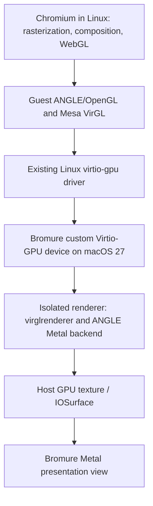

**Bromure Web: macOS 27 GPU feasibility study — September 30, 2026**

Reviewed `main` at `2f04f294` after `git pull --ff-only origin main`. This is a source and documentation study, not a benchmark or implementation. The research environment is Linux; no macOS 27 SDK compilation, VM boot, or GPU measurements were performed. Existing untracked files were left untouched.

**Recommendation: pursue a bounded prototype of a standard Virtio-GPU host backend using virglrenderer and ANGLE/Metal.** macOS 27 exposes the transport and memory facilities needed to make this credible while retaining Virtualization.framework. Reuse Linux's virtio-gpu kernel driver and Mesa's VirGL driver where possible. A proprietary Linux graphics driver, new shader compiler, or Chromium fork should not be the starting point.

The result would be a Bromure-owned virtual GPU implementation on the host, backed by existing graphics libraries. Feasibility is supported by the APIs and comparable rendering stacks; compatibility and worthwhile speedups in Bromure remain unproven.

**What Bromure does today.** The current image builder targets Ubuntu 24.04 ARM64, image version 403, with Xorg, Openbox, Mesa, and Chromium. Some older comments still describe Alpine, which remains the installer environment. The relevant evidence is:

| Source at the reviewed commit | Finding |
| --- | --- |
| `Sources/SandboxEngine/LinuxImageManager.swift:294` | Creates Apple's `VZVirtioGraphicsDeviceConfiguration` with one scanout. |
| `Sources/SandboxEngine/Resources/vm-setup/scripts/xinitrc:141` | Forces `LIBGL_ALWAYS_SOFTWARE=1` unless the experimental override is set. |
| `Sources/SandboxEngine/Resources/vm-setup/scripts/xinitrc:176` | Chromium's launch command disables Vulkan. |
| `Sources/SandboxEngine/Resources/vm-setup/scripts/config-agent.py:407` | “GPU enabled” selects ANGLE/OpenGL and GPU rasterization flags; that does not establish access to host hardware. |
| `Sources/SandboxEngine/VMPool.swift:690` | Disables GPU compositing by default because GL compositing runs on llvmpipe. |
| `Sources/Browser/SafariSandbox.swift:2338` | Displays the VM through `PrecisionScrollVMView`, a `VZVirtualMachineView` subclass. |
| `Sources/SandboxEngine/Resources/vm-setup/configs/xorg-10-virtio.conf` | Uses Xorg's modesetting driver. |

The existing path is Chromium software rendering → guest framebuffer → Apple's Virtio display → `VZVirtualMachineView`. Host display composition can use the GPU without accelerating Chromium's guest rasterization or rendering.

The comment in `VMPool.swift` records GL compositor CPU usage of roughly 150% at 60 Hz and 280% at 120 Hz, versus 46% and 90% for software compositing, on a seven-vCPU, 2× display configuration. These are historical repository observations, not measurements reproduced here. They explain why simply enabling the current “GPU” options is unlikely to help. The prototype must beat the optimized software path now on `main`.

**What macOS 27 adds.** Apple's WWDC26 session introduces custom Virtio devices for Linux guests. It supplies a device transport, not a complete accelerated Linux GPU. [Apple's session](https://developer.apple.com/videos/play/wwdc2026/224/).

| Public API | Relevance |
| --- | --- |
| `VZCustomVirtioDeviceConfiguration` | Select device identity, PCI class/subclass, queue count, device-specific configuration, and feature negotiation. [Documentation](https://developer.apple.com/documentation/virtualization/vzcustomvirtiodeviceconfiguration). |
| `VZCustomVirtioDeviceDelegateProvider` and device delegate | Handle requests and lifecycle events on a dedicated serial device queue. [Device documentation](https://developer.apple.com/documentation/virtualization/vzcustomvirtiodevice). |
| `VZVirtioQueue` / `VZVirtioQueueElement` | Consume descriptor chains and return completed requests. [Queue element documentation](https://developer.apple.com/documentation/virtualization/vzvirtioqueueelement). |
| `guestMemoryMapping(atPhysicalAddress:length:)` | Access guest RAM backing graphics resources. Mappings become invalid across shutdown/reboot. [Mapping documentation](https://developer.apple.com/documentation/virtualization/vzguestmemorymapping). |
| `VZVirtioSharedMemoryRegionConfiguration` / `VZVirtioSharedMemoryRegion` | Advertise persistent shared-memory regions and map host allocations into them. This is relevant to GPU resource/blob mappings. [Region documentation](https://developer.apple.com/documentation/virtualization/vzvirtiosharedmemoryregion). |
| Device pause/resume/reset and save/restore callbacks | Manage in-flight GPU work and resource ownership across VM lifecycle changes. Save/restore is explicitly opt-in. [Delegate documentation](https://developer.apple.com/documentation/virtualization/vzcustomvirtiodevicedelegate), [save/restore configuration](https://developer.apple.com/documentation/virtualization/vzcustomvirtiodeviceconfiguration/supportssaverestore). |

Apple's documentation marks these custom-device facilities as macOS 27+. Preserve the existing backend on earlier supported hosts and make device selection before warming a VM.

The compatibility requirement is one app distribution that retains the current macOS 14 minimum (`Package.swift`) and uses the new renderer only on macOS 27+. Build against the macOS 27 SDK while keeping the app's deployment target and minimum-version metadata at their existing values. Isolate new API references inside `@available(macOS 27, *)` implementations selected through `if #available(macOS 27, *)`. Keep shared interfaces independent of macOS 27 types. This is the standard availability model described in [Apple's deployment guidance](https://developer.apple.com/documentation/xcode/running-code-on-a-specific-version/).

Keep the legacy VZ graphics device, view, and software-rendering guest configuration as a complete backend. New renderer dependencies must either support the app's deployment target or live in a separate helper loaded only on supported hosts; linking an incompatible library at app launch would defeat the runtime guard. Select backend-specific guest flags and warm-pool configuration together. The guest image can contain both driver paths and select according to the exposed device. If accelerated initialization fails, build a fresh VM with the legacy device configuration; do not promise an in-place GPU swap for a running session. Verify launch and browsing on macOS 14/15/26, and both accelerated and forced-legacy operation on 27.

Two distinctions matter. Apple's stock Linux graphics configuration still exposes scanout configuration, with no documented switch for a VirGL/Venus renderer. Apple's ParavirtualizedGraphics framework describes a macOS guest driver stack; it is not a documented Linux Metal driver. [Stock Virtio graphics API](https://developer.apple.com/documentation/virtualization/vzvirtiographicsdeviceconfiguration), [ParavirtualizedGraphics](https://developer.apple.com/documentation/paravirtualizedgraphics).

Shared CPU memory also does not establish that an arbitrary Metal texture or IOSurface can be mapped into a guest. Allocation compatibility, alignment, cache behavior, synchronization, and lifetime must be tested on macOS 27. Public `mapMemory` documentation is too sparse to promise that integration. [Mapping method](https://developer.apple.com/documentation/virtualization/vzvirtiosharedmemoryregion/mapmemory(_:atoffset:size:completionhandler:)).

**The most promising architecture.**

This diagram is a proposed design. The new integration is the VZ transport adapter, safe resource management, process boundary, and presentation path. UTM documents an existing guest virtio-gpu → host virglrenderer → ANGLE/Metal → IOSurface → Metal display chain. That is useful evidence for the renderer combination, but does not prove compatibility with Apple's custom-device transport. [UTM graphics architecture](https://github.com/utmapp/UTM/blob/main/Documentation/Graphics.md).

The Virtio GPU specification assigns device ID 16 and two queues: control and cursor. A prototype would implement the standard configuration and display/resource commands, advertise only supported features and capability sets, and forward 3D submissions to the renderer. Context creation/destruction, resource attachment/transfers, scanout, cursor, fences, and reset handling are real device work; setting a device ID alone is insufficient. [Virtio 1.4 GPU specification](https://docs.oasis-open.org/virtio/virtio/v1.4/virtio-v1.4.pdf).

Linux's existing driver and Mesa VirGL are the intended guest stack. First verify that the actual shipped image contains the required kernel configuration and Mesa driver, then verify binding and EGL/GLX operation. New guest kernel code should be unnecessary if the host faithfully implements the standard interface, but this is an integration hypothesis until boot-tested. [Mesa VirGL](https://docs.mesa3d.org/drivers/virgl.html), [QEMU's Virtio-GPU requirements](https://www.qemu.org/docs/master/system/devices/virtio/virtio-gpu.html).

**Presentation is the critical performance issue.** I found no documented mechanism to register custom-device scanout textures with `VZVirtualMachineView`. Its public interface displays the VM framebuffer and forwards input. Plan on owning presentation for the accelerated backend, subject to confirmation with the SDK. [VZVirtualMachineView](https://developer.apple.com/documentation/virtualization/vzvirtualmachineview).

Keep final rendered images on the host and present them through Metal, ideally through explicitly shared IOSurfaces across the renderer/UI boundary. A GPU blit may still be needed; the objective is to avoid a complete host-GPU → guest-CPU → host-display round trip every frame. A 3840×2160 BGRA image is 33.2 MB, or approximately 2.0 GB/s at 60 Hz and 4.0 GB/s at 120 Hz for one full-frame transfer alone. These are arithmetic traffic estimates, not predicted application throughput; additional transfers and synchronization increase the cost.

A second accelerated device alongside Apple's framebuffer could be useful for an offscreen proof. It is not automatically a useful production display path: cross-device rendering and readback can consume the benefit. The preferred final design is a custom GPU that owns both rendering and scanout.

Replacing the view also means covering the work it currently does: keyboard/mouse forwarding, focus, cursor, display resize and scale changes. Preserve Bromure's native tab-bar crop, precise-scroll bridge, drag/drop coordinates, fullscreen behavior, and 60/120 Hz pacing. These are substantial integration tasks in `SafariSandbox.swift`, not just renderer library initialization.

**Alternatives considered.**

| Approach | Assessment |
| --- | --- |
| Standard Virtio-GPU + VirGL + ANGLE/Metal | Best first prototype for the current OpenGL/Xorg browser stack. Reuses guest drivers and a demonstrated host rendering chain. |
| Virtio-GPU + Venus + Vulkan-to-Metal | Credible follow-on, particularly for Vulkan/WebGPU. More memory, synchronization, and compatibility work to validate. |
| gfxstream | Worth evaluating if VirGL compatibility blocks progress. Adds Linux guest and macOS host integration uncertainty for this product. |
| Bespoke GPU protocol + direct Metal backend | Potentially efficient, but requires a graphics API implementation, shader translation, resource model, Linux userspace integration, and long-term compatibility ownership. Too much initial scope. |
| Faster transport for already-rendered pixels | Can improve presentation when that is the bottleneck; leaves software rasterization and WebGL on guest CPUs. |
| Switch the VM backend to QEMU | Provides useful comparison builds and an existing accelerated device implementation, but replacing Bromure's VM lifecycle and integrations is a separate project. |

The Vulkan option deserves current context: Mesa's Venus documentation describes Linux/Android external-memory assumptions that do not directly map to macOS. Nevertheless, UTM's September 24, 2026 beta announces Linux Vulkan 1.3 support and also notes a Linux Vulkan desktop-rendering limitation. Its older architecture document still labels Venus as future work, so that part is stale. Vulkan-on-Metal virtualization is therefore demonstrably progressing, not categorically impossible, but the release is not evidence of a working VZ custom-Virtio integration. [Venus requirements](https://docs.mesa3d.org/drivers/venus.html), [UTM 5.0.6 beta](https://github.com/utmapp/UTM/discussions/7909).

MoltenVK and Mesa's KosmicKrisp are host translation candidates for that route; KosmicKrisp documents Metal 4 on Apple Silicon, macOS 26+. Backend support alone does not solve guest memory sharing or presentation. [KosmicKrisp documentation](https://docs.mesa3d.org/drivers/kosmickrisp.html).

Gfxstream explicitly supports graphics API streaming. QEMU documents Linux Vulkan and cross-domain capability sets, with GLES/composer sets described as experimental for Android. This makes “drop the Android emulator renderer into Ubuntu Chromium” an integration project rather than a ready substitute. [Gfxstream](https://github.com/google/gfxstream), [QEMU backend documentation](https://www.qemu.org/docs/master/system/devices/virtio/virtio-gpu.html).

**Expected benefit and limits.** Compositing, CSS transforms, canvas, GPU rasterization, and WebGL are plausible beneficiaries. Improvement depends on time currently spent in those stages, command batching, shader-cache behavior, and the final scanout path. JavaScript, layout, networking, and CPU-heavy page code do not become faster merely because rendering is accelerated. Chromium video decode is a separate path: exposing GL/Vulkan does not automatically expose VideoToolbox or a usable guest hardware decoder. Treat video acceleration as separate work.

No defensible FPS multiplier follows from this study. Software rendering might already meet the refresh target on simple pages; lower total CPU and energy could be the main gain there. GPU-heavy pages offer greater upside. UI-thread stalls and input latency can remain after rasterization gets faster.

**Security and lifecycle are part of feasibility.** Bromure assumes that web content and potentially the whole guest are hostile. A custom renderer adds command parsers, shader translation, and host GPU-driver exposure. Reusing a mature renderer reduces implementation work but does not preserve the current attack surface unchanged.

Use a narrowly sandboxed renderer helper without credentials, user files, or network access, with per-VM resource namespaces and bounded IPC. Apple invokes custom-device delegates in the provider's context; it does not automatically create this renderer isolation. Copy and validate command metadata once, reject invalid ranges and dimensions, limit memory and queued work, and treat device reset/crash as expected recovery cases. Apple specifically warns that repeated reads of guest-controlled descriptor memory permit TOCTOU attacks. [Queue memory guidance](https://developer.apple.com/documentation/virtualization/vzvirtioqueueelement).

Bulk pixel buffers may remain shared where safe, but executable command metadata must not change between validation and use. An isolated helper reduces consequences of a parser compromise; it does not eliminate host GPU-driver risk. Establish the sandbox and memory-sharing design before enabling untrusted browsing.

Keep request handling off the app's main queue. `VMConfig.swift:241` already records VZ main-queue stalls under load. Fence completion must reflect actual GPU completion without blocking device dispatch. Test teardown, reset, and pause/resume with work in flight. `VMPool.swift:156` pauses idle prewarmed VMs, so lifecycle support is required immediately; persistent snapshot support can remain disabled until separately implemented.

**Proposed validation, after approval to implement.**

1. Establish a baseline on the intended macOS 27 hardware. Record guest renderer identity and Chromium GPU diagnostics, host/guest CPU, energy, actual presentation cadence, frame-time percentiles, input-to-visible latency, and dropped frames. Use 1×/2× displays at 60/120 Hz, repeatable scrolling/CSS/canvas/WebGL pages, and a video workload to separate decode cost. Include current defaults and the existing llvmpipe override as distinct baselines.
2. Prove VZ device feasibility. Configure a standard GPU identity, bind Linux's existing driver, complete feature/capability negotiation and a minimal display path, and test guest RAM mappings plus repeated reset/pause/resume. Confirm SDK validation permits the intended device configuration. Stop early if this fails.
3. Prove real acceleration and presentation together. Render a GL workload through VirGL/ANGLE, verify Metal GPU activity, and display the final host texture without full-frame guest readback. Then exercise unmodified Chromium's compositor and WebGL against the isolated helper.
4. Integrate backend-aware guest configuration. Remove forced software GL and forced software composition only for a successfully selected accelerated backend. Keep Vulkan disabled for the initial GL path. Preserve WebGL policy settings, software fallback, and support for older hosts; rebuild/version the guest image if its drivers need changes.
5. Validate product behavior and containment. Exercise input/resize/HiDPI/cropping, warm-pool claim, multiple concurrent VMs, helper crashes, malformed requests, resource exhaustion, and long sessions. The existing guest `test_gpu` checks command-line flags, not hardware use, so it cannot certify acceleration.

Suggested prototype success criteria, to make the decision concrete: verified host GPU execution; no whole-frame CPU round trip in normal scanout; correct representative pages; at least a 30% reduction in total CPU at equal visible cadence or a material improvement in missed frames on a previously GPU-bound workload; no material p95 input-latency regression; and reliable recovery/isolation. These are proposed gates, not measured results.

Budget this as a graphics integration effort: weeks for a focused feasibility spike and months for a production backend, assuming experienced graphics/virtualization engineering and usable upstream macOS renderer support. The largest uncertainty is memory/presentation/process integration, followed by browser compatibility. A from-scratch graphics API driver would be substantially larger.

**Video decoding extension, requested during the study.** Hardware video decode is feasible in principle through a separate bridge to host VideoToolbox. The intended path is compressed video in guest Chromium → Linux video acceleration interface → Virtio → isolated host decoder → VideoToolbox pixel buffers → the host graphics renderer. VideoToolbox can request hardware decoding explicitly and reports an error when the requested stream cannot use it. Query codec support, attempt the actual profile/resolution session, and verify hardware use; do not let a host software fallback masquerade as acceleration. [Hardware decode requirement](https://developer.apple.com/documentation/videotoolbox/kvtvideodecoderspecification_requirehardwareacceleratedvideodecoder), [codec query](https://developer.apple.com/documentation/videotoolbox/vtishardwaredecodesupported(_:)).

There are two guest integration candidates:

| Candidate | Benefit | Work or limitation |
| --- | --- | --- |
| Chromium VA-API → Mesa VirGL video commands → new VideoToolbox backend | Could reuse the graphics device and existing Linux userspace interface. First route to investigate alongside VirGL graphics. | The inspected upstream virglrenderer video implementation uses host VA-API/DRM, not VideoToolbox. Porting includes translating codec parameters/bitstreams and integrating decoded surfaces. Guest driver packaging and Chromium selection must be verified. |
| Chromium V4L2 → virtio-media → new VideoToolbox decoder device | A stateful compressed-stream interface is a natural conceptual match for VideoToolbox. Reuses a published transport and guest module. | Requires the guest module and a Chromium build with the corresponding backend. The current project README lists DMA-BUF and buffer-export support as unimplemented, so GPU surface sharing is additional work. |

Sources: [current virglrenderer video implementation](https://gitlab.freedesktop.org/virgl/virglrenderer/-/blob/main/src/vrend/virgl_video.c), [virtio-media](https://github.com/chromeos/virtio-media), [Chromium decoder pipeline](https://chromium.googlesource.com/chromium/src/+/refs/heads/main/media/gpu/chromeos/video_decoder_pipeline.cc). The inspected virtio-media reference decoder uses software FFmpeg; it is a protocol example, not an existing macOS hardware bridge. [Reference decoder](https://github.com/chromeos/virtio-media/tree/main/extras/ffmpeg-decoder).

Avoid promising an unchanged Chromium binary until its compile-time video backends, sandbox device access, and runtime selection have been checked. Chromium added support for compiling both Linux VA-API and V4L2 backends in July 2026, but that does not establish the configuration of Bromure's packaged browser. [Chromium change](https://chromium.googlesource.com/chromium/src/media/+/c825d027f6ddb95a17c61750cc02b9b75e472f06).

VA-API/Gallium decode parameters and VideoToolbox's compressed-sample interface are not interchangeable. For an initial H.264 implementation, preserve or reconstruct complete access units and codec configuration, including SPS/PPS, then manage timestamps, frame reordering, reference lifetime, drain/flush, and seek/reset. Advertise only the profiles actually implemented. A custom Chromium decoder hook would simplify access to original compressed packets but introduce a browser-fork maintenance cost; reserve it for a demonstrated limitation in the standard interfaces.

The highest-value design shares decoded NV12/P010 surfaces with the virtual GPU. Request Metal-compatible, IOSurface-backed Core Video output and use the host texture/resource registry to associate each guest-visible video surface with its host image. Chromium must receive the guest-side buffer/texture semantics its compositor expects; a raw IOSurface identifier is not a Linux DMA-BUF. That import/export bridge and completion fences are the difficult integration work. Apple supports creating Metal texture views from Core Video buffers, but this proves only the host half. [Core Video texture mapping](https://developer.apple.com/documentation/corevideo/cvmetaltexturecachecreatetexturefromimage(_:_:_:_:_:_:_:_:_:)).

Normal playback should send compressed data to the host and return completion/resource handles, leaving decoded pixels available to host GPU composition. Explicit CPU readback, such as canvas pixel access, needs a supported slower path. Preserve Chromium's composition so subtitles, occlusion, transforms, clipping, and picture-in-picture remain correct; drawing a separate native video rectangle is not a general substitute.

A first proof can copy decoded NV12 frames into guest memory, even before accelerated graphics exists. This can still remove substantial CPU decode cost. It is not the preferred final path: 4K NV12 at 60 fps represents approximately 0.75 GB/s for a single full-frame transfer, before additional copies or uploads. Measure this intermediate design rather than assuming it is worthless or sufficient.

Start with unencrypted H.264, then add other codecs according to measured host capabilities and actual browser workloads. Do not assume AV1/VP9 availability across all Apple Silicon generations or promise protected DRM playback; protected surfaces and CDM compatibility require separate investigation. Keep unsupported formats on the guest software path. Hardware encoding for conferencing is another distinct backend.

Use the same isolated-helper principles as graphics: guest-owned video bytes are untrusted, the host decoder receives no page credentials or URL-fetching authority, and each VM has bounded session/surface counts. Test hardware-use reporting, playback drops, CPU/energy, audio/video synchronization, seek, resolution changes, multiple streams, and cleanup. This is an additional decoder backend plus surface-sharing project, not an ANGLE flag.

The decision supported by this study is to prototype the standard VirGL/Metal route while retaining the software backend, and design its resource registry to accommodate VideoToolbox decode surfaces. Production commitment should follow measured end-to-end gains and a reviewed containment design. No implementation changes were made for this study.
