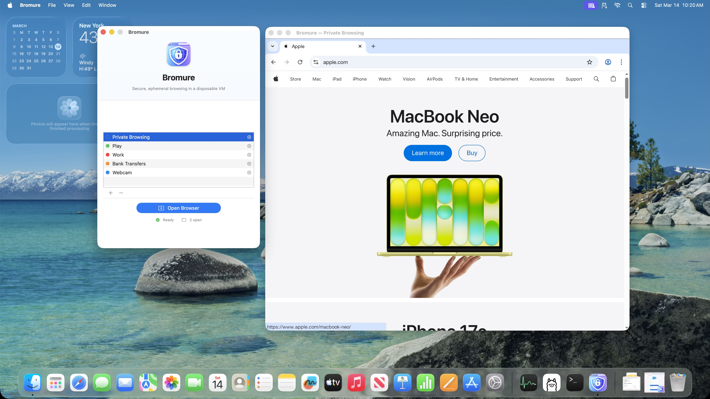
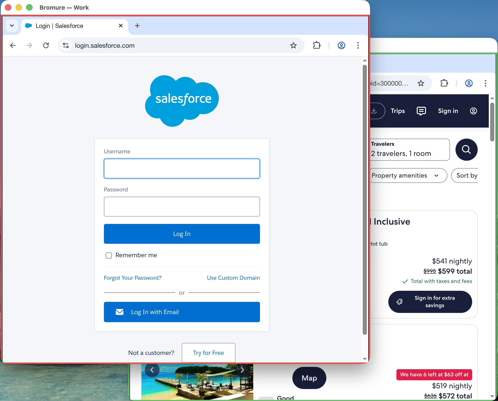
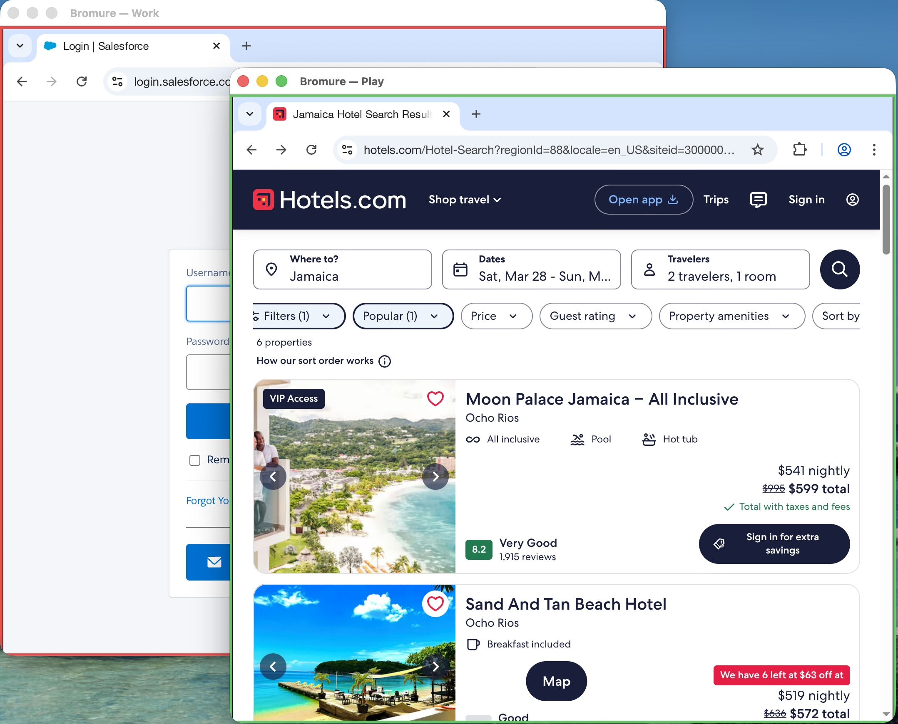
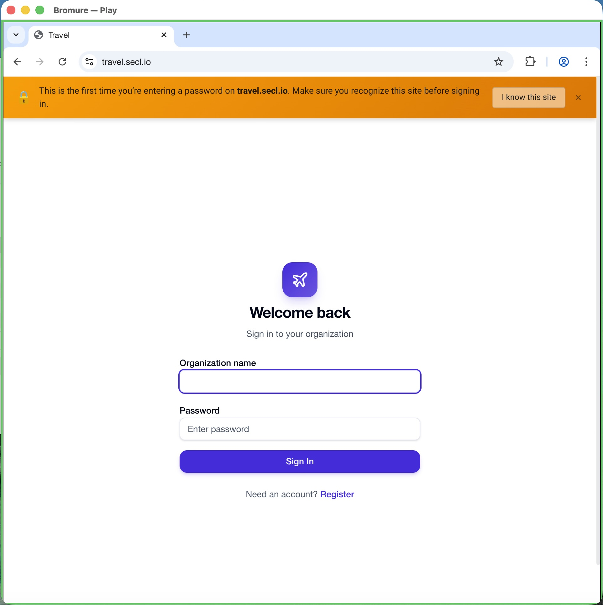

<p align="center">
  
</p>

<h1 align="center">Bromure</h1>

<p align="center">
  Secure, ephemeral browsing in a disposable virtual machine on macOS.
</p>

---

## Your browser is the biggest hole in your Mac

Every link you click, every page you load, every ad that renders -- it all runs code on your machine. Ransomware encrypts your files through a browser tab. Drive-by downloads install malware you never asked for. Credential-stealing scripts read your clipboard. A single zero-day exploit can hand an attacker your documents, your photos, your Keychain. And when it's over, private browsing mode can't erase what was never contained in the first place.

Traditional browsers try to protect you with layers of sandboxing -- but the sandbox shares an OS, a filesystem, and a kernel with everything you care about.

## Bromure throws the whole OS away

Bromure is a native macOS app that runs every browser session inside a lightweight, disposable Linux virtual machine using Apple's [Virtualization.framework](https://developer.apple.com/documentation/virtualization). The browser and your Mac don't share an operating system, a filesystem, or even a kernel. When you close the window, the VM is destroyed -- cookies, history, malware, trackers, all of it. Gone.

<p align="center">
  
</p>

- **Ransomware can't escape.** It can only see the VM's temporary filesystem. Close the window and the ransomware is gone, along with the entire OS it was running on. No cleanup, no decryption keys, no ransom.
- **Drive-by downloads are harmless.** Exploit kits are trapped inside a VM that gets destroyed. They never touch your real system.
- **Credential theft is contained.** Keyloggers, clipboard hijackers, and screen capture malware can't see anything outside the VM -- not your other apps, not your password manager, not your macOS Keychain.
- **Zero-day exploits have nowhere to go.** Even a chained browser + OS exploit only compromises a throwaway VM with no personal data and no way to persist.
- **No forensic residue.** No cache, no DNS history, no temp files on your Mac's disk. The VM's filesystem is deleted on close.

## Instant Launch

Bromure pre-warms a pool of ready-to-go VMs in the background using Virtio GPU, audio, and input drivers for a smooth, native-feeling browsing experience. Your first window takes a few seconds; every window after that opens in under a second.

Add Bromure to your Login Items and a warm VM is always ready when you need it.

## Profiles

Create named profiles for different contexts -- Work, Personal, Banking, Shopping, Research -- each with its own color-coded window border so you can tell them apart at a glance.

<p align="center">
  
  &nbsp;&nbsp;
  
</p>

Every profile carries its own independent settings -- home page, VPN, ad blocking, clipboard access, network rules, media devices -- so your banking profile can be locked down tight while your personal profile lets you copy-paste and download freely.

- **Persistent storage** -- optionally keep bookmarks, history, and cookies between sessions, with LUKS encryption and keys stored in your macOS Keychain
- **Language** -- set a different browser language per profile (English, French, German, Spanish, Portuguese, Japanese, Chinese, and more)
- **iCloud sync** -- profiles sync across your Macs, so your setup follows you

## Built-in VPN

Bromure integrates [Cloudflare WARP](https://one.one.one.one/) directly into each VM. When enabled, all browser traffic is routed through Cloudflare's encrypted network -- your IP address is hidden from every website you visit. No system-wide VPN required.

WARP runs entirely inside the disposable VM, so Cloudflare never sees your host machine's identity. When the session ends, the WARP registration is destroyed along with everything else.

## Network-Level Ad Blocking

Bromure blocks ads and trackers at the network layer using a built-in DNS sinkhole and Squid proxy. This is more effective than browser extensions -- ads are blocked before they even reach the browser, making pages load faster and eliminating tracking scripts.

## Privacy & Safety

<p align="center">
  
  &nbsp;&nbsp;
  
</p>

Each profile has granular privacy controls:

- **Malware Site Blocking** -- block known malicious websites using Cloudflare's security DNS.
- **Phishing Warnings** (Beta) -- get alerted when you're about to enter a password on a website that looks suspicious or fake.
- **Cross-Profile Link Sharing** -- right-click any link to send it to a different Bromure profile.

## File Transfer & Malware Scanning

<p align="center">
  
</p>

Upload and download are controlled independently per profile. When downloads are enabled, you can plug in your [VirusTotal](https://www.virustotal.com/) API key to automatically scan every file for malware before it reaches your Mac -- and optionally block anything flagged as a threat.

## Network Isolation

Lock down what the browser can reach on your network:

- **LAN Isolation** -- prevent the browser from accessing devices on your local network (printers, NAS, internal servers) while keeping full internet access.
- **Port Restriction** -- whitelist specific outgoing ports (e.g. 80, 443) to control exactly which services the browser can connect to.

## Media

Use Bromure for video calls and meetings:

- **Webcam** -- share your Mac's camera with websites inside the VM, with quality selection and live effects.
- **Microphone** -- share your Mac's microphone for calls and voice input.
- **Speaker Selection** -- choose which audio output device each profile uses.
- **Volume control** -- independent volume slider per profile.

## Enterprise

- **HTTP Proxy** -- route traffic through your organization's proxy server with authentication support.
- **Custom Root CA Certificates** -- install internal certificates so the browser trusts your corporate websites and services. Supports PEM, DER, CRT, and CER formats.
- **Network Controls** -- LAN isolation and port restriction for compliance with corporate security policies.
- **Encrypted Persistent Storage** -- LUKS encryption with keys stored in macOS Keychain for profiles that need to retain data.

## Hardware & Display

Fine-tune how the VM uses your Mac's resources:

- **Memory** -- 1 GB to 16 GB per session
- **CPU Cores** -- automatic scaling based on memory, or manual override
- **GPU Acceleration** -- hardware-accelerated rendering for faster page loads
- **WebGL** -- enable 3D graphics for games, maps, and data visualizations
- **Display Scaling** -- 1x or 2x for Retina displays
- **Dark Mode** -- follow system appearance, or force light/dark
- **29 Keyboard Layouts** -- QWERTY, AZERTY, QWERTZ, Dvorak, Colemak, and international layouts including Japanese, Korean, Arabic, Hebrew, and more
- **Natural Scrolling** -- matches your macOS trackpad preference
- **Command Key Swap** -- use Cmd instead of Ctrl for familiar macOS shortcuts

## Default Browser

Register Bromure as your macOS default browser (System Settings > Desktop & Dock > Default web browser). Every link you click in other apps opens in a fresh, isolated VM.

## Requirements

- macOS 14 (Sonoma) or later
- Apple Silicon (M1 or newer)

## Getting Started

- Download the pre-built binaries here: https://github.com/rderaison/bromure/releases
- Or you can build the app yourself:
```bash
# Build the app
./build.sh

# Initialize the base image (downloads Alpine Linux + installs Chromium)
.build/arm64-apple-macosx/release/bromure.app/Contents/MacOS/bromure init

# Launch
open .build/arm64-apple-macosx/release/bromure.app
```

## How It Works

1. Bromure downloads a minimal Alpine Linux base image (~50 MB)
2. Each new window clones the base image using APFS copy-on-write (near-zero disk cost)
3. A full Chromium browser launches inside the VM with your profile's settings applied
4. When you close the window, the VM and its disk are destroyed (unless the profile retains data)

No Docker. No containers. Full hardware-level virtualization via Apple's Virtualization.framework.

## Documentation

See [Settings Reference](SETTINGS.md) for a detailed description of every settings panel.

## FAQ

**The first browser window takes a long time to open. Will it always be this slow?**

No. The very first time you launch Bromure, it needs to boot a VM from scratch, which takes several seconds. Once that VM is ready, it goes into a warm pool -- subsequent windows open almost instantly because a pre-booted VM is already waiting. If you add Bromure to your Login Items (System Settings > General > Login Items), it will start in the background when you log in, so a warm VM is always ready when you need it.

**How much memory should I allocate to the VM?**

The default of 2 GB is sufficient for most browsing. Video playback works great thanks to GPU hardware acceleration, but if you notice choppy playback on high-definition videos or use memory-heavy web apps, consider increasing it to 4 GB in Settings. Going above 4 GB is rarely necessary.

**How do I enable the VPN? Is it free?**

Open the profile settings and toggle "Cloudflare WARP" under VPN & Ads. The first time you enable it, you will be asked to accept Cloudflare's terms of service. WARP is a free service provided by [Cloudflare](https://one.one.one.one/) -- it encrypts your DNS queries and routes your traffic through Cloudflare's network. It runs entirely inside the disposable VM, so no configuration is needed on your host machine, and the WARP registration is destroyed when the session ends.

**Can I make my browsing data persistent?**

Yes. Open the profile settings and turn on "Retain Browsing Data" under General. Your bookmarks, history, cookies, and passwords will persist between sessions. You can also enable LUKS encryption for the persistent data under Advanced.

**Can I upload or download files?**

Yes. File upload and download are controlled independently per profile under File Transfer. When downloads are enabled, you can optionally enable VirusTotal scanning to check files for malware before they reach your Mac.

**Does each VM session require a lot of disk space?**

No. Bromure uses `clonefile()` to create each session's disk image, which leverages APFS copy-on-write (COW) semantics. The cloned image initially takes up almost no additional space -- only the blocks that the VM actually modifies during the session consume real disk storage. A typical browsing session writes very little to disk, so the actual cost per session is usually just a few megabytes.

**Networking in the VM is broken when my VPN is active.**

This is a known limitation of Apple's Virtualization.framework. When a VPN (especially IKEv2 or other full-tunnel configurations) reroutes all host traffic, the VM's NAT networking may fail to follow the routing change. Try starting the VPN before launching Bromure, or restarting Bromure after connecting. In some cases, a host reboot may be required to restore VM networking.

**Does Bromure work on Intel Macs?**

No. Bromure requires Apple Silicon (M1 or later). It relies on Apple's Virtualization.framework, which only supports ARM64 guest VMs on Apple Silicon hosts.

**Why is it called "Bromure"?**

It is a pun on [Bromium](https://en.wikipedia.org/wiki/Bromium), a company that pioneered micro-virtualization for endpoint security -- running each task in a disposable VM. Bromium was acquired by HP in 2019. "Bromure" is also the French word for "bromide", which felt fitting for something designed to neutralize threats.

## Author

- [Renaud Deraison](https://www.linkedin.com/in/rderaison/) (prompting)
- [Claude + Opus 4.6](https://www.anthropic.com) (implementation)
