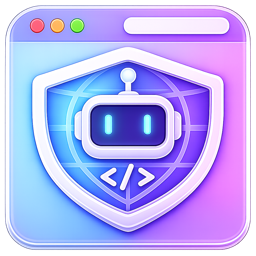

<p align="center">
  
  &nbsp;&nbsp;&nbsp;&nbsp;
  
</p>

<h1 align="center">Bromure</h1>

<p align="center">
  Secure, ephemeral computing in disposable Linux VMs on macOS.
</p>

<h2 align="center">
  → Full details, screenshots, and downloads at <a href="https://bromure.io">bromure.io</a>
</h2>

---

This repo ships two sibling apps, both built on Apple's [Virtualization.framework](https://developer.apple.com/documentation/virtualization):

- **Bromure** — every browser session runs in a throwaway Linux VM. Close the window, the VM is destroyed.
- **Bromure Agentic Coding** — a sandboxed environment for AI coding agents (Claude Code, Codex), with a host-side MITM proxy that swaps fake credentials for real ones on the wire so secrets never enter the VM.

## Build

```bash
./build.sh                 # browser app
./build.sh bromure-ac      # agentic-coding app
swift test                 # tests
```

Outputs land in `.build/arm64-apple-macosx/release/`.

## Architecture

Three SPM targets:

| Target          | Path                      | Notes                                                           |
| --------------- | ------------------------- | --------------------------------------------------------------- |
| `bromure`       | `Sources/Browser/`        | Browser app + SwiftUI + AppKit window management                |
| `bromure-ac`    | `Sources/AgentCoding/`    | Agentic-coding app + MITM proxy + cloud-credential plumbing     |
| `SandboxEngine` | `Sources/SandboxEngine/`  | Shared VM lifecycle, image management, virtio bridges           |

Both apps pre-warm a pool of VMs in the background so new sessions open in under a second. Guest ↔ host communication runs over vsock (clipboard, file transfer, MITM proxy).

## Requirements

- macOS 14 (Sonoma) or later
- Apple Silicon (M1 or newer) — `Virtualization.framework` only supports ARM64 guest VMs on Apple Silicon hosts.

## Author

- [Renaud Deraison](https://www.linkedin.com/in/rderaison/) (prompting)
- [Claude + Opus 4.7](https://www.anthropic.com) (implementation)
