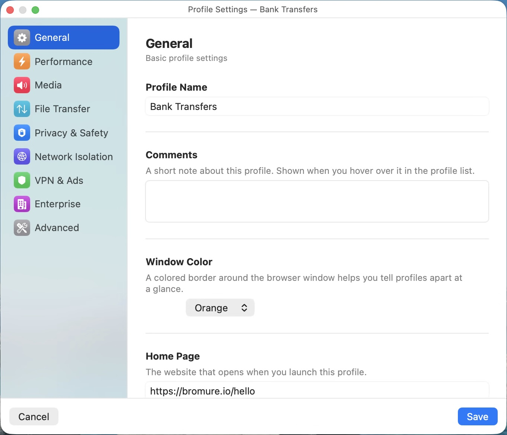
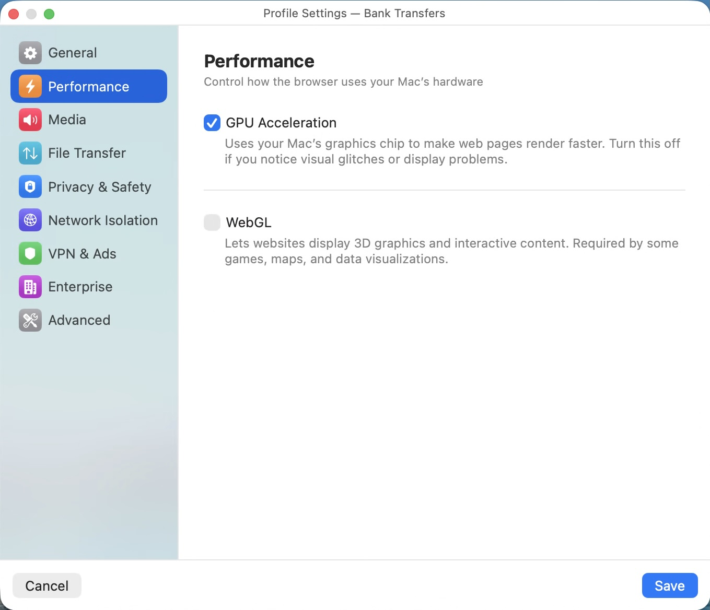
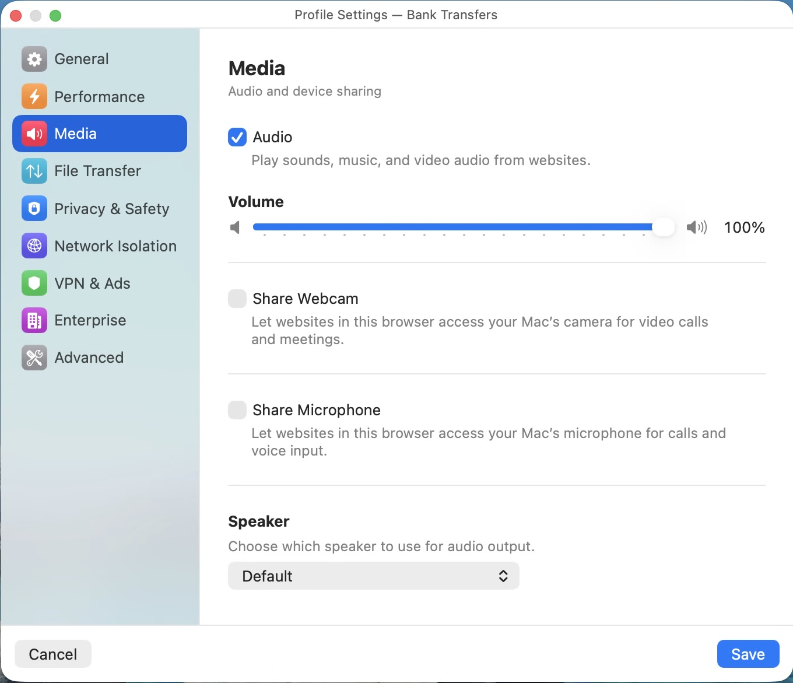
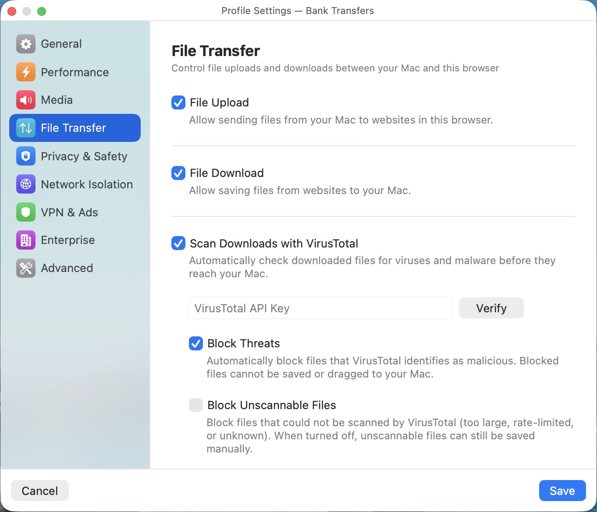
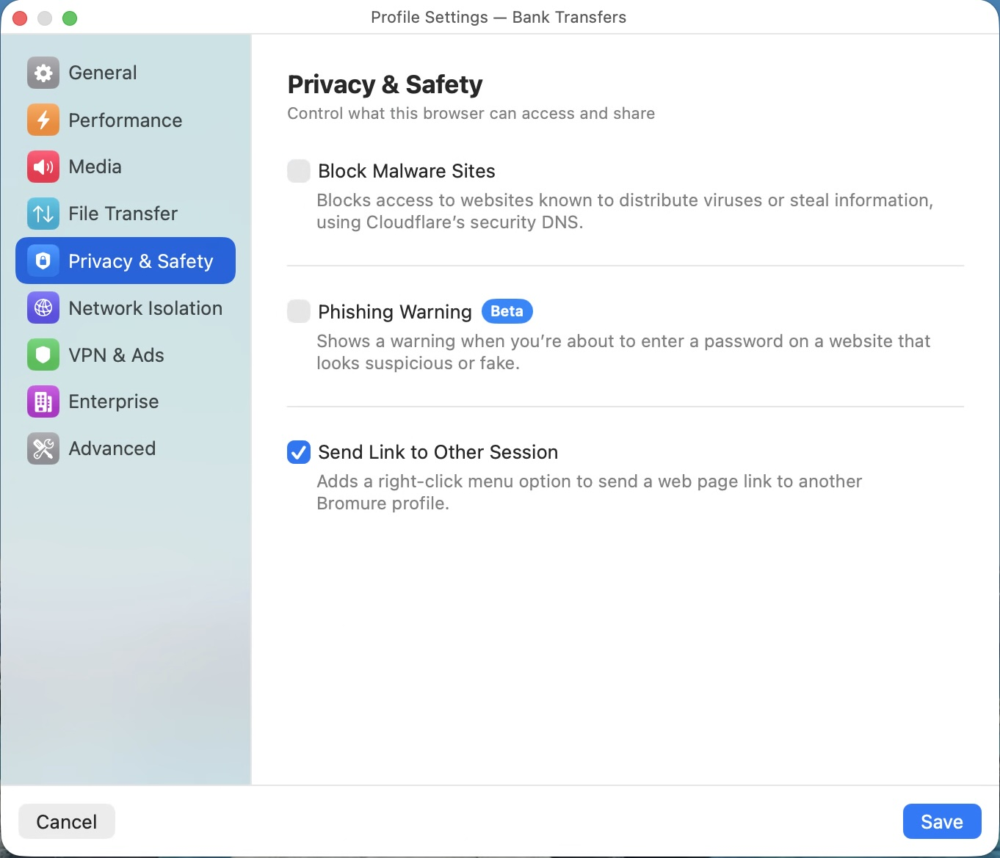
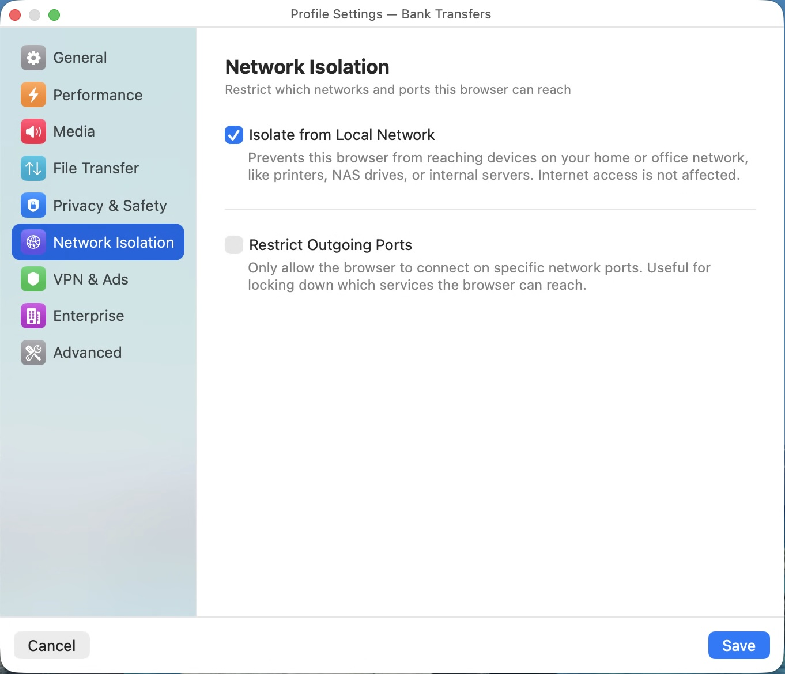
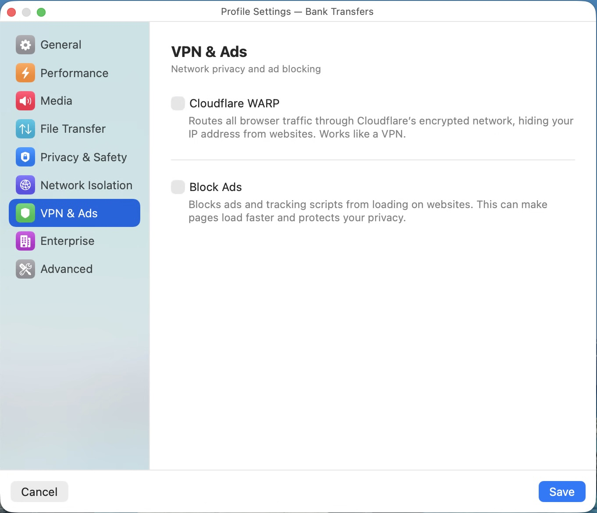

# Bromure Settings Reference

Bromure has two levels of settings: **Profile Settings** (per-profile, opened via the gear icon next to each profile) and **App Settings** (global, opened via the Bromure menu or keyboard shortcut). This document describes every panel in detail.

---

## Profile Settings

Each profile has its own independent configuration across eight panels.

### General

  

Basic identity and behavior for the profile.

| Setting | Description |
|---|---|
| **Profile Name** | The display name shown in the profile list and window title bar. |
| **Comments** | A short note about the profile. Shown as a tooltip when you hover over the profile in the list. |
| **Window Color** | A colored border drawn around the browser window to visually distinguish profiles. Options: None, Blue, Red, Green, Orange, Purple, Pink, Teal, Gray. |
| **Home Page** | The URL loaded when a new session starts for this profile. Defaults to `https://bromure.io/hello`. |
| **Language** | The browser's display language. Options: Same as System, English, French, German, Spanish, Portuguese, Japanese, Traditional Chinese, Simplified Chinese. |
| **Retain Browsing Data** | When enabled, bookmarks, history, cookies, and passwords persist between sessions on a dedicated virtual disk. When disabled (the default), everything is destroyed when the window closes. |
| **Shared Clipboard** | Allow copy-paste between your Mac and the browser VM. Disabled by default for security -- a compromised page cannot read your clipboard unless you opt in. |

### Performance

  

Controls how the browser uses your Mac's hardware.

| Setting | Description |
|---|---|
| **GPU Acceleration** | Uses your Mac's graphics chip (via Virtio GPU) to accelerate page rendering, CSS animations, and video playback. Enabled by default. Turn it off if you experience visual glitches or display corruption. |
| **WebGL** | Allows websites to use 3D graphics APIs. Required by some games, mapping services (Google Maps 3D), and data visualization tools. Disabled by default to reduce attack surface -- WebGL exposes GPU driver interfaces to web content. |

### Media

  

Audio output and device sharing for video calls, meetings, and media playback.

| Setting | Description |
|---|---|
| **Audio** | Master toggle for all sound output from websites. When enabled, a volume slider (0--100%) appears. |
| **Volume** | Controls the audio output level for this profile. Independent from other profiles and from your Mac's system volume. |
| **Share Webcam** | Forwards your Mac's camera into the VM so websites can use it for video calls. When enabled, a live preview appears along with a quality picker (resolution depends on your camera) and an Effects button for applying real-time visual effects. |
| **Share Microphone** | Forwards your Mac's microphone into the VM for voice calls and voice input. When enabled, a preview with level meter appears. |
| **Speaker** | Choose which audio output device this profile uses. Defaults to your Mac's default output. Useful for routing different profiles to different speakers or headphones. |

### File Transfer

  

Controls file uploads and downloads between your Mac and the browser VM.

| Setting | Description |
|---|---|
| **File Upload** | Allow sending files from your Mac to websites in this browser session. When enabled, file picker dialogs in the browser can access a shared folder on your Mac. |
| **File Download** | Allow saving files from websites to your Mac. Downloaded files appear in a sidebar drawer within the browser window. |
| **Scan Downloads with VirusTotal** | When downloads are enabled, automatically submit every downloaded file to [VirusTotal](https://www.virustotal.com/) for malware analysis before it reaches your Mac. Requires a free VirusTotal API key (enter it in the field and click Verify to confirm it works). |
| **Block Threats** | Automatically prevent files that VirusTotal flags as malicious from being saved or dragged to your Mac. |
| **Block Unscannable Files** | Block files that could not be scanned -- for example, files too large for VirusTotal, rate-limited requests, or unknown file types. When disabled, unscannable files can still be saved manually. |

### Privacy & Safety

  

Controls what the browser can access and share.

| Setting | Description |
|---|---|
| **Block Malware Sites** | Blocks access to websites known to distribute viruses or steal information by routing DNS queries through Cloudflare's security-filtered resolvers (1.1.1.2 / 1.0.0.2). |
| **Phishing Warning** (Beta) | Shows an in-browser warning banner when you are about to enter a password on a website that looks suspicious or fake. Uses a Chromium extension that compares the site against the Tranco top-10k domains list to detect typosquatting and impersonation. Requires "Retain Browsing Data" to be enabled (the extension needs persistent storage to track which sites you've previously trusted). |
| **Send Link to Other Session** | Adds a right-click context menu option inside the browser to send a link to a different Bromure profile. Useful for moving a link from your general browsing profile to a more secure one (e.g., opening a banking link in your Banking profile). |

### Network Isolation

  

Restricts which networks and ports the browser can reach.

| Setting | Description |
|---|---|
| **Isolate from Local Network** | Prevents the browser VM from reaching any device on your home or office network -- printers, NAS drives, routers, internal servers, other computers. Internet access is unaffected. This stops a compromised browser from pivoting into your LAN to attack local services. |
| **Restrict Outgoing Ports** | Only allows the browser to connect on specific TCP ports. When enabled, a text field appears where you enter a comma-separated list of allowed ports or port ranges (e.g., `80, 443, 8000-9000`). DNS (port 53) is always allowed regardless of this setting. Useful for locking a profile down to web-only traffic. |

### VPN & Ads

  

Network privacy and ad blocking.

| Setting | Description |
|---|---|
| **Cloudflare WARP** | Routes all browser traffic through [Cloudflare's encrypted WARP network](https://one.one.one.one/), hiding your IP address from websites. Works like a VPN but runs entirely inside the disposable VM -- no system-wide configuration needed, and the WARP registration is destroyed when the session ends. The first time you enable WARP, you are asked to accept Cloudflare's terms of service. Requires at least 2 GB of VM memory (you'll be prompted to increase it if needed). When enabled, a "Connect on Startup" sub-toggle auto-connects WARP when the session launches. |
| **Block Ads** | Blocks ads and tracking scripts at the network layer using a built-in DNS sinkhole and Squid proxy running inside the VM. Ads are intercepted before they reach the browser, making pages load faster and eliminating tracking. More effective than browser-based ad blockers because it operates below the browser. |

> **Note:** If an HTTP proxy is configured in the Enterprise tab, both WARP and ad blocking are disabled -- proxy traffic cannot be rerouted through these services.

### Enterprise

Settings for managed environments and corporate deployments.

| Setting | Description |
|---|---|
| **HTTP Proxy** | Route all browser traffic through a corporate proxy server. Enter the hostname and port; Bromure validates that the hostname resolves before saving. Optional username and password fields appear once a hostname is set. When a proxy is active, WARP and ad blocking are automatically disabled. |
| **Root Certificates** | Install custom CA certificates so the browser trusts your organization's internal websites, TLS-intercepting proxies, and self-signed services. Click "Add Certificate..." to import files in PEM, DER, CRT, or CER format. Installed certificates are listed by name and can be removed by dragging to trash. |

### Advanced

Additional options for power users.

| Setting | Description |
|---|---|
| **Encrypt Browsing Data** | Encrypts the persistent disk for this profile using LUKS (Linux Unified Key Setup). The encryption key is stored in your macOS Keychain -- you never need to enter a passphrase. Only available when "Retain Browsing Data" is enabled in General. Enabling encryption on a profile that already has an unencrypted disk will require confirmation, as the existing data will be erased. |

---

## App Settings

Global settings that apply to all profiles and sessions. Changes to hardware settings trigger a pool restart (existing warm VMs are replaced). Changes to input and display settings may require an image rebuild.

### Hardware

Resources allocated to each browser session.

| Setting | Description |
|---|---|
| **Memory** | RAM allocated to each VM. Options: 1 GB, 2 GB (default), 3 GB, 4 GB, 8 GB, 16 GB. 2 GB is sufficient for most browsing. WARP requires at least 2 GB. |
| **CPU Cores** | Number of CPU cores assigned to each VM. "Automatic" (default) allocates 2 cores per GB of memory, up to the number of cores on your Mac. Can be manually set to 1 through N cores. |

### Input

Keyboard and trackpad settings.

| Setting | Description |
|---|---|
| **Keyboard Layout** | The keyboard layout used inside the VM. 29 layouts available: US, US Dvorak, US Colemak, British, French (AZERTY), German (QWERTZ), Spanish, Italian, Portuguese, Brazilian, Belgian, Dutch, Swedish, Norwegian, Danish, Finnish, Swiss French, Swiss German, Canadian French, Czech, Polish, Russian, Turkish, Japanese, Korean, Arabic, Hebrew, Irish. Changing this rebuilds the base image. |
| **Natural Scrolling** | Matches your macOS trackpad scrolling direction inside the VM. Requires a base image rebuild when changed. |
| **Use Command as Control** | Swaps the Command and Control keys so that macOS shortcuts (Cmd+C, Cmd+V, Cmd+T, etc.) work as expected inside the Linux VM. Does not require a rebuild. |

### Display

Screen and appearance settings.

| Setting | Description |
|---|---|
| **Scale Factor** | Display resolution: 1x (standard) or 2x (Retina). Use 2x for sharp text on Retina displays at the cost of higher GPU memory usage. Requires a base image rebuild when changed. |
| **Appearance** | Browser color scheme: "Same as System" follows your macOS light/dark setting, or force "Light" or "Dark" regardless of system preference. Applied via Chromium's `--force-dark-mode` flag. |

### Network

Connection mode and DNS settings. These settings are rarely needed -- the defaults work for most users.

| Setting | Description |
|---|---|
| **Connection Mode** | **NAT** (default, recommended): The VM shares your Mac's network connection through address translation. **Bridged**: The VM gets its own IP address on your physical network, appearing as a separate device. Bridged mode disables LAN isolation and port restriction. |
| **Network Interface** | When using bridged mode, select which physical network interface the VM bridges to (e.g., en0 for Wi-Fi, en1 for Ethernet). |
| **DNS Servers** | Override the DNS servers used inside the VM. Enter a comma-separated list (e.g., `1.1.1.1, 8.8.8.8`). Only applies in NAT mode. Leave empty to use your Mac's default DNS. |

### Storage

Disk usage and base image management.

| Setting | Description |
|---|---|
| **Disk Usage** | Shows the total disk space consumed by the base image and all profile data. |
| **Storage Location** | The path where Bromure stores its data (`~/Library/Application Support/Bromure`). Read-only, but the text can be selected and copied. |
| **Reset** | Deletes the Linux base image, forcing a fresh download and setup on next launch. Does not delete profile data or settings. Use this if the base image becomes corrupted or you want to update to a newer Alpine/Chromium version. |
