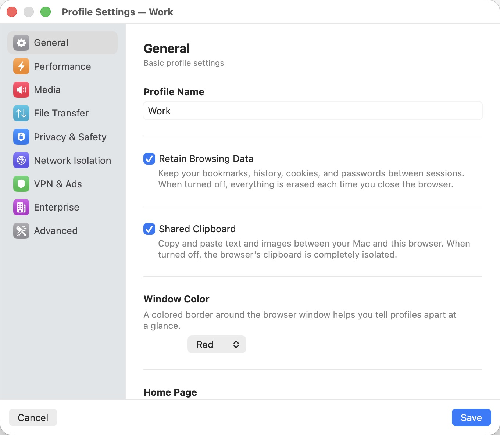
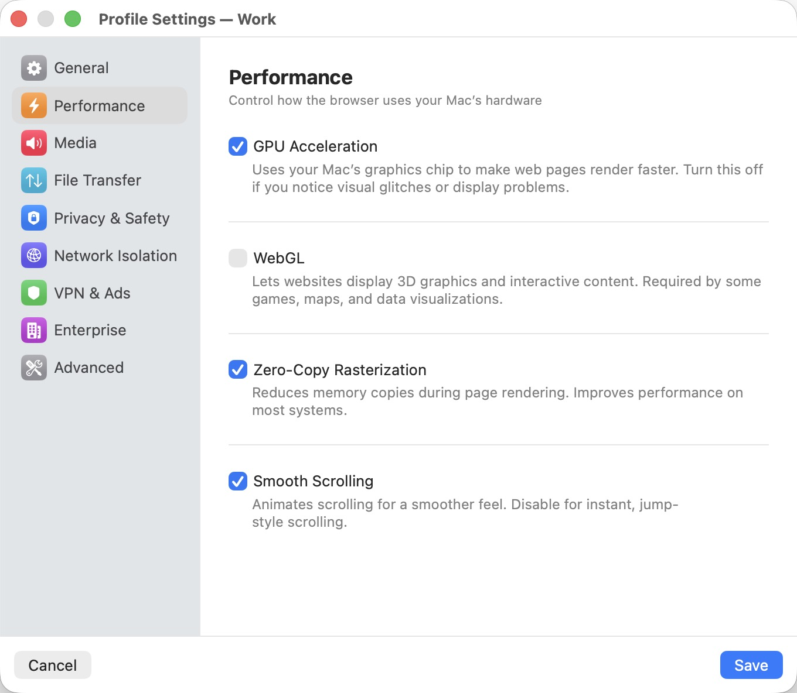
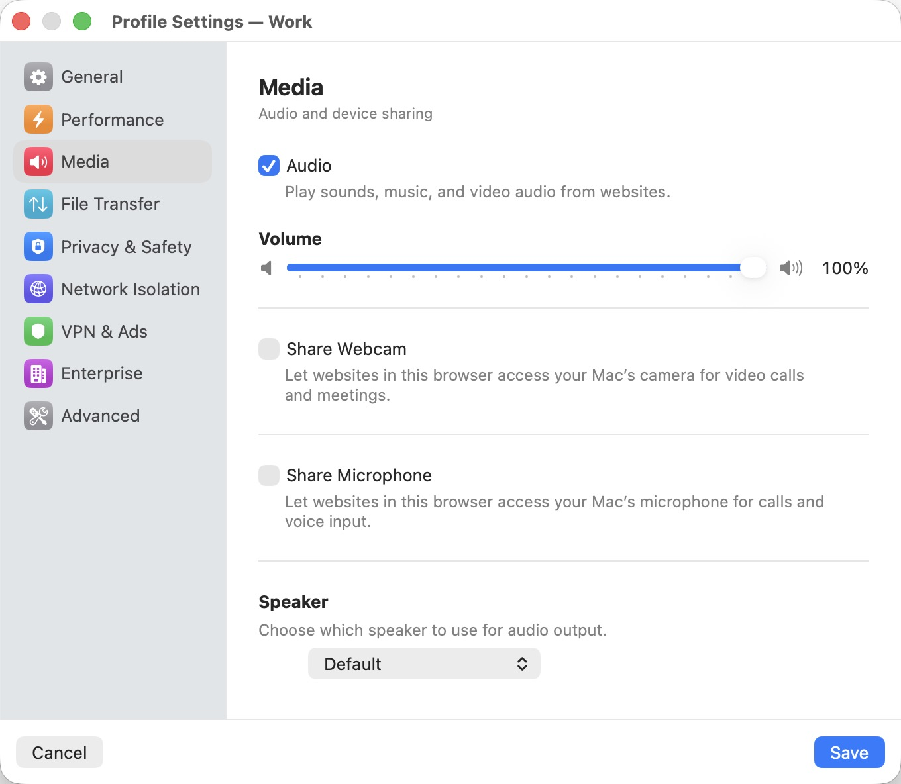
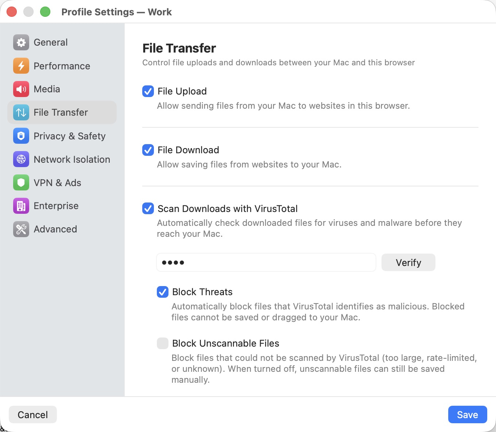
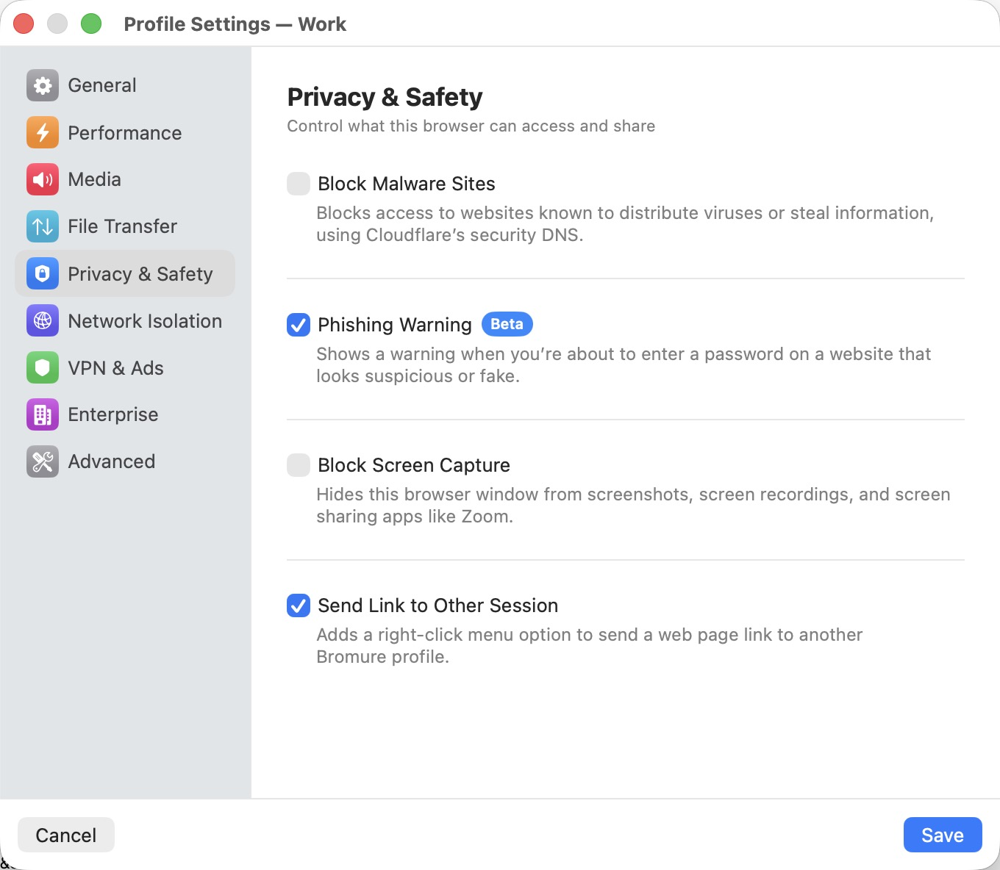
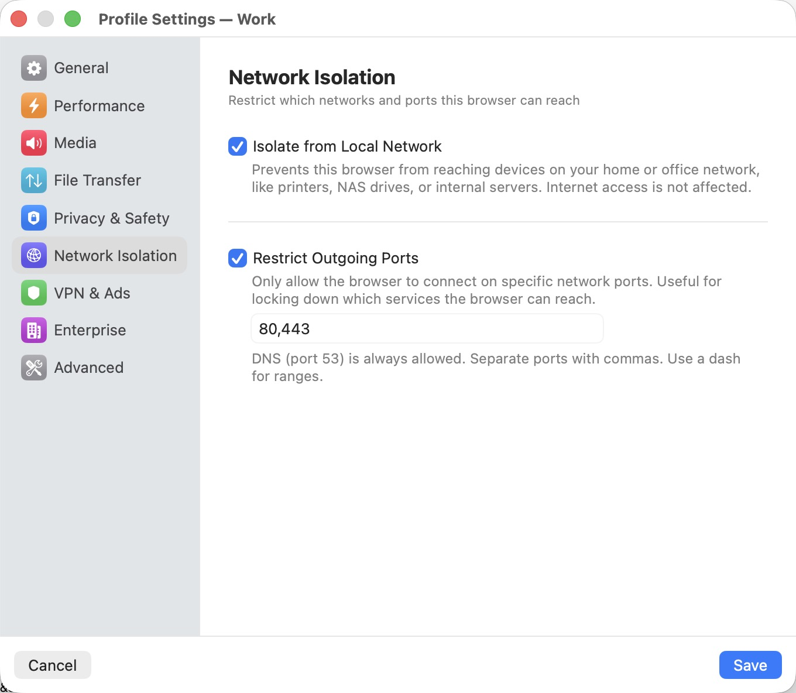
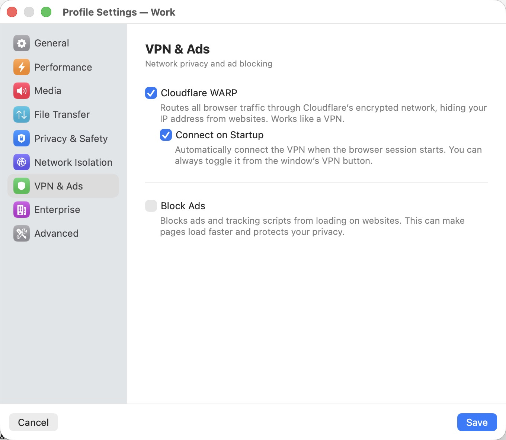
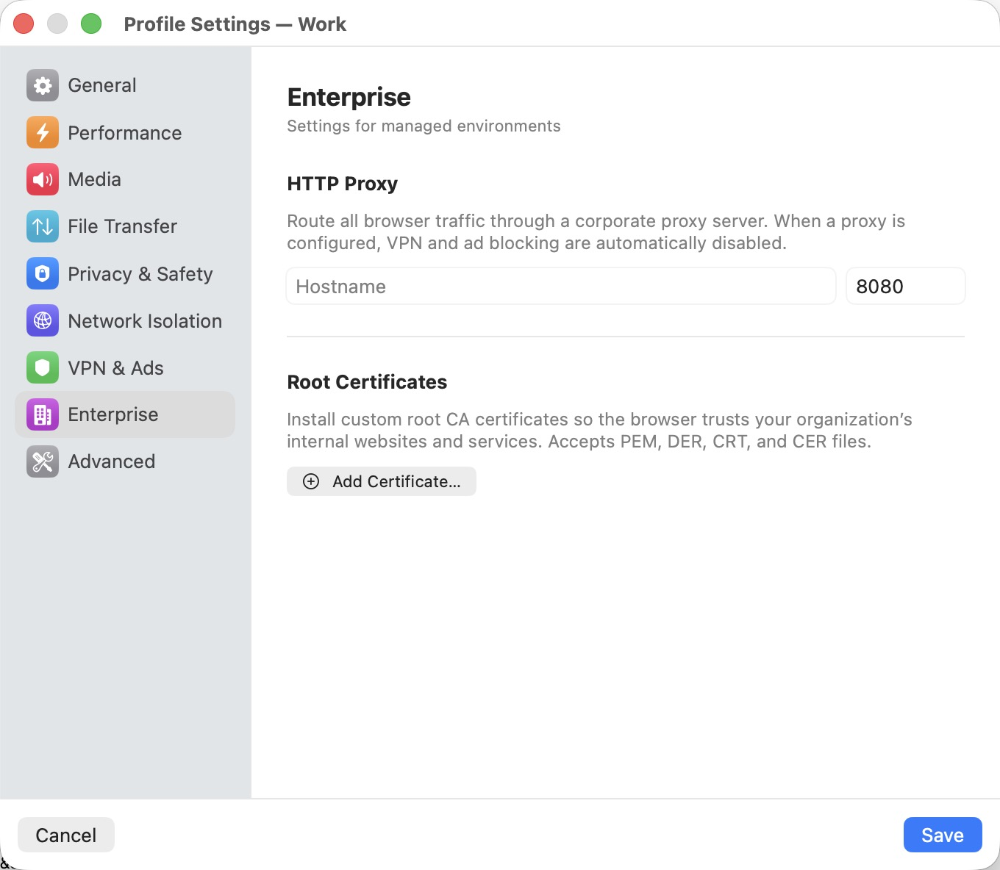
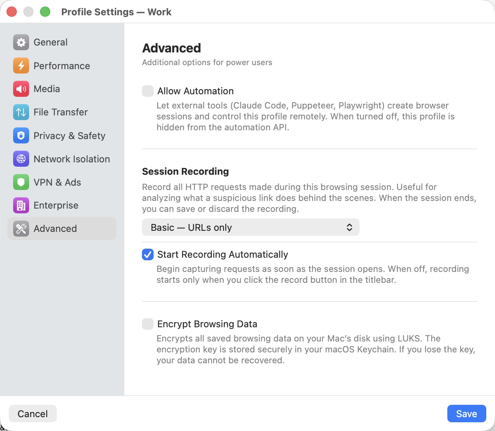

# Bromure Settings Reference

Bromure has two levels of settings: **Profile Settings** (per-profile, opened via the gear icon next to each profile) and **App Settings** (global, opened via the Bromure menu or keyboard shortcut). This document describes every panel in detail.

---

## Profile Settings

Each profile has its own independent configuration across nine panels.

### General

<p align="center">
  
</p>

Basic identity and behavior for the profile.

| Setting | Description |
|---|---|
| **Profile Name** | The display name shown in the profile list and window title bar. |
| **Retain Browsing Data** | When enabled, bookmarks, history, cookies, and passwords persist between sessions on a dedicated virtual disk. When disabled (the default), everything is destroyed when the window closes. |
| **Shared Clipboard** | Allow copy-paste between your Mac and the browser VM. Disabled by default for security -- a compromised page cannot read your clipboard unless you opt in. |
| **Window Color** | A colored border drawn around the browser window to visually distinguish profiles. Options: None, Blue, Red, Green, Orange, Purple, Pink, Teal, Gray. |
| **Home Page** | The URL loaded when a new session starts for this profile. Defaults to `https://bromure.io/hello`. |
| **Match Keyboard Layout** | Automatically switches the browser's keyboard layout when you change it on your Mac. Uses a vsock bridge to send layout changes to the VM in real time. When disabled, the browser always uses the layout set in App Settings > Input. Enabled by default. Supports 249 keyboard layouts. |
| **Language** | The browser's display language. Options: Same as System, English, French, German, Spanish, Portuguese, Japanese, Traditional Chinese, Simplified Chinese. |
| **Comments** | A short note about the profile. Shown as a tooltip when you hover over the profile in the list. |

### Performance

<p align="center">
  
</p>

Controls how the browser uses your Mac's hardware.

| Setting | Description |
|---|---|
| **GPU Acceleration** | Uses your Mac's graphics chip (via Virtio GPU) to accelerate page rendering, CSS animations, and video playback. Enabled by default. Turn it off if you experience visual glitches or display corruption. |
| **WebGL** | Allows websites to use 3D graphics APIs. Required by some games, mapping services (Google Maps 3D), and data visualization tools. Disabled by default to reduce attack surface -- WebGL exposes GPU driver interfaces to web content. Automatically disabled when GPU Acceleration is off. |
| **Zero-Copy Rasterization** | Reduces memory copies during page rendering by allowing the GPU to rasterize directly into shared memory. Improves performance on most systems. Enabled by default. |
| **Smooth Scrolling** | Animates scrolling for a smoother, more fluid feel. Disable for instant, jump-style scrolling. Enabled by default. |

### Media

<p align="center">
  
</p>

Audio output and device sharing for video calls, meetings, and media playback.

| Setting | Description |
|---|---|
| **Audio** | Master toggle for all sound output from websites. When enabled, a volume slider (0--100%) appears. |
| **Volume** | Controls the audio output level for this profile. Independent from other profiles and from your Mac's system volume. |
| **Share Webcam** | Forwards your Mac's camera into the VM so websites can use it for video calls. When enabled, a live preview appears along with a quality picker and an Effects button for real-time visual effects, including face swap for anonymous video calls. |
| **Share Microphone** | Forwards your Mac's microphone into the VM for voice calls and voice input. |
| **Device Selection** | Choose which camera, microphone, and speaker each profile uses. Defaults to your Mac's default devices. |

### File Transfer

<p align="center">
  
</p>

Controls file uploads and downloads between your Mac and the browser VM.

| Setting | Description |
|---|---|
| **File Upload** | Allow sending files from your Mac to websites in this browser session. When enabled, file picker dialogs in the browser can access a shared folder on your Mac. |
| **File Download** | Allow saving files from websites to your Mac. Downloaded files appear in a sidebar drawer within the browser window. |
| **Scan Downloads with VirusTotal** | When downloads are enabled, automatically submit every downloaded file to [VirusTotal](https://www.virustotal.com/) for malware analysis before it reaches your Mac. Requires a free VirusTotal API key. |
| **Block Threats** | Automatically prevent files that VirusTotal flags as malicious from being saved or dragged to your Mac. |
| **Block Unscannable Files** | Block files that could not be scanned -- files too large for VirusTotal, rate-limited requests, or unknown file types. When disabled, unscannable files can still be saved manually. |

### Privacy & Safety

<p align="center">
  
</p>

Controls what the browser can access and share.

| Setting | Description |
|---|---|
| **Block Malware Sites** | Blocks access to websites known to distribute viruses or steal information by routing DNS queries through Cloudflare's security-filtered resolvers (1.1.1.2 / 1.0.0.2). |
| **Phishing Warning** (Beta) | Shows an in-browser warning banner when you are about to enter a password on a suspicious website. Uses a Chromium extension that compares the site against the Tranco top-10k domains list. This is a rough heuristic and will produce false positives. |
| **Block Screen Capture** | Hides this browser window from screenshots, screen recordings, and screen sharing apps like Zoom. Useful when sharing your screen in a meeting while keeping a browser session private. |
| **Send Link to Other Session** | Adds a right-click context menu option to send a link to a different Bromure profile. Useful for opening a suspicious link in a more isolated profile. |

### Network Isolation

<p align="center">
  
</p>

Restricts which networks and ports the browser can reach.

| Setting | Description |
|---|---|
| **Isolate from Local Network** | Prevents the browser VM from reaching any device on your home or office network -- printers, NAS drives, routers, internal servers. Internet access is unaffected. |
| **Restrict Outgoing Ports** | Only allows the browser to connect on specific TCP ports. Enter a comma-separated list of ports or ranges (e.g., `80, 443, 8000-9000`). DNS (port 53) is always allowed. |

### VPN & Ads

<p align="center">
  
</p>

Network privacy and ad blocking.

| Setting | Description |
|---|---|
| **Cloudflare WARP** | Routes all browser traffic through [Cloudflare's encrypted WARP network](https://one.one.one.one/), hiding your IP address from websites. Runs entirely inside the disposable VM. Requires at least 2 GB of VM memory. |
| **Connect on Startup** | When WARP is enabled, automatically connect the VPN when the browser session starts. You can always toggle it from the VPN button in the window's titlebar. |
| **Block Ads** | Blocks ads and tracking scripts at the network layer using a built-in DNS sinkhole and Squid proxy. Ads are intercepted before they reach the browser. |

> **Note:** If an HTTP proxy is configured in the Enterprise tab, both WARP and ad blocking are disabled.

### Enterprise

<p align="center">
  
</p>

Settings for managed environments and corporate deployments.

| Setting | Description |
|---|---|
| **HTTP Proxy** | Route all browser traffic through a corporate proxy server. Enter the hostname and port. Optional username and password fields for proxy authentication. When a proxy is active, WARP and ad blocking are automatically disabled. |
| **Root Certificates** | Install custom CA certificates so the browser trusts your organization's internal websites and TLS-intercepting proxies. Accepts PEM, DER, CRT, and CER files. |

### Advanced

<p align="center">
  
</p>

Additional options for power users.

| Setting | Description |
|---|---|
| **Allow Automation** | Let external tools (Claude Code, Puppeteer, Playwright) create browser sessions and control this profile remotely via the automation API. When disabled, this profile is hidden from the API. |
| **Session Recording** | Record all HTTP requests made during this browsing session. Choose a capture level: **Basic** (URLs only), **Headers** (URLs + headers + POST data), or **Full** (URLs + headers + response bodies). Useful for analyzing what a suspicious link does behind the scenes. When the session ends, you can save the recording as a `.bromtrace` file or discard it. |
| **Start Recording Automatically** | Begin capturing requests as soon as the session opens. When off, recording starts only when you click the record button in the titlebar. |
| **Encrypt Browsing Data** | Encrypts the persistent disk using LUKS. The encryption key is stored in your macOS Keychain. Only available when "Retain Browsing Data" is enabled. |

---

## App Settings

Global settings that apply to all profiles and sessions. Opened via the Bromure menu or keyboard shortcut.

### Hardware

Resources allocated to each browser session.

| Setting | Description |
|---|---|
| **Memory** | RAM allocated to each VM. Options: 1 GB, 2 GB (default), 3 GB, 4 GB, 8 GB, 16 GB. 2 GB is sufficient for most browsing. WARP requires at least 2 GB. |
| **CPU Cores** | Number of CPU cores assigned to each VM. "Automatic" (default) allocates 2 cores per GB of memory, up to the number of cores on your Mac. |
| **Kernel Boot Options** | Additional Linux kernel command-line parameters appended to the VM boot command. The default (`arm64.nosme`) disables SME to work around a crash on Apple M4 processors. A warning appears if you change this from the default. |

### Input

Keyboard and trackpad settings.

| Setting | Description |
|---|---|
| **Keyboard Layout** | The base keyboard layout used inside the VM. Over 249 layouts available including US, AZERTY, QWERTZ, Dvorak, Colemak, and international layouts. This sets the initial layout at image build time. For dynamic switching, use "Match Keyboard Layout" in each profile's General settings. Changing this rebuilds the base image. |
| **Natural Scrolling** | Matches your macOS trackpad scrolling direction inside the VM. Requires a base image rebuild when changed. |
| **Use Command as Control** | Swaps the Command and Control keys so that macOS shortcuts (Cmd+C, Cmd+V, Cmd+T) work as expected inside the Linux VM. Does not require a rebuild. |

### Display

Screen and appearance settings.

| Setting | Description |
|---|---|
| **Scale Factor** | Display resolution: 1x (standard) or 2x (Retina). Use 2x for sharp text on Retina displays. Changes take effect on the next session (no image rebuild required). |
| **Appearance** | Browser color scheme: "Same as System" follows your macOS light/dark setting, or force "Light" or "Dark". |

### Network

Connection mode and DNS settings. These settings are rarely needed -- the defaults work for most users.

| Setting | Description |
|---|---|
| **Connection Mode** | **NAT** (default): The VM shares your Mac's network connection. **Bridged**: The VM gets its own IP address on your physical network. Bridged mode disables LAN isolation and port restriction. |
| **Network Interface** | When using bridged mode, select which physical network interface the VM bridges to. |
| **DNS Servers** | Override the DNS servers used inside the VM. Only applies in NAT mode. Leave empty to use your Mac's default DNS. |

### Automation

Remote browser control via HTTP API, CDP, and MCP. The automation server can be toggled on and off dynamically without restarting the app.

| Setting | Description |
|---|---|
| **Enable Automation** | Start an HTTP server that lets external tools create browser sessions and control them via CDP. |
| **API Port** | The port for the automation API server (default: 9222). |
| **Bind Address** | `127.0.0.1` (localhost only) or `0.0.0.0` (all interfaces). Binding to all interfaces exposes the API to your entire network. |

**API Reference:**

| Method | Endpoint | Description |
|--------|----------|-------------|
| `GET` | `/health` | Health check |
| `GET` | `/profiles` | List available profiles |
| `GET` | `/sessions` | List active sessions |
| `POST` | `/sessions` | Create a new browser session |
| `GET` | `/sessions/:id` | Get session info |
| `DELETE` | `/sessions/:id` | Close a session |
| `GET` | `/sessions/:id/trace` | Get session trace events |
| `WS` | `/cdp/:id/...` | Chrome DevTools Protocol WebSocket proxy |

**MCP Server:**

Bromure includes a built-in [Model Context Protocol](https://modelcontextprotocol.io) server for AI tools. Add to your `.mcp.json`:

```json
{
  "mcpServers": {
    "bromure": {
      "command": "/Applications/Bromure.app/Contents/MacOS/bromure",
      "args": ["mcp"]
    }
  }
}
```

Add `--debug` to the args for VM shell access and app state tools.

### Storage

Disk usage and base image management.

| Setting | Description |
|---|---|
| **Disk Usage** | Shows total disk space consumed by the base image and all profile data. |
| **Storage Location** | The path where Bromure stores its data (`~/Library/Application Support/Bromure`). |
| **Reset** | Deletes the Linux base image, forcing a fresh download and setup on next launch. Does not delete profile data or settings. |

---

## Localization

Bromure is available in 8 languages: English, French, German, Spanish, Portuguese, Japanese, Traditional Chinese (zh-TW), and Simplified Chinese (zh-CN). The app follows your macOS language setting, or you can override it per launch with the `-AppleLanguages` flag.
