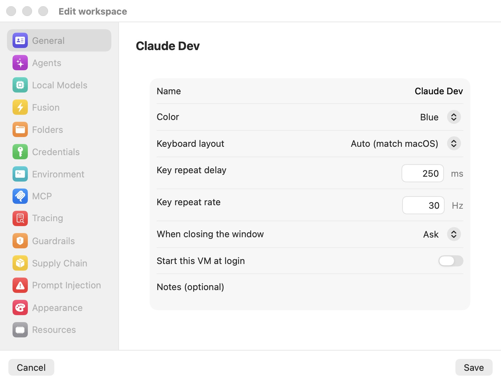
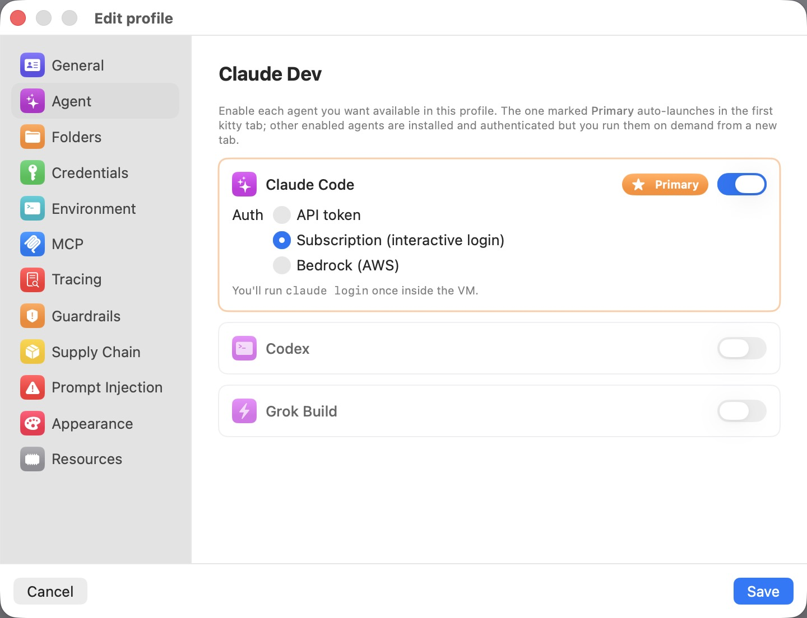
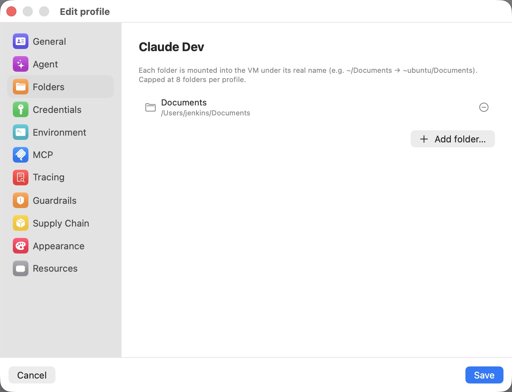
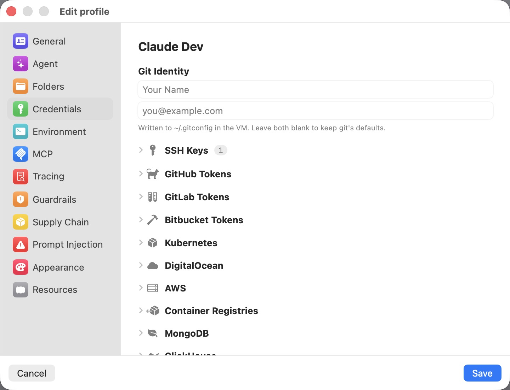
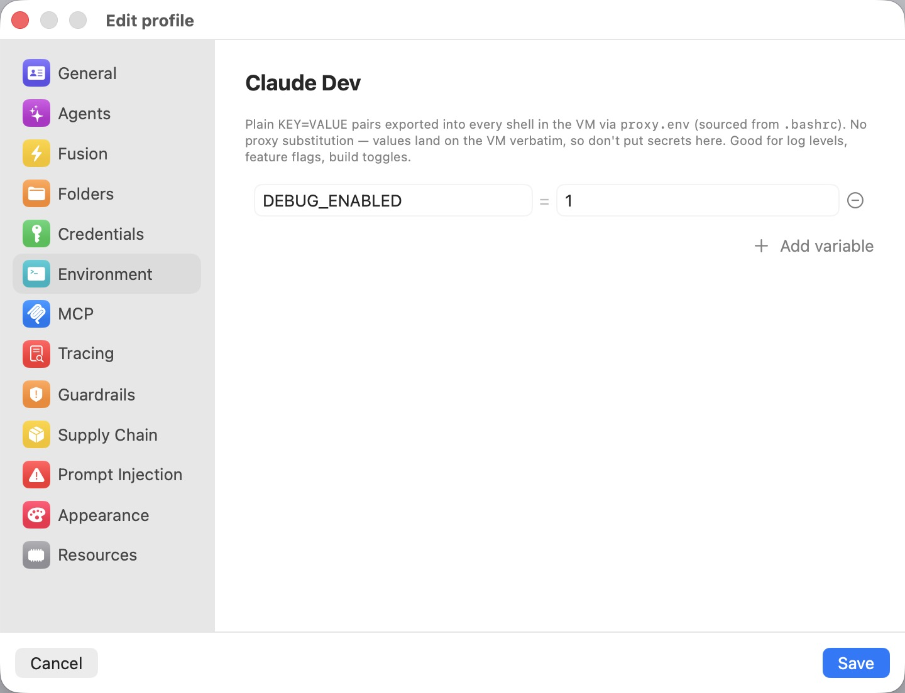
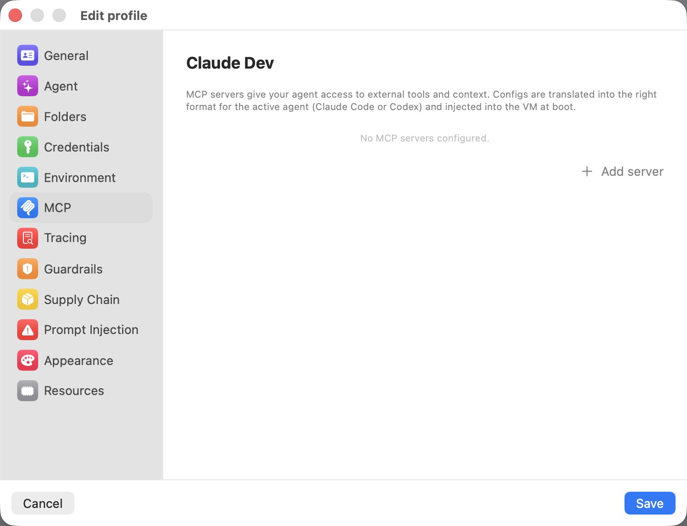
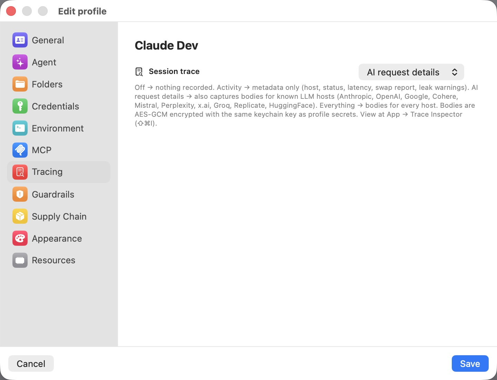
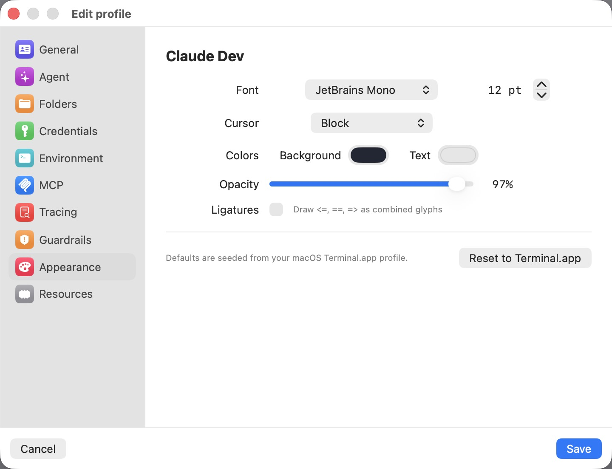
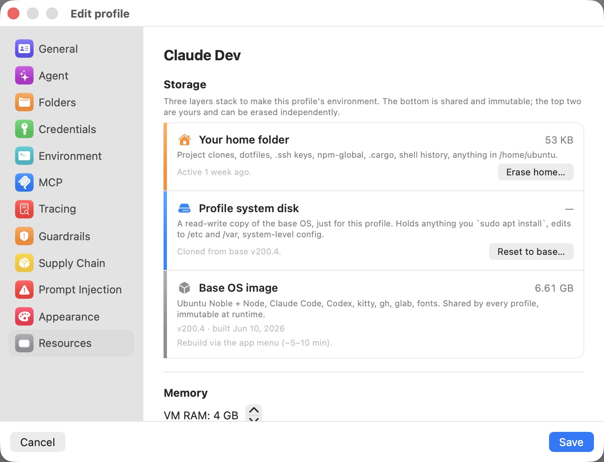

# Bromure Agentic Coding — Profile Settings Reference

Each profile in Bromure Agentic Coding has its own independent configuration across nine panels, accessed by clicking the gear icon next to a profile in the picker.

---

## General

  

Basic identity and behavior for the profile.

| Setting | Description |
|---|---|
| **Name** | The display name shown in the profile list. |
| **Color** | A colored dot drawn next to the profile in the picker to visually distinguish profiles. Options: Blue, Red, Green, Orange, Purple, Pink, Teal, Gray. |
| **Keyboard layout** | The keyboard layout used inside the VM. "Auto (match macOS)" dynamically mirrors whichever input source is active on the host, with live updates when you switch. Select any other layout to pin the VM to a specific XKB layout regardless of macOS state. |
| **Key repeat delay** | Time in milliseconds before a held key starts repeating inside the VM. Defaults to your macOS value; change it to override the X11 key-repeat cadence independently of the host. |
| **Key repeat rate** | Repeat frequency in Hz once the delay has elapsed. Defaults to your macOS value. Useful when the X-server pipeline makes typing feel laggier than in a Cocoa app — bumping the rate 2× the macOS value is a common fix. |
| **When closing the window** | What happens to the VM when you close a session window: **Suspend** (saves RAM to disk for instant resume — default), **Shut down** (clean ACPI poweroff), or **Ask** (prompt each time). |
| **Notes (optional)** | A short note about the profile. Shown as a tooltip when you hover over the profile in the list. |

---

## Agent

  

Choose which coding agents are available in this profile and how they authenticate. The agent marked **Primary** is auto-launched in the first kitty tab when a session opens; other enabled agents are installed and authenticated but started on demand from a new tab.

| Setting | Description |
|---|---|
| **Claude Code** | Enable or disable the Claude Code agent for this profile. Toggle on to configure. |
| **Claude Code — Primary** | Mark Claude Code as the primary agent (auto-launched on session start). Click "Primary" on any enabled agent to promote it. |
| **Claude Code — Auth** | Authentication method for Claude Code: **API token** (paste an `ANTHROPIC_API_KEY` — injected as an env var, never written into the VM directly), **Subscription (interactive login)** (run `claude login` once inside the VM), or **Bedrock (AWS)** (use your AWS credentials via the Bedrock runtime — requires AWS credentials configured in the Credentials tab). |
| **Claude Code — Require approval to use** | (Token mode only.) When enabled, every fake→real swap of the Anthropic API key shows a host-side consent dialog before the key is forwarded. Off by default. |
| **Claude Code — Default Model ID** | (Bedrock mode only.) Override the Bedrock model ID Claude Code uses, e.g. `us.anthropic.claude-sonnet-4-6-v1:0`. Leave empty to use Claude Code's built-in default. |
| **Codex** | Enable or disable the OpenAI Codex agent for this profile. Toggle on to configure authentication. |
| **Codex — Auth** | Authentication method for Codex: **API token** (paste an `OPENAI_API_KEY`) or **Subscription (interactive login)** (run `codex login` once inside the VM). |
| **Codex — Require approval to use** | (Token mode only.) When enabled, every fake→real swap of the OpenAI API key shows a host-side consent dialog before the key is forwarded. Off by default. |
| **Grok Build** | Enable or disable the Grok Build (xAI) agent for this profile. Toggle on to configure. |
| **Grok Build — Auth** | Authentication method for Grok Build: **API token** (paste an `XAI_API_KEY` — injected as an env var; the proxy swaps the fake `xai-brm-…` key back to the real value on requests to `api.x.ai`, so the real key never enters the VM) or **Subscription (interactive login)** (run `grok login` once inside the VM). Bedrock is not available for Grok Build. |
| **Grok Build — Require approval to use** | (Token mode only.) When enabled, every fake→real swap of the xAI API key shows a host-side consent dialog before the key is forwarded. Off by default. |

---

## Folders

  

Mac folders to share into the VM. Each folder is mounted at `/home/ubuntu/<basename>` (e.g., `~/Documents` → `~ubuntu/Documents`). Capped at 8 folders per profile.

| Setting | Description |
|---|---|
| **Folder list** | The host paths currently shared into the VM. Each row shows the folder name and its full path on your Mac. Click the minus button to remove a share. |
| **Add folder…** | Opens a file picker to select one or more directories to share. Greyed out when 8 folders are already configured. |

---

## Credentials

  

Secrets and identities injected into the VM at session start. All real values stay on the host; the MITM proxy substitutes them for fake placeholders on the wire so secrets never enter the VM's address space.

| Setting | Description |
|---|---|
| **Git Identity — Name** | Written to `user.name` in `~/.gitconfig` inside the VM. Leave blank to keep git's defaults. |
| **Git Identity — Email** | Written to `user.email` in `~/.gitconfig` inside the VM. Leave blank to keep git's defaults. |
| **SSH Keys** | Expandable section. Manages the auto-generated ed25519 keypair (one per profile) and any imported private keys. The generated public key is shown here for pasting into github.com/settings/keys. Imported keys (RSA, ed25519, ecdsa, including passphrase-protected ones) are loaded into the per-profile bromure ssh-agent at every session launch; passphrases are stored in the macOS Keychain. |
| **SSH Keys — Require approval to use** | When enabled, every SSH sign request using this key shows a host-side consent dialog. The user picks a time-bounded grant (5 min / 1 hr / rest of session) or denies. Off by default. |
| **GitHub Tokens** | Expandable section. Personal access tokens for git over HTTPS to github.com. Written to `~/.git-credentials` and picked up by the `gh` CLI automatically. The real token stays on the host; the proxy swaps a fake on outbound requests. |
| **GitLab Tokens** | Expandable section. Personal access tokens for git over HTTPS to gitlab.com and self-hosted GitLab instances. Picked up by the `glab` CLI automatically. |
| **Bitbucket Tokens** | Expandable section. App passwords for git over HTTPS to bitbucket.org. |
| **Kubernetes** | Expandable section. One entry per cluster context. Bromure generates a synthetic `~/.kube/config` in the VM with throwaway client certs; real credentials stay on the host and are substituted by the proxy on API-server requests. Exec-plugin contexts are polled on the host so `kubectl` always sees a fresh token. Contexts can be added manually or imported from an existing kubeconfig file. |
| **DigitalOcean** | Expandable section. Personal access token from cloud.digitalocean.com. Injected as `DIGITALOCEAN_ACCESS_TOKEN` env and `~/.config/doctl/config.yaml` — `doctl auth init` is unnecessary. |
| **AWS** | Expandable section. AWS credentials for the `aws` CLI and SDKs. Supports **Static keys** (Access Key ID + Secret Access Key + optional Session Token + default region) and **SSO / Identity Center** (select a named profile from `~/.aws/config`). The real secret never reaches the VM — the host's MITM proxy intercepts and re-signs SigV4 requests with the real material; if the proxy is bypassed, AWS rejects with `InvalidSignatureException`. |
| **AWS — Require approval to use** | When enabled, every host-side SigV4 signing call (one per AWS API request) shows a consent prompt until a time-bounded grant covers it. |
| **Container Registries** | Expandable section. Per-registry HTTP Basic auth for `docker pull` / `docker push`. Supports Docker Hub, GHCR, GitLab Container Registry, Quay, and arbitrary private registries. A fake `base64("<user>:<derived>")` is written to `~/.docker/config.json` in the VM; the proxy substitutes the real value on the wire. Can be populated by importing an existing `~/.docker/config.json`. |
| **Other API keys** | Expandable section. Manual token-swap rules for any API beyond the auto-handled ones (Anthropic, OpenAI, GitHub, GitLab, DigitalOcean, Kubernetes). Each entry mints a fresh fake (`brm_…`) exported as a named env var inside the VM; the proxy swaps it back to the real value on outbound requests to the optionally-specified host. |
| **MongoDB** | Expandable section. MongoDB Atlas Data API endpoints. Each entry specifies a display name, the bare hostname of the endpoint, authentication kind (**API key**, **Bearer token**, or **Username + password**), and one or more env var names under which the fake credential is exported into the VM. The real secret stays on the host; the proxy swaps it on outbound requests to the specified host. A per-endpoint Guardrails mode (Off / Block destructive / Read-only) can also be set here and is enforced in the proxy — `deleteOne`/`deleteMany` = destructive, `find`/`aggregate` = read. |
| **ClickHouse** | Expandable section. ClickHouse HTTP interface endpoints. Each entry specifies a host, authentication kind, env var names, and an optional Guardrails mode. The proxy intercepts requests to the host and substitutes the real credential on the wire. Guardrails classify SQL by leading keyword: `DROP`/`TRUNCATE`/`DELETE` = destructive; `INSERT`/`CREATE` = write; `SELECT`/`SHOW` = read. |
| **Elasticsearch** | Expandable section. Elasticsearch endpoints. Each entry specifies a host, authentication kind, env var names, and an optional Guardrails mode. Guardrails classify by HTTP method and path: `DELETE` and `_delete_by_query` = destructive; `_search`/`_count`/`_msearch` = read; `_bulk`/index/`_update` = write. |

---

## Environment

  

Plain `KEY=VALUE` pairs exported into every shell in the VM via `proxy.env` (sourced from `.bashrc`). Values are written verbatim — no proxy substitution — so do not put secrets here. Intended for non-secret toggles such as log levels, feature flags, and build options.

| Setting | Description |
|---|---|
| **Variable list** | The environment variables currently configured. Each row has a name field and a value field. Click the minus button to remove a variable. |
| **Add variable** | Appends a new empty `KEY=VALUE` row. |

---

## MCP

  

Model Context Protocol servers that give the agent access to external tools and context. Configurations are translated into the appropriate format for the active agent (Claude Code JSON or Codex TOML) and injected into the VM at boot.

| Setting | Description |
|---|---|
| **Server list** | MCP servers currently configured for this profile. Each server can be toggled on or off independently. Supports **HTTP** transport (a URL-based remote server, with optional bearer token) and **stdio** transport (a local command launched inside the VM). |
| **Add server** | Appends a new MCP server entry. |

---

## Tracing

  

Controls how the MITM proxy records traffic for this profile. Higher levels write encrypted body files to disk; all are opt-in. Recorded data can be viewed in App → Trace Inspector (⇧⌘I).

| Setting | Description |
|---|---|
| **Session trace** | How aggressively the proxy records traffic. **Off** — nothing recorded (default). **Activity** — metadata only: host, status, latency, swap report, leak warnings; no request or response bodies. **AI request details** — same as Activity, plus full bodies for known LLM hosts (Anthropic, OpenAI, Google, Cohere, Mistral, Perplexity, x.ai, Groq, Replicate, HuggingFace). **Everything** — bodies for every host; uses disk space fastest (capped at 100 MB per session / 5 GB total). Bodies are AES-GCM encrypted with the same keychain key as profile secrets. |
| **Private mode** | (Only shown on Macs enrolled with a bromure.io workspace.) When enabled, sessions for this profile do not stream metadata (tools, files, commands, token usage) to the workspace. The local trace inspector is unaffected. Useful when working with a personal API key you do not want your admin to see. |
| **Claude subscription token swap** | (Shown only after the proxy has prompted about this profile.) Displays whether the real Claude OAuth tokens are currently being swapped by the proxy (**Active**) or whether the user declined the swap (**Declined**). A reset button lets the user be asked again on the next session. |
| **Codex subscription token swap** | Same three-state swap consent as above, scoped to the Codex / ChatGPT OAuth tokens (`~/.codex/auth.json`). Shown independently so a profile that uses both agents can manage each provider separately. |

---

## Guardrails

Host-side policy engine that strips destructive operations from the protocols the agent speaks. Enforcement happens inside the MITM proxy on the host, so a misbehaving or compromised agent in the VM cannot bypass it — blocked calls return a hard 403 error that the agent sees as a normal API failure.

Each resource supports three modes: **Off** (no filtering — default), **Block destructive** (block deletes/drops/terminates; allow creates and updates), or **Read-only** (block every mutation; reads only).

| Setting | Description |
|---|---|
| **Kubernetes** | Guardrail mode for the Kubernetes API servers configured in this profile's kubeconfigs. HTTP method-based: `DELETE` = destructive (includes `deletecollection`); all writes are blocked in read-only mode. A warning is shown if no kubeconfigs are configured. |
| **AWS** | Guardrail mode for all `*.amazonaws.com` APIs. Classified by action name extracted from the `X-Amz-Target` header (JSON-protocol services like DynamoDB/Lambda) or the `Action=` form parameter (query-protocol services like EC2/IAM/SQS); falls back to HTTP method for S3 and REST-style requests. `Delete*`/`Terminate*`/`Remove*`/`Purge*`/`Destroy*` = destructive; `Get*`/`List*`/`Describe*` = read. |
| **DigitalOcean** | Guardrail mode for `api.digitalocean.com` and `*.digitalocean.com`. HTTP method-based: `DELETE` = destructive; `GET`/`HEAD` = read. |
| **Docker registries** | Guardrail mode for the container registries configured in this profile's Credentials. HTTP method-based against the registry's hostname: `DELETE` = destructive (tag/manifest deletion); `GET`/`HEAD` = read (pull); `PUT`/`POST` = write (push). A warning is shown if no registries are configured. |
| **GitHub** | Guardrail mode for `github.com` REST API and git over HTTPS. Method-based for REST; git push (`git-receive-pack`) is treated as a write and blocked in read-only mode; git fetch (`git-upload-pack`) is always allowed. |
| **GitLab** | Guardrail mode for `gitlab.com` REST API and git over HTTPS. Same classification logic as GitHub. |
| **Bitbucket** | Guardrail mode for `bitbucket.org` REST API and git over HTTPS. Same classification logic as GitHub. |
| **Databases** | Per-endpoint Guardrails mode for each HTTPS database endpoint configured under Credentials (MongoDB, ClickHouse, Elasticsearch). Shown here as individual rows, one per endpoint. Modes and classification rules match those described in the Credentials section for each engine. A prompt is shown if the endpoint's host is not yet set. |

---

## Appearance

  

Visual appearance of the kitty terminal window. Defaults are seeded from your macOS Terminal.app default profile.

| Setting | Description |
|---|---|
| **Font** | The font family used in the terminal. Choose from any font installed on your Mac. Size is set in points via a stepper. Only font families without a leading `.` are offered — macOS-internal names that Linux fontconfig cannot resolve are excluded. |
| **Cursor** | Cursor shape inside the terminal: **Block**, **Beam (I-cursor)**, or **Underline**. |
| **Colors — Background** | Terminal background color, as a color picker swatch. |
| **Colors — Text** | Terminal foreground (text) color, as a color picker swatch. |
| **Opacity** | Combined window and terminal opacity, from 30% to 100%. Applied as both kitty's `background_opacity` (requires a compositor in the VM) and the macOS window's `alphaValue` (always effective — produces a see-through-to-the-desktop effect). Default is 97%. |
| **Ligatures** | When enabled, the terminal renders programming ligatures — multi-character sequences such as `<=`, `==`, and `=>` are drawn as single combined glyphs. Disabled by default (kitty's `disable_ligatures always` is active unless this is turned on). Only visible with fonts that include ligature tables, such as JetBrains Mono or Fira Code. |
| **Reset to Terminal.app** | Restores all appearance fields to the values read from your macOS Terminal.app default profile at app startup. |

---

## Resources

  

Storage layers, memory, and network configuration for the profile's VM.

### Storage

Three layers stack to make the profile's environment. The bottom layer is shared and immutable; the top two are per-profile and can be erased independently.

| Setting | Description |
|---|---|
| **Your home folder** | The per-profile `/home/ubuntu` directory — dotfiles, `.ssh` keys, `npm-global`, `.cargo`, shell history, and anything else the agent writes to home. Shows last-active time and current size. **Erase home…** wipes this layer and resets the home directory to its post-clone state. |
| **Profile system disk** | A read-write copy of the base OS cloned specifically for this profile. Holds anything installed via `sudo apt install`, edits to `/etc`, `/var`, and system-level config. **Reset to base…** discards all system-level changes and re-clones from the current base image. |
| **Base OS image** | The shared, immutable base image: Ubuntu Noble + Claude Code + Codex + kitty + gh + glab + fonts. Shared by every profile; read-only at runtime. Shows the current version stamp and build date. Rebuilt via the app menu (takes ~5–10 minutes). |

### Memory

| Setting | Description |
|---|---|
| **VM RAM** | RAM allocated to this profile's VM, in GB (2–32 GB, step 2). Defaults to a host-scaled value (4 GB on hosts with less than 18 GB RAM, 6 GB up to 36 GB, 8 GB on larger machines). Increase this if Claude / Codex feels sluggish or Rust builds run out of memory. |

### Network

| Setting | Description |
|---|---|
| **Network mode** | **NAT** (default) — the VM shares your Mac's network connection via VZ's built-in NAT; egress works, nothing on your LAN can reach the VM. **Bridged** — the VM gets its own LAN-routable IP address via DHCP on the chosen physical interface. |
| **Interface** | (Bridged mode only.) The physical network interface the VM bridges to. Defaults to the first available bridged interface if left unset. |
