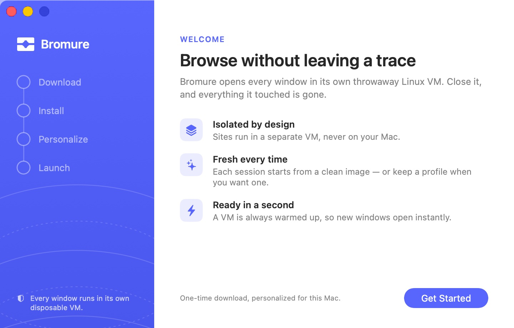
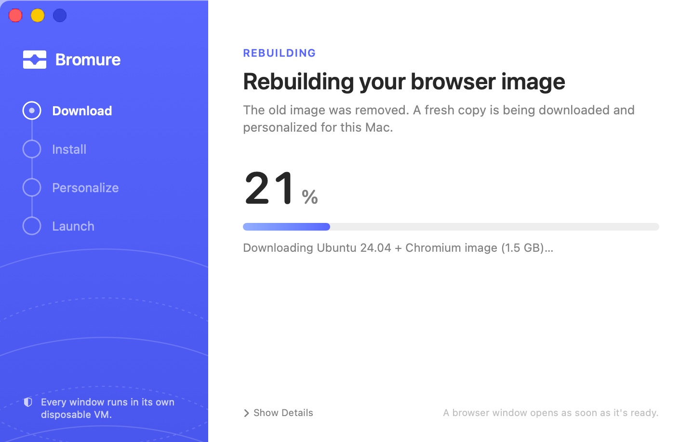
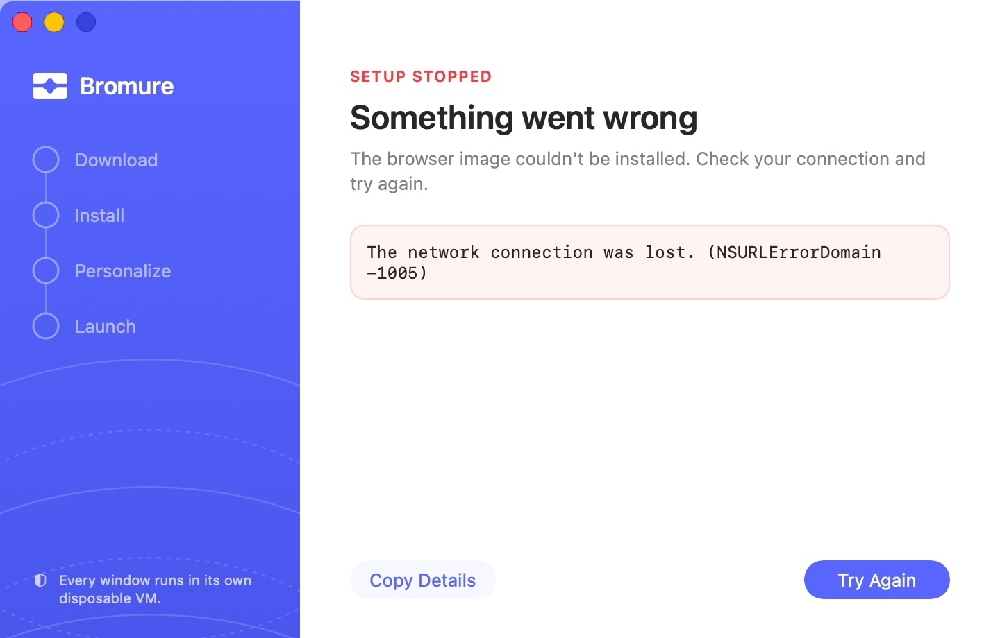
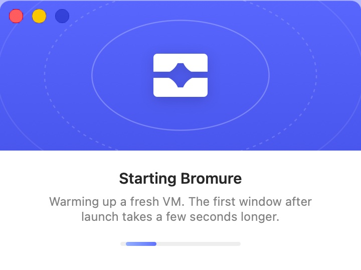

# Installation & First Run

This chapter takes you from an empty Mac to your first Bromure window: what the app needs, how to install it, what the setup window does the first time you open it, and how the Linux **browser image** that every window starts from is downloaded, kept up to date and rebuilt. It ends with where Bromure keeps its files and how to remove everything. When you're done here, continue with the [Quick Start](03-quick-start.mdx).

## System requirements

| Requirement | Minimum |
|---|---|
| Mac | Apple Silicon (M1 or newer) |
| macOS | macOS 14 (Sonoma) or later |
| Free disk space | At least 8 GB free when the image is installed or updated, and at least 1 GB free each time a window opens |
| Network | Internet access for the first-time image download (a local build is used automatically if the download fails; it also needs the internet) |

There is no Intel version. Bromure runs its Linux VMs with Apple's Virtualization framework, which runs ARM64 Linux guests on Apple Silicon only.

Memory: each open window is a VM with its own memory, set in [Settings › Hardware](08-app-settings/hardware.mdx). Until you choose a value there, Bromure picks one from your Mac's memory: 2 GB per VM on Macs with less than 18 GB, 3 GB with less than 36 GB, and 4 GB otherwise.

## Installing the app

Bromure is published as a signed, notarized disk image, `Bromure.dmg`, on [bromure.io](https://bromure.io).

1. Download `Bromure.dmg` from bromure.io.
2. Open it. The window shows the Bromure icon and an arrow pointing at an **Applications** shortcut.
3. Drag **Bromure** onto **Applications**.
4. Eject the disk image and open Bromure from `/Applications`.

Because the app and the disk image are notarized by Apple, Gatekeeper opens them without a warning. If a copy of Bromure from anywhere else triggers a Gatekeeper warning, don't bypass it — download it again from bromure.io.

The first time a profile uses your camera or microphone, macOS asks for permission, as it does for any app ("Bromure needs camera access to share your webcam with the virtual machine."). Nothing else asks for system permissions during installation.

## First run: the setup window

The first time you open Bromure, it has no browser image yet, so instead of a browser window it shows the **setup window**. The same window comes back whenever the image is being rebuilt or updated, and when something goes wrong with it.

The setup window has two parts:

- On the left, a blue **brand rail** with the Bromure mark and the four stages of an install: **Download**, **Install**, **Personalize**, and **Launch**. Finished stages show a check mark, the current stage a pulsing dot, and a failed stage an exclamation mark. At the bottom, the rail reads "Every window runs in its own disposable VM."
- On the right, the current step.

### Welcome

<p align="center">
  
</p>

The first pane, headed **WELCOME**, reads **Browse without leaving a trace** — "Bromure opens every window in its own throwaway Linux VM. Close it, and everything it touched is gone." Three short points summarize the idea:

- **Isolated by design** — "Sites run in a separate VM, never on your Mac."
- **Fresh every time** — "Each session starts from a clean image — or keep a profile when you want one."
- **Ready in a second** — "A VM is always warmed up, so new windows open instantly."

Click **Get Started** (or press Return) to begin. The caption beside it, "One-time download, personalized for this Mac.", is a fair summary of what happens next.

### Progress

<p align="center">
  
</p>

While the image is being installed, the pane shows:

- An **eyebrow** that says why the image is being installed: **FIRST-TIME SETUP** on a new installation, **REBUILDING** after you ask for a rebuild, or **UPDATING** when the image is refreshed or brought up to date with a new version of Bromure (see [Keeping the image up to date](#keeping-the-image-up-to-date)).
- A **title** and a sentence that match the eyebrow. On first run: **Setting up Bromure** — "Downloading the Linux + Chromium image and personalizing it for this Mac. This only happens once."
- A large **percentage** and a progress bar. The percentage covers the whole install in one continuous bar; work that can't report a percentage (such as the local build described below) shows an animated bar instead.
- A **status line** that narrates the current step, for example "Fetching image catalog…", "Downloading … image (… GB)…", "Expanding image…", "Personalizing (keyboard, language, fonts)…", "Installing Google Chrome (official arm64 build)…" or "Checking filesystem integrity…".
- **Show Details**, which opens a box with the last few steps (each with a check mark once done) and the tail of the installer's console output. The small copy button in the box (**Copy the console output**) puts the whole log on the clipboard. Click **Hide Details** to close it.

The rail follows the install: **Download** while the image is fetched, **Install** while it is expanded and its boot files are prepared, and **Personalize** while it is adapted to your Mac.

When the image is ready, the pane changes to **Almost there** — "The image is ready. Warming up the first VM so your browser opens instantly." — and the rail moves to **Launch**. As soon as that first VM is ready, the setup window closes and your first browser window opens.

You can close the setup window at any time; the install carries on in the background. Click Bromure's Dock icon to bring the window back.

### If setup fails

<p align="center">
  
</p>

If the install stops, the pane turns into an error: the red eyebrow **SETUP STOPPED**, the title **Something went wrong**, "The browser image couldn't be installed. Check your connection and try again.", and the error message in a box. The rail marks the stage that failed.

- **Try Again** (Return) starts over.
- **Copy Details** copies the error message and the console log, which is what support needs if you report the problem.

Two errors have their own wording:

- "Not enough disk space (… MB available). Free up space and try again." — the install needs at least 8 GB free on your startup disk (more precisely, on the volume that holds `~/Library/Application Support/Bromure/`).
- "Couldn't set up networking. Bromure tries again when your network changes, or click Try Again." — the VM's network couldn't be created. Bromure retries by itself when your Mac's network changes.

[Troubleshooting](15-troubleshooting.mdx) covers setup problems in more detail.

### Starting

<p align="center">
  
</p>

Once the image is installed, you won't see the setup layout again during a normal launch. Instead, a small splash reads **Starting Bromure** — "Warming up a fresh VM. The first window after launch takes a few seconds longer." — while Bromure boots its first VM. The splash disappears as soon as your first window opens, usually within seconds.

Like Safari, launching Bromure opens a browser window. It opens in your most recently used profile; on the very first launch that is the built-in **Private Browsing** profile, which keeps nothing when you close it. [Quick Start](03-quick-start.mdx) picks up from here.

## What setup does

Every Bromure window starts from one **browser image**: an Ubuntu 24.04 Linux system with Chromium, stored on your Mac. Setup produces that image. It has two ways to do so, and both end with the same result.

### The prebuilt image download

The normal path downloads an image that the Bromure team builds and publishes weekly at `https://dl.bromure.io/browser-images/`:

1. **Catalog.** Bromure fetches the image catalog, `img-catalog.json`. It names the current image, the SHA-256 checksum of each file, and a list of extra packages to install. The catalog is signed with the same key that signs Bromure's app updates, and Bromure refuses a catalog whose signature doesn't verify.
2. **Download.** Bromure downloads the compressed disk image, the Linux kernel and its initial RAM disk, and checks each file against its checksum. If a download fails, it fetches the catalog again and retries, up to three times.
3. **Expansion.** The disk image is expanded on your Mac.
4. **Personalization.** Bromure starts a temporary VM on the new image and adapts it to your Mac: it copies your Mac's fonts into the image (so pages render with familiar fonts), applies your keyboard layout, trackpad scrolling direction and language, and installs the catalog's recommended packages. In version 5.0.0 those are **Google Chrome** (the official arm64 build, used by profiles that choose Google Chrome) and the **Cloudflare WARP** client (used by profiles with the WARP VPN). Clicking **Get Started** is your consent to install this first set. Finally the image's file system is checked.
5. **Swap into place.** Everything is written to temporary `.partial` files first; only when all steps succeed are the finished files moved into place. An interrupted install never leaves a half-written image behind.

### The local build fallback

If the download fails for a download-related reason — you're offline, the server can't be reached, or a checksum doesn't match — Bromure automatically switches to building the image on your Mac. The status line reads "Prebuilt image unavailable — building locally instead." The local build takes about ten minutes and produces the same image:

1. Downloads the build tools (a small Alpine Linux installer).
2. Creates the disk image.
3. Boots the installer in a temporary VM, which installs Ubuntu Linux with Chromium.
4. Prepares the boot files.
5. Installs the same recommended packages as the download path.

During a local build the progress bar is animated rather than a percentage, and **Show Details** lists each of these steps.

A failure that isn't about downloading — for example a problem while personalizing the image — does not fall back to a local build, because the local build uses the same machinery and would fail the same way. The setup window shows the error instead.

## Keeping the image up to date

The browser image contains Linux, Chromium and Google Chrome, which all receive security updates. Bromure keeps it current in four ways.

### Automatic reinstall after an app update

Each version of Bromure expects a particular version of the image, recorded in the file `image-version` next to the image. When you launch a new version of Bromure and the installed image doesn't match, Bromure deletes the old image and installs the matching one at once, without asking. The setup window shows the eyebrow **UPDATING** and **Updating your browser image** — "Bringing your browser image up to date with this version of Bromure."

Your profiles and their saved browsing data are not affected; only the shared image is replaced.

### The monthly refresh prompt

Bromure publishes a new image every week. When the image on your Mac is more than 30 days old, Bromure asks at launch:

> **Your browser image is over a month old**
> A newer image with the latest security updates for Linux and the browser is available. Downloading it takes a few minutes; your profiles and their data are kept, and open sessions keep running.

- **Download Latest** replaces the image with the current one. The setup window shows **UPDATING** and **Updating your browser image** — "Fetching the latest image, with current Linux and browser security updates." Windows that are already open keep running on their copy of the old image; new windows open once the update finishes.
- **Not Now** keeps the current image. Bromure asks again after another 30 days at the earliest.
- **Never ask me again** (a checkbox) turns the prompt off for good. You can still refresh the image yourself with **File › Recreate Base Image…**.

The prompt never appears on top of an app-update dialog or another alert; if one is showing, Bromure asks on a later launch instead.

### The new-packages prompt

When the Bromure team adds a new recommended package to the catalog after your image was installed, Bromure asks at launch before installing it:

> **New packages are recommended to be installed**
> • *package name*
> They will be added to the browser base image (a few minutes). Sessions already open keep running.

- **Install** adds the packages. Bromure works on a copy of the image and swaps it in when done, so open windows are not disturbed; the setup window shows the progress with the eyebrow **UPDATING**.
- **Not Now** skips it for this launch. Bromure asks again the next time you open it.

Only one of these two prompts appears per launch. Installing new packages rewrites the image, so the image counts as new again for the monthly check.

### Recreating the image yourself

To throw away the image and install a fresh one, choose **File › Recreate Base Image…**. Bromure asks:

> **Recreate base image?**
> This will close all browser windows, delete the current base image, and rebuild it from scratch. This may take several minutes.

Click **Recreate** to proceed. All browser windows close (their unsaved data is lost, as with any closed window), and the setup window shows **REBUILDING** — **Rebuilding your browser image** — "The old image was removed. A fresh copy is being downloaded and personalized for this Mac." When it finishes, a browser window opens.

Some settings are baked into the image during personalization, so changing them also rebuilds it: changing **Keyboard Layout** or **Natural Scrolling** in [Settings › Input](08-app-settings/input.mdx) asks **Rebuild required** — "Changing this setting requires rebuilding the base image. All open browser windows will be closed and any unsaved data will be lost." — and **Rebuild Image** starts the same rebuild.

### Deleting the image

[Settings › Storage](08-app-settings/storage.mdx) has a **Reset** section with **Delete Base Image & Reset…** — "Delete the Linux base image. You'll need to run the initial setup again. This does not delete your profile data or settings." After you confirm with **Delete**, Bromure closes all windows, deletes the image and returns to the setup window's **Welcome** pane. Nothing is downloaded until you click **Get Started**. Use this to reclaim the space the image takes, or as a clean start when troubleshooting.

## App updates

Bromure updates itself with Sparkle, the standard macOS update framework. It checks `https://bromure.io/api/v1/release` for a new version once a day, and you can check at any time with **Bromure › Check for Updates…**. Updates are signed, and Sparkle refuses an update whose signature doesn't match.

When a new version installs and relaunches, it usually expects a newer browser image, which it installs automatically as described in [Automatic reinstall after an app update](#automatic-reinstall-after-an-app-update).

## The command-line tool

The app's executable doubles as a command-line tool. It is not installed on your `PATH`; call it inside the app bundle:

```bash
/Applications/Bromure.app/Contents/MacOS/bromure init
```

`bromure init` installs the browser image without the setup window (downloading the prebuilt image, with the local build as a fallback), and `bromure init --build-local` skips the download and builds locally. The other subcommands are covered in [Automation](14-automation.mdx).

## Where Bromure stores its files

Everything Bromure writes stays in your user account.

| Path | Contents |
|---|---|
| `~/Library/Application Support/Bromure/` | Bromure's support folder (shown in [Settings › Storage](08-app-settings/storage.mdx) as **Storage Location**) |
| `…/Bromure/linux-base.img` | The browser image's disk |
| `…/Bromure/vmlinuz`, `…/Bromure/initrd` | The image's Linux kernel and initial RAM disk |
| `…/Bromure/image-version` | The version of the installed image |
| `…/Bromure/image-state.json` | Which image was downloaded and which recommended packages have been installed |
| `…/Bromure/browser-img-catalog.json` | The cached image catalog |
| `…/Bromure/*.partial` | Temporary install files; if you see them, an install is running or was interrupted |
| `…/Bromure/profiles/<UUID>/image/profile.img` | A persistent profile's browsing data (bookmarks, history, cookies, passwords) |
| `…/Bromure/profiles/<UUID>/profile.json` | A profile's settings, when iCloud Drive isn't available (see below) |
| `…/Bromure/managed/` | Enrollments and managed profiles delivered by your organization |
| `…/Bromure/extensions/` | Downloaded browser extensions |
| `…/Bromure/Models/` | The face-swap models, if you downloaded them for [Camera & Effects](10-camera-effects.mdx) |
| `~/Library/Mobile Documents/iCloud~io~bromure~app/Documents/profiles/` | Profile settings (`profile.json`) when iCloud Drive is available, so your profiles appear on your other Macs |
| `$TMPDIR/bromure/` | Each open window's disk (`session-<id>.img`) and received files; deleted when the window closes |
| UserDefaults domain `io.bromure.app` | App settings |

Profile settings sync through iCloud Drive, but a persistent profile's browsing data (`profile.img`) never leaves the Mac it was created on.

Bromure also keeps a few secrets in your login keychain: the encryption keys of encrypted profiles (service `com.bromure.profile-key`), VPN and proxy credentials (service `io.bromure.app.vpn`), and, when your Mac is enrolled, enrollment credentials (service `io.bromure.app.managed-install`) and managed profiles' client-certificate keys (service `io.bromure.app.managed-mtls`).

**Settings › Storage › Disk Usage** shows the size of the browser image files (`linux-base.img`, `vmlinuz` and `initrd`). Because the image is stored as a sparse file, it can take less space on disk than its listed size.

## Uninstalling

To remove Bromure completely:

1. If your Mac is enrolled with an organization, unenroll first in [Settings › Managed Profile](08-app-settings/managed-profile.mdx) (**Unenroll…**), or from Terminal:

   ```bash
   /Applications/Bromure.app/Contents/MacOS/bromure unenroll --all
   ```

2. Quit Bromure (**Bromure › Quit Bromure**, ⌘Q). All open windows are closed.
3. Drag `/Applications/Bromure.app` to the Trash.
4. Delete the support folder, which holds the browser image and all persistent profiles' data:

   ```bash
   rm -rf ~/Library/Application\ Support/Bromure
   ```

5. Delete the app's settings:

   ```bash
   defaults delete io.bromure.app
   ```

6. Optionally, open **Keychain Access** and delete the items whose name is `com.bromure.profile-key`, `io.bromure.app.vpn`, `io.bromure.app.managed-install` or `io.bromure.app.managed-mtls`.
7. Optionally, delete your profiles' settings from iCloud Drive: remove `~/Library/Mobile Documents/iCloud~io~bromure~app`.

> **Warning:** Profile settings in iCloud Drive are shared by every Mac signed in to your Apple Account. Deleting them removes your profiles from all of those Macs. Skip step 7 if you still use Bromure on another Mac.

To keep your persistent profiles but free space, delete only the image instead: **Settings › Storage › Delete Base Image & Reset…**.

## Related chapters

- [Quick Start](03-quick-start.mdx) — your first window, your first profile.
- [Concepts & Architecture](04-concepts.mdx) — what the image is and how windows use it.
- [Storage](08-app-settings/storage.mdx) — disk usage and resetting the image.
- [Troubleshooting](15-troubleshooting.mdx) — setup errors, disk space, and network repair.
