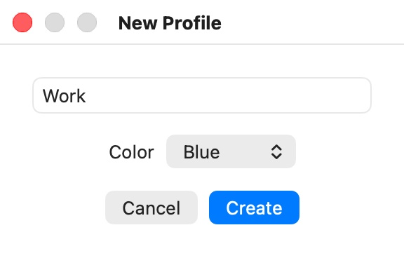

# Profiles

A **profile** is a named set of browser settings — which browser, which home page, what the browser may share with your Mac, how it reaches the network — plus, optionally, a place to keep browsing data between windows. Every Bromure window runs exactly one profile. This chapter explains how to create and manage profiles, how windows and links find their profile, and where profiles are stored. The settings inside a profile are documented one category at a time in [Profile Settings](07-profile-settings/index.mdx).

## Two kinds of profile

Whether a profile keeps anything is decided by one setting, **Retain Browsing Data**, in the profile's [General](07-profile-settings/general.mdx) settings:

- **Ephemeral** (Retain Browsing Data off). Each window starts from a clean browser and everything — cookies, history, cache, downloads left in the VM — is destroyed when the window closes. You can open as many windows of an ephemeral profile as you like; each is its own VM.
- **Persistent** (Retain Browsing Data on). The profile gets its own small disk on your Mac that holds the browser's user data: bookmarks, history, cookies, saved passwords, and open tabs. Everything else in the VM is still thrown away when the window closes. A persistent profile has **at most one window at a time**, because only one VM can use its disk. Opening it again brings the existing window to the front.

Both kinds start every window from the same clean base image; only the persistent profile's disk carries anything over. See [Concepts & Architecture](04-concepts.mdx) for how this works.

## The built-in Private Browsing profile

The first time Bromure starts and finds no profiles, it creates one called **Private Browsing**. It is ephemeral, has no color, and its note reads: "Fully stateless browsing. Nothing is saved between sessions — no cookies, no history, no cache. Only the clipboard is shared with your Mac."

It has audio and GPU acceleration on, **Shared Clipboard** on, **Send Link to Other Session** on, and **Allow Automation** on. Everything else is at its default. You can edit it or delete it like any other profile.

### New Private Window

**File › New Private Window** (⇧⌘N) opens a window of the **Private Browsing** profile. If you have deleted or renamed it, Bromure uses the first ephemeral profile it finds instead. Because the profile is ephemeral, each ⇧⌘N opens a new, separate window.

## Creating a profile

1. Choose **File › New Profile…**, or click the profile chip in any window and choose **New Profile…**.
2. In the **New Profile** window, type a **Profile Name**.
3. Pick a **Color**, or **None**. The color is used for the window border, the profile chip, and the color dots in menus. The picker suggests the first color no other profile uses yet.
4. Click **Create** (or press Return).

  

A profile created this way is **persistent** (Retain Browsing Data on) and starts with **Shared Clipboard**, **Send Link to Other Session**, **Use macOS Passkeys**, and **Use macOS Passwords** on. Its home page is `https://bromure.io/hello`. Every other setting starts at its default.

As soon as you click **Create**, the profile's settings window opens so you can adjust it before first use. Click **Save** to keep your changes, or **Cancel** to keep the defaults; the profile exists either way.

The new profile's persistent disk is created the first time you open a window for it.

You can also create profiles from AppleScript (`create profile`). See [Automation](14-automation.mdx).

## Opening a window for a profile

- **The profile chip** in any window lists every profile. Choose one to open a window for it.
- **File › New Window With Profile** lists every profile as **New *name* Window**.
- **File › New Window** (⌘N) opens another window of the front window's profile.

For a persistent profile that already has a window, the chip shows **Work (open)** and the File menu shows **Show Work Window**; choosing it brings the existing window to the front (and un-minimizes it) instead of opening a second one.

When you launch Bromure, click its Dock icon with no window open, or press ⌘N with no window in front, it opens a window of the profile you used most recently. To always start in one profile instead, choose it under **Settings › General › Open New Windows With**, or open the profile chip in that profile's window and choose **Open New Windows with “*name*”**. See [Open New Windows With](08-app-settings/general.mdx#open-new-windows-with).

## Editing a profile

To change a profile's settings:

- In a window of that profile, click the profile chip and choose **Edit “*name*”…**, or
- Choose **File › Edit “*name*”…** (it acts on the front window's profile).

This opens the **Profile Settings — *name*** window. Make your changes and click **Save**; closing the window or clicking **Cancel** discards them. See [Profile Settings](07-profile-settings/index.mdx) for every setting.

Most settings take effect when a window starts. If the profile has open windows when you save a change, Bromure asks:

> **Restart session?**
> Settings have changed. Restart the browser session to apply them?

**Restart** closes the window's VM and opens a fresh window with the new settings. **Later** keeps the current window as it is; the change applies to the next window you open. For an ephemeral profile, restarting discards everything in the window.

Name and color changes appear on the profile chip of open windows right away.

## Deleting a profile

1. Close the profile's window, if it has one.
2. Choose **File › Delete “*name*”…**, or **Delete “*name*”…** in the profile chip of another window.
3. Confirm with **Delete**.

For a persistent profile, the confirmation reads "This will permanently delete the profile and all its saved browsing data." For an ephemeral one, "This will delete the profile." Deleting removes the profile's settings, its persistent disk, and any decisions you asked Bromure to remember for it. It cannot be undone.

If the profile's window is still open, Bromure refuses with "“*name*” is open — Close its window before deleting the profile."

To wipe a persistent profile's browsing data but keep the profile and its settings, use **Delete Browsing Data…** in its [General](07-profile-settings/general.mdx) settings instead.

## Managed profiles

If your Mac is enrolled with an organization, the profiles it assigns appear alongside yours with a shield-and-lock icon on the profile chip. They are read-only: the menus say **View “*name*” Settings…** instead of **Edit**, the settings window opens with every control disabled, and **Delete** is dimmed. See [Enterprise Management](13-enterprise.mdx).

## Restoring tabs

When you open a persistent profile that has data from a previous window, Bromure asks **Restore previous tabs?**:

- **Restore** reopens the tabs that were open when you last closed the profile's window.
- **Start Fresh** opens the profile's home page. Your bookmarks, history, cookies, and passwords are still there; only the old tabs aren't reopened.

Check **Remember my decision** to make that choice permanent for the profile. Bromure then stops asking and always restores, or always starts fresh.

> **Tip:** There is no setting to forget a remembered choice. To be asked again, quit Bromure and remove the saved decision with `defaults delete io.bromure.app profilePrefs.<profile-id>.restoreTabs`, where `<profile-id>` is the profile's ID in lowercase (the name of its folder under `~/Library/Application Support/Bromure/profiles/`). The same applies to the **Remember my decision** checkbox of the close-window alert, stored as `profilePrefs.<profile-id>.skipCloseConfirm`.

## Opening links from other apps

Bromure can be your Mac's default web browser (**System Settings › Desktop & Dock › Default web browser**). When you click a web link in another app, Bromure decides where it goes:

1. If you have picked a **Default Profile for Links** in [Settings › General](08-app-settings/general.mdx), the link opens in that profile: in its existing window if it has one, otherwise in a new window.
2. Otherwise, if there is more than one place the link could go — more than one profile, or one profile plus another browser installed on your Mac — Bromure shows the link chooser.
3. Otherwise, the link opens in the window in front (or the most recent window), or in a new window of your only profile.

If Bromure is still setting up its base image, the link is held and opened once it is ready.

### The link chooser

> **Choose where to open this link**
> Which application should open *URL*?

The pop-up menu lists your profiles, each with its color dot, then, under **Other browsers**, the other web browsers installed on your Mac, with their icons. Below it you see the full URL. Pick a destination and click **Open**, or **Cancel** to drop the link.

- A profile opens the link in its existing window, or in a new window if it has none.
- Another browser opens the link in that browser, outside Bromure.

Opening a link in another browser leaves Bromure's isolation, so do it only for links you trust.

### Default Profile for Links

**Settings › General › Default Profile for Links** is **Ask Every Time** by default, which uses the chooser. Choose a profile to skip the chooser and always send outside links to it. If you later delete that profile, Bromure goes back to asking.

## Sending a link to another profile

With **Send Link to Other Session** on ([Privacy & Safety](07-profile-settings/privacy-safety.mdx); on for the built-in profile and for new profiles), right-click a link on a page and choose **Open link in another Bromure profile**. The link travels to your Mac and opens the same chooser described above, so you can open it in another profile — for example, a work link you received in a personal profile — or in another browser.

When the only possible destination is a single profile or a single browser, the link opens there without asking.

## Where profiles are stored

Each profile has an ID and two parts stored in different places:

| Part | Location |
|---|---|
| Settings (`profile.json`: name, color, note, settings) | In iCloud Drive when iCloud is available, in Bromure's app container (`iCloud.io.bromure.app`, under `Documents/profiles/<profile-id>/`). Otherwise in `~/Library/Application Support/Bromure/profiles/<profile-id>/`. |
| Persistent disk (`profile.img`) | Always on this Mac, in `~/Library/Application Support/Bromure/profiles/<profile-id>/image/`. |

Because settings live in iCloud Drive, your profiles appear on every Mac signed in to the same Apple Account that runs Bromure. Browsing data does not: each Mac keeps its own persistent disk, created the first time you open the profile there.

A few secrets are kept in your login keychain rather than in the profile's settings: IKEv2 and OpenVPN credentials, and the key that encrypts a profile's disk when **Encrypt Browsing Data** is on ([Advanced](07-profile-settings/advanced.mdx)).

The persistent disk is a 1 GB sparse file, so it takes only as much space on your Mac as the data it holds.

Managed profiles are stored separately, under `~/Library/Application Support/Bromure/managed/`, and are never synced through iCloud. See [Enterprise Management](13-enterprise.mdx).

Menus list profiles with the most recently used first.

## Related chapters

- [Profile Settings](07-profile-settings/index.mdx) — every setting in a profile, one category per page.
- [The Browser Window](05-browser-window.mdx) — the profile chip and the File menu.
- [Concepts & Architecture](04-concepts.mdx) — what persists and what doesn't.
- [App Settings › General](08-app-settings/general.mdx) — Default Profile for Links.
- [Enterprise Management](13-enterprise.mdx) — managed profiles.
