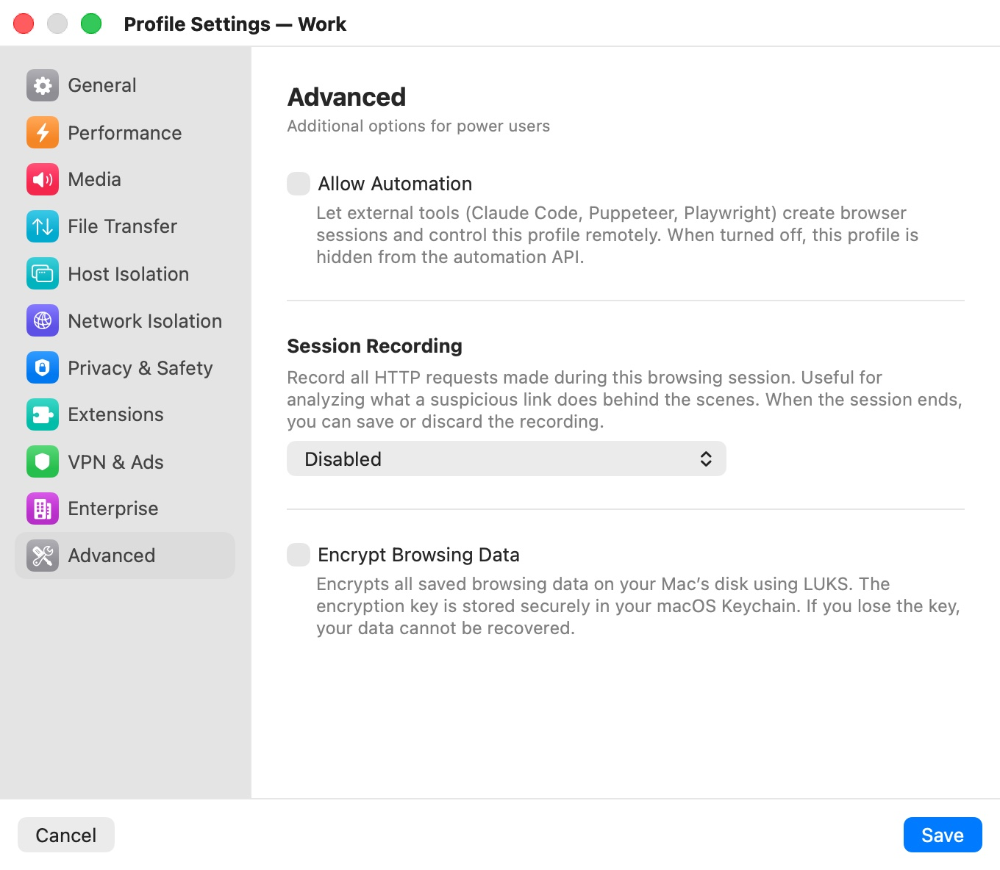

# Advanced

The **Advanced** category ("Additional options for power users") holds three settings with security consequences: whether external tools may drive the profile, how much of its network traffic is recorded, and whether its saved data is encrypted on disk.

  

## Settings

| Setting | Description |
|---|---|
| **Allow Automation** | Lets external tools (Claude Code, Puppeteer, Playwright) create sessions of this profile and control them through Bromure's automation API. Off: the profile is hidden from the API. Default: off (on for the built-in **Private Browsing** profile). |
| **Session Recording** | Records the HTTP requests made in the profile's sessions: **Disabled** (default), **Basic — URLs only**, **Headers — URLs + headers + POST data**, or **Full — URLs + headers + response bodies**. |
| **Start Recording Automatically** | Starts recording as soon as a session opens. Off: recording starts only when you click the record button in the titlebar. Shown when **Session Recording** isn't **Disabled**. Default: on. |
| **Encrypt Browsing Data** | Encrypts the profile's saved data on your Mac's disk with LUKS, with the key kept in your macOS Keychain. Default: off. Offered only when **Retain Browsing Data** is on. |

All advanced settings apply to an open window after a restart.

## Allow Automation

Automation needs two switches: this one, per profile, and the app-wide automation server in [Automation](../08-app-settings/automation.mdx), which is off by default. If the profile allows automation while the server is off, the category warns: "The automation server is currently disabled. Enable it in Bromure → Settings → Automation."

Only profiles with **Allow Automation** on are listed by the automation API and the MCP server, and only they can be used to create sessions through them. See [Automation](../14-automation.mdx).

## Session Recording

Recording captures the requests the browser makes — useful for seeing what a suspicious link does behind the scenes. When a session with a recording ends, Bromure asks whether to save the recording or discard it. See [Session Recording](../11-session-recording.mdx) for the record button, the viewer and exports.

| Level | What is recorded |
|---|---|
| **Basic — URLs only** | Time, method, URL, status and duration of each request. |
| **Headers — URLs + headers + POST data** | Also request and response headers and submitted form data. |
| **Full — URLs + headers + response bodies** | Also the body of every response. |

The two detailed levels capture sensitive data in clear text, and the category says so:

- **Headers**: "This level captures POST data which may include passwords, tokens, and form submissions in clear text."
- **Full**: "Full capture records all request and response bodies including passwords, authentication tokens, personal data, and any sensitive content transmitted over the network. Use only for security analysis of untrusted links."

> **Note:** On a profile managed by your organization, a recording level other than **Disabled** also streams the recording to your organization's Bromure analytics service. See [Enterprise Management](../13-enterprise.mdx).

## Encrypt Browsing Data

Encryption protects a persistent profile's disk: bookmarks, history, cookies and passwords are unreadable without the key, which Bromure generates and keeps in your macOS Keychain. If the key is lost, the data can't be recovered.

- With **Retain Browsing Data** off ([General](general.mdx)), the category shows **Encryption** with "Turn on “Retain Browsing Data” in General to access disk encryption options." Turning **Retain Browsing Data** off also turns encryption off.
- A profile's disk is either encrypted or not from the moment it's created. If the profile already has saved data, turning encryption on or off asks **Enable encryption?** or **Disable encryption?** — "Changing the encryption setting will delete all existing browsing data for this profile. This cannot be undone." **Delete data and continue** deletes the data immediately (clicking **Cancel** in the settings window afterwards doesn't bring it back); **Cancel** keeps everything as it was.

Turn encryption on when you create a persistent profile, before its first session, to avoid losing data later.

## Related chapters

- [Automation](../14-automation.mdx) — the HTTP API, CDP proxy, MCP server and AppleScript.
- [Session Recording](../11-session-recording.mdx) — recording, viewing and exporting traces.
- [Privacy & Security](../12-privacy-security.mdx) — how profile data is protected at rest.
- [Profile Settings](index.mdx) — all categories at a glance.
