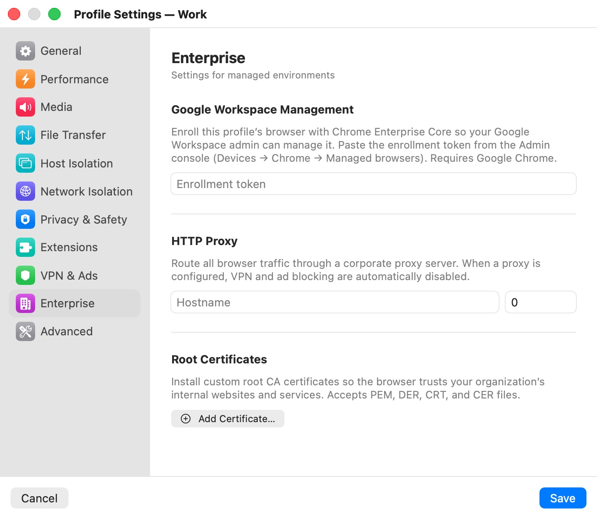

# Enterprise

The **Enterprise** category ("Settings for managed environments") connects a profile to your organization's infrastructure: Google Workspace browser management, a corporate proxy, and internal certificate authorities. These are ordinary profile settings you set yourself. Profiles your organization delivers through Bromure's own enterprise enrollment are a different mechanism; see [Enterprise Management](../13-enterprise.mdx).

  

## Settings

| Setting | Description |
|---|---|
| **Google Workspace Management** | An **Enrollment token** from your Google Admin console. Sessions then enroll as a managed Google Chrome browser, so your Workspace admin can apply policies. Requires the **Google Chrome** browser. Default: empty. |
| **HTTP Proxy** | Routes all browser traffic through a corporate proxy: **Hostname** and **Port**, plus **Username** and **Password** once a hostname is set. Default: none. Turns off VPN and ad blocking while set. |
| **Root Certificates** | Custom root CA certificates the browser trusts, for your organization's internal websites and services. Accepts PEM, DER, CRT and CER files. Default: none. |

All enterprise settings apply to an open window after a restart.

## Google Workspace Management

Paste the enrollment token from the Google Admin console (**Devices › Chrome › Managed browsers**). Chrome Enterprise Core can only manage Google Chrome, not Chromium, so the profile's **Browser** ([General](general.mdx)) must be **Google Chrome**. When it is, the field shows "Sessions will enroll as a managed Google Chrome browser." with a green check.

If you enter a token in a Chromium profile, or switch a profile with a token to Chromium, the app shows **Managed browsing requires Google Chrome**:

- If the profile has no saved browsing data yet: "Google Workspace can only manage the Google Chrome browser. Switch this profile to Google Chrome to use the enrollment token." **Switch to Google Chrome** changes the browser; **Cancel** clears the token.
- If the profile already has saved data from Chromium, the browser can't change until that data is deleted: the message asks you to delete the profile data in **General** first, and **OK** clears the token.

A token in a Chromium profile is never used.

## HTTP Proxy

Enter the proxy's hostname and port. When you press Return in **Hostname**, Bromure checks the name ("Resolving…") and shows "Cannot resolve “*host*” — check the hostname" if it can't be found; IP addresses are accepted as is. The **Username** and **Password** fields appear once a hostname is filled in; leave them empty for a proxy without authentication.

The proxy counts as set when both the hostname and a port are filled in. While it is:

- The VPN picker and **Block Ads** in [VPN & Ads](vpn-ads.mdx) are disabled, and neither is used in the session.
- Your VPN and ad-blocking settings are kept and come back into effect when you clear the proxy.

The proxy password is saved with the profile's settings, not in the Keychain.

## Root Certificates

Click **Add Certificate…** to pick one or more certificate files. Each certificate is listed with its file name and the certificate's subject; the trash button removes it. A file that isn't a valid X.509 certificate is rejected with "*file*: Not a valid X.509 certificate".

Add your organization's root CA when its internal sites use certificates from a private authority, or when a corporate proxy inspects TLS traffic. Certificates apply only to this profile's browser, not to your Mac.

## Related chapters

- [Enterprise Management](../13-enterprise.mdx) — enrolling Bromure itself and managed profiles.
- [General](general.mdx) — choosing Google Chrome.
- [VPN & Ads](vpn-ads.mdx) — the VPN and ad blocking a proxy disables.
- [Profile Settings](index.mdx) — all categories at a glance.
