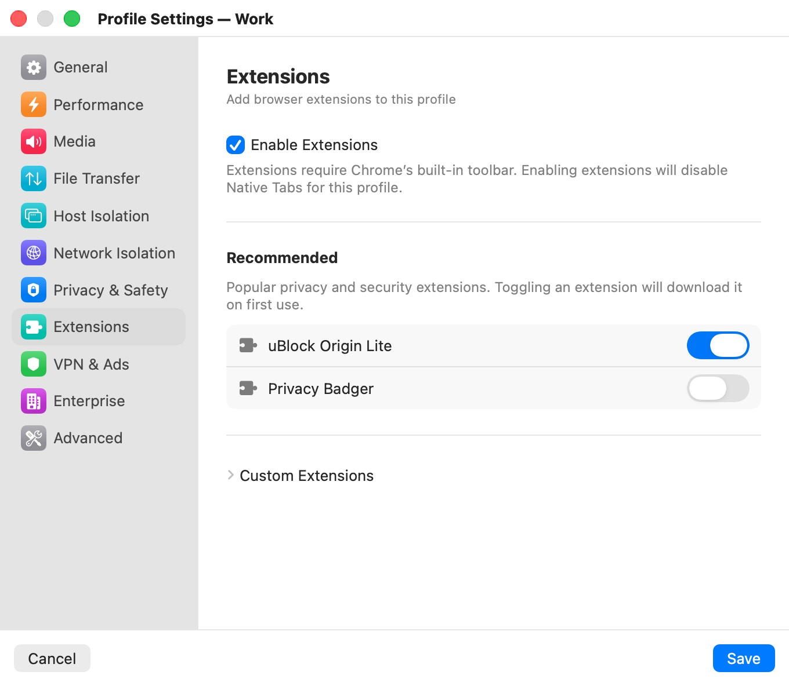

# Extensions

The **Extensions** category ("Add browser extensions to this profile") installs Chrome extensions into the profile's browser. Extensions run inside the VM like everything else, and they are installed fresh in every session, so an ephemeral profile gets them back each time without keeping anything else.

  

## Settings

| Setting | Description |
|---|---|
| **Enable Extensions** | Turns extensions on for this profile. Extensions require Chromium's own toolbar, so turning this on turns **Native Tabs** off. Default: off. |
| **uBlock Origin Lite** | A recommended content blocker for ads, trackers and annoyances. Listed under **Recommended**. Default: off. |
| **Privacy Badger** | A recommended tracker blocker from the EFF that learns which invisible trackers to block as you browse. Listed under **Recommended**. Default: off. |
| **Custom Extensions** | A collapsible section for any other extension, added from its Chrome Web Store URL. Default: none. |

The **Recommended** list and **Custom Extensions** appear once **Enable Extensions** is on. All extension settings apply to an open window after a restart.

## Enabling extensions

If the profile uses **Native Tabs** (the default), turning on **Enable Extensions** asks first:

- **Disable Native Tabs?** — "Extensions require Chrome's native toolbar to display icons and popups. Native Tabs will be turned off for this profile." **Disable Native Tabs** or **Cancel**.

With extensions on, the window shows Chromium's own tab strip and address bar, and **Native Tabs** can't be turned back on in [Host Isolation](host-isolation.mdx) until you turn extensions off. Turning extensions off doesn't turn **Native Tabs** back on by itself. Features that depend on Native Tabs, such as printing, are unavailable meanwhile.

Turning off **Enable Extensions** keeps your list; the extensions simply aren't loaded until you turn it on again.

## Recommended extensions

"Popular privacy and security extensions. Toggling an extension will download it on first use." Switching one on downloads it from Google's extension servers to your Mac, where Bromure keeps a copy for every profile that uses it. Switching it off keeps it in the profile's list, turned off.

## Custom extensions

Open **Custom Extensions** to add any extension from the Chrome Web Store. Custom extensions can access all browsing data within the session, and the section warns: "Custom extensions are not vetted by Bromure. Only install extensions you trust."

To add one:

1. Click **Add Extension…**.
2. Paste the extension's Chrome Web Store URL into **Chrome Web Store URL** — it looks like `https://chromewebstore.google.com/detail/<name>/<extension-id>`. A bare 32-letter extension ID works too.
3. Click **Add** (or press Return). Bromure downloads the extension and lists it with its name and ID.

Each custom extension has a switch to turn it off and a trash button to remove it from the profile. The errors you can see:

| Message | Meaning |
|---|---|
| Invalid Chrome Web Store URL. Expected format: chromewebstore.google.com/detail/.../EXTENSION_ID | The text isn't a Chrome Web Store detail URL or an extension ID. |
| This extension is already added. | The profile already lists that extension (recommended or custom). |
| Failed to download extension: *reason* | The download from Google failed, for example because your Mac is offline or the extension no longer exists. |

## Extensions or built-in ad blocking

For ad blocking without giving up Native Tabs, use **Block Ads** in [VPN & Ads](vpn-ads.mdx) instead of an extension: it filters ads at the network level inside the VM.

## Related chapters

- [Host Isolation](host-isolation.mdx) — Native Tabs and printing.
- [VPN & Ads](vpn-ads.mdx) — network-level ad blocking.
- [The Browser Window](../05-browser-window.mdx) — the window with and without Native Tabs.
- [Profile Settings](index.mdx) — all categories at a glance.
