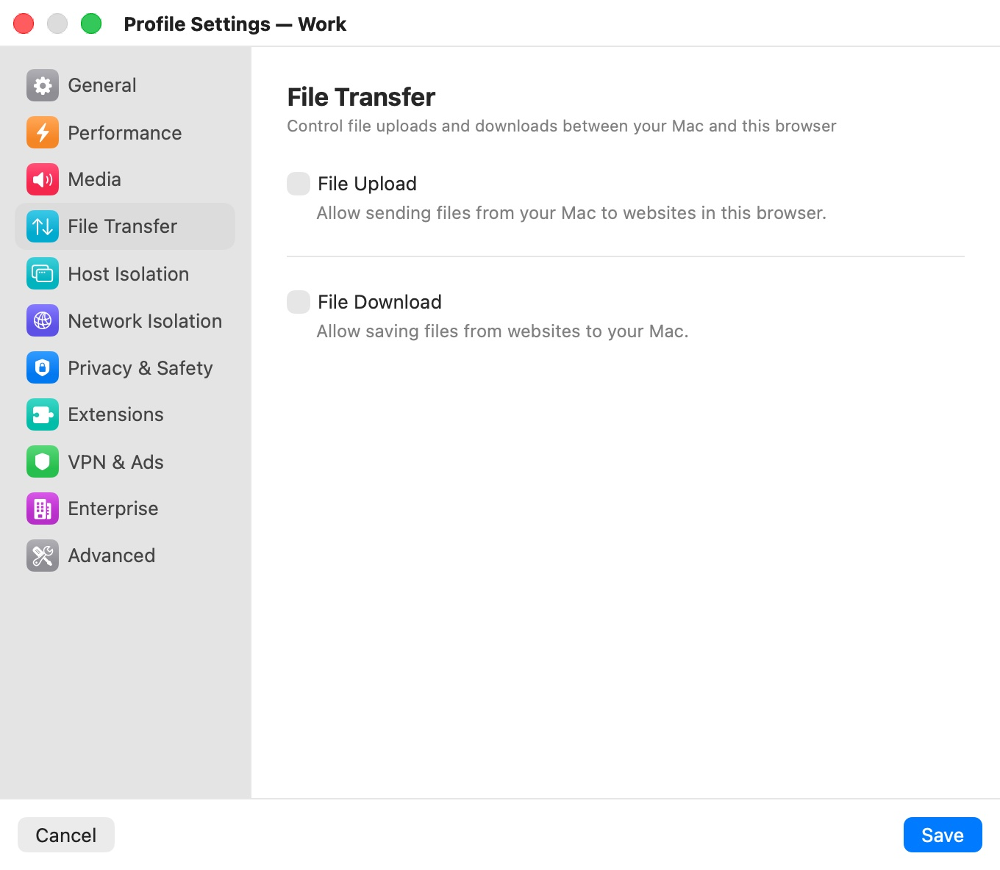

# File Transfer

The **File Transfer** category ("Control file uploads and downloads between your Mac and this browser") controls the one channel files have between the VM and your Mac. Both directions are off by default: a new profile can neither read files from your Mac nor save files to it. Turn on only the direction a profile needs.

  

## Settings

| Setting | Description |
|---|---|
| **File Upload** | Lets you send files from your Mac to websites in this browser: through the page's file picker, or by dragging files onto the window. Default: off. |
| **File Download** | Lets you save files from websites to your Mac. Downloaded files appear in the window's file drawer, from which you save or drag them out. Default: off; with it off, the browser blocks downloads. |
| **Scan Downloads with VirusTotal** | Checks every downloaded file with VirusTotal before you can save it to your Mac. Needs a VirusTotal API key. Shown only when **File Download** is on. Default: off. |
| **VirusTotal API Key** | Your VirusTotal API key. **Verify** checks it with VirusTotal and shows a green check or a red cross (hover over the cross for the reason). Shown while scanning is on. Default: empty. |
| **Block Threats** | Blocks files VirusTotal identifies as malicious; they can't be saved or dragged to your Mac. Default: on. |
| **Block Unscannable Files** | Blocks files VirusTotal couldn't scan — too large, rate-limited, or unknown. With it off, you can still save such files manually. Default: off. |

**Block Threats** and **Block Unscannable Files** appear under the API key while **Scan Downloads with VirusTotal** is on. All file-transfer settings apply to an open window after a restart.

## Getting a VirusTotal key

VirusTotal gives free API keys at `https://www.virustotal.com/gui/join-us`. Paste yours into **VirusTotal API Key** and click **Verify**. If you click **Save** with scanning on and the key empty, the app shows **VirusTotal API Key Required** and doesn't save until you add a key or turn scanning off.

The free key is rate-limited, so large bursts of downloads can come back unscannable. With **Block Unscannable Files** off, those files are still offered for saving.

Bromure first looks the file up by its SHA-256 hash. A file VirusTotal has never seen is uploaded for analysis, which can take a few minutes; files larger than VirusTotal's upload limit are reported as unscannable.

> **Note:** Scanning can send your downloaded files to VirusTotal, a third-party service. See [Privacy & Security](../12-privacy-security.mdx) for everything that leaves your Mac.

## Where transferred files go

Downloads stay out of your Mac's folders until you save them: the file drawer keeps them in a temporary folder that is deleted when the session ends. See [Files & Downloads](../09-files-downloads.mdx).

## Related chapters

- [Files & Downloads](../09-files-downloads.mdx) — the file drawer, uploads, downloads and scan results.
- [Privacy & Security](../12-privacy-security.mdx) — what VirusTotal receives.
- [Profile Settings](index.mdx) — all categories at a glance.
