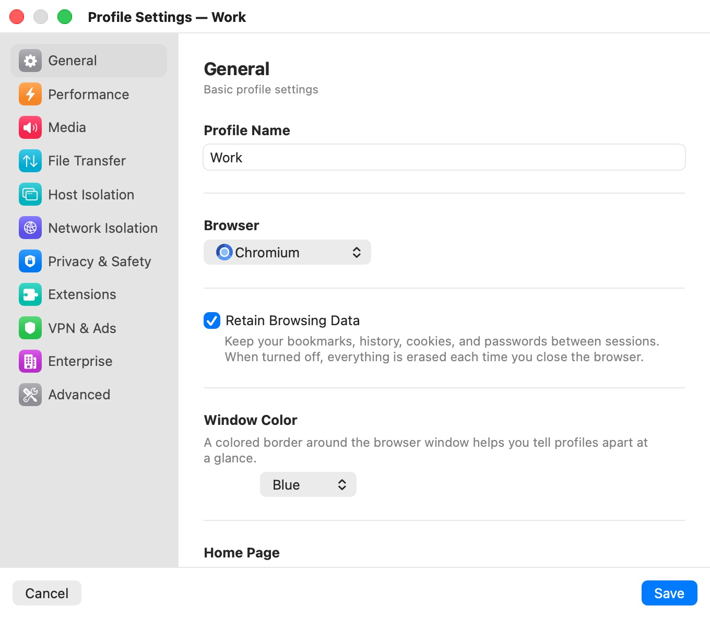

# General

The **General** category ("Basic profile settings") holds a profile's identity and the one choice that shapes everything else: whether the profile keeps its browsing data. It is the category the settings window opens on.

  

## Settings

| Setting | Description |
|---|---|
| **Profile Name** | The name shown in the profile chip, the **File** menu, the window title (**Bromure — *name***) and the settings window's title. |
| **Browser** | Which browser the session runs: **Chromium** (default) or **Google Chrome**. Locked once the profile has saved browsing data (see below). |
| **Retain Browsing Data** | Keeps bookmarks, history, cookies and passwords between sessions on a disk of the profile's own. Off: everything is erased when you close the window. Default: off for a profile with factory settings, but on for profiles you create with **File › New Profile…**; off for the built-in **Private Browsing** profile. |
| **Delete Browsing Data…** | Permanently erases the profile's saved data. Shown only when **Retain Browsing Data** is on and the profile has saved data. |
| **Window Color** | A colored border around the browser window, so you can tell profiles apart at a glance: **None**, **Blue**, **Red**, **Green**, **Orange**, **Purple**, **Pink**, **Teal** or **Gray**. The color also tints the profile chip and the dots in the profile menus. **File › New Profile…** suggests the first color no other profile uses. |
| **Home Page** | The website that opens when a session of the profile starts. Default: `https://bromure.io/hello`. |
| **Language** | The browser's language: **Same as System** (default), **English**, **Français**, **Deutsch**, **Español**, **Português**, **日本語**, **中文（繁體）** or **中文（简体）**. |
| **Comments** | A short free-form note kept with the profile. Default: empty. |

A change to the browser, **Retain Browsing Data**, home page or language applies to an open window after a restart; see [Save, Cancel and restarting a session](index.mdx#save-cancel-and-restarting-a-session).

## Browser

Both browsers are installed in the Bromure image; the profile decides which one a session launches. **Google Chrome** is required for Google Workspace management ([Enterprise](enterprise.mdx)).

A profile's saved browsing data belongs to the browser that wrote it, so once a persistent profile has data the **Browser** menu is disabled with the note "This profile's saved browsing data was created by *Chromium*. Delete the profile data below to switch browsers." To switch, click **Delete Browsing Data…**, then reopen the settings window: the menu is enabled again.

If you switch a profile to **Chromium** while it has a Google Workspace enrollment token, the app shows **Managed browsing requires Google Chrome**. See [Enterprise](enterprise.mdx#google-workspace-management).

## Retain Browsing Data

With **Retain Browsing Data** off, the profile is ephemeral: each window starts from a clean copy of the base image and nothing survives closing it. With it on, the profile gets its own virtual disk, kept in `~/Library/Application Support/Bromure/profiles/<UUID>/image/`, which holds the browser's user data. See [Concepts](../04-concepts.mdx) for exactly what persists.

Two settings depend on it, and turning **Retain Browsing Data** off turns them off too:

- **Encrypt Browsing Data** ([Advanced](advanced.mdx)) — only offered for persistent profiles.
- **AI Phishing Detection** ([Privacy & Safety](privacy-safety.mdx)) — it needs to remember the sites you visit.

A persistent profile can have only one window at a time; an ephemeral profile can have many. See [Profiles](../06-profiles.mdx).

## Delete Browsing Data

**Delete Browsing Data…** erases the profile's disk: bookmarks, history, cookies, passwords and saved tabs. The profile itself and its settings are kept. The app asks first:

- **Delete browsing data?** — "This will permanently delete all bookmarks, history, cookies, and passwords for this profile. This cannot be undone." **Delete All Data** or **Cancel**.

The deletion happens as soon as you confirm; clicking **Cancel** in the settings window afterwards doesn't bring the data back. The button is disabled while the profile has an open window ("Close the session before deleting browsing data").

## Language

**Same as System** follows your Mac's language. Picking a specific language sets the browser's interface language and the languages it reports to websites, which also makes the browser harder to fingerprint.

## Related chapters

- [Profiles](../06-profiles.mdx) — creating, deleting and opening profiles.
- [Concepts](../04-concepts.mdx) — ephemeral and persistent profiles.
- [Advanced](advanced.mdx) — encrypting a persistent profile's data.
- [Profile Settings](index.mdx) — all categories at a glance.
