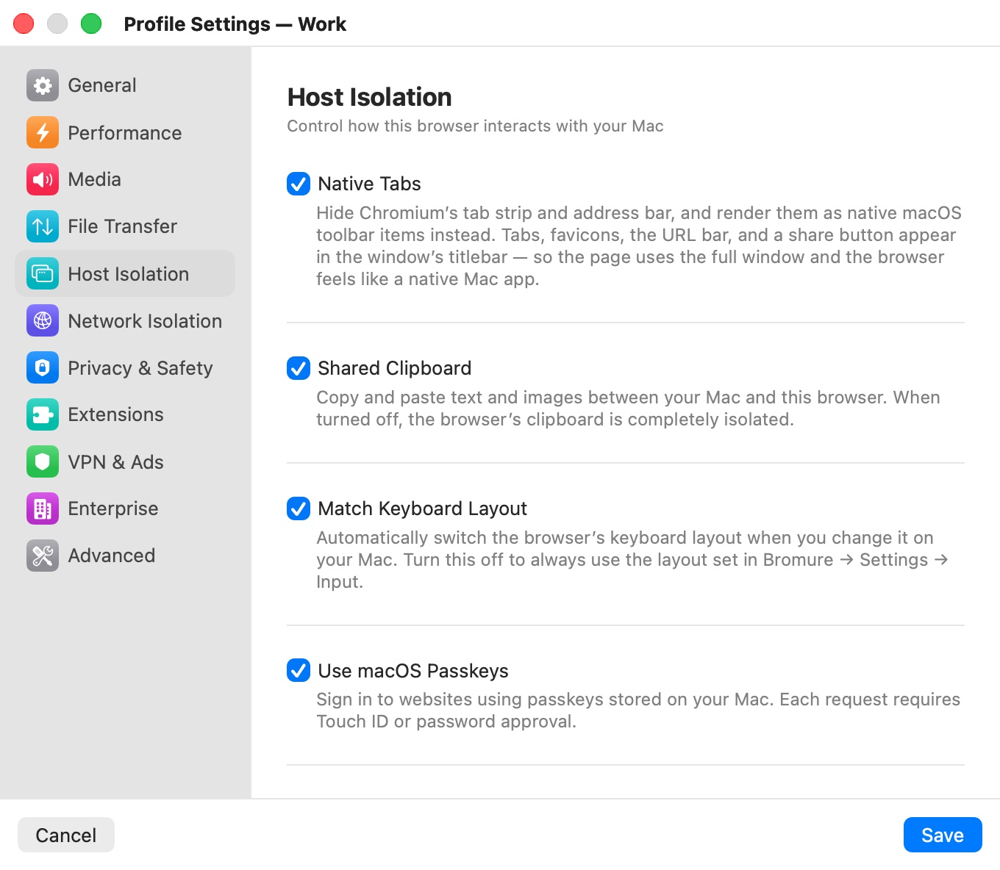

# Host Isolation

The **Host Isolation** category ("Control how this browser interacts with your Mac") lists every convenience that crosses the boundary between the VM and macOS. Each one is a narrow, dedicated channel; turning one off closes that channel for the profile. Profiles you create with **File › New Profile…** start with the clipboard, passkeys and passwords on; a profile with factory settings starts with them off.

  

## Settings

| Setting | Description |
|---|---|
| **Native Tabs** | Hides Chromium's tab strip and address bar and draws them as native macOS toolbar items: tabs, favicons, the URL bar and a share button sit in the window's titlebar, and the page uses the whole window. Default: on. Unavailable while extensions are enabled. |
| **Shared Clipboard** | Copy and paste text and images between your Mac and the browser. Off: the browser's clipboard is completely isolated. Default: off (on for **File › New Profile…** profiles and the built-in **Private Browsing** profile). |
| **Match Keyboard Layout** | Switches the browser's keyboard layout whenever you change it on your Mac. Off: the browser always uses the layout set in **Settings › Input**. Default: on. |
| **Use macOS Passkeys** | Sign in to websites with passkeys stored on your Mac. Each request needs Touch ID or your password. Default: off (on for **File › New Profile…** profiles). |
| **Use macOS Passwords** | Autofill usernames and passwords from your Mac's saved passwords and iCloud Keychain. Turns off Chromium's built-in password manager. Default: off (on for **File › New Profile…** profiles). |
| **Allow Printing** | ⌘P captures the current page as a PDF and hands it to the macOS print dialog, where you can pick a printer or save to a file. The PDF stays in memory; nothing is written to your Mac's disk. Default: off. Requires **Native Tabs**. |

All host-isolation settings apply to an open window after a restart.

## Native Tabs and extensions

Chrome extensions need Chromium's own toolbar to show their icons and popups, so **Native Tabs** and extensions exclude each other:

- Turning on **Enable Extensions** ([Extensions](extensions.mdx)) in a profile with **Native Tabs** asks **Disable Native Tabs?**; confirming turns **Native Tabs** off.
- While extensions are enabled, the **Native Tabs** switch is disabled with the note "Native Tabs is disabled because extensions are enabled. Disable extensions first to re-enable Native Tabs."
- Turning extensions off again doesn't turn **Native Tabs** back on; switch it on yourself.

Without Native Tabs, the window shows Chromium's own tab strip and address bar, and features that rely on the native tab bar — the **Bookmarks** and **History** menus, printing — are unavailable. See [The Browser Window](../05-browser-window.mdx).

## Printing

Printing relies on the tab agent that ships with Native Tabs. With **Native Tabs** off, **Allow Printing** is disabled and a note says "Printing relies on the tab agent that ships with Native Tabs. Turn Native Tabs on first to enable printing." **File › Print…** is enabled only in a window whose profile allows printing.

## Passkeys and passwords

Your Mac's keychain is not copied into the VM. When a site asks for a passkey, or you fill a login form, the request goes to macOS over a dedicated channel, and macOS asks for Touch ID or your password before anything is returned to the browser. With **Use macOS Passwords** on, Chromium's own password manager is off, so the browser doesn't offer to save passwords inside the VM.

## Related chapters

- [The Browser Window](../05-browser-window.mdx) — the native tab bar, printing and keyboard shortcuts.
- [Input](../08-app-settings/input.mdx) — the keyboard layout used when **Match Keyboard Layout** is off.
- [Concepts](../04-concepts.mdx) — the host–guest channels behind each switch.
- [Profile Settings](index.mdx) — all categories at a glance.
