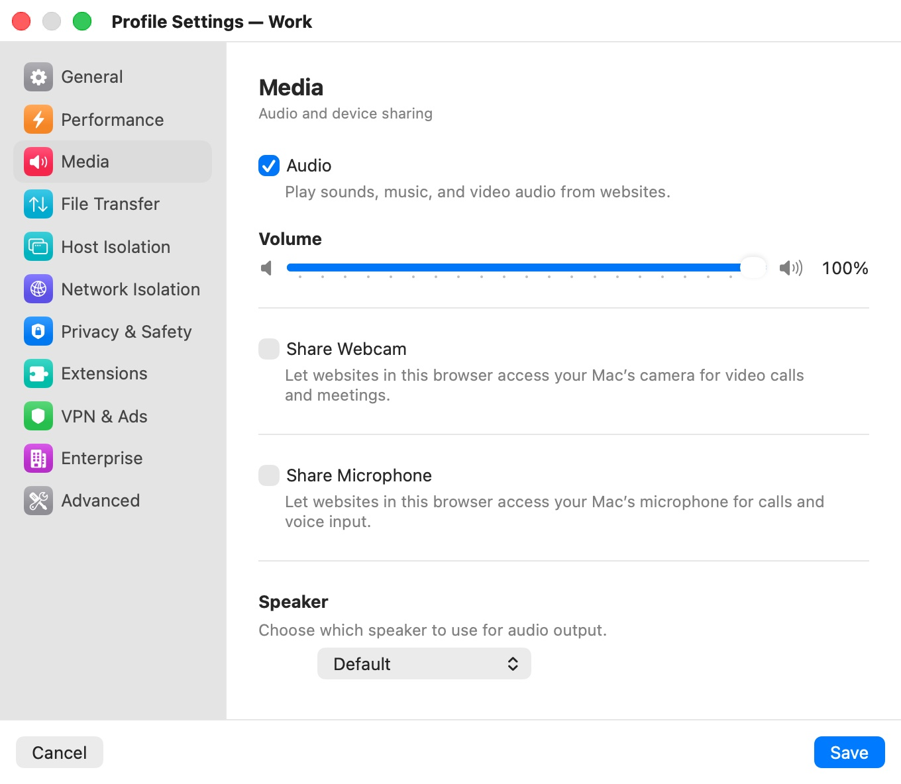

# Media

The **Media** category ("Audio and device sharing") decides whether websites in the profile can play sound, see your camera and hear your microphone, and which of your Mac's devices they use. Camera and microphone sharing are off by default: a site in the VM gets nothing from your Mac's devices until you turn them on for its profile.

  

## Settings

| Setting | Description |
|---|---|
| **Audio** | Plays sounds, music and video audio from websites. Default: on. |
| **Volume** | The profile's output level, 0–100 % in steps of 5, shown while **Audio** is on. Independent of other profiles and of your Mac's volume. Default: 100 %. |
| **Share Webcam** | Lets websites use your Mac's camera for video calls and meetings. Default: off. When on, it shows a live preview, a **Camera** picker, a **Quality** picker and **Effects…**. |
| **Camera** | Which camera the profile uses. Default: **Default** (your Mac's default camera). |
| **Quality** | The resolution sent to the VM: **Low (640×480)**, **Medium (1280×720)** or **High (1920×1080)**. Only the resolutions your camera supports are listed. Default: **High (1920×1080)**. |
| **Effects…** | Opens the webcam effects sheet: city and time, a name badge, a logo, and face swap. A blue dot next to the button means an effect is set. See [Camera & Effects](../10-camera-effects.mdx). |
| **Share Microphone** | Lets websites use your Mac's microphone for calls and voice input. Default: off. When on, it shows a level meter and the **Microphone** and **Speaker** pickers. |
| **Microphone** | Which microphone the profile uses. Default: **Default**. |
| **Speaker** | Which output device plays the profile's sound: **Default** or one of your Mac's speakers. Shown on its own ("Choose which speaker to use for audio output.") when neither the webcam nor the microphone is shared, and next to the microphone otherwise. Default: **Default**. |

All media settings apply to an open window after a restart.

## macOS permissions

The first time a session shares your camera or microphone, macOS asks whether Bromure may use it. Bromure can only pass on what macOS lets it capture: if you declined, allow Bromure in **System Settings › Privacy & Security › Camera** or **Microphone**, then restart the session.

While a site is using the camera or microphone, its tab shows a red dot. See [The Browser Window](../05-browser-window.mdx).

## Related chapters

- [Camera & Effects](../10-camera-effects.mdx) — webcam sharing and every effect in detail.
- [The Browser Window](../05-browser-window.mdx) — the camera-effects button in the titlebar.
- [Profile Settings](index.mdx) — all categories at a glance.
