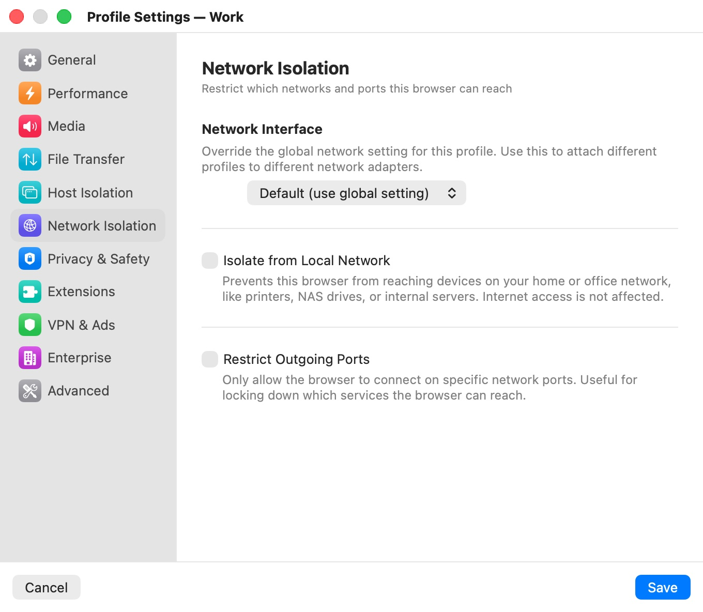

# Network Isolation

The **Network Isolation** category ("Restrict which networks and ports this browser can reach") limits where a profile's VM can connect. The filtering happens on your Mac, outside the VM, so nothing a website or a compromised browser does inside the VM can turn it off.

  

## Settings

| Setting | Description |
|---|---|
| **Network Interface** | Overrides the app-wide network mode for this profile: **Default (use global setting)**, **NAT**, or **Bridge — *interface*** for each network adapter on your Mac (for example Wi-Fi or Ethernet). Default: **Default (use global setting)**. |
| **Isolate from Local Network** | Stops the browser from reaching devices on your home or office network — printers, NAS drives, routers, internal servers. Internet access is not affected. Default: off. |
| **Restrict Outgoing Ports** | Lets the browser connect only on the ports you list. Default: off. |
| **Allowed ports** | The ports allowed while **Restrict Outgoing Ports** is on: comma-separated, with a dash for ranges, for example `80, 443, 8000-9000`. Default: `80,443`. |

All network-isolation settings apply to an open window after a restart.

## Network Interface

By default a profile uses the connection mode set in [Network](../08-app-settings/network.mdx): NAT (the VM shares your Mac's connection behind a private address) or bridged (the VM appears on your network as a separate device). Use this setting to put different profiles on different networks — for example a profile bridged to a lab Ethernet adapter while the others stay on NAT.

Bromure keeps one VM booted in advance with the app-wide network mode, which is why new windows open almost instantly. A profile whose **Network Interface** differs from the app-wide mode gets a VM booted on demand with the right network, so its windows take a few seconds longer to open.

## Isolate from Local Network

With isolation on, the VM can still reach the internet, its gateway and its DNS servers, but every packet addressed to your local network or to another private address range (`10.0.0.0/8`, `172.16.0.0/12`, `192.168.0.0/16`, and link-local `169.254.0.0/16`) is dropped. The profile's sessions also can't reach other Bromure VMs.

Use it for profiles that open untrusted links, so a malicious page can't probe your router, printers or internal services.

## Restrict Outgoing Ports

With the restriction on, the VM can open TCP and UDP connections only to the listed ports. DNS (port 53) is always allowed. The default list, `80,443`, allows ordinary web browsing and nothing else.

- If your profile uses a VPN ([VPN & Ads](vpn-ads.mdx)), the VPN's own endpoint ports are allowed automatically, so a strict list doesn't stop the tunnel from connecting.
- If the list contains no valid port, the restriction isn't applied.

> **Note:** Local-network isolation and port restriction are not supported in bridged mode; use NAT for profiles that need them.

## Related chapters

- [Network](../08-app-settings/network.mdx) — the app-wide connection mode, bridged interface and DNS servers.
- [Concepts](../04-concepts.mdx) — NAT versus bridged networking.
- [VPN & Ads](vpn-ads.mdx) — routing a profile's traffic through a VPN.
- [Troubleshooting](../15-troubleshooting.mdx) — network problems and Repair Network.
- [Profile Settings](index.mdx) — all categories at a glance.
