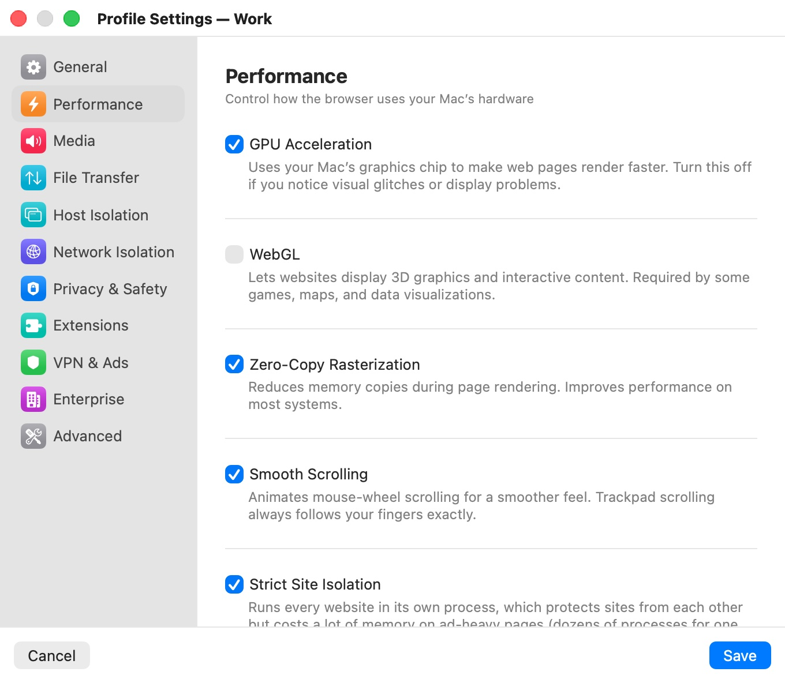

# Performance

The **Performance** category ("Control how the browser uses your Mac’s hardware") tunes rendering and process isolation inside the profile's VM. The defaults suit most browsing; change them when a site misbehaves or memory runs short. Memory and CPU cores for the VM itself are app-wide, in [Hardware](../08-app-settings/hardware.mdx).

  

## Settings

| Setting | Description |
|---|---|
| **GPU Acceleration** | Turns on Chromium's accelerated (OpenGL) rendering path inside the VM, which WebGL depends on. Turn it off if you see visual glitches or display problems. Default: on. Turning it off also turns off **WebGL**. |
| **WebGL** | Lets websites draw 3D graphics and interactive content, which some games, maps and data visualizations need. Default: off. Available only while **GPU Acceleration** is on. |
| **Zero-Copy Rasterization** | Reduces memory copies while pages are drawn, which improves performance on most systems. Default: on. |
| **Smooth Scrolling** | Animates mouse-wheel scrolling. Trackpad scrolling always follows your fingers exactly, whatever this setting. Default: on. |
| **Strict Site Isolation** | Runs every website in its own process. Default: on. |

Every setting here applies to an open window after a restart.

## WebGL and the attack surface

WebGL exposes the VM's graphics stack directly to web content, a large and complex attack surface, so it stays off by default. Turn it on only for the profiles that need it — for example a profile you use for mapping or design tools. With **GPU Acceleration** off, the **WebGL** switch is dimmed and WebGL is never enabled, even if the profile had it on.

## Strict Site Isolation

With **Strict Site Isolation** on, Chromium gives every site its own renderer process, so a compromised page can't read another site's memory. The cost is memory: an ad-heavy page can spawn dozens of processes for a single tab (one measured page used 70 renderer processes and about 2.1 GB). With it off, Chromium keeps a separate process only for the sites you sign in to; the same page then ran in 5 processes and about 1.4 GB.

Turn it off for a profile that runs out of memory on heavy pages, or raise the VM memory in [Hardware](../08-app-settings/hardware.mdx) instead.

## Related chapters

- [Hardware](../08-app-settings/hardware.mdx) — VM memory and CPU cores, shared by every profile.
- [Troubleshooting](../15-troubleshooting.mdx) — display and performance problems.
- [Profile Settings](index.mdx) — all categories at a glance.
