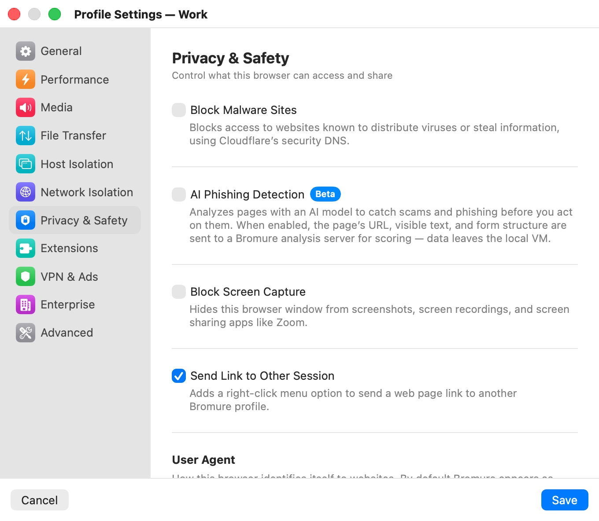
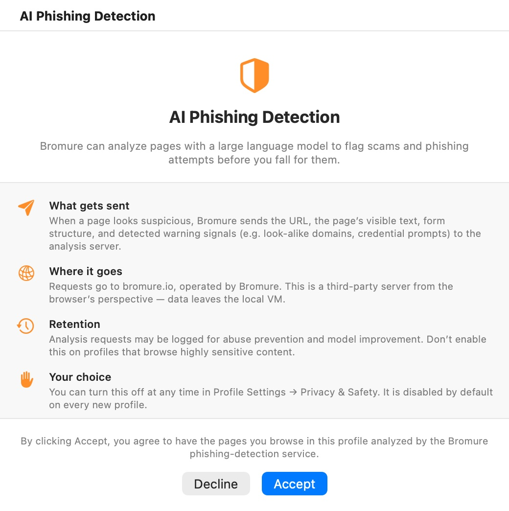

# Privacy & Safety

The **Privacy & Safety** category ("Control what this browser can access and share") adds protections on top of the VM's isolation: filtering known malware sites, AI-based phishing detection, keeping the window out of screenshots and screen sharing, and controlling how the browser identifies itself.

  

## Settings

| Setting | Description |
|---|---|
| **Block Malware Sites** | Blocks websites known to distribute viruses or steal information, using Cloudflare's security DNS. Default: off. |
| **AI Phishing Detection** (Beta) | Analyzes pages with an AI model to catch scams and phishing before you act on them. The page's URL, visible text and form structure are sent to a Bromure analysis server. Default: off. Requires **Retain Browsing Data** and a one-time consent. |
| **Block Screen Capture** | Hides the profile's windows from screenshots, screen recordings and screen-sharing apps like Zoom. Default: off. |
| **Send Link to Other Session** | Adds **Send Link to Other Session** to the browser's right-click menu, to open a link in another Bromure profile. Default: off (on for **File › New Profile…** profiles and the built-in **Private Browsing** profile). |
| **User Agent** | How the browser identifies itself to websites. Leave it empty (placeholder "Browser default (no override)") to use the selected browser’s own user agent, or enter a custom user-agent string. Default: empty. |

All privacy and safety settings apply to an open window after a restart.

## Block Malware Sites

With malware blocking on, the VM resolves names through Cloudflare's malware-filtering resolver (`1.1.1.2`), which refuses to resolve domains known to host malware or phishing. Some networks intercept DNS to public resolvers; on those, the VM falls back to your Mac's resolver and malware filtering is unavailable for that session.

## AI Phishing Detection

The phishing detector watches pages for warning signs — look-alike domains, credential prompts, suspicious links and forms — and, when a page looks suspicious, asks the Bromure analysis server for a verdict. Suspicious pages get a warning banner; pages judged to be phishing are blocked with a warning page.

It has two requirements, checked when you turn it on:

1. **Retain Browsing Data** must be on ([General](general.mdx)), because the detector remembers which sites you've visited in order to spot look-alikes. If it's off, the app asks **Enable data persistence?** — "Phishing protection needs to remember which sites you’ve visited so it can detect suspicious look-alikes. This requires retaining browsing data between sessions." **Enable Both** turns on both settings; **Cancel** leaves both off. Turning **Retain Browsing Data** off later also turns phishing detection off.
2. The first time on this Mac, you must accept the consent below.

### The consent window

  

The **AI Phishing Detection** window explains what the feature does before it's enabled:

- **What gets sent** — when a page looks suspicious, the URL, the page's visible text, its form structure and the warning signals detected.
- **Where it goes** — the analysis server, `bromure.io` by default, operated by Bromure. Data leaves the local VM.
- **Retention** — analysis requests may be logged for abuse prevention and model improvement; don't enable the feature on profiles that browse highly sensitive content.
- **Your choice** — you can turn it off at any time in **Privacy & Safety**; it is off by default on every new profile.

**Accept** turns the setting on and records your consent for the whole app, so other profiles don't ask again. **Decline** leaves the setting off. You can point the feature at a self-hosted analysis server with **Phishing Analysis Server** in [Network](../08-app-settings/network.mdx).

## Block Screen Capture

With it on, macOS leaves the profile's browser windows out of screenshots, screen recordings and screen sharing: they appear blank or are missing in the captured image. Use it for a profile you keep open while sharing your screen in a meeting. The setting takes effect for windows opened after you save it.

## Send Link to Other Session

Right-click a link and choose **Send Link to Other Session** to open it in another profile — for example to open a link from an email in an isolated, ephemeral profile. Bromure then shows a chooser listing your profiles and other browsers, or goes straight to the **Default Profile for Links** if you set one. See [Profiles](../06-profiles.mdx).

## User Agent

By default Bromure leaves the selected browser’s user agent unchanged. An empty field adds no override, whether you use Chromium or Google Chrome. Enter a custom string to override it; clear the field to restore the browser’s own default.

## Related chapters

- [Privacy & Security](../12-privacy-security.mdx) — the security model and everything that leaves your Mac.
- [Profiles](../06-profiles.mdx) — the link chooser and the default profile for links.
- [Network](../08-app-settings/network.mdx) — the phishing analysis server.
- [Profile Settings](index.mdx) — all categories at a glance.
