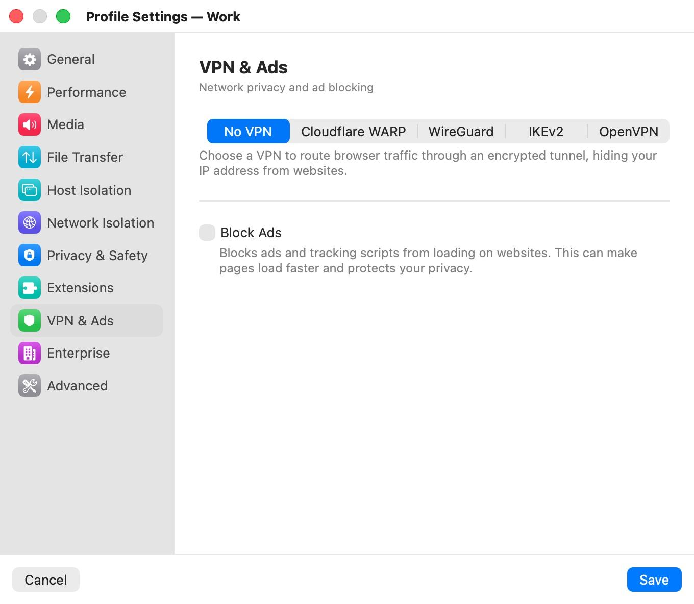
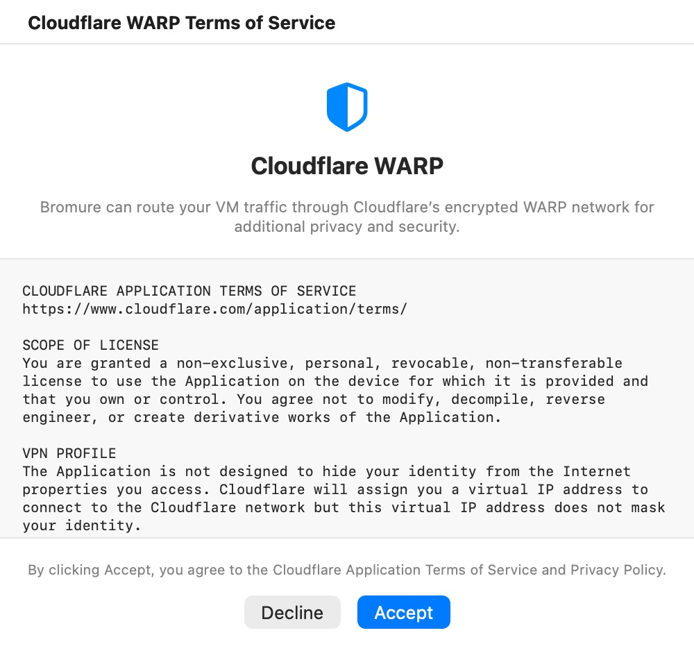

# VPN & Ads

The **VPN & Ads** category ("Network privacy and ad blocking") routes a profile's browser traffic through an encrypted tunnel and blocks ads. The VPN runs inside the profile's VM, not on your Mac: only that profile's traffic goes through it, your Mac's own connection is untouched, and each profile can use a different VPN at the same time.

  

## Settings

| Setting | Description |
|---|---|
| **VPN** (segmented control) | **No VPN** (default), **Cloudflare WARP**, **WireGuard**, **IKEv2** or **OpenVPN**. Choosing one reveals its settings below. |
| **Connect on Startup** | Connects the VPN as soon as the session starts. You can always connect or disconnect from the window's VPN button. Default: on. Each VPN type keeps its own switch. |
| **Block Ads** | Blocks ads and tracking scripts from loading, which can make pages load faster and protects your privacy. Default: off. |

The VPN choice, its settings and **Block Ads** apply to an open window after a restart. Once a session runs, the VPN button in the window's titlebar connects and disconnects the tunnel. See [The Browser Window](../05-browser-window.mdx).

> **Note:** When an HTTP proxy is set in [Enterprise](enterprise.mdx), the VPN control and **Block Ads** are disabled and the category shows "A custom proxy is configured in the Enterprise tab. VPN and ad blocking are disabled while a proxy is active." Your VPN settings are kept, but ignored until you clear the proxy's hostname or port.

## Cloudflare WARP

WARP routes the browser's traffic through Cloudflare's encrypted network, hiding your IP address from websites. It needs no account and no configuration: the only setting is **Connect on Startup**.

### The Cloudflare terms

The first time you choose **Cloudflare WARP** on this Mac, the selection returns to **No VPN** and the **Cloudflare WARP Terms of Service** window opens.

  

It shows an excerpt of Cloudflare's Application Terms of Service — including that WARP assigns you a virtual IP address that does not mask your identity from the sites you visit — with links to the full terms and privacy policy. **Accept** selects **Cloudflare WARP** and records your acceptance for the whole app, so other profiles don't ask again; **Decline** leaves **No VPN** selected.

### Memory

WARP needs at least 2 GB of VM memory to run reliably. If the app's memory setting in [Hardware](../08-app-settings/hardware.mdx) is below 2 GB when you choose WARP, the app asks **Increase VM memory?** — **Increase to 2 GB** changes the app-wide setting at once (for every profile); **Keep current** leaves it.

## WireGuard

WireGuard works with any WireGuard provider or your own server.

| Setting | Description |
|---|---|
| **WireGuard Configuration** | The contents of your WireGuard `.conf` file. Paste it, or click **Import .conf File…** to load it from disk. Default: empty. |
| **Connect on Startup** | See above. Default: on. |

## IKEv2

IKEv2/IPsec works with standard IKEv2 gateways.

| Setting | Description |
|---|---|
| **Server address** | Hostname or IP address of the IKEv2 gateway. |
| **Remote ID** | The gateway's IKE identity. Leave it empty to use the server address. |
| **User authentication** | **Username** (default; username and password), **Certificate** (a client certificate), or **None (PSK)** (a pre-shared key only). |
| **Username** / **Password** | Your credentials, shown for **Username** authentication. |
| **Shared secret** | The pre-shared key, shown for **None (PSK)**. |
| **Certificate** / **Passphrase** | Your client certificate, chosen with **Select…** (`.p12` or `.pfx`), and its passphrase, shown for **Certificate** authentication. The field shows the file's name, or **Imported** for a certificate saved earlier. |
| **VPN Proxy** | An HTTP proxy reachable inside the tunnel, for networks that only allow web traffic through one: **Hostname** and **Port**, plus **Username** and **Password** once a hostname is set. Default: none. |
| **Use VPN DNS** | Uses the DNS servers pushed by the gateway, so name lookups don't leak outside the tunnel. Default: on. |
| **Connect on Startup** | See above. Default: on. |

## OpenVPN

OpenVPN works with standard OpenVPN servers.

| Setting | Description |
|---|---|
| **OpenVPN Configuration** | The contents of your `.ovpn` file. Paste it, or click **Import .ovpn File…**. Certificates and keys can be inlined in the file. Default: empty. |
| **Username** / **Password** | Under **Credentials**: only needed when your configuration uses username and password (`auth-user-pass`). Leave them blank for certificate-only configurations. |
| **Connect on Startup** | See above. Default: on. |

## Where VPN secrets are stored

The IKEv2 password, shared secret, client certificate and passphrase, and the OpenVPN password are stored in your macOS Keychain, not in the profile's settings file. They are saved as soon as you type or import them, even if you then click **Cancel**.

The WireGuard and OpenVPN configuration text, the usernames, and the IKEv2 **VPN Proxy** password are saved with the profile's settings. A WireGuard configuration contains your private key, so keep that in mind if your profiles sync through iCloud Drive (see [Profiles](../06-profiles.mdx)).

## VPNs and port restriction

If the profile also uses **Restrict Outgoing Ports** ([Network Isolation](network-isolation.mdx)), the VPN's endpoint ports are allowed automatically: UDP 2408 for WARP, the `Endpoint` port(s) of the WireGuard configuration (51820 if none), UDP 500 and 4500 for IKEv2, and the `remote` port(s) of the OpenVPN configuration (1194 if none).

## Block Ads

**Block Ads** filters ads and trackers at the DNS level inside the VM: requests to known ad and tracking domains never leave it. It works in every browser tab without an extension, so it keeps **Native Tabs** available. For per-element blocking, add uBlock Origin Lite in [Extensions](extensions.mdx) instead.

## Related chapters

- [Privacy & Security](../12-privacy-security.mdx) — how VPNs and ad blocking fit into Bromure's security model.
- [The Browser Window](../05-browser-window.mdx) — the VPN button in the titlebar.
- [Troubleshooting](../15-troubleshooting.mdx) — VPN connection failures.
- [Enterprise](enterprise.mdx) — the HTTP proxy that disables VPN and ad blocking.
- [Profile Settings](index.mdx) — all categories at a glance.
