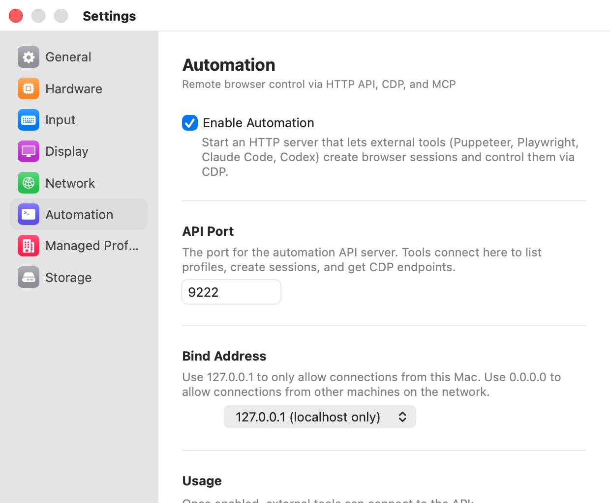

# Automation

The **Automation** pane ("Remote browser control via HTTP API, CDP, and MCP") turns on Bromure's automation server: a small HTTP server on your Mac that lets scripts, test frameworks such as Puppeteer and Playwright, and AI tools such as Claude Code open browser windows and drive them through the Chrome DevTools Protocol (CDP). The same server backs Bromure's MCP server. The full reference for the API, the CDP proxy, the MCP tools and AppleScript is in [Automation](../14-automation.mdx).

<p align="center">
  
</p>

## Settings

| Setting | Description |
|---|---|
| **Enable Automation** | "Start an HTTP server that lets external tools (Puppeteer, Playwright, Claude Code, Codex) create browser sessions and control them via CDP." Starts or stops the server immediately. Default: off. |
| **API Port** | "The port for the automation API server. Tools connect here to list profiles, create sessions, and get CDP endpoints." Default: `9222`. |
| **Bind Address** | "Use 127.0.0.1 to only allow connections from this Mac. Use 0.0.0.0 to allow connections from other machines on the network." **127.0.0.1 (localhost only)** or **0.0.0.0 (all interfaces)**. Default: **127.0.0.1 (localhost only)**. |

**API Port**, **Bind Address** and the rest of the pane appear only while **Enable Automation** is on. A new port or bind address takes effect the next time the server starts: turn **Enable Automation** off and on again, or quit and reopen Bromure.

## Which profiles automation can use

Turning on the server is not enough on its own: each profile decides whether tools may use it, with **Allow Automation** in its **Advanced** settings (see [Advanced](../07-profile-settings/advanced.mdx)). Profiles without it are hidden from the API and can't be opened through it. The built-in **Private Browsing** profile allows automation; profiles you create don't until you turn it on.

## Bind address and security

> **Warning:** The automation server has no authentication. Anything that can connect to the port can open windows, run JavaScript in them, read their pages, and take screenshots.

With **127.0.0.1 (localhost only)** only programs on your Mac can connect. With **0.0.0.0 (all interfaces)** the pane shows a warning: "Binding to all interfaces exposes the automation API to your entire network. Anyone on your LAN can create browser sessions, execute JavaScript, and take screenshots. Only use this on trusted networks."

## Usage and API Reference

With automation on, the pane shows ready-made `curl` commands under **Usage** ("Once enabled, external tools can connect to the API:") for **List profiles**, **Create session**, **List sessions** and **Close session**, using the port you set. You can select and copy them.

Below, **API Reference** ("HTTP endpoints available when automation is enabled:") lists every route with its method: `GET /health`, `GET /profiles`, `GET /sessions`, `POST /sessions`, `GET /sessions/:id`, `DELETE /sessions/:id`, `GET /sessions/:id/trace`, and the `WS /cdp/:id/...` CDP proxy. Each row except the CDP proxy has a copy button (**Copy to clipboard**) that copies an example `curl` command. The routes are documented in [Automation](../14-automation.mdx#the-http-api).

## MCP Server

"Bromure includes a built-in MCP server for Claude Code, Openclaws, and other MCP-compatible AI tools. Add this to your MCP configuration:" The pane then shows a `.mcp.json` snippet, with a copy button, that points at the Bromure executable inside the app bundle:

```json
{
  "mcpServers": {
    "bromure": {
      "command": "/Applications/Bromure.app/Contents/MacOS/bromure",
      "args": ["mcp"]
    }
  }
}
```

The path in your copy is the actual location of the running app, so it is correct even if you keep Bromure somewhere other than `/Applications`. The MCP server talks to the automation server, so **Enable Automation** must stay on for its tools to work. The tools are listed in [Automation](../14-automation.mdx#the-mcp-server).

The note under the snippet, "Add --debug to the args to include VM shell access and app state tools.", refers to development tools that only work when Bromure itself was started with a debugging environment variable. You don't need them for normal use.

## Preferences keys

| Setting | Key | Type | Default |
|---|---|---|---|
| **Enable Automation** | `automation.enabled` | Boolean | `false` |
| **API Port** | `automation.port` | Integer | `9222` |
| **Bind Address** | `automation.bindAddress` | String | `127.0.0.1` |

For example, `defaults write io.bromure.app automation.enabled -bool true` turns the server on the next time Bromure starts. To turn it on in a running app, use AppleScript: `tell application "Bromure" to set app setting "automation.enabled" to value "true"` starts the server immediately.

## Related chapters

- [Automation](../14-automation.mdx) — the HTTP API, the CDP proxy, the MCP tools, AppleScript, and the command-line tool.
- [Advanced](../07-profile-settings/advanced.mdx) — **Allow Automation** and session recording, per profile.
