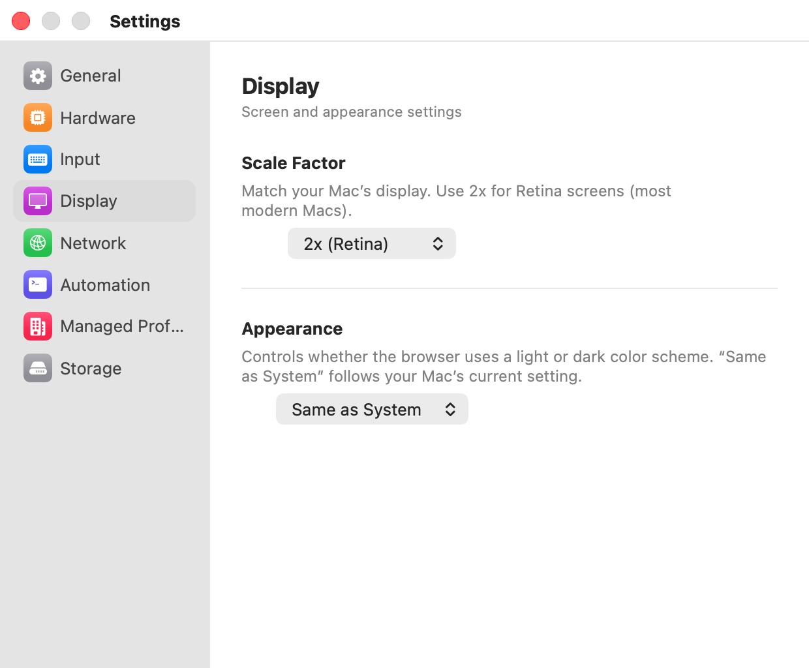

# Display

The **Display** pane ("Screen and appearance settings") controls how sharp the browser is drawn and which color scheme it reports to websites.

  

## Settings

| Setting | Description |
|---|---|
| **Scale Factor** | "Match your Mac’s display. Use 2x for Retina screens (most modern Macs)." **1x (Standard)** or **2x (Retina)**. Default: detected from your main display (**2x (Retina)** on a Retina screen). |
| **Appearance** | "Controls whether the browser uses a light or dark color scheme. “Same as System” follows your Mac’s current setting." **Same as System**, **Light**, or **Dark**. Default: **Same as System**. |

Both settings apply to browser windows you open after the change. Changing **Scale Factor** also replaces the pre-warmed VM so the next window starts at the new scale.

## Scale Factor

At **2x (Retina)**, the browser renders every CSS pixel with four device pixels, so text and images are as crisp as in a native Mac app. At **1x (Standard)**, it renders one device pixel per CSS pixel: use it on an external non-Retina display, where 2x brings no benefit and costs memory and GPU time.

If you move between a Retina laptop screen and a standard external display, pick the value for the screen you browse on most.

## Appearance

With **Same as System**, a new window uses the light or dark mode your Mac is in when the window opens; switching your Mac's appearance later does not change a window that is already open. **Light** and **Dark** force that scheme in every new window. Websites that support a dark theme (through the `prefers-color-scheme` media query) follow this setting, as do Chromium's own pages and menus.

## Preferences keys

| Setting | Key | Type | Default |
|---|---|---|---|
| **Scale Factor** | `vm.displayScale` | Integer: `1` or `2` | detected |
| **Appearance** | `vm.appearance` | String: `system`, `light`, `dark` | `system` |

## Related chapters

- [Performance](../07-profile-settings/performance.mdx) — GPU acceleration and rendering options per profile.
- [The Browser Window](../05-browser-window.mdx) — zoom and the window itself.
