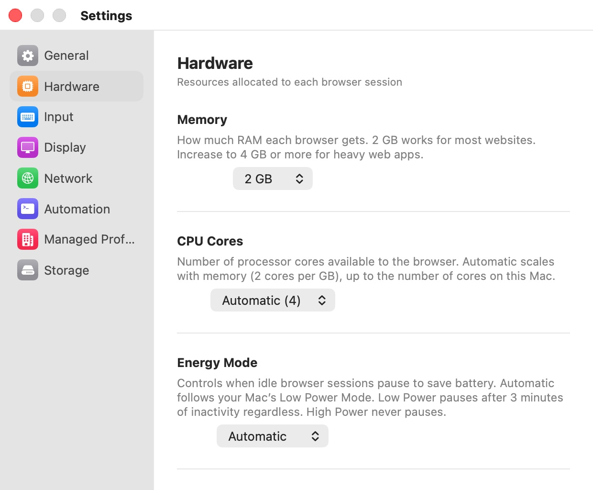

# Hardware

The **Hardware** pane ("Resources allocated to each browser session") sets the virtual hardware every browser window gets. Each window is its own Linux VM, so these values apply per window: two open windows with 4 GB each can use up to 8 GB of your Mac's memory.

  

## Settings

| Setting | Description |
|---|---|
| **Memory** | How much RAM each browser VM gets: **1 GB**, **2 GB**, **3 GB**, **4 GB**, **8 GB**, or **16 GB**. "2 GB works for most websites. Increase to 4 GB or more for heavy web apps." Default: sized to your Mac (see below). |
| **CPU Cores** | How many processor cores each browser VM gets: **Automatic** or a fixed number from 1 to the number of cores in your Mac. Default: **Automatic**. |
| **Energy Mode** | When idle browser windows pause to save power: **High Power**, **Automatic**, or **Low Power**. Default: **Automatic**. |
| **Kernel Boot Options** | Extra parameters appended to the Linux kernel command line of every browser VM. Default: `arm64.nosme`. |

The pane's footnote reads "Changes take effect when the next browser session starts." Memory, CPU cores and kernel options apply to windows you open after the change; windows already open keep their current hardware. **Energy Mode** is the exception: open windows follow it immediately.

## Memory

Until you pick a value, Bromure sizes each VM from your Mac's installed memory:

| Your Mac's memory | Memory per browser VM |
|---|---|
| Less than 18 GB | 2 GB |
| 18 GB to less than 36 GB | 3 GB |
| 36 GB or more | 4 GB |

The menu shows **2 GB** until you choose a value yourself. Once you choose one, it is used on every Mac model.

Some features need more than the minimum. Choosing **Cloudflare WARP** for a profile whose VMs have less than 2 GB offers to raise the memory to 2 GB (see [VPN & Ads](../07-profile-settings/vpn-ads.mdx)). Heavy web apps, many open tabs, or video calls with camera effects benefit from 4 GB or more.

## CPU Cores

With **Automatic**, each browser VM gets half of your Mac's cores, never fewer than 2 and never more than 12. The number shown in parentheses next to **Automatic** in the menu is an estimate based on the memory setting (two cores per gigabyte, up to the number of cores in your Mac). Choose a fixed number if you want to be certain how many cores each window uses.

## Energy Mode

A browser window that sits idle can pause its VM so it uses no CPU at all; it resumes instantly when you come back to it. A window counts as idle when, for 3 minutes in a row, it is not the front window, it has no network traffic, and its camera and microphone are not in use.

- **High Power** — windows never pause.
- **Automatic** (default) — windows pause when idle only while your Mac is in Low Power Mode.
- **Low Power** — windows always pause when idle, whatever your Mac's power state.

Automation keeps a paused window awake: a request to the automation API for a window resumes it first. See [Automation](../14-automation.mdx).

## Kernel Boot Options

"Additional Linux kernel command-line parameters appended to the virtual machine boot command. The default disables SME to work around a crash on Apple M4 processors."

As soon as the field differs from the default, the pane shows a red warning, "Incorrect kernel options will prevent the browser from booting.", explaining that removing `arm64.nosme` may cause crashes on M4 Macs, and a **Reset to Default** button that puts back `arm64.nosme`.

> **Warning:** Bromure does not check what you type here. An invalid option can stop every browser VM from starting. If windows no longer open after you changed this field, return to **Settings › Hardware** and click **Reset to Default**. See [Troubleshooting](../15-troubleshooting.mdx).

## Preferences keys

| Setting | Key | Type | Default |
|---|---|---|---|
| **Memory** | `vm.memoryGB` | Integer (GB) | not set (sized to your Mac) |
| **CPU Cores** | `vm.cpuCount` | Integer (`0` = Automatic) | `0` |
| **Energy Mode** | `vm.energyMode` | String: `highPower`, `automatic`, `lowPower` | `automatic` |
| **Kernel Boot Options** | `vm.extraKernelOptions` | String | `arm64.nosme` |

`vm.memoryGB` and `vm.cpuCount` can also be set with AppleScript's `set app setting`, which restarts the pre-warmed VM and offers to restart open windows so they pick up the change. See [Automation](../14-automation.mdx#applescript).

## Related chapters

- [Concepts](../04-concepts.mdx) — one VM per window, and the pre-warmed VM.
- [Performance](../07-profile-settings/performance.mdx) — per-profile GPU and rendering options.
- [Troubleshooting](../15-troubleshooting.mdx) — windows that won't start, and kernel options.
