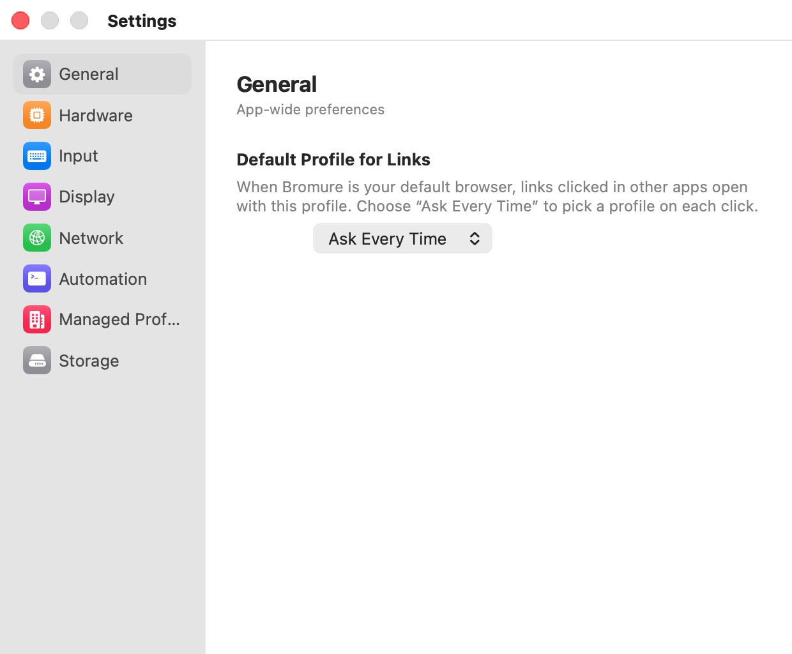

# App Settings

Most of what shapes a browsing session belongs to a profile (see [Profile Settings](../07-profile-settings/index.mdx)). A few things apply to every profile at once: how much memory and how many CPU cores each browser VM gets, the keyboard layout baked into the browser image, the display scale, the default network mode, the automation server, enterprise enrollment, and the base image itself. These live in the app's **Settings** window.

This chapter is the reference for that window. Each pane has its own page with a screenshot, a settings table with defaults, and pointers to the chapter that explains the feature behind it.

## Opening the Settings window

Choose **Bromure › Settings…** in the menu bar, or press ⌘,. The window is titled **Settings**. Only one Settings window exists at a time: choosing the command again brings the open window forward.

  

The left column lists the panes, each with a colored icon; the right column shows the selected pane, with a heading and a one-line subtitle. The window always opens on **General**.

## Changes apply immediately

The Settings window has no **Save** or **Cancel** button. Every change is stored the moment you make it. What happens next depends on the setting:

- **Applied to the next browser window.** Memory, CPU cores, kernel boot options, display scale, connection mode, bridged interface, and DNS servers. Bromure discards its pre-warmed VM and boots a new one with the new values, so the next window you open uses them. Windows that are already open keep running with the settings they started with; close and reopen a window to pick up the change.
- **Applied when a window is opened.** Appearance and **Use Command as Control** are read each time a browser window is created.
- **Applied at once.** **Energy Mode** is checked continuously by every open window. **Default Profile for Links** is used for the next link you click in another app. **Enable Automation** starts or stops the automation server right away.
- **Needs a rebuild of the base image.** **Keyboard Layout** and **Natural Scrolling** are built into the browser image. Changing either asks you to confirm a rebuild first (see [Input](input.mdx)).

## The panes

| Pane | Subtitle | What it configures |
|---|---|---|
| [General](general.mdx) | App-wide preferences | Which profile opens links clicked in other apps. |
| [Hardware](hardware.mdx) | Resources allocated to each browser session | Memory, CPU cores, energy mode, and kernel boot options for every browser VM. |
| [Input](input.mdx) | Keyboard and trackpad settings | Keyboard layout, natural scrolling, and the Command/Control swap. |
| [Display](display.mdx) | Screen and appearance settings | Scale factor and light or dark appearance. |
| [Network](network.mdx) | Connection mode and DNS settings | NAT or bridged networking, DNS servers, and the phishing-analysis server. |
| [Automation](automation.mdx) | Remote browser control via HTTP API, CDP, and MCP | The automation server, its port and bind address, and the MCP configuration. |
| [Managed Profile](managed-profile.mdx) | Enterprise-provisioned profile delivered from a Bromure control plane | Enrollment in one or more organizations, and syncing their managed profiles. |
| [Storage](storage.mdx) | Disk usage and base image management | The size and location of the base image, and deleting it. |

## Where settings are stored

App settings are stored in the `io.bromure.app` preferences domain. The **Storage** and **Managed Profile** panes show information kept elsewhere: the base image in `~/Library/Application Support/Bromure/`, and enrollments in `~/Library/Application Support/Bromure/managed/` with their secrets in the macOS Keychain.

Most app settings can also be read and changed with AppleScript (`get app setting` and `set app setting`) or with `defaults`. The keys are listed on each pane's page and in [Automation](../14-automation.mdx#app-setting-keys).

> **Note:** If you change a setting with `defaults write` while Bromure is running, the Settings window reflects it, but a change to the VM hardware settings only reaches new windows once Bromure boots a fresh VM. Use AppleScript's `set app setting`, which restarts the pre-warmed VM for you, or quit and reopen Bromure.

## Related chapters

- [Profile Settings](../07-profile-settings/index.mdx) — everything that is set per profile.
- [Concepts](../04-concepts.mdx) — the VM-per-window model the Hardware and Network panes configure.
- [Appendix](../17-appendix.mdx) — every preferences key, file location, and keyboard shortcut.
