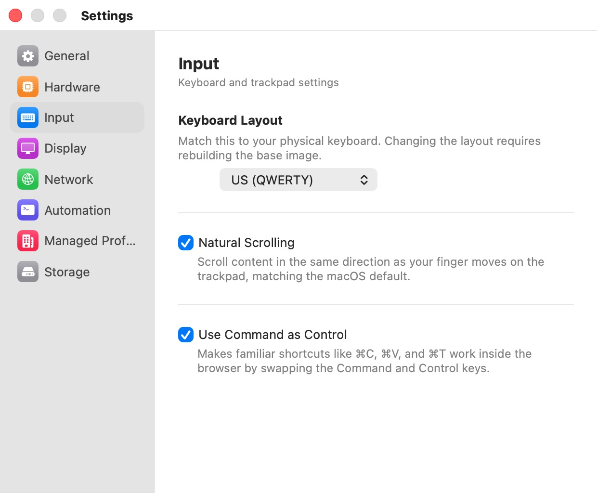

# Input

The **Input** pane ("Keyboard and trackpad settings") makes the keyboard and trackpad behave inside the browser VM the way they do on your Mac. Two of its settings are built into the browser image, so changing them rebuilds that image.

  

## Settings

| Setting | Description |
|---|---|
| **Keyboard Layout** | "Match this to your physical keyboard. Changing the layout requires rebuilding the base image." Default: detected from your Mac's current keyboard input source at first setup, or **US (QWERTY)** if it can't be matched. |
| **Natural Scrolling** | "Scroll content in the same direction as your finger moves on the trackpad, matching the macOS default." Changing it requires rebuilding the base image. Default: follows your Mac's scrolling setting (on if it can't be read). |
| **Use Command as Control** | "Makes familiar shortcuts like ⌘C, ⌘V, and ⌘T work inside the browser by swapping the Command and Control keys." Default: on. |

## Keyboard layouts

The **Keyboard Layout** menu offers 28 layouts: US (QWERTY), US (Dvorak), US (Colemak), British, French (AZERTY), German (QWERTZ), Spanish, Italian, Portuguese, Brazilian, Belgian, Dutch, Swedish, Norwegian, Danish, Finnish, Swiss French, Swiss German, Canadian French, Czech, Polish, Russian, Turkish, Japanese, Korean, Arabic, Hebrew, and Irish.

This is the layout the VM starts with. A profile can also follow your Mac while it runs: with **Match Keyboard Layout** on (the default), switching input sources on your Mac switches the layout in the browser too. See [Host Isolation](../07-profile-settings/host-isolation.mdx).

## Rebuilding the image

Changing **Keyboard Layout** or **Natural Scrolling** opens a confirmation, **Rebuild required**: "Changing this setting requires rebuilding the base image. All open browser windows will be closed and any unsaved data will be lost."

- **Rebuild Image** saves the new value, closes every browser window, deletes the base image, and installs it again with the new setting. The setup window shows the progress (eyebrow **REBUILDING**). Your profiles and their saved data are kept; see [Installation](../02-installation.mdx).
- **Cancel** puts the setting back to its previous value. Nothing is rebuilt.

> **Tip:** Save anything you are working on before you change these two settings. Rebuilding closes every window without the usual close confirmation, and the contents of ephemeral windows are lost.

## Use Command as Control

Linux applications, Chromium included, use Control for the shortcuts that macOS puts on Command. With **Use Command as Control** on, Bromure swaps the two keys inside the VM, so ⌘C copies, ⌘T opens a tab and ⌘L selects the address bar as you'd expect. Turn it off if you prefer to press Control yourself, for example in a web-based terminal. The setting applies to windows opened after the change.

## Preferences keys

| Setting | Key | Type | Default |
|---|---|---|---|
| **Keyboard Layout** | `vm.keyboardLayout` | String (an XKB layout name, such as `us`, `fr`, `ch(de)`) | detected |
| **Natural Scrolling** | `vm.naturalScrolling` | Boolean | detected |
| **Use Command as Control** | `vm.swapCmdCtrl` | Boolean | `true` |

Setting `vm.keyboardLayout` or `vm.naturalScrolling` outside the Settings window (with `defaults` or AppleScript) does not rebuild the image by itself; use **File › Recreate Base Image…** afterwards to apply it.

## Related chapters

- [Host Isolation](../07-profile-settings/host-isolation.mdx) — **Match Keyboard Layout**, per profile.
- [The Browser Window](../05-browser-window.mdx) — keyboard shortcuts.
- [Installation](../02-installation.mdx) — what a rebuild does and how long it takes.
