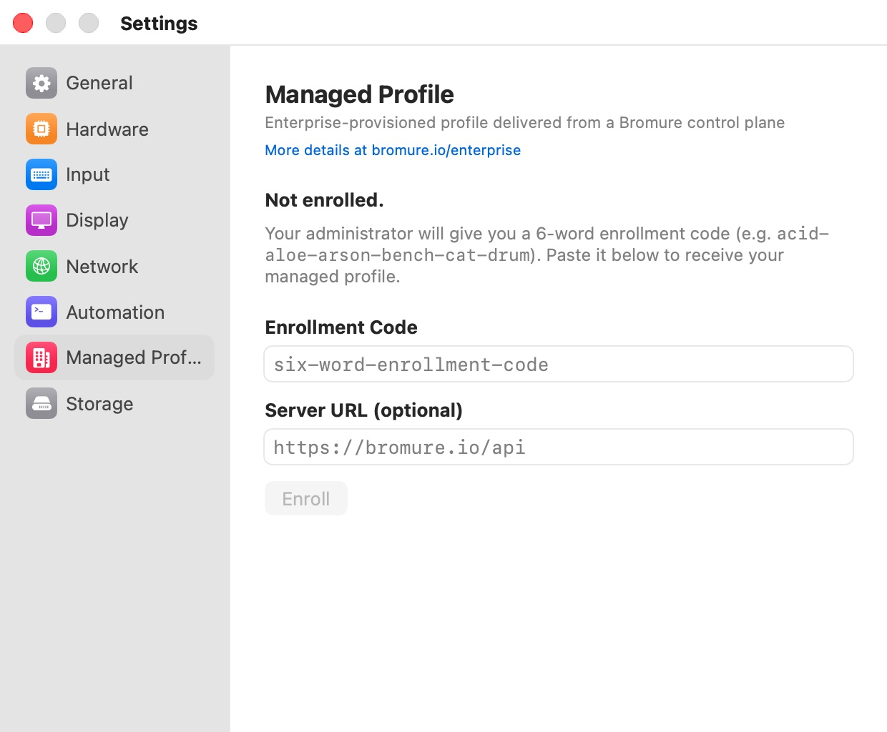

# Managed Profile

The **Managed Profile** pane ("Enterprise-provisioned profile delivered from a Bromure control plane") is where you enroll this Mac with your organization, so that it receives the browser profiles your administrator prepared for you. If nobody at work gave you an enrollment code, you don't need this pane. A link under the heading, **More details at bromure.io/enterprise**, opens the product page.

  

What enrollment is, what administrators control, and how managed profiles behave are covered in [Enterprise](../13-enterprise.mdx). This page describes the pane itself.

## When the Mac is not enrolled

The pane shows **Not enrolled.** and: "Your administrator will give you a 6-word enrollment code (e.g. `acid-aloe-arson-bench-cat-drum`). Paste it below to receive your managed profile."

| Field | Description |
|---|---|
| **Enrollment Code** | The six-word code from your administrator. Placeholder: `six-word-enrollment-code`. |
| **Server URL (optional)** | Your organization's control-plane address, if it runs its own. Leave empty to use `https://bromure.io/api`. |
| **Enroll** | Redeems the code. Available once the code field is not empty. |

While Bromure contacts the server, **Enroll** shows a spinner. On success the pane switches to the enrolled view and the managed profiles appear in your profile list. If enrollment fails, the reason is shown in red next to the button. This form registers the Mac under its own name; to choose a different device name, use the command line (`bromure enroll … --device-name`) or, for a further organization, **Enroll Another…**.

## When the Mac is enrolled

The pane shows one card per organization this Mac is enrolled with, headed by the organization's short name (its slug), with an **Unenroll…** button and these rows:

| Row | Shows |
|---|---|
| **User** | The account email the enrollment code was issued to. |
| **Device** | The device name registered with the organization. |
| **Server** | The control-plane address. |
| **Last sync** | When managed profiles were last fetched successfully during this run of Bromure. The row appears after the first successful sync. |

Below the cards, a status line reports the last sync: **Syncing…**, **Synced *n* profile(s).**, **Enrolled — no profiles assigned.**, or **Sync failed: *reason***.

**Assigned profiles** lists the managed profiles now on this Mac, each with a padlock. With none, it says "No managed profiles are currently assigned."

| Button | Does |
|---|---|
| **Sync Now** | Fetches the organization's current profiles immediately. Bromure also syncs on launch, every 15 minutes, and whenever it becomes the active app. |
| **Enroll Another…** | Opens the **Enroll in Enterprise Management** window to enroll with a further organization. A Mac can be enrolled with several organizations at once. See [Enterprise](../13-enterprise.mdx#enrolling-with-another-organization). |
| **Unenroll…** | Removes that one organization. See below. |

## Unenrolling

**Unenroll…** on a card asks **Unenroll from this organization?**: "Managed profiles and any issued mTLS certificates from this organization will be removed. Profiles you created yourself are untouched." Click **Unenroll** to confirm, or **Cancel**.

Unenrolling removes that organization's enrollment, its managed profiles, and their client certificates from this Mac. Enrollments with other organizations stay as they are. When the last enrollment is removed, the pane returns to **Not enrolled.**

## Related chapters

- [Enterprise](../13-enterprise.mdx) — enrollment, managed profiles, and what administrators control.
- [Profile Settings](../07-profile-settings/index.mdx) — how managed profiles open read-only.
- [Automation](../14-automation.mdx#command-line-tool) — `bromure enroll`, `unenroll`, and `list-enrollments`.
