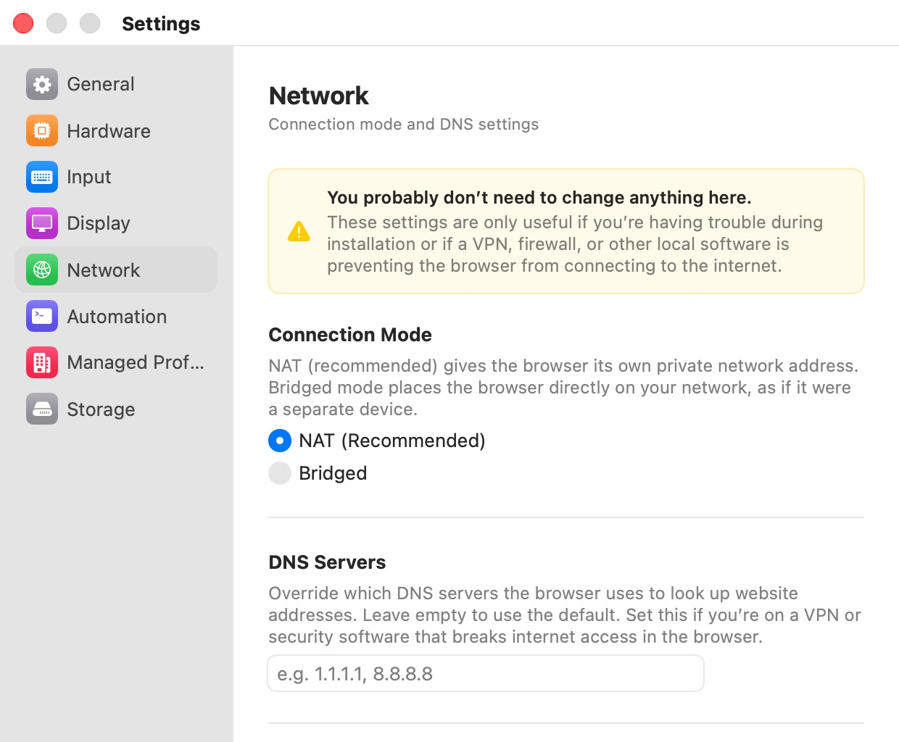

# Network

The **Network** pane ("Connection mode and DNS settings") decides how browser VMs reach the network. The defaults work on almost every Mac, and the pane says so at the top in a yellow banner: "You probably don’t need to change anything here. These settings are only useful if you’re having trouble during installation or if a VPN, firewall, or other local software is preventing the browser from connecting to the internet."

  

## Settings

| Setting | Description |
|---|---|
| **Connection Mode** | "NAT (recommended) gives the browser its own private network address. Bridged mode places the browser directly on your network, as if it were a separate device." **NAT (Recommended)** or **Bridged**. Default: **NAT (Recommended)**. |
| **Network Interface** | Shown only in Bridged mode. "Choose which network connection the browser should use. Typically this is your Wi-Fi or Ethernet adapter." Lists your Mac's adapters, for example **Wi-Fi (en0)**. Default: **Select…** (none chosen). |
| **DNS Servers** | "Override which DNS servers the browser uses to look up website addresses. Leave empty to use the default. Set this if you’re on a VPN or security software that breaks internet access in the browser." A comma-separated list of IPv4 addresses, for example `1.1.1.1, 8.8.8.8`. Default: empty. |
| **Phishing Analysis Server** | "URL of the server used for AI-powered phishing detection. Change this to use a self-hosted instance." Default: `https://bromure.io/api`. A **Reset** button appears when the field differs from the default. |

Connection mode, network interface and DNS servers apply to browser windows opened after the change: Bromure replaces its pre-warmed VM as soon as you change one of them. The phishing server is read when a window starts.

## NAT or Bridged

In **NAT** mode each browser VM gets a private address behind your Mac, which shares its own connection with it. The VM is invisible to other devices on your network, and Bromure can filter its traffic on the Mac: the per-profile **Isolate from Local Network** and **Restrict Outgoing Ports** options, and the DNS override on this pane, all work only in NAT mode.

In **Bridged** mode the VM joins your network directly, as a separate device with its own address from your router. Use it when NAT doesn't work on your Mac, typically because a VPN client or security software interferes with macOS's shared networking. When Bridged is selected, the pane warns: "LAN isolation and port restriction are not available in bridged mode." If your Mac has no adapter that can be bridged, the pane shows "No network interfaces available."

A profile can override the mode chosen here: see **Network Interface** in [Network Isolation](../07-profile-settings/network-isolation.mdx).

## DNS Servers

Leave the field empty to let the VM use the DNS servers Bromure gives it by default. Enter your own servers when your network's resolver doesn't answer the VM, for example behind some corporate VPNs. Only IPv4 addresses are accepted; anything else in the list is ignored. In Bridged mode the pane reminds you that "DNS override only works in NAT mode."

A profile with **Block Malware Sites** on uses Cloudflare's filtering resolvers instead (see [Privacy & Safety](../07-profile-settings/privacy-safety.mdx)), and a profile with a VPN may use the VPN's DNS.

## Phishing Analysis Server

Profiles with **AI Phishing Detection** turned on send details of suspicious pages to this server for analysis. Change it only if your organization runs its own instance of the Bromure phishing-analysis service; the new address applies to windows opened afterwards. What is sent, and when, is described in [Privacy & Security](../12-privacy-security.mdx#ai-phishing-detection).

## Preferences keys

| Setting | Key | Type | Default |
|---|---|---|---|
| **Connection Mode** | `vm.networkMode` | String: `nat`, `bridged` | `nat` |
| **Network Interface** | `vm.bridgedInterface` | String (a BSD interface name, such as `en0`) | empty |
| **DNS Servers** | `vm.dnsServers` | String (comma-separated IPv4 addresses) | empty |
| **Phishing Analysis Server** | `phishingAnalysis.serverURL` | String (URL) | `https://bromure.io/api` |

## Related chapters

- [Network Isolation](../07-profile-settings/network-isolation.mdx) — per-profile interface, LAN isolation, and port restrictions.
- [Concepts](../04-concepts.mdx) — NAT and bridged networking.
- [Troubleshooting](../15-troubleshooting.mdx) — **Network Issue** alerts and **Repair Network**.
