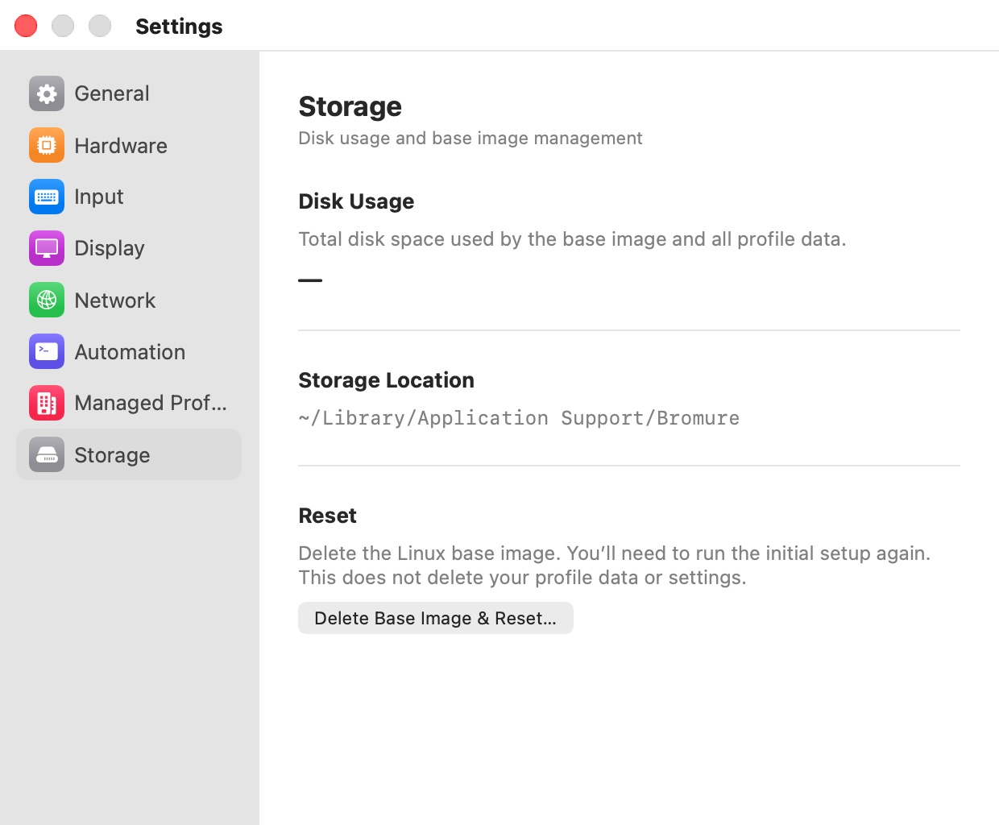

# Storage

The **Storage** pane ("Disk usage and base image management") shows the size and location of the browser base image, the Linux disk every browser VM starts from, and lets you delete it.

  

## Settings

| Item | Description |
|---|---|
| **Disk Usage** | The space taken by the base image: the disk image (`linux-base.img`) plus the kernel and initial RAM disk it boots with. Shows **No base image** when there is none. |
| **Storage Location** | The folder that holds the base image and Bromure's other data: `~/Library/Application Support/Bromure`. You can select and copy the path. It can't be changed. |
| **Delete Base Image & Reset…** | Deletes the base image so that setup runs again. See below. |

## What Disk Usage counts

The pane's description says "Total disk space used by the base image and all profile data", but the figure counts only the base image files. The size shown is the image's logical size; because the image is a sparse file on APFS, it can occupy less space on disk.

Other data in the storage folder is not included:

- **Persistent profiles** keep their browsing data in `profiles/<profile-id>/image/profile.img`, a sparse disk image of up to 1 GB per profile. Deleting a profile deletes it.
- **Managed profiles** are kept in `managed/`.
- **Extensions** you added are cached in `extensions/`.

Each browser window also uses a temporary copy-on-write clone of the base image in your temporary folder while it runs. The clone only grows with what the window writes, and it is deleted when the window closes. To see the full picture, check the folder in Finder with **File › Get Info**. File locations are listed in the [Appendix](../17-appendix.mdx).

## Delete Base Image & Reset

"Delete the Linux base image. You’ll need to run the initial setup again. This does not delete your profile data or settings."

Clicking **Delete Base Image & Reset…** asks **Delete the base image?**: "This will delete the Linux base image. You’ll need to run setup again." Click **Delete** to confirm.

Bromure then closes every browser window, deletes the image files, and shows the setup window on its Welcome screen. Click **Get Started** to download and install a fresh image. Your profiles, their saved browsing data, your enrollments and your settings are kept.

Use it to reclaim the image's space before uninstalling Bromure, or to start over when the image is damaged. To replace the image in one step instead, use **File › Recreate Base Image…**, which rebuilds it straight away. Both are described in [Installation](../02-installation.mdx) and [Troubleshooting](../15-troubleshooting.mdx#recreating-the-base-image).

> **Note:** Windows closed by a reset are closed without the usual confirmation. Save anything you need from open windows first.

## Related chapters

- [Installation](../02-installation.mdx) — setup, image updates, storage locations, and uninstalling.
- [Concepts](../04-concepts.mdx) — the base image and copy-on-write clones.
- [Troubleshooting](../15-troubleshooting.mdx) — disk space and recreating the image.
