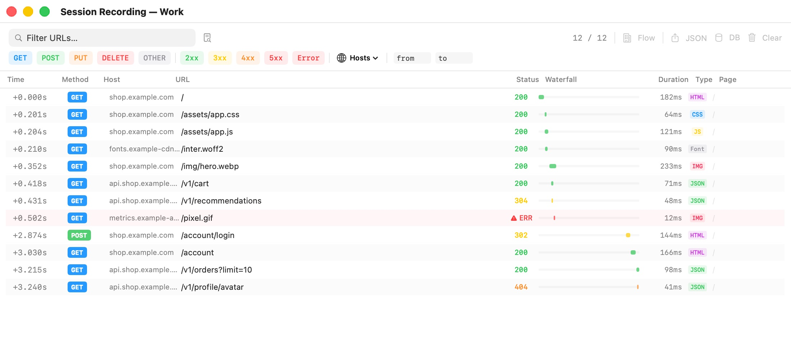

# Session Recording

Session recording captures every HTTP request the browser in a window makes — the pages you open and everything they load behind the scenes — so you can see exactly what a site or a suspicious link does. You browse normally; Bromure records in the background and lets you inspect, filter, and export the result. This chapter is for anyone who analyzes websites, investigates phishing, or simply wants to see what a page talks to.

Recording is set per profile and is off by default.

## Turning recording on

In the profile's [Advanced](07-profile-settings/advanced.mdx) settings, under **Session Recording**, choose a capture level:

| Level | What each recorded request contains |
|---|---|
| **Disabled** (default) | Nothing is recorded, and the recording buttons don't appear. |
| **Basic — URLs only** | Time, method, URL, status code, duration, content type, and the tab it came from. |
| **Headers — URLs + headers + POST data** | Everything in Basic, plus request and response headers, request bodies (POST data), and the values of form fields when a form is submitted. |
| **Full — URLs + headers + response bodies** | Everything in Headers, plus response bodies (up to 1 MB each; larger bodies are cut off and marked as truncated). |

> **Warning:** **Headers** records POST data, which can include passwords, tokens, and form submissions in clear text. **Full** also records every response, including personal data and authentication tokens. Use these levels for security analysis of untrusted links, not for everyday browsing, and treat saved recordings as sensitive files.

Below the level, **Start Recording Automatically** (on by default) decides whether recording begins as soon as the window opens. Turn it off to start each window paused and record only when you click the record button.

Save the profile. The level applies to windows opened afterwards.

## The record button

In a window whose profile records, two buttons appear at the right of the titlebar:

- **Record / pause** — a circle icon. While recording, it is red with a small red dot (tooltip **Recording — click to pause**). While paused, it is gray (tooltip **Paused — click to start recording**). Click it to switch. Requests made while paused are not recorded; what was already captured is kept.
- **View trace** — a waveform icon that opens the Session Recording window for this window.

## The Session Recording window

Click **View trace** to open **Session Recording — *profile name***. The window shows the requests recorded up to the moment you opened it; to see newer ones, close it and click **View trace** again.

  

### The request table

Each row is one request, in the order they happened:

| Column | Shows |
|---|---|
| **Time** | Seconds since the first request shown, such as `+1.234s`. |
| **Method** | GET, POST, and so on, color-coded. Page loads the browser starts itself appear as NAVIGATE. |
| **Host** | The server's host name. |
| **URL** | The path and query. |
| **Status** | The HTTP status code, or **ERR** in red when the request failed. |
| **Waterfall** | A bar showing when the request started and how long it took, relative to the others. |
| **Duration** | How long the request took. |
| **Type** | The kind of content: **HTML**, **JS**, **CSS**, **JSON**, **IMG**, **Font**, or **Other**. Hover to see the exact type. |
| **Page** | The path of the page that made the request. |

Click a row to open its details on the right. Click the × at the top of the details, or another row, to change the selection.

### Filtering

The toolbar narrows the table. Filters combine: a request must match all of them.

- **Filter URLs…** — shows requests whose URL contains the text.
- **Body search** (the magnifying glass on a document, tooltip "Search response/request body content") — adds a **Body content…** field that matches text inside request bodies and response bodies. Needs the **Headers** or **Full** level to have anything to search.
- **Method chips** — **GET**, **POST**, **PUT**, **DELETE**, **OTHER**. Click one or more to show only those methods.
- **Status chips** — **2xx**, **3xx**, **4xx**, **5xx**, **Error**.
- **Tabs** — when requests came from more than one browser tab, pick **Tab *n*** to see only that tab, or **All Tabs**.
- **Hosts** — check one or more host names; **Clear Selection** unchecks them all. The menu shows how many hosts are selected.
- **T *from* – *to* s** — a time range in seconds from the first request, for example `2` to `10`.
- **Reset** — appears when any filter is active and clears them all.

The count on the right, such as **12 / 40**, is the number of requests shown out of the number recorded.

### Request details

The details pane has five tabs:

- **Request** — **URL** (with a copy button), **Origin** (the initiator and the page that made the request), **Request Headers**, and **Request Body**.
- **Response** — the status, any error message for a failed request, **Response Headers**, and **Response Body**. A body over 1 MB shows "Response body was truncated".
- **Form Fields** — **Captured Form Fields**: the name, type, and value of each field of a submitted form. **POST Data vs Form Values** compares what was in the form with what was actually sent, which reveals pages that transform your input (for example, hashing or encoding it) before sending it. Form fields are captured when a form is submitted, at the **Headers** and **Full** levels.
- **Navigation** — for the request's tab: **Navigation Flow**, the chain of pages the tab went through, and **Request Tree**, every page with the requests it made, with the selected request highlighted.
- **Timing** — **Request Time** and **Completed At** (from the start of the recording), **Absolute Time**, **Duration**, and **Tab ID**.

Sections with headers or bodies have a copy button that copies their content to the Mac's clipboard.

### Toolbar buttons

| Button | What it does |
|---|---|
| **Flow** | Opens the Flow view in a new window (see [below](#the-flow-view)). |
| **JSON** | Exports the recording as a JSON file (default name `trace-<profile>.json`). You can open it later with **File › Open Trace…**. |
| **DB** | Exports the recording as a SQLite database (`trace-<profile>.sqlite`), with tables for requests, headers, bodies, and form fields, for analysis with your own tools. |
| **Clear** | Deletes everything recorded so far in this window. Recording continues from an empty list. |

## The Flow view

**Flow** opens **Flow — *profile name***, a map of the pages a tab visited drawn as an isometric city. Each page load is a building:

- The building's height grows with the number of requests the page made (one to eight floors).
- Its color tells what kind of step it was: green for the entry point, blue for a normal page load (GET), orange for a form submission (POST), purple for a redirect, and red for an error (status 400 or higher). The legend shows the colors.
- Lines connect each page to the next, so redirect chains and form submissions stand out.

To explore:

- **Drag** to move around, and **pinch** to zoom. The house button (tooltip "Reset view to center", ⇧⌘H) resets the view.
- **Click a building** to see its details at the bottom: its label, host, status, full URL, and its sub-requests with their method, status, and duration. The arrow keys move between buildings; Esc closes the details.
- **Filter pages…** highlights the buildings whose URL or host contains the text and dims the others.
- The pin button in the details marks a building on the map.
- When the recording covers several tabs, buttons at the top (**Tab 1**, **Tab 2**, …) switch between them.

If the recording has no page loads yet, the view says "No navigation events captured".

## Saving when the window closes

When you close a window whose recording holds at least one request, Bromure asks:

> **Save session recording?**
> This session captured *n* HTTP requests. Save the recording before closing?

- **Save…** — choose where to save the recording as JSON, then the window closes.
- **Discard** — close the window and throw the recording away.
- **Cancel** — keep the window open.

This question comes after the usual **Close this browser?** alert (unless you told Bromure to stop asking that). Quitting Bromure doesn't ask it, so save any recording you want to keep before you quit.

## Opening a saved recording

Choose **File › Open Trace…** (⌘O) and pick a `.json` file saved from a recording. It opens in a **Session Recording — *file name*** window with the same table, filters, and details. The **Flow**, **JSON**, **DB**, and **Clear** buttons are unavailable for a recording opened from a file.

If the file isn't a Bromure recording, you see **Invalid Trace File** — "The file could not be read as a Bromure session recording."

## Managed recording

On a profile managed by your organization, the administrator can require recording. In that case:

- Recording always starts when the window opens, at the level the administrator chose, and can't be paused: the record button is red and disabled, with the tooltip **Recording is enforced by your organization (*organization*)**.
- A red banner with an eye icon at the left of the titlebar reads **Recording — shared with *organization***. Its tooltip: "Every request in this window is recorded and sent to your organization's infosec team. This is required by your administrator and cannot be turned off."
- The requests are sent to your organization's Bromure analytics service. They are kept in memory only, never written to your Mac's disk.
- There is no **View trace** button and no **Save session recording?** prompt: the recording belongs to the organization and isn't shown or saved locally.

See [Enterprise Management](13-enterprise.mdx).

## Reading recordings from other tools

When a profile has **Allow Automation** on and the automation server is running, scripts and AI agents can read a window's recording through the HTTP API and the MCP server's trace tools. See [Automation](14-automation.mdx).

## Related chapters

- [Advanced](07-profile-settings/advanced.mdx) — the Session Recording setting.
- [The Browser Window](05-browser-window.mdx) — the titlebar buttons and closing alerts.
- [Enterprise Management](13-enterprise.mdx) — recording required by an organization.
- [Automation](14-automation.mdx) — reading traces from the API and MCP.
