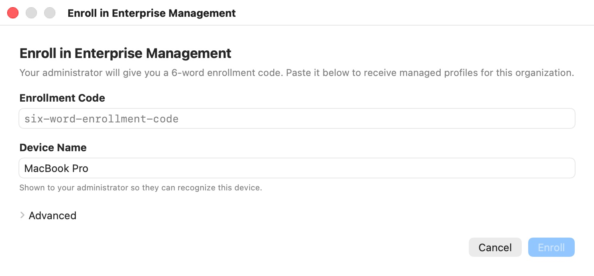

# Enterprise

Organizations can deliver ready-made Bromure profiles to their people: a profile for the internal web apps with a company client certificate, a recorded profile for sensitive back-office work, a locked-down profile for contractors. The administrator defines these **managed profiles** on a Bromure control plane (bromure.io, or the organization's own server); each Mac that is **enrolled** receives the ones assigned to its user and keeps them up to date.

This chapter is for users who have been given an enrollment code, and for administrators who want to know what enrollment does on the Mac. If you use Bromure on your own, you can skip it.

## Enrolling this Mac

Your administrator gives you a single-use enrollment code of six words joined by hyphens, such as `acid-aloe-arson-bench-cat-drum`. Codes are issued to a specific user, so the managed profiles you receive are the ones assigned to that user.

### In the Settings window

1. Open **Bromure › Settings…** (⌘,) and select **Managed Profile**.
2. Paste the code in **Enrollment Code**.
3. If your organization runs its own control plane, enter its address in **Server URL (optional)**. Otherwise leave it empty to use `https://bromure.io/api`.
4. Click **Enroll**.

When enrollment succeeds, the pane lists the organization with your account and this device, and the managed profiles appear in your profile list. This form registers the Mac under its macOS computer name. See [Managed Profile](08-app-settings/managed-profile.mdx) for everything the pane shows.

### Enrolling with another organization

A Mac can be enrolled with several organizations at the same time, for example a consultant working for two clients. Once the Mac is enrolled with one, click **Enroll Another…** in **Settings › Managed Profile**. The **Enroll in Enterprise Management** window opens:

<p align="center">
  
</p>

- **Enrollment Code** — the code from the new organization.
- **Device Name** — prefilled with your Mac's name. "Shown to your administrator so they can recognize this device." Change it if your Mac's name isn't meaningful to them.
- **Advanced › Server URL (optional)** — the organization's control-plane address, if it isn't `https://bromure.io/api`.

Click **Enroll** (Return), or **Cancel** (Esc). If enrollment fails, the reason appears in red above the buttons and the window stays open so you can correct the code. Each enrollment is independent: its profiles, certificates and sync status are kept apart from the others.

### From the command line

The same enrollment is available from Terminal, which is useful for scripted provisioning or over SSH. The executable is inside the app bundle:

```bash
/Applications/Bromure.app/Contents/MacOS/bromure enroll acid-aloe-arson-bench-cat-drum \
    --device-name "Alice's MacBook Pro"
```

| Command | What it does |
|---|---|
| `bromure enroll <code> [--server URL] [--device-name NAME]` | Redeems the code. `--server` defaults to `https://bromure.io/api`; `--device-name` defaults to the Mac's name. Prints the managed profiles received, with their version, whether they use mTLS, and their number of assets. |
| `bromure list-enrollments` | Prints one line per enrollment: install ID, `org=`, `user=`, `server=`, `device=`. |
| `bromure unenroll [--install ID] [--org SLUG] [--all]` | Removes one enrollment (by install ID or organization), or all of them with `--all`. With a single enrollment, no option is needed. |

The command-line tool and the app share the same enrollment store; if Bromure is running, it picks up the change at its next sync (or click **Sync Now**). See [Automation](14-automation.mdx#command-line-tool) for the other commands.

## How managed profiles are delivered

Enrollment and sync are designed so that only your organization can define what your managed profiles do, and only this Mac can read them.

- **A device key.** At first enrollment, Bromure creates a key pair for this Mac and sends the server only the public key. The server encrypts each profile's private contents (certificates and other files) to this key, so only this Mac can open them.
- **An install token.** The server returns a token that identifies this enrollment on later syncs. It is stored in your Keychain (service `io.bromure.app.managed-install`), usable only while your Mac is unlocked and never synced to other devices.
- **Signed profiles.** Each profile's definition is signed by the organization. Bromure verifies the signature on every sync and again every time it loads the profile from disk. A profile whose signature doesn't verify, or whose files don't match the sizes and SHA-256 hashes listed in the signed definition, is skipped.

Managed profiles are stored in `~/Library/Application Support/Bromure/managed/`, separately from the profiles you create, and they are never synced to iCloud.

## Using a managed profile

Managed profiles appear with your other profiles, in the profile chip, in **File › New Window With Profile**, and in the link chooser. You can tell them apart:

- The profile chip shows a shield-with-padlock icon instead of the usual person icon.
- The profile's comment reads **Managed by *organization***.
- **File › Edit Profile…** becomes **View “*profile*” Settings…**. The settings window, titled **Managed Profile — *profile***, opens read-only with the banner "This profile is managed by your organization. Settings are read-only." and a single **Close** button.
- **Delete “*profile*”…** is unavailable. A managed profile is removed only when your organization stops assigning it or you unenroll.

Everything else works as for any profile: open windows, use tabs, save files if the profile allows it.

## What administrators control

A managed profile can set any profile setting, from **Retain Browsing Data** and the browser choice to file transfer, network isolation, VPN, proxy and root certificates, exactly as described in [Profile Settings](07-profile-settings/index.mdx). On top of that, a managed profile can use four features that only an organization can turn on.

### Client certificates (mTLS)

When a managed profile uses mutual TLS, Bromure obtains a client certificate for it from the organization: it generates an RSA 2048-bit key on this Mac, sends a certificate signing request, and stores the signed certificate and the organization's CA in the profile's folder. The private key stays in your Keychain (service `io.bromure.app.managed-mtls`), usable only while your Mac is unlocked. Each window of the profile receives the certificate, key and CA when it starts, so the browser presents the certificate to your organization's sites.

Certificates are short-lived by design. At every sync, Bromure checks whether the certificate expires within the next hour and, if so, requests a new one. A renewed certificate is pushed into the windows already open for that profile, so they keep working without a restart.

### Enforced session recording

If the administrator sets a recording level on a managed profile, every window of that profile records its web traffic and sends it to the organization, over the profile's client certificate, to `analytics.bromure.io`. In such a window:

- A red banner at the left of the title bar reads **Recording — shared with *organization***. Its tooltip explains: "Every request in this window is recorded and sent to your organization's infosec team. This is required by your administrator and cannot be turned off."
- Recording starts with the window. The record button is disabled, with the tooltip "Recording is enforced by your organization (*organization*)."
- The recording is kept in memory only, never written to your Mac's disk, and there is no **View trace** button or save prompt when the window closes.

The level decides what is sent: request URLs and timings only, or also headers, or also request and response bodies. See [Session Recording](11-session-recording.mdx) for what each level captures.

### Corporate websites

An administrator can list the organization's websites for a managed profile. Subdomains are included (listing `example.com` also covers `intranet.example.com`), and `bromure.io` is always allowed. The profile then treats every other site in one of two ways:

- **Open outside sites elsewhere.** Navigating to a site that isn't on the list shows the page **Opening this site in a private Bromure session** ("This URL isn't on your company's approved list for this managed session.") and hands the link to your Mac, where Bromure asks you where to open it, in one of your own profiles or another browser. The managed window stays on company sites only.
- **Warn on outside sites.** When the profile also records, sites that aren't on the list show an amber banner at the top of the page: "This site is not on your company's approved list. Activity in this session is being recorded by your administrator."

### Chrome Enterprise

A profile that runs Google Chrome can be enrolled in Google's Chrome browser management with an enrollment token from the Google Admin console. The token is a regular profile setting (**Google Workspace Management** in [Enterprise](07-profile-settings/enterprise.mdx)), so an administrator can set it in a managed profile or a user can set it in their own. Chrome then applies the policies your Google administrator defined.

## Sync

Bromure syncs every enrollment:

- when it starts,
- every 15 minutes while it runs,
- whenever it becomes the active app,
- and when you click **Sync Now** in **Settings › Managed Profile**.

A sync brings in new profiles, updates changed ones, and removes profiles that are no longer assigned to you, together with their certificates. A window that is already open keeps the settings it started with; changes apply to windows opened afterwards (a renewed certificate is the exception, see above). If a sync fails, for example because the Mac is offline or the server is unreachable, the pane shows **Sync failed: *reason***. Click **Sync Now** once the connection is back.

## Unenrolling

To leave an organization, open **Settings › Managed Profile**, click **Unenroll…** on its card, and confirm with **Unenroll**. From Terminal, use `bromure unenroll` (with `--org` or `--install` when there are several enrollments, or `--all`).

Unenrolling removes, from this Mac, that organization's enrollment record, install token, managed profiles, and client certificates and keys. Profiles you created yourself, and enrollments with other organizations, are not affected. `bromure unenroll --all` also deletes the device key, so a later enrollment starts with a new one.

> **Note:** Unenrolling is done on your Mac. To revoke the device on the organization's side as well, ask your administrator to remove it from the control plane.

## Where enrollment data is stored

| Item | Location |
|---|---|
| Enrollment records | `~/Library/Application Support/Bromure/managed/installs/install-<id>.json` |
| Managed profiles | `~/Library/Application Support/Bromure/managed/profiles/<profile-id>/` (`profile.json`, `manifest.json`, `assets/`, and `mtls/cert.pem` and `mtls/ca.pem` when the profile uses mTLS) |
| Device key and install tokens | Keychain, service `io.bromure.app.managed-install` |
| Client-certificate private keys | Keychain, service `io.bromure.app.managed-mtls` |

The control-plane address can also be preset for a fleet with the `managed.serverURL` preference (in the `io.bromure.app` domain); it then becomes the default for enrollments that don't specify a server.

## Related chapters

- [Managed Profile](08-app-settings/managed-profile.mdx) — the Settings pane.
- [Session Recording](11-session-recording.mdx) — recording levels and the recording window.
- [Enterprise](07-profile-settings/enterprise.mdx) — the per-profile proxy, root certificates, and Chrome Enterprise token.
- [Privacy & Security](12-privacy-security.mdx) — what leaves your Mac.
