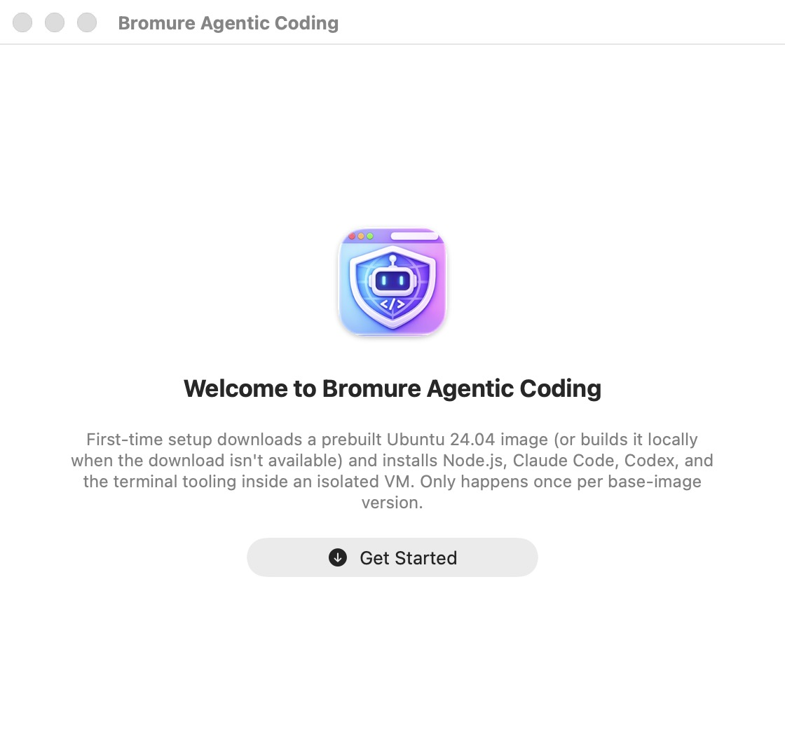

# Installation

This chapter takes you from an empty Mac to a fully installed copy of Bromure Agentic Coding: what the app needs from your machine, how to download and install a release, what happens the first time you launch it, how the Linux [base image](18-glossary.mdx) is downloaded, verified, and kept up to date, and how to remove everything cleanly. Once installation is complete, continue with the [quick start](03-quick-start.mdx) to create your first workspace.

## System requirements

| Requirement | Minimum |
|---|---|
| Mac | Apple Silicon (M1 or newer) |
| macOS | macOS 14 (Sonoma) or later |
| Free disk space | At least 8 GB to run first-time setup; plan for roughly 6–8 GB for the installed base image, plus per-workspace disks |
| Network | Internet access for the base-image download (an offline local-build fallback exists; see below) |

There is no Intel build and there will not be one: the app runs its Linux VMs on Apple's Virtualization.framework, which only supports ARM64 guests on Apple Silicon hosts.

Two disk-space safeguards are built in:

- Every image install first checks that at least 8 GB is free on the volume holding the app's support directory, and fails fast with a clear message otherwise.
- During a local image build, a monitor aborts the build with an explicit disk-full error if free space drops below 1 GB, instead of letting the installer time out mysteriously.

If you plan to use the optional embedded web browser inside workspaces, budget additional space for its separate Alpine/Chromium image (about 500 MB compressed to download); that install is covered in [Settings → Browser](07-settings/browser.mdx).

## Installing the release build

Release builds are published as a signed, notarized disk image (`BromureAgenticCoding.dmg`) at [bromure.io](https://bromure.io).

1. Download the DMG from the bromure.io downloads page.
2. Open the DMG. The window shows the app icon and an arrow pointing at an **Applications** symlink.
3. Drag **Bromure Agentic Coding** onto the **Applications** symlink.
4. Eject the DMG and launch the app from `/Applications`.

Because the published DMG is notarized and stapled, Gatekeeper opens it without warnings. If you obtained a DMG from somewhere other than bromure.io and Gatekeeper complains, treat that as a red flag rather than something to bypass.

## First launch

### The Welcome window

The app cannot run agent workspaces until a Linux base image exists on your Mac. When you launch it for the first time (no base image yet), it opens a welcome window instead of the workspace browser:

<p align="center">
  
</p>

The window — titled **Bromure Agentic Coding** — shows the app icon, the heading **Welcome to Bromure Agentic Coding**, a short explanation ("First-time setup downloads a prebuilt Ubuntu 24.04 image (or builds it locally when the download isn't available) and installs Node.js, Claude Code, Codex, and the terminal tooling inside an isolated VM. Only happens once per base-image version."), and a prominent **Get Started** button.

Click **Get Started** (or press Return — it is the default button) to begin. This runs exactly the same installation as the `bromure-cli init` CLI command.

> **Note:** The welcome text names Node.js, Claude Code, and Codex as examples. In full, Node.js and the free tooling are already baked into the prebuilt image, and setup additionally installs Grok CLI and the Google Cloud SDK — see [What first-time setup does](#what-first-time-setup-does) below.

The welcome window is skipped when the app is launched purely as a remote-mirroring client (see [Remote access](14-remote-access.mdx)) or as the windowless [headless agent](18-glossary.mdx), since neither needs a local base image.

### The setup progress window

After **Get Started**, the window switches to a progress screen titled **Bromure Agentic Coding — Setup**, headed "Building base image" / "This is the one-time install. Don't close the window." It shows:

- A status pill naming the current step — for the download path: "Fetching image catalog…", "Downloading Ubuntu 24.04 image (… GB)…", "Verifying checksum…", "Expanding image…", "Installing recommended packages (N step(s), ~2-5 min)…", and finally "Base image ready at … (vNNN)".
- A single determinate progress bar with a numeric percentage. On the download path the bar is phase-weighted: the image download fills 0–60%, expansion 60–80%, and the postinstall steps the remainder.
- A collapsed-by-default **Console output** disclosure that streams the raw installer log (the serial console of the helper VM). The text is selectable, and a copy icon button copies the whole log to the clipboard. Only the last 100 lines are kept on screen.

If anything fails, the status pill is replaced by a red error line and a **Close** button appears.

Attempting to close the window mid-install raises a warning — **Cancel base-image rebuild?** ("The image will be left in an incomplete state. You'll need to re-run the rebuild before launching new sessions.") — with **Cancel rebuild** and **Keep building** buttons. If you cancel and a previous working image exists, the app returns to the normal main window; otherwise it returns to the welcome screen.

> **Note:** While an image install or amendment is running, the optional SSH remote-access front door is paused and resumed automatically afterwards (see [Remote access](14-remote-access.mdx)).

### The `bromure-cli` prompt

On the first GUI launch from an installed app bundle, the app offers to install its command-line entry point: **Install the “bromure-cli” command-line tool?** — "This creates a symlink at /usr/local/bin/bromure-cli so you can drive Bromure from the terminal (vm, exec, trace, …). It needs your admin password once."

- **Install** creates the symlink at `/usr/local/bin/bromure-cli` via a one-time admin-password prompt (no privileged helper is installed).
- **Not Now** defers; you are asked again on the next launch.
- **Don’t Ask Again** suppresses the prompt permanently (stored in the `cliSymlinkDeclined` UserDefaults key).

When the binary is invoked through the `bromure-cli` name, image-management commands (`init`, `info`, `reset`, and the publisher-side verbs), the GUI default, and the MCP server are hidden; running `bromure-cli` bare prints help. The full command reference is in [Automation & CLI](16-automation-cli.mdx). The prompt is skipped for headless-agent, development (`swift run`), and remote-mirroring launches.

## What first-time setup does

First-time setup produces the base image: a 24 GB [sparse disk](18-glossary.mdx) containing Ubuntu 24.04 ("noble") with EFI/GRUB boot, from which every workspace VM is cloned. Two paths produce it; the download is preferred and the local build is the fallback. Both write to `.partial` files and promote the results atomically, so an interrupted install never leaves a half-written image in place of a working one.

### The prebuilt image download

The preferred path downloads a prebuilt image published weekly to `https://dl.bromure.io`:

1. **Catalog fetch.** The app fetches the signed [image catalog](18-glossary.mdx) at `https://dl.bromure.io/images/img-catalog.json`, which names the current image (UUID, version, SHA-256, sizes) and lists the postinstall steps. The catalog carries an ed25519 signature made with the same key that signs app updates (the Sparkle `SUPublicEDKey`); the signature covers the image identity, its checksum, and every postinstall command. Unsigned or invalid catalogs are refused, and a catalog signed earlier than one the app has already adopted is never accepted (rollback protection).
2. **Download.** The gzipped image (about 3 GB compressed) is downloaded and its SHA-256 verified. Failed downloads retry up to 3 times, re-fetching the catalog between attempts — this closes the race with the weekly publish deleting the previous build mid-download.
3. **Expansion.** The image is expanded sparse into `base.img.partial`: 24 GB logical, but only about 6–8 GB of physical disk space.
4. **Postinstall.** The app boots a small [Alpine netboot installer](18-glossary.mdx) helper VM which runs the catalog's postinstall steps as root in a chroot on the image (see the next section).
5. **Promotion.** A fresh EFI variable store is created, and `base.img`, `efivars.bin`, `base.version`, and `image-state.json` are promoted atomically.

### Postinstall steps: the recommended packages

The published image must be legally redistributable, so it contains strictly free software (Node.js, docker, kitty, gh, glab, kubectl, doctl, awscli, azure-cli, and more are baked in). Everything non-free is declared as signed [postinstall steps](18-glossary.mdx) in the catalog and installed on *your* machine, into *your* copy of the image. The baseline steps at version 4.3.0 are:

| Seq | Step | Publisher | How it installs |
|---|---|---|---|
| 10 | Claude Code | Anthropic | npm, wrapped in the Socket.dev supply-chain scanner (`npx --yes @socketsecurity/cli npm install -g --silent @anthropic-ai/claude-code`) |
| 20 | Codex CLI | OpenAI | npm, Socket.dev-wrapped |
| 30 | Grok CLI | x.ai | Vendor install script |
| 40 | Google Cloud SDK | Google | `gcloud`, `gsutil`, `bq` |

Consent works as follows: on a new installation, all baseline steps run without an extra prompt — starting setup from the welcome screen (or typing `bromure-cli init`) *is* the consent. Steps published later require explicit approval through the **New recommended packages** prompt described under [Base-image updates and versioning](#base-image-updates-and-versioning). Because the catalog signature covers every step's command text, a compromised CDN cannot alter what runs as root in your image.

### The local build fallback

If the download fails for a download-side reason — offline, CDN outage, checksum or expansion failure — the app shows an **Image download failed** alert with **Build Locally** and **Cancel** buttons. It never falls back silently. (The `bromure-cli init` CLI command, by contrast, falls back automatically without prompting.)

The local build produces the same image on your own Mac:

1. Downloads the Alpine 3.22 netboot kernel and initramfs (about 25 MB, cached in the support directory).
2. Allocates a fresh 24 GB sparse disk.
3. Boots a one-shot Alpine installer VM (4 vCPUs, 4 GB RAM), driven over its serial console, which debootstraps Ubuntu noble, installs the free tooling and GRUB.
4. Applies the same catalog postinstall steps as the download path.

Progress messages include "Downloading Alpine netboot installer…", "Allocating 24GB sparse disk…", "Booting Alpine installer (this drives the Ubuntu install)…", and "Running setup.sh…". The progress bar on this path is driven by installer log lines and caps at 97% until the final "Base image ready" jump.

The local build includes VPN-resilience machinery: all guest package fetches route through an in-process host-side proxy, the installer clamps the VM NIC's MTU before any download, DHCP gets a second chance, a no-network condition aborts early, and a guest kernel panic triggers one automatic clean retry. Two related escape hatches:

- If the installer VM gets no DHCP lease, the build fails with a **Network Issue During Base-Image Build** alert offering **Repair and Retry** (restarts macOS networking daemons; asks for your admin password) or **Cancel**.
- On VPNs that blackhole large transfers (for example WireGuard at MTU 1420), you can pin the installer VM's MTU: `defaults write io.bromure.agentic-coding vm.mtu -int 1400`.

You can also choose the local build explicitly at any time — **Rebuild Base Image…** → **Rebuild Locally** in the app menu, or `bromure-cli init --build-local`.

### Network endpoints used during setup

For firewall and proxy administrators, installation talks to:

| Endpoint | Purpose |
|---|---|
| `https://dl.bromure.io` | Image catalog (`images/img-catalog.json`) and image downloads |
| `https://dl-cdn.alpinelinux.org` | Alpine 3.22 netboot files (local build and postinstall helper VM) |
| Package mirrors and vendor endpoints | Ubuntu packages, npm registry, Socket.dev, vendor install scripts, fetched by the installer through the app's host-side proxy |
| `https://bromure.io/api/v1/release-agentic-coding` | Sparkle appcast for app updates (not part of image setup) |

Installation itself opens no listening TCP ports; the host-side package proxy used during builds binds an ephemeral localhost-only port per build.

## Setup time and disk usage

| Path | Typical duration | Notes |
|---|---|---|
| Prebuilt download | Transfer time for ~3 GB, plus expansion, plus ~2–5 minutes of postinstall | Dominated by your connection speed |
| Local build | About 10 minutes | Install-marker timeout 30 minutes; hard timeout 45 minutes; postinstall-only runs 20/30 minutes |

Disk usage:

- **To start:** at least 8 GB free on the volume holding `~/Library/Application Support/BromureAC/`.
- **After install:** the base image occupies roughly 6–8 GB physically (24 GB logical — sparse blocks only cost space once written).
- **Per workspace:** each workspace's disk starts as an APFS copy-on-write clone of the base image, so it is nearly free initially and grows only as the workspace writes data.

Setup happens once per base-image version — subsequent launches go straight to the workspace browser.

## Where everything is stored

Everything the app writes lives under your user account; nothing is installed system-wide except the optional `bromure-cli` symlink.

| Path | Contents |
|---|---|
| `~/Library/Application Support/BromureAC/` | The app's support directory: base image, catalogs, workspaces, per-install CA |
| `~/Library/Application Support/BromureAC/base.img` | The Ubuntu base image (24 GB logical, ~6–8 GB physical) |
| `~/Library/Application Support/BromureAC/efivars.bin` | EFI variable store for the base image |
| `~/Library/Application Support/BromureAC/base.version` | Installed image [version stamp](18-glossary.mdx) (e.g. `200`, `200.1`) |
| `~/Library/Application Support/BromureAC/image-state.json` | Image provenance and applied postinstall step UUIDs |
| `~/Library/Application Support/BromureAC/img-catalog.json` | Cached copy of the downloaded image catalog |
| `~/Library/Application Support/BromureAC/profiles/` | One directory per workspace: `profile.json`, `disk.img` (the workspace's copy-on-write clone of the base image), `home.img`, SSH keys |
| `~/Library/Application Support/BromureAC/alpine-vmlinuz`, `alpine-initramfs`, `alpine-initramfs-shimmed` | Cached Alpine netboot installer files |
| `~/Library/Application Support/BromureAC/browser/` | The app's own copy of the embedded browser image, if installed (`~/Library/Application Support/Bromure/` — the sibling browser app's directory — is reused when present) |
| `~/Library/Application Support/BromureAC/base.img.partial`, `base.img.gz.partial`, `efivars.partial` | Transient install files; their presence means an install is running or was interrupted |
| `~/Library/LaunchAgents/io.bromure.agentic-coding.boot.plist` | Boot-at-login LaunchAgent, written automatically when any workspace enables boot at startup (see [Workspaces](05-workspaces.mdx)) |
| `/usr/local/bin/bromure-cli` | Optional CLI symlink |
| UserDefaults domain `io.bromure.agentic-coding` | App settings |

Two items live elsewhere by necessity:

- The credential master key is stored in the macOS Data Protection Keychain (marked *this device only* — it never leaves the Mac), not in the support directory. Secrets on disk are AES-256-GCM ciphertext; see [Credentials](08-credentials.mdx).
- The app bundle embeds a privileged launchd daemon plist (`io.bromure.fatclient-tunnel`) used by the remote-mirroring network helper. It is registered on demand, and the first registration surfaces an approval toggle under System Settings › General › Login Items; see [Remote access](14-remote-access.mdx).

The `bromure-cli info` command prints the installed image's version stamp, its logical and physical sizes, and its path at any time.

## Base-image updates and versioning

### Version stamps and dot-revisions

The installed image records its version in `base.version`. The *major* part comes from the version constant bundled in the app (`200` at version 4.3.0); any rebuild, re-download, or amendment at the same major appends a [dot-revision](18-glossary.mdx) (`200` → `200.1` → `200.2`). The sidecar `image-state.json` records where the image came from and which postinstall step UUIDs have been applied.

Two comparisons use these stamps:

- The app-level update check compares majors only, so you are prompted only for deliberate image releases.
- Per-workspace *drift detection* compares the full stamp recorded when a workspace was cloned against the current one; any change (including a dot-revision) makes the workspace offer a reset onto the new base. An image update never touches existing workspace disks by itself — drift resets are always your call (see [Workspaces](05-workspaces.mdx)).

Prebuilt images are republished weekly with fresh Ubuntu packages, but weekly republishes do **not** bump the version — only a deliberate version bump in an app release triggers an update prompt, so you are not nagged every week. A stale CDN catalog can never offer a downgrade: only strictly newer versions count.

### The update prompt

When a newer major image version is available — either because an app update bundles one or because the catalog publishes one — launch shows a non-blocking alert, **Base image update available**: "Your base image is at version X but version Y is available. The current image still works — updating downloads the new prebuilt image (a few GB; local rebuild as fallback) and re-applies the recommended packages."

- **Update Now** starts the download-first reinstall in the setup window.
- **Later** dismisses it for this launch; you are asked again next launch. The existing image keeps working either way.

### New recommended packages

When the catalog gains postinstall steps that are not yet recorded as applied in `image-state.json`, launch shows a consent alert, **New recommended packages**, listing the new steps: "New packages are recommended to be installed: … Bromure installs them into the base image (a few minutes, in the background VM). Existing workspaces keep running; each one's drift prompt will offer a reset to pick them up."

- **Install** applies the steps to an APFS copy-on-write clone of `base.img` and swaps the amended image in atomically — existing workspaces keep running throughout. The version stamp gets a dot-revision bump (e.g. `200` → `200.1`). Progress appears in the setup window, titled "Installing recommended packages" / "The base image is being amended. Existing workspaces keep working."
- **Later** defers; you are asked again next launch.

Nothing ever executes without this consent — postinstall steps run as root inside the base image. Installations that predate `image-state.json` are migrated on launch: all bundled baseline steps are marked as already applied.

### Manual rebuild

To force a reinstall at any time, choose **Rebuild Base Image…** from the application menu (below **Remote Access…**). It asks **Update the base image?** — "Downloads the latest prebuilt image (or re-runs the full local installer, ~5–10 min) and re-applies the recommended packages. Existing workspaces' disks aren't touched — on next launch each one's drift prompt will offer to reset to the new base." — with **Download Prebuilt**, **Rebuild Locally**, and **Cancel**.

The old image stays live until the new one is fully built (thanks to the `.partial` files and atomic swap), so sessions can still launch during the rebuild. The CLI equivalent is `bromure-cli init` (download-first) or `bromure-cli init --build-local`.

## Keeping the app up to date

The app updates itself with Sparkle: it checks `https://bromure.io/api/v1/release-agentic-coding` automatically once a day, and updates are verified against the same pinned public key that signs the image catalogs. A manual **Check for Updates…** item sits in the application menu, right under **About**. (The item is absent in development builds, where the updater is not initialized.)

App updates and base-image updates are independent: updating the app only prompts for an image update when the new app version deliberately bumps the bundled image version.

## Moving to a new Mac

There is no built-in migration assistant. The recommended path is a fresh install plus a selective copy of your workspace data:

1. On the new Mac, install the app and complete first-time setup (re-downloading the base image is faster and cleaner than copying it — `base.img` and `efivars.bin` are per-machine artifacts the app recreates for free).
2. Quit the app on both Macs.
3. Copy `~/Library/Application Support/BromureAC/profiles/` from the old Mac to the same location on the new one. Each subdirectory is one workspace: its definition (`profile.json`), its VM disk (`disk.img` — your cloned repos, caches, and shell history), its home volume, and its SSH keys.
4. Launch the app on the new Mac. Your workspaces appear in the workspace browser. If a workspace was cloned from a different base-image revision than the one now installed, its drift prompt offers a reset — decline it to keep the workspace's current disk (see [Workspaces](05-workspaces.mdx)).

Three things intentionally do not transfer:

- **Credentials.** The master key that encrypts stored secrets lives in the Mac's Data Protection Keychain and is marked *this device only*. Encrypted secret blobs from the old Mac are unreadable on the new one; the non-sensitive metadata in each `profile.json` survives, so re-entering your API keys and tokens in the credentials pane is all that is needed (see [Credentials](08-credentials.mdx)).
- **Enterprise enrollment.** The install identity (mTLS leaf certificate) is per-install and stored device-only; re-enroll the new Mac (see [Enterprise](15-enterprise.mdx)).
- **App settings** in the `io.bromure.agentic-coding` defaults domain, unless you migrate them yourself.

> **Tip:** Workspace `disk.img` files are sparse, and their copy-on-write savings do not survive a network copy — a workspace that costs a few GB on the old Mac can materialize at its full written size in transit. Use a sparse-aware copy (for example `rsync -aS`) and check free space on the destination first.

Apple's Migration Assistant copies the whole support directory as ordinary files; that works, but you still land in the credential and enrollment situations above, and the copied base image loses its copy-on-write relationship with the workspace disks (costing extra physical space until you rebuild).

## Uninstalling completely

To reset only the base image while keeping the app and your workspaces, run `bromure-cli reset` (add `--yes` to skip the confirmation). It deletes `base.img`, `efivars.bin`, `base.version`, and `image-state.json`, so the next launch starts setup from scratch. It never touches workspaces, and it leaves the cached Alpine netboot files and cached catalog in place.

There is no bundled uninstaller. Complete removal is manual:

1. Quit the app (and any headless agent: check with `pgrep -fl bromure-cli`).
2. Drag **Bromure Agentic Coding** from `/Applications` to the Trash.
3. Delete the support directory — base image, all workspaces and their disks, caches, and the per-install CA:

   ```bash
   rm -rf ~/Library/Application\ Support/BromureAC
   ```

4. Delete the boot-at-login LaunchAgent, if present:

   ```bash
   rm -f ~/Library/LaunchAgents/io.bromure.agentic-coding.boot.plist
   ```

5. Remove the app's entries under System Settings › General › Login Items & Extensions (the remote-mirroring tunnel daemon's approval toggle, if you ever enabled it).
6. Remove the CLI symlink, if you installed it:

   ```bash
   sudo rm -f /usr/local/bin/bromure-cli
   ```

7. Optionally clear the app's settings:

   ```bash
   defaults delete io.bromure.agentic-coding
   ```

> **Warning:** Step 3 permanently deletes every workspace's disk — cloned repositories, uncommitted work, package caches, shell history. Push or export anything you care about first.

The credential master key in the Keychain becomes orphaned once its ciphertext is gone; it is harmless, but you can remove it with Keychain Access by searching for `io.bromure.agentic-coding.master-key`.
