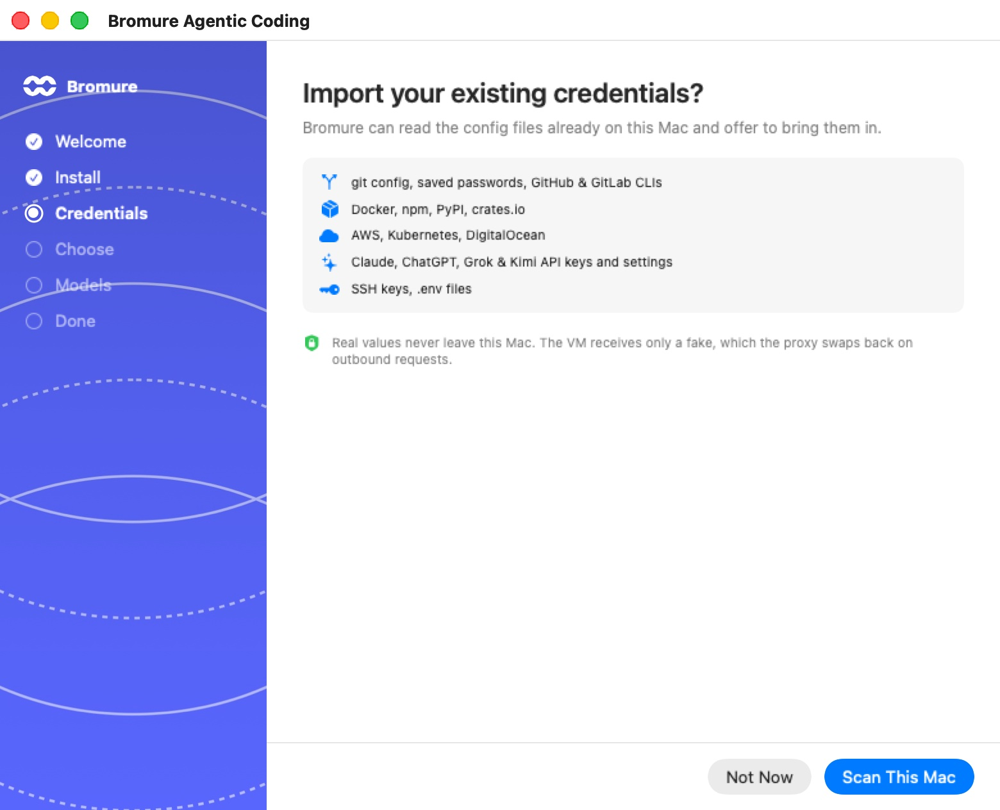
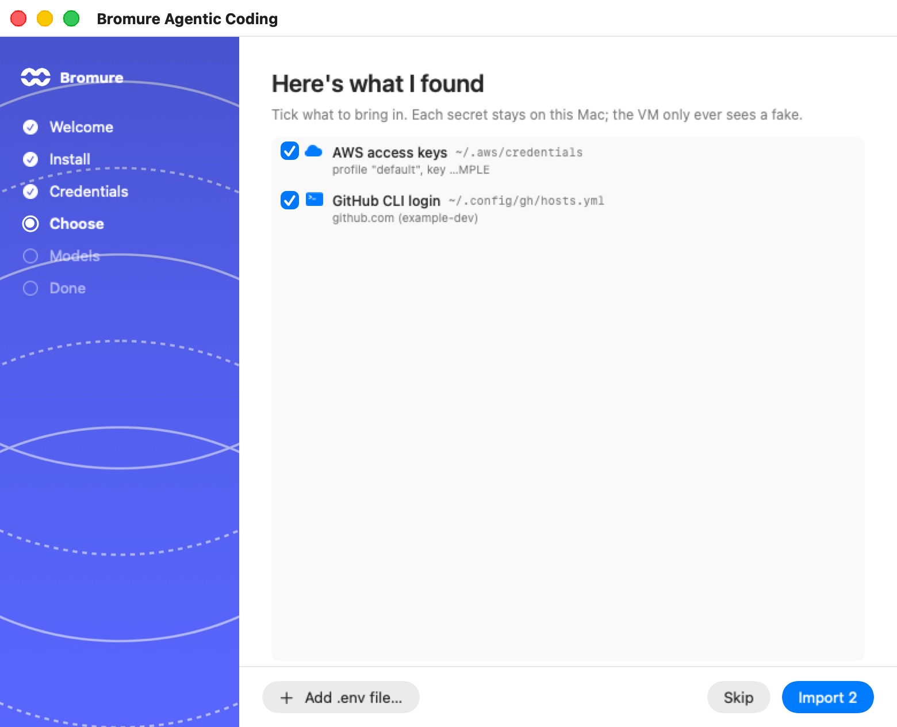
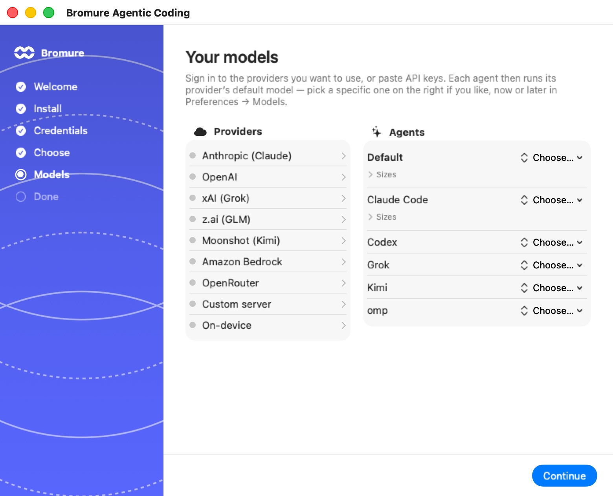
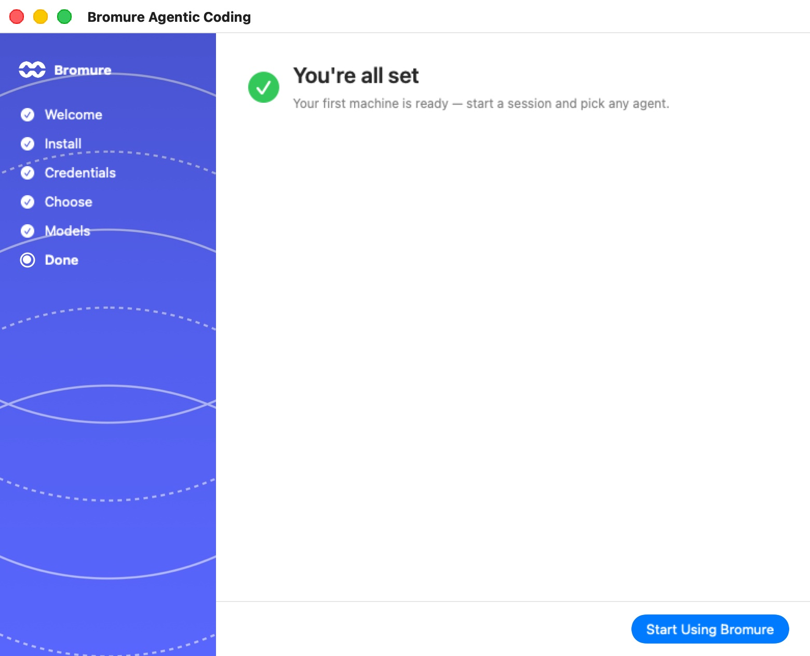

# Installation & First Run

This chapter takes you from an empty Mac to a working copy of Bromure Agentic Coding: what the app needs, how to install it, what the onboarding wizard does the first time you launch it, how the Linux [base image](18-glossary.mdx) is downloaded, checked, and kept up to date, where the app keeps its files, and how to remove everything cleanly. When you're done here, continue with the [Quick Start](03-quick-start.mdx).

## System requirements

| Requirement | Minimum |
|---|---|
| Mac | Apple Silicon (M1 or newer) |
| macOS | macOS 14 (Sonoma) or later |
| Free disk space | At least 8 GB to run first-time setup; plan for roughly 6–8 GB for the installed base image, plus the space each machine uses |
| Network | Internet access for the base-image download (a local build is available as a fallback; see below) |

There is no Intel build, and there won't be one: the app runs its Linux VMs on Apple's Virtualization.framework, which only supports ARM64 guests on Apple Silicon.

Two disk-space safeguards are built in:

- Every image install first checks that at least 8 GB is free on the volume holding the app's support folder, and stops with a clear message if not.
- During a local image build, a monitor stops the build with an explicit disk-full error if free space drops below 1 GB, rather than letting it time out.

The optional embedded browser that opens beside a session uses its own Ubuntu + Chromium image, downloaded separately the first time you install it; see [Settings › Browser](07-settings/browser.mdx).

## Installing the app

Release builds are published as a signed, notarized disk image (`BromureAgenticCoding.dmg`) at [bromure.io](https://bromure.io).

1. Download the DMG from the bromure.io downloads page.
2. Open the DMG. The window shows the app icon and an arrow pointing at an **Applications** shortcut.
3. Drag **Bromure Agentic Coding** onto **Applications**.
4. Eject the DMG and open the app from `/Applications`.

Because the published DMG is notarized, Gatekeeper opens it without warnings. If you got a DMG from somewhere other than bromure.io and Gatekeeper complains, treat that as a red flag, not something to work around.

## First run: the onboarding wizard

The first time you open the app, a setup window titled **Bromure Agentic Coding** opens instead of the main window. It is a six-step wizard: a column on the left lists the steps and marks the ones you've finished, the current step fills the right side, and the buttons for that step sit along the bottom.

The wizard opens whenever the app has no base image yet, or has a base image but no machine (for example after a reinstall, or when the image was built from the command line). If the base image is already there, the **Install** step is left out of the list. The wizard doesn't open when the app is launched only to mirror a remote Mac (see [Remote Access & Clients](14-remote-access.mdx)) or as the windowless headless agent.

The steps are **Welcome**, **Install**, **Credentials**, **Choose**, **Models**, and **Done**.

### 1. Welcome

<p align="center">
  
</p>

The first step reads **Welcome to Bromure** — "Let's get started." A short paragraph explains that Bromure runs your coding agents inside disposable Linux VMs, and that the wizard will install the base image and then offer to bring over the credentials you already have on this Mac.

Click **Get Started** (or press Return) to begin the install. If a base image is already present, the button reads **Continue** and takes you straight to the Credentials step.

### 2. Install

The Install step runs the base-image install inside the wizard. It is headed **Setting up the base image** — "Downloading the image and applying patches. This is the one-time install — don't close the window." It shows:

- A status line naming the current stage. On the normal download path you'll see "Fetching image catalog…", then lines such as "Downloading … (… GB)…", "Verifying … checksum…", and "Expanding …", then "Customizing the image: …" while the recommended packages are installed (see [What first-time setup does](#what-first-time-setup-does)), and finally "Base image ready at … (v201)".
- A progress bar with a percentage.
- A collapsed **Console output** section that shows the installer's raw log. The text can be selected, and **Copy** copies the whole log. Only the last 100 lines are kept on screen.

If something fails, the status line turns into a red error and a **Close** button appears.

If you try to close the window while the install is running, the app asks **Cancel base-image rebuild?** — "The image will be left in an incomplete state. You'll need to re-run the rebuild before launching new sessions." — with **Cancel rebuild** and **Keep building**.

When the install finishes, the wizard moves on to the Credentials step by itself.

> **Note:** While an image install is running, the optional SSH remote-access server is paused and restarted afterwards (see [Remote Access & Clients](14-remote-access.mdx)).

### 3. Credentials

<p align="center">
  
</p>

The wizard offers to look for the credentials and config files you already use: **Import your existing credentials?** — "Bromure can read the config files already on this Mac and offer to bring them in." A box lists what it reads:

- git config, saved passwords, GitHub & GitLab CLIs
- Docker, npm, PyPI, crates.io
- AWS, Kubernetes, DigitalOcean
- Claude, ChatGPT, Grok & Kimi API keys and settings
- SSH keys, .env files

A note underneath repeats the rule that makes this safe: "Real values never leave this Mac. The VM receives only a fake, which the proxy swaps back on outbound requests."

- **Scan This Mac** reads those files and moves to the Choose step. Nothing is imported until you confirm there.
- **Not Now** skips the scan and imports nothing. You go straight to the Models step.

### 4. Choose

<p align="center">
  
</p>

**Here's what I found** lists every file the scan found, one row each, with a checkbox, the file's path, and a short description of what it holds (for example, a git identity and the number of embedded tokens). "Tick what to bring in. Each secret stays on this Mac; the VM only ever sees a fake." If nothing was found, the list reads "No config files found."

Besides credential files, the list can include a row per agent for its own settings folder — for example your Claude Code slash commands, subagents, and memory files. Those are copied into the machine as they are; they hold no secrets.

- **Add .env file…** lets you pick a `.env` file by hand. Its variables are added to the list.
- **Import** *n* (it reads **Continue** when nothing is ticked) imports the ticked rows and moves on.
- **Skip** imports nothing and moves on.

What you import becomes the starting point for your first machine and for every machine you create later: git identity and config, registry, cloud, and git credentials go into the settings every new machine starts from. SSH keys are the exception — they are copied into the first machine only. Agent API keys found in your agents' settings are added to the global model settings, so every machine can run that agent.

> **Note:** The scan does not copy the sign-ins your agent CLIs hold on this Mac (for example Claude Code's own login). Those logins renew themselves, and sharing one with Bromure would sign one side out every time the other renewed it. Sign in again from Bromure in the next step instead; that creates a separate sign-in of its own.

### 5. Models

<p align="center">
  
</p>

This step appears only on the first run. **Your models** — "Sign in to the providers you want to use, or paste API keys. Each agent then runs its provider’s default model — pick a specific one on the right if you like, now or later in Preferences → Models." Below is the same Models board as in **Preferences › Models**, with a **Providers** column on the left and an **Agents** column on the right. Anything the scan imported already shows up as configured.

For a subscription (Claude, ChatGPT, Grok, or Kimi), choose the provider's sign-in. The sign-in happens on your Mac, in a hidden temporary machine; you never see a terminal. A card above the board follows it:

- "Setting up a private sign-in machine…", then progress lines such as "Finish signing in in your browser…".
- When the provider's sign-in doesn't open your browser by itself, the card shows an **Open sign-in page** button and, for device-code sign-ins, **Your code:** followed by the code to enter.
- On success the card reads **Signed in to** *provider* — "Your account stays on this Mac; every machine can use it." Click **OK** to dismiss it.
- **Cancel** stops the sign-in and removes the temporary machine.

Only one sign-in runs at a time: the board and the **Continue** button are disabled until the current sign-in finishes or is cancelled. For providers that use API keys, paste the key into the provider's entry instead. [Models & Providers](13-models.mdx) explains every provider and option on this board.

You don't have to set anything up here. Click **Continue** to move on; an agent with nothing configured offers to sign in the first time you start it.

### 6. Done

<p align="center">
  
</p>

**You're all set** confirms the setup. If you imported files, a summary of what came in appears underneath; otherwise the step reads "Your first machine is ready — start a session and pick any agent."

Click **Start Using Bromure**. The wizard closes and:

- If you have no machine yet, the app creates one named **Default workspace**, from the settings the wizard just gathered. Its default agent is the first one you can actually start: Claude Code, then Codex, Grok, Kimi Code, and Oh My Pi, in that order; if none is set up, it stays Claude Code, which offers to sign in when it starts.
- The main window opens on the new-session screen, ready for your first session. The [Quick Start](03-quick-start.mdx) picks up from here.

From then on, the app opens straight to the main window.

> **Tip:** The credential part of the wizard is also available later. Hold Option while clicking the **+** beside **Virtual Machines** in the sidebar to create a new machine with the wizard: it starts at the Credentials step, skips the Models step, and opens the new machine's settings when you finish. The app menu item **New Workspace from My Configs…** (⇧⌥⌘N) does the same.

## What first-time setup does

The Install step produces the base image: a 24 GB [sparse disk](18-glossary.mdx) holding Ubuntu 24.04 ("noble") with EFI/GRUB boot, from which every machine is cloned. There are two ways to produce it; the download is preferred and the local build is the fallback. Both write to temporary `.partial` files and swap the result into place in one step, so an interrupted install never leaves a half-written image in place of a working one.

### The prebuilt image download

The preferred path downloads a prebuilt image published weekly to `https://dl.bromure.io`:

1. **Catalog.** The app fetches the signed [image catalog](18-glossary.mdx) for its image version, at `https://dl.bromure.io/images/201/img-catalog.json`. The catalog names the current image (ID, version, SHA-256, sizes) and lists the setup steps. It carries an ed25519 signature made with the same key that signs app updates; the signature covers the image's identity, its checksum, and every setup command. Unsigned or invalid catalogs are refused, and a catalog signed earlier than one the app has already accepted is never used (rollback protection).
2. **Download.** The compressed image is downloaded and its SHA-256 checked. A failed download is retried up to 3 times, fetching the catalog again between attempts.
3. **Expansion.** The image is expanded into `base.img.partial`: 24 GB in size, but only about 6–8 GB of real disk space.
4. **Customizing the image.** The app downloads a small set of image tools published with the image and starts them in a temporary helper VM, which runs the catalog's setup steps inside the image (see the next section). Progress reads "Customizing the image: waiting for the prompt…", "…: installing packages…", and so on.
5. **Swap into place.** A fresh EFI variable store is created, and `base.img`, `efivars.bin`, `base.version`, and `image-state.json` are moved into place together.

### Setup steps: the recommended packages

The published image must be legally redistributable, so it contains only free software (Node.js, Docker, kitty, gh, glab, kubectl, doctl, awscli, azure-cli, and more). Everything else is declared as signed [setup steps](18-glossary.mdx) in the catalog and installed on *your* Mac, into *your* copy of the image. The steps bundled with version 5.0.0 are:

| Order | Step | How it installs |
|---|---|---|
| 10 | Claude Code (Anthropic) | npm, wrapped in the Socket.dev supply-chain scanner (`npx --yes @socketsecurity/cli npm install -g --silent @anthropic-ai/claude-code`) |
| 20 | Codex CLI (OpenAI) | npm, Socket.dev-wrapped |
| 30 | Grok CLI (x.ai) | The vendor's install script |
| 35 | Kimi Code CLI (Moonshot AI) | npm, Socket.dev-wrapped |
| 37 | Oh My Pi CLI (omp) + bun runtime | bun's install script, then omp through npm, Socket.dev-wrapped |
| 40 | Google Cloud SDK (gcloud) | `gcloud`, `gsutil`, `bq` |

On a new installation, all bundled steps run without an extra prompt: starting setup from the wizard (or running `bromure-cli init`) *is* your consent. Steps published later need your explicit approval through the **New recommended packages** prompt described under [Base-image updates](#base-image-updates). Because the catalog signature covers every step's command, a tampered download server cannot change what runs as root in your image.

### The local build fallback

If the download fails for a download-side reason — you're offline, the server is down, or the checksum or expansion fails — the app shows **Image download failed**, with the error and "Bromure can build the image locally instead (~10 min, same result).", and the buttons **Build Locally** and **Cancel**. It never switches to a local build silently. (The `bromure-cli init` command, by contrast, falls back automatically.)

The local build produces the same image on your Mac:

1. Downloads the image build tools and caches them in the support folder.
2. Creates a fresh 24 GB sparse disk.
3. Starts a one-time builder VM (4 vCPUs, 4 GB RAM) that installs Ubuntu noble, the free tooling, and GRUB.
4. Applies the same catalog setup steps as the download path.

Progress reads "Building the image: downloading tools…", "Allocating 24GB sparse disk…", "Building the image: starting…", and so on. On this path the progress bar follows the installer's log and stops at 97% until the final "Base image ready" jump.

The local build is designed to survive VPNs: all package downloads go through a host-side proxy, the builder's network MTU is lowered before any download, a missing network stops the build early, and a guest kernel crash triggers one automatic retry on a fresh disk. Two related escape hatches:

- If the builder VM gets no network address, the build fails with **Network Issue During Base-Image Build**, offering **Repair and Retry** (restarts the macOS networking services; asks for your admin password) or **Cancel**.
- On VPNs that drop large packets (for example WireGuard at MTU 1420), you can set the builder VM's MTU yourself: `defaults write io.bromure.agentic-coding vm.mtu -int 1400`.

You can also choose the local build on purpose at any time: **Rebuild Base Image…** › **Rebuild Locally** in the app menu, or `bromure-cli init --build-local`.

### Network endpoints used during setup

For firewall and proxy administrators, installation talks to:

| Endpoint | Purpose |
|---|---|
| `https://dl.bromure.io` | The image catalog (`images/201/img-catalog.json`), image downloads, and the image tools |
| Package mirrors and vendor sites | Ubuntu packages, the npm registry, Socket.dev, and vendor install scripts, fetched through the app's host-side proxy |
| `https://bromure.io/api/v1/release-agentic-coding` | App update checks (not part of image setup) |

Installation itself opens no listening network ports; the host-side package proxy used during builds listens only on a temporary localhost port.

## Setup time and disk usage

| Path | Typical duration | Notes |
|---|---|---|
| Prebuilt download | Download time for a few GB, plus expansion, plus a few minutes for the setup steps | Mostly depends on your connection |
| Local build | About 10 minutes | Stops after 45 minutes at most |

Disk usage:

- **To start:** at least 8 GB free on the volume holding `~/Library/Application Support/BromureAC/`.
- **After install:** the base image takes roughly 6–8 GB of real space (24 GB in size — unused parts of a sparse disk cost nothing).
- **Per machine:** each machine's system disk starts as an APFS copy-on-write clone of the base image, so it is nearly free at first and grows only as the machine writes data. Its home disk grows the same way.

Setup happens once per base-image version.

## The command-line tool

The app doesn't install anything outside your user account on its own. To drive Bromure from Terminal, choose **Install Command-Line Tool…** in the app menu (**Bromure Agentic Coding** menu). The app asks **Install the “bromure-cli” command-line tool?** — "This creates a symlink at /usr/local/bin/bromure-cli so you can drive Bromure from the terminal (vm, exec, trace, …). It needs your admin password once." Click **Install** and enter your admin password; no background helper is installed.

The menu item only works from the installed app bundle. The full command reference is in [CLI, API & MCP](16-automation-cli.mdx).

## Where everything is stored

Everything the app writes lives in your user account; nothing is installed system-wide except the optional `bromure-cli` link.

| Path | Contents |
|---|---|
| `~/Library/Application Support/BromureAC/` | The app's support folder |
| `…/BromureAC/base.img` | The Ubuntu base image (24 GB in size, ~6–8 GB on disk) |
| `…/BromureAC/efivars.bin` | The EFI variable store for the base image |
| `…/BromureAC/base.version` | The installed image's [version stamp](18-glossary.mdx) (for example `201` or `201.1`) |
| `…/BromureAC/image-state.json` | Where the image came from, and which setup steps have been applied |
| `…/BromureAC/img-catalog.json` | Cached copy of the image catalog |
| `…/BromureAC/profiles/` | One folder per machine: `profile.json`, the system disk `disk.img`, the home disk `home.img`, SSH keys, checkpoints, and saved state |
| `…/BromureAC/sessions.json` | Your sessions: titles, agents, folders, and states |
| `…/BromureAC/transcripts/` | A local copy of each session's conversation, so it can be read while its machine is off |
| `…/BromureAC/rooms.json` | Your rooms |
| `…/BromureAC/delegations.json` | Work agents have handed to each other |
| `…/BromureAC/models.enc` | The global Models settings (encrypted) |
| `…/BromureAC/claude-subscription.enc`, `codex-subscription.enc`, `grok-subscription.enc`, `kimi-subscription.enc` | Subscription sign-ins (encrypted) |
| `…/BromureAC/profile-template.enc` | Secrets of the Defaults template every new machine starts from (encrypted) |
| `…/BromureAC/security-timeline/` | The Security Timeline, one file per day, kept 90 days |
| `…/BromureAC/kube/` | Kubernetes clusters, registries, and the messaging connector, with their VM disks |
| `…/BromureAC/pii/` | PII protection data |
| `…/BromureAC/dhcp-leases.sqlite` | Address leases, so each machine usually keeps its IP address |
| `…/BromureAC/browser/` | The embedded browser's image, if installed |
| `…/BromureAC/base.img.partial`, `base.img.gz.partial`, `efivars.partial` | Temporary install files; if you see them, an install is running or was interrupted |
| `~/Library/Logs/BromureAC/bromure-ac.log` | The app's log |
| `~/Library/LaunchAgents/io.bromure.agentic-coding.boot.plist` | Start-at-login agent, written when any machine has **Start this VM at login** turned on |
| `/usr/local/bin/bromure-cli` | The optional command-line tool link |
| UserDefaults domain `io.bromure.agentic-coding` | App settings |

Two things live elsewhere on purpose:

- The credential master key is kept in the macOS Data Protection Keychain, marked *this device only*, so it never leaves the Mac. Secrets on disk are AES-256-GCM ciphertext; see [Credentials](08-credentials.mdx).
- The app bundle contains a system daemon (`io.bromure.fatclient-tunnel`) used when you mirror a remote Mac. It is registered only when needed, and the first registration shows an approval switch under **System Settings › General › Login Items**; see [Remote Access & Clients](14-remote-access.mdx).

`bromure-cli info` prints the installed image's version stamp, size, and path at any time.

## Base-image updates

### Version stamps

The installed image records its version in `base.version`. Version 5.0.0 of the app uses base image **201**. Any rebuild, re-download, or amendment at the same version adds a [dot-revision](18-glossary.mdx) (`201` → `201.1` → `201.2`). `image-state.json` records where the image came from and which setup steps have been applied.

The app looks for updates in the catalog of its own image version, so an older app never picks up an image made for a newer one. Prebuilt images are republished weekly with fresh Ubuntu packages, but those weekly republishes keep the same version number, so you aren't asked to update every week.

### The update prompt

When the image on your Mac is *older* than the version the app expects, or the catalog publishes a newer version, the app shows **Base image update available** at launch: "Your base image is at version X but version Y is available. The current image still works — updating downloads the new prebuilt image (a few GB; local rebuild as fallback) and re-applies the recommended packages."

- **Update Now** starts the reinstall, download first.
- **Later** dismisses the prompt until the next launch. The current image keeps working either way.

An image that is newer than the app expects still works and doesn't trigger the prompt.

### Upgrading each machine

Installing a new base image doesn't change your existing machines: each machine keeps the system disk it was cloned from. The next time you start a machine whose disk came from an older base, the app asks **A newer base image is available.** — "This workspace runs base v201; v201.1 is on disk. Upgrade it now? Upgrading resets the workspace disk — anything installed inside the VM is wiped; your project folder is untouched."

- **Yes, upgrade** resets the machine's system disk onto the new base, then starts it. The home disk (and everything in `/home/ubuntu`) is kept.
- **No** starts the machine as it is and doesn't ask again until a different base image is installed.
- **Remind me later** starts the machine as it is and asks again on the first start after a day.

The answer is remembered per machine.

### New recommended packages

When the catalog lists setup steps that aren't yet applied to your image, the app asks **New recommended packages** at launch, listing them: "New packages are recommended to be installed: … Bromure installs them into the base image (a few minutes, in the background VM). Existing workspaces keep running; each one's drift prompt will offer a reset to pick them up."

- **Install** applies the steps to a copy-on-write clone of `base.img` and swaps the amended image in when it's done; running machines keep running. The version stamp gets a dot-revision (for example `201` → `201.1`), so each machine then offers the upgrade described above.
- **Later** asks again at the next launch.

Nothing runs without this consent — setup steps run as root inside the base image.

### Rebuilding by hand

To reinstall the image at any time, choose **Rebuild Base Image…** in the app menu. It asks **Update the base image?** and offers **Download Prebuilt**, **Rebuild Locally**, and **Cancel**. Existing machines' disks aren't touched. The old image stays in use until the new one is complete, so you can keep starting machines during the rebuild. The command-line equivalents are `bromure-cli init` (download first) and `bromure-cli init --build-local`.

A download keeps a copy of the published image with the recommended packages installed (`stock.img`, sharing its disk blocks with the base image). As long as the catalog still names the same image, **Download Prebuilt** starts from that copy: it skips the download and the agent installs, applies only packages published since, and runs your customize script. That makes it quick to retry or revise a customize script. To start over anyway — for example to pick up newer agent releases — turn on **Re-download and reinstall the agents**, or run `bromure-cli init --fresh`.

## Keeping the app up to date

The app updates itself with Sparkle. It checks `https://bromure.io/api/v1/release-agentic-coding` once a day, and updates are verified against the same public key that signs the image catalogs. To check now, choose **Check for Updates…** in the app menu, under **About**. (Development builds don't have this item.)

App updates and base-image updates are separate: updating the app only leads to an image update when the new app version expects a newer base image.

## Moving to a new Mac

There is no built-in migration assistant. The recommended path is a fresh install plus a copy of your machine data:

1. On the new Mac, install the app and go through the wizard. Downloading the base image again is faster and cleaner than copying it.
2. Quit the app on both Macs.
3. Copy `~/Library/Application Support/BromureAC/profiles/` from the old Mac to the same place on the new one. Each subfolder is one machine: its settings (`profile.json`), its system disk (`disk.img`), its home disk (`home.img` — your cloned repositories, caches, and shell history), and its SSH keys. To keep your session list and conversations as well, also copy `sessions.json`, `rooms.json`, and the `transcripts/` folder.
4. Open the app on the new Mac. Your machines appear under **Virtual Machines**. If a machine was cloned from a different base image than the one now installed, it offers the upgrade described above; choose **No** to keep its current disk.

Three things don't transfer, on purpose:

- **Credentials.** The master key that encrypts stored secrets is kept in the Mac's Data Protection Keychain and marked *this device only*, so encrypted secrets and sign-ins from the old Mac can't be read on the new one. Their non-secret details in each `profile.json` survive; re-enter your keys in each machine's **Credentials** pane and sign in again in **Preferences › Models** (see [Credentials](08-credentials.mdx)).
- **Enterprise enrollment.** The install's identity certificate belongs to one install; enroll the new Mac again (see [Enterprise](15-enterprise.mdx)).
- **App settings** in the `io.bromure.agentic-coding` defaults domain, unless you copy them yourself.

> **Tip:** Machine disks are sparse, and copy-on-write savings are lost in a plain network copy — a machine that takes a few GB on the old Mac can grow to its full written size on the way. Use a sparse-aware copy (for example `rsync -aS`) and check free space on the new Mac first.

## Uninstalling completely

To reset only the base image while keeping the app and your machines, run `bromure-cli reset` (add `--yes` to skip the confirmation). It deletes `base.img`, `efivars.bin`, `base.version`, and `image-state.json`, so the next launch runs setup again. It never touches your machines.

There is no bundled uninstaller. To remove everything:

1. Quit the app (and any headless agent: check with `pgrep -fl bromure-ac`).
2. Drag **Bromure Agentic Coding** from `/Applications` to the Trash.
3. Delete the support folder — base image, every machine and its disks, sessions, caches, and the per-install CA:

   ```bash
   rm -rf ~/Library/Application\ Support/BromureAC
   ```

4. Delete the start-at-login agent, if present:

   ```bash
   rm -f ~/Library/LaunchAgents/io.bromure.agentic-coding.boot.plist
   ```

5. Delete the log folder:

   ```bash
   rm -rf ~/Library/Logs/BromureAC
   ```

6. Remove the app's entries under **System Settings › General › Login Items & Extensions** (the remote-mirroring daemon's approval switch, if you ever turned it on).
7. Remove the command-line tool, if you installed it:

   ```bash
   sudo rm -f /usr/local/bin/bromure-cli
   ```

8. Optionally, clear the app's settings:

   ```bash
   defaults delete io.bromure.agentic-coding
   ```

> **Warning:** Step 3 permanently deletes every machine's disks — cloned repositories, uncommitted work, package caches, shell history — and every session's conversation. Push or export anything you want to keep first.

The credential master key in the Keychain is left behind once its ciphertext is gone. It is harmless, but you can delete it in Keychain Access by searching for `io.bromure.agentic-coding.master-key`.
