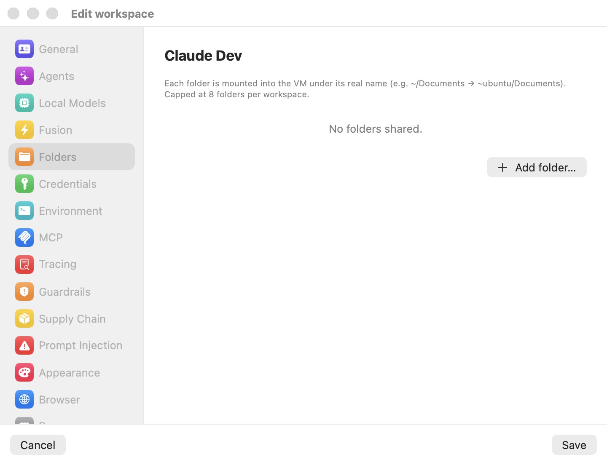

# Quick Start

This chapter walks you through your first complete session with Bromure Agentic Coding: creating a workspace, choosing an agent and how it authenticates, sharing a project folder into the sandbox, running a first task, inspecting what the agent sent over the network, and closing the session so you can pick it up again later. Plan for about ten minutes.

The walkthrough deliberately uses defaults everywhere it can. Every setting you touch here has a full reference later in the manual — links are provided along the way and collected in [Where to go next](#where-to-go-next).

## Before you begin

You need:

- Bromure Agentic Coding installed and launched at least once, with the base OS image ready — see [Installation](02-installation.mdx). (A Mac with Apple Silicon running macOS 14 or later is required.)
- A way to authenticate the coding agent. For Claude Code — the default agent — that is either an Anthropic API key or a Claude subscription you can sign in to. Both paths are covered in step 4 below.
- Optionally, a project folder on your Mac you want the agent to work on. A small git repository makes the best first test, but any folder works.

One idea to hold on to before you start: the agent runs inside a disposable Ubuntu VM, and your real credentials never enter that VM. The VM only ever holds fake placeholder tokens; a host-side proxy swaps them for the real values at the moment a request leaves your Mac. This is the [wire boundary](18-glossary.mdx), and it is why the walkthrough asks you to paste an API key into the app rather than into the terminal.

## Create your first workspace

A workspace is the unit of isolation: one Ubuntu VM with its own system disk, its own persistent home folder, its own agents, credentials, and security policies. You can create as many as you like; this walkthrough creates one.

1. Open the main window. The left sidebar is headed **WORKSPACES**; at its bottom sits a black circular **+** button (tooltip: **New workspace**). Click it.

2. A settings editor opens in a window titled **New workspace**, pre-filled from your preferences template and named "Default workspace" (auto-numbered if that name is taken). The **General** pane is showing. Type a name of your own — for example `My First Project`. The name is the only required field; everything else in this walkthrough is optional polish. If you like, pick a **Color** — it tints the workspace's tile in the sidebar.

Don't click **Create** yet — two panes are worth a visit first.

## Choose an agent and authentication

3. Click **Agents** in the editor's category sidebar. The pane shows one card per supported agent — **Claude Code**, **Codex**, and **Grok Build** — each with an enable switch. Claude Code is enabled and carries the orange **Primary** pill out of the box: the primary agent is the one that auto-launches in the session's first tab. Other enabled agents are installed and authenticated too, but you start them yourself from a new tab.

<p align="center">
  
</p>

   Inside the Claude Code card you see four authentication modes: **API token**, **Subscription (interactive login)** with a **Register…** link, **Bedrock (AWS)**, and **Local model** (grayed out with "— download a model in Local Models" until a local model is installed). Pick one of the first two:

4. **If you have an Anthropic API key:** select **API token** and paste the key into the **Anthropic API key** field. The key is stored encrypted on the host; the VM receives only a structure-preserving fake, and the proxy substitutes the real key on requests to Anthropic — nowhere else. Leave the **Require approval to use** checkbox off for now; turning it on would make the app ask for your consent the first time each session uses the key (see [Credentials](08-credentials.mdx)).

5. **If you have a Claude subscription:** select **Subscription (interactive login)** — the factory default — and click **Register…**. Bromure boots a temporary, throwaway VM with no access to your folders or credentials, runs the real Claude login inside it, and opens the provider's sign-in page in your Mac's default browser. Sign in there; you have a few minutes before the flow times out. On success the captured tokens are stored encrypted on the host, the throwaway VM is destroyed, and the app asks whether to share the registration with **Every workspace** or **Just this workspace**. Once registered, the card shows a green seal plus **Re-register…** and **Forget** controls. Your workspace VMs never perform OAuth themselves and never hold the real tokens — the host injects them on the wire and handles refresh.

6. That is all the Agents pane needs for a first session. (Enabling **Codex** or **Grok Build** alongside works the same way — each card gets its own auth mode — but one agent is plenty today.)

## Share a project folder

7. Click **Folders** in the category sidebar. This pane lists host folders that will be mounted into the VM. As the caption says, each folder is mounted under its real name — for example `~/Documents` on your Mac appears as `~ubuntu/Documents` in the VM — and a workspace is capped at 8 folders. A brand-new workspace shows "No folders shared."

<p align="center">
  
</p>

8. Click **Add folder…** and pick your project folder in the directory picker. It appears in the list with its full host path (remove it later with the minus button if you change your mind). Inside the VM it will be live at `/home/ubuntu/<basename>` — the same files, not a copy, so changes the agent makes are on your Mac instantly.

> **Note:** Sharing a folder is optional. Everything under the VM's `/home/ubuntu` is persistent per workspace, so you can also clone a repository inside the VM and keep the sandbox fully separated from your Mac's filesystem. Deleting a workspace never touches shared host folders.

9. Click **Create**. The editor closes and your workspace appears in the sidebar with the state label **Off**.

## Start the session

10. Click the workspace's row in the sidebar. The right-hand stage shows the workspace's dashboard: an **Off** pill under the name, cards for **CPU**, **Memory**, **vCPUs**, **Disk**, and **Uptime** (mostly dashes and zeros before the first launch — the disk is created on first start), a **CONFIGURATION** summary listing your agent and auth mode, the Guardrails and Prompt-injection scan states, and your shared folders. Click the **Start** button at the top right.

<p align="center">
  
</p>

11. On first launch Bromure creates the workspace's private system disk as a copy-on-write clone of the shared base image — this is instant and costs almost no disk space — and boots the VM with 4 vCPUs and the RAM shown on the dashboard (sized to your Mac by default: 4, 6, or 8 GB). While the VM boots, an animated overlay with the workspace name and a progress bar covers the pane; it fades the moment the guest's first terminal comes up, typically within seconds. If no terminal appears within 30 seconds the overlay flips to a **DIVE FAILED** panel with **Keep Waiting** and **Reset Base Image…** buttons — see [Troubleshooting](17-troubleshooting.mdx) if that happens.

12. When the boot completes you are looking at a terminal on the stage, and the primary agent — Claude Code — is already running in it, ready for a prompt. You never run `claude login` inside the VM; authentication was handled at the wire boundary. In the sidebar, the workspace's status dot is now green, the state label reads Running, and its first tab (labeled with the foreground program, e.g. `claude`) is nested under the workspace row along with a Docker node. The window toolbar now shows a cluster of controls for this VM: its IP address as a click-to-copy pill, and buttons to browse files, reboot, inspect the trace, edit the workspace, pop the session out into its own window, and toggle the browser and repo-file panes.

## Run your first task

13. Type a task at the Claude Code prompt, referencing the shared folder by its in-VM path. For example:

    ```
    Read the code in ~/my-project and summarize what it does.
    Then add a README.md with build instructions.
    ```

    Watch the status dot on the tab's icon in the sidebar: it pulses orange while the agent works, turns green when the agent is done, and turns red when the agent needs your input.

14. Because the shared folder is a live mount, the `README.md` the agent writes is immediately on your Mac — check it in Finder if you like. If your folder is a git repository, the repo file-explorer pane opens automatically when the active tab's working directory enters the repo, showing an IDE-style tree with git status and per-file diffs; you can also toggle it any time with ⌃⌘E. Press ⌘T for an additional plain shell tab alongside the agent — every tab is a window of the same in-VM `tmux` session.

15. Anything else the agent does — `apt install`, `npm install`, writing throwaway files in the VM home — stays inside the sandbox. The system disk and home folder persist between sessions, and both can be reset independently later ([Workspaces](05-workspaces.mdx)).

## Inspect the trace

16. Press ⇧⌘I (or click the **Inspect trace** toolbar button) to open the Trace Inspector. New workspaces record at the **AI request details** level: every network request the agent made is listed with host, status, and latency, and for known LLM hosts the full request and response bodies are captured too. Select one of the requests to Anthropic and the inspector renders it as a conversation — provider and model header with token counts, the system prompt, and the user, assistant, and tool messages as chat bubbles.

17. Two things worth noticing on your first trace. First, the swap report: the fake API token the VM holds was exchanged for your real credential on the wire, exactly once per request, scoped to the provider's host. Second, everything captured stays on your Mac, encrypted at rest. Trace levels, retention caps, and leak warnings are covered in [Tracing](11-tracing.mdx).

## Close and resume

18. Close the session: hover the workspace row in the sidebar and click its **×** button (or press ⌘W on its last tab). New workspaces have their close action set to **Ask**, so a prompt appears — "Close “My First Project”?" — with the buttons **Run in the Background**, **Suspend**, **Shut Down**, and **Cancel**, and the explanation: "Run in the background keeps the VM running so you can reattach later. Suspend saves its state to disk. Shut down powers it off."

19. Click **Suspend**. The VM's RAM is snapshotted to disk and the sidebar row's state label changes to **Suspended**. Nothing is lost — not the agent's conversation, not your shell history, not the tab layout.

20. Resume: click the workspace and press **Resume** on its dashboard (or use the row's **⋯** menu → **Resume**). The session restores near-instantly, exactly where you left it — the same terminals, with Claude Code mid-conversation.

21. If you always want the same behavior on close, open the row's **⋯** menu → **Edit…** and set **When closing the window** in the General pane to **Suspend** (or **Run in the background** / **Shut down**) so the prompt never appears. See [Settings — General](07-settings/general.mdx).

> **Tip:** A suspended or shut-down workspace keeps its system disk and home folder. Destroying data is always an explicit act — **Reset disk**, **Erase home…**, or **Delete workspace** — and even deleting a workspace never touches the host folders you shared into it.

## Where to go next

- [Concepts](04-concepts.mdx) — the mental model behind what you just did: workspaces, the VM lifecycle, the wire boundary, and how the pieces fit together.
- [Workspaces](05-workspaces.mdx) — duplicating, resetting, and deleting workspaces; storage layers, checkpoints, and the preferences template every new workspace is forked from.
- [Sessions](06-sessions.mdx) — tabs and git worktrees, the terminal Grid, the agentic browser pane, file transfer in and out of the VM, and every keyboard shortcut.
- [Settings reference](07-settings/index.mdx) — every settings pane, one page each, including [Agents](07-settings/agents.mdx) and [Folders](07-settings/folders.mdx) from this walkthrough.
- [Credentials](08-credentials.mdx) — the full credential catalog (git tokens, SSH keys, AWS, Kubernetes, container registries, databases, and more), approval prompts, and how the fake-to-real swap works in detail.
- [Tracing](11-tracing.mdx) — trace levels, the Trace Inspector, and leak detection.
- [Supply Chain](09-supply-chain.mdx) and [Prompt Injection](10-prompt-injection.mdx) — the protections you can layer onto a workspace before pointing an agent at untrusted code.
- [Fusion](12-fusion.mdx) and [Local Models](13-local-models.mdx) — answering prompts with multiple models at once, and running models on your Mac instead of the cloud.
- [Automation & CLI](16-automation-cli.mdx) — driving workspaces from scripts, the HTTP API, and the `bromure-cli mcp` server.
