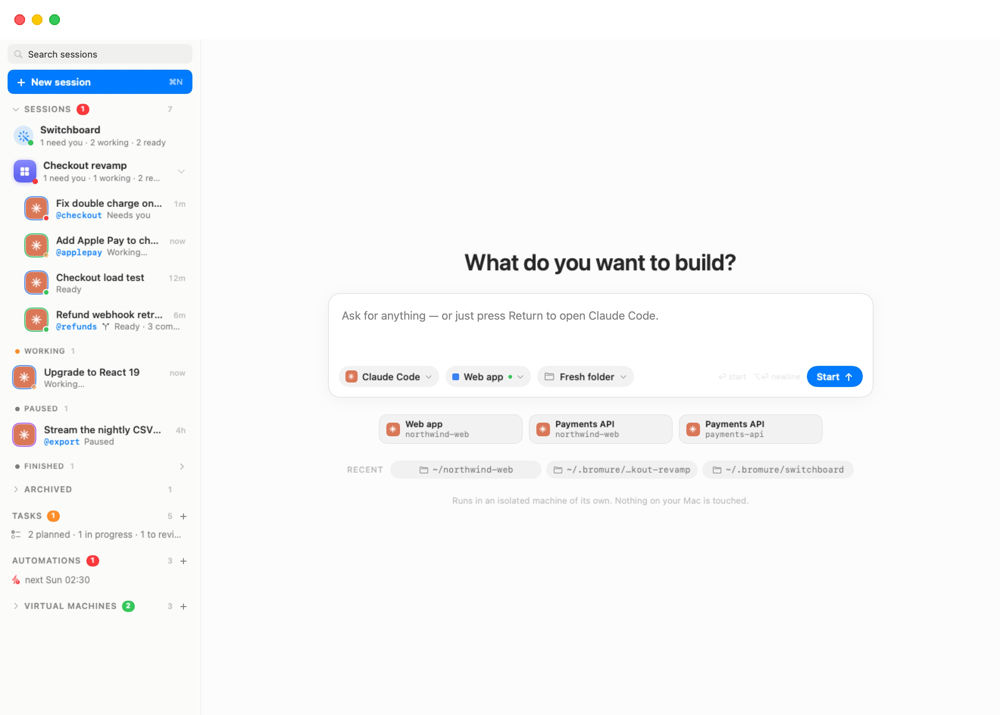

# Quick Start

This chapter walks you through your first session with Bromure Agentic Coding: finishing the onboarding wizard, asking an agent to do something, answering its question, looking at what it changed, checking what it sent over the network, and putting the session away so you can pick it up later. Plan for about ten minutes, most of it spent on the first download.

The walkthrough uses defaults wherever it can. Every screen you meet here has a full chapter later; links along the way point to them, and [Where to go next](#where-to-go-next) collects them.

## Before you begin

You need:

- A Mac with Apple Silicon running macOS 14 or later, with Bromure Agentic Coding installed — see [Installation & First Run](02-installation.mdx).
- A way for the agent to reach a model. For Claude Code, the default agent, that is either a Claude subscription you can sign in to or an Anthropic API key. Other agents work the same way with their own providers.

One idea to keep in mind: the agent runs inside an isolated Linux machine, and your real credentials never enter it. The machine only holds fake stand-ins; a proxy on your Mac swaps them for the real values as each request leaves. That is the [wire boundary](18-glossary.mdx), and it is why you sign in or paste keys in the app rather than inside the machine.

## Step 1: Finish the onboarding wizard

The first time you open the app, the onboarding wizard walks you through six steps. [Installation & First Run](02-installation.mdx#first-run-the-onboarding-wizard) describes each one; for this walkthrough:

1. On **Welcome**, click **Get Started**. The **Install** step downloads and sets up the base image. Leave the window open until it moves on by itself.
2. On **Credentials**, click **Scan This Mac** to see which of your existing credentials the app can bring in, or **Not Now** to skip. On **Choose**, tick what you want and click **Import** (or **Skip**).
3. On **Models**, sign in to your provider or paste an API key. For a Claude subscription, choose the Anthropic sign-in, finish signing in in the browser page that opens, and wait for the card to read **Signed in to** Claude. Then click **Continue**.

   You can also skip this: an agent with nothing set up offers to sign in the first time it starts.
4. On **Done**, click **Start Using Bromure**.

The app creates your first machine, **Default workspace**, and opens the main window on the new-session screen.

## Step 2: Start a session

  

The new-session screen greets you with a short line such as "What can I help you with?" and a composer. Under the composer, three chips say how the session will run:

- **Agent** — which coding agent to use. Claude Code is selected; click the chip to choose another. An agent you haven't set up yet says "Sign in when it starts".
- **Machine** — which machine it runs on. With one machine, it's **Default workspace**. The chip's help tells you whether the machine is running or "asleep, wakes up when you start".
- **Where** — which folder it works in. **Fresh folder** is the default: a new folder of its own in the machine's home, named after your message and started as a git repository. You can also pick **A folder** (one that already exists in the machine, or a new path) or **A repository** to check out.

Type what you want done in the composer — for example:

> Write a small Python script that prints the ten most common words in a text file, with a test.

Press Return, or click **Start**. (Option-Return adds a new line instead. Pressing Return with an empty composer just opens the agent without a first message.)

A new session appears in the sidebar and on the stage. If the machine was off, it starts first ("Waking up…", then "Starting Claude Code…"); the first start of a machine takes longer than the next ones. When the agent is up, your message is delivered to it.

> **Note:** If the agent has no way to reach its model yet, the chat shows a **Sign in to** card instead of starting, and the sidebar row reads "Sign in needed". Follow the card: the sign-in runs on your Mac, and the agent starts again when it's done. See [The Chat](06a-chat.mdx).

## Step 3: Watch the agent work

  

The chat shows the agent's replies as text, and what it does in between as compact **activity lines** — for example "1 tool call · 1 file read" or "Thought · 1 edit · 1 command". Click an activity line to see the details (the commands it ran, the files it read, the edits it made); click again to hide them. Edits, commands, to-do lists, tables, and diagrams appear as cards.

While the agent works:

- The session sits under **Working** in the sidebar, with an orange status dot.
- The composer's red **Stop** button (or Escape) interrupts the agent.
- You can type your next message at any time; it is sent to the agent.

When a turn changes files, the turn ends with a line such as **Changed 2 files +38 −0**. Click it to open the review window on exactly what that turn changed. See [Branches & Review](06c-branches.mdx).

## Step 4: Answer the agent's question

Agents sometimes stop and ask you to choose. When that happens, the session moves to **Needs you** at the top of the sidebar (with a red dot), and the chat shows a question card:

  

The card is headed **The agent is asking** (or "The agent is asking *n* questions — answer them all, then Submit" when there are several). Pick an option and click **Submit**. The card folds to a single grey line showing your answer, and the agent carries on.

## Step 5: Look at the files

The agent works inside the machine, not on your Mac. To see its files, use the **Files pane** on the right of the window. It opens by itself the first time a session's folder has changes; open or close it with the Files pane button in the session's toolbar or ⌃⌘E.

The pane lists the session's folder. From it you can:

- Open a subfolder, or go up with the up-arrow button.
- Drag a file to the Finder to copy it to your Mac, or drag files from the Finder into the pane to copy them into the machine.
- Right-click a file for **Save to Downloads** or **Copy Path**.

To share files with the agent directly, drop them on the chat composer: each becomes an attachment chip, copied into the machine when you send. See [Machines](06f-machines.mdx) for the Files pane in full.

## Step 6: See what the agent sent

Everything the agent sent to the internet went through the proxy on your Mac. To see it, open the **machine menu** — the capsule with the machine's name in the session's toolbar — and choose **Inspect Trace**. The Trace Inspector opens on this machine's trace: model calls with their token counts, tool calls, commands, file reads and writes, and every host the agent contacted. You can also open it with **Window › Trace Inspector…** (⇧⌘I).

For a summary of what the security engines did — blocked connections, brokered credentials, checked packages — choose **Window › Security Timeline…**. See [Tracing & Audit](11-tracing.mdx) and [Security Overview & Timeline](11a-security-timeline.mdx).

## Step 7: Put the session away

When the agent finishes its turn, the session moves to **Ready** (green dot). You can leave it there and come back to it, or put it away:

- **Archive.** Right-click the session in the sidebar and choose **Archive** — or **End & Archive** while the agent is still running, which also stops it. The session moves into the **Archived** fold at the bottom of the session list. Its conversation stays readable.
- **End session.** Choose **End session** from the same menu to stop the agent; the session moves to **Finished**. Pressing ⌘W with the session on stage does the same after asking **End “…”?** — "The agent stops. The conversation stays in its folder and can be resumed later." — with **End Session** and **Cancel**.

Archiving or ending (from the menu or with ⌘W) shows a short notice at the bottom of the window — for example "Archived “Word counter”" — with an **Undo** button (⌘Z) for a few seconds.

Sessions also change state on their own: when a machine is shut down or suspended, its sessions move to **Paused**, and finished sessions are archived automatically after three days.

## Step 8: Bring it back

A session doesn't need to be running to be read or continued. Click the paused, finished, or archived session in the sidebar:

  

The conversation is shown from a copy kept on your Mac, even with the machine off. A line at the end says how to continue — "Paused. Your next message picks it up from here." for a paused session, or "Archived. Your next message brings it back and carries on from here." for an archived one.

To continue, type a message and send it. The app starts the machine if needed, reopens the agent's conversation where it left off, and delivers your message. An archived session returns to the main list. To reopen the agent without a message, click **Resume** in the session header, or press ⌘⏎ on a paused or finished session.

## Where to go next

- [Concepts & Architecture](04-concepts.mdx) — how sessions, machines, rooms, and branches relate, and what persists where.
- [The Sessions Home](05-sessions-home.mdx) — every part of the main window, the ⌘K command palette, and session menus.
- [Starting a Session](06-new-session.mdx) and [The Chat](06a-chat.mdx) — all the options for starting and talking to an agent.
- [Rooms](06b-rooms.mdx) and [Branches & Review](06c-branches.mdx) — running several sessions on one piece of work, and trying things on a branch.
- [Machines](06f-machines.mdx) — creating more machines, terminals, the Grid, and resetting or rewinding a machine.
- [Settings Reference](07-settings/index.mdx) — every setting of a machine, starting with [Folders](07-settings/folders.mdx) to share a folder from your Mac and [Credentials](07-settings/credentials.mdx) to give the agent more keys.
- [Models & Providers](13-models.mdx) — signing in to more providers and choosing each agent's model.
- [Credentials & the Wire Boundary](08-credentials.mdx) — how your keys stay out of the machine.
