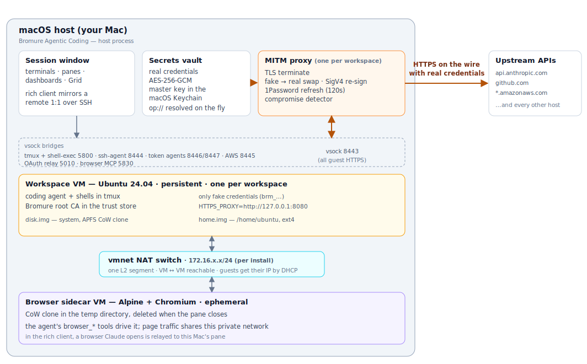
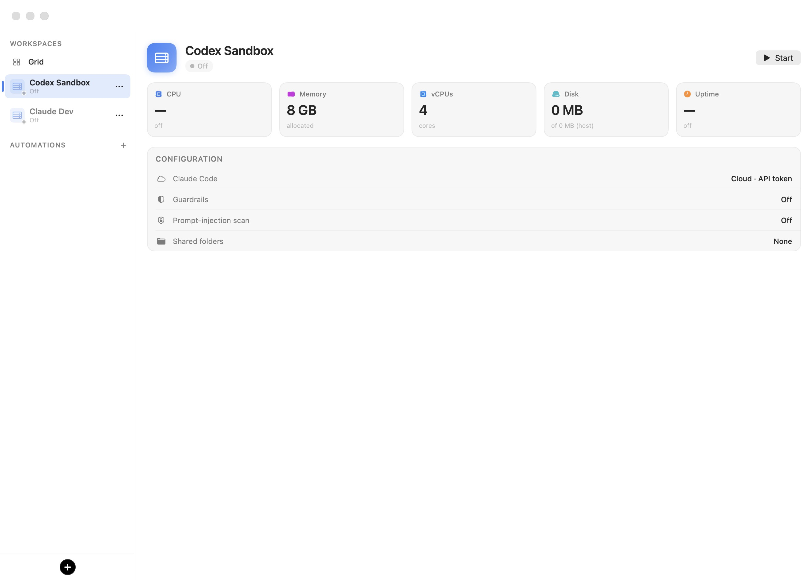

# Concepts & Architecture

Bromure Agentic Coding runs AI coding agents inside a hardware-virtualized Linux machine on your own Mac, and enforces every security control at a single point the agent cannot reach around. This chapter defines the vocabulary the rest of the manual relies on — host and guest, workspace and session, the [wire boundary](18-glossary.mdx), persistent and ephemeral storage — and explains how the pieces fit together. If you only read one chapter beyond the [Quick start](03-quick-start.mdx), read this one.

## The host and the guest

Everything in Bromure Agentic Coding lives on one side of a hard line:

- **The host** is your Mac — macOS 14 or later on Apple Silicon — and the Bromure Agentic Coding process running on it. The host owns everything sensitive: your real credentials (encrypted with a master key in the macOS Keychain), the MITM proxy that speaks to the internet on the agent's behalf, the private key of the Bromure root CA, the trace store, and the app's windows, terminals, and dashboards. The terminal you type into is rendered on the host, not inside the VM.
- **The guest** is the Linux virtual machine where the agent actually runs — Claude Code, Codex CLI, Grok CLI, or plain shell tooling, together with everything they install and touch: cloned repositories, package caches, Docker containers, virtualenvs. The guest is treated as untrusted by construction. It holds no real secrets, only intentionally invalid [fake credentials](18-glossary.mdx), and its outbound HTTPS is funneled through the host's proxy.

The two sides communicate over two narrow channels: [vsock](18-glossary.mdx) (virtio sockets, a host-to-guest transport that needs no network at all) for control, terminals, and the proxy path, and a private virtual network (vmnet NAT) for ordinary IP traffic. Both are described in detail below.

This split is what makes the product's security claim concrete: a prompt-injected or otherwise misbehaving agent can do anything it likes *inside* the guest, but it cannot read a real API key, sign with a real AWS secret, or extract an SSH private key — none of those exist on its side of the line.

## Architecture at a glance

<figure>
  
</figure>

Read the diagram bottom-up: the agent works in the workspace VM; its HTTPS leaves over vsock to the host proxy, which is the only place fake credentials become real ones; the session window attaches to the VM's terminals over separate vsock bridges; and an optional disposable browser VM shares the same private network so it can load the agent's dev servers.

## Workspace, session, and VM

Three words carry precise, distinct meanings throughout this manual:

- A **workspace** is a saved configuration plus its durable storage. It defines which agent runs (and how it authenticates), the credentials, shared folders, environment, MCP servers, guardrails, appearance, and VM sizing — everything you edit in the **Edit workspace** window — and it owns a directory under `~/Library/Application Support/BromureAC/profiles/<uuid>/` holding its system disk, home image, SSH keys, checkpoints, and saved state. A workspace exists whether or not anything is running. Internally (in file names such as `profile.json` and in CLI flags) a workspace is called a *profile*; the two terms are interchangeable. Typical practice is one workspace per project or per credential boundary. See [Workspaces](05-workspaces.mdx).
- The **VM** (virtual machine) is the running Linux instance booted from a workspace's storage. Each workspace maps to exactly one VM — one Ubuntu guest with its own disks, deterministic MAC address, IP address, and per-workspace MITM proxy listener. Two workspaces never share a VM, and one workspace never has two.
- A **session** is one continuous run of a workspace's VM: it begins when you start (or resume) the workspace and ends when the VM shuts down or suspends. The session window can detach from a session without ending it — the **Run in the background** close action leaves the VM running headless, and you can reattach from the sidebar later. Some state is deliberately session-scoped: credential approval grants and denials live only in memory and are revoked at session teardown, and the per-launch metadata shares are rebuilt on every boot. See [Sessions](06-sessions.mdx).

A useful shorthand: the workspace is the *noun* (it persists on disk), the VM is the *machine* (it exists while powered on or suspended), and the session is the *run* (it has a beginning and an end).

## The workspace VM

Each workspace VM is an Ubuntu 24.04 guest running under Apple's Virtualization.framework — the same hypervisor technology macOS itself provides, requiring Apple Silicon and supporting ARM64 guests only. The VM boots with a fixed 4 vCPUs and the amount of RAM set in the workspace (sized to your Mac by default: 4, 6, or 8 GB), from two virtual disks:

- **`disk.img`** — the system disk. On the workspace's first launch it is created as an APFS copy-on-write clone of the shared, signed Ubuntu base image (see [Installation](02-installation.mdx)): the clone appears instantly and consumes no new disk space until the guest writes to it. Later launches reuse the same clone, so packages you `apt install`, Docker images you pull, and any other system-level change survive across sessions.
- **`home.img`** — a private sparse ext4 image holding `/home/ubuntu`, attached as a second virtio-blk device. It has a 64 GiB apparent size by default but is allocated lazily, and it shrinks on the host as files are deleted in the guest. The home survives even a **Reset disk**, which is why your repositories, dotfiles, and shell history outlive a system-disk reset. (Older workspaces may still use a legacy shared-folder home; the app offers a one-time upgrade — see [Workspaces](05-workspaces.mdx).)

The guest also mounts small per-launch virtiofs shares: a read-only *meta share* carrying that boot's configuration (fake-token environment files, proxy settings, the Bromure CA certificate, guest agents, MCP configs) and a writable *outbox* the guest uses to publish events back to the host (its IP address, the tmux tab roster, agent status). Both are rebuilt on every boot and carry no durable state. Up to 8 host project folders can additionally be shared into the guest, symlinked into the home directory.

### Persistent by design — the contrast with Bromure (Web)

Bromure Agentic Coding ships from the same code base as its sibling app, **Bromure** — the web-browser variant — and the two make opposite lifecycle choices on purpose:

| | Bromure (Web) | Bromure Agentic Coding |
|---|---|---|
| Guest image | Alpine + Chromium | Ubuntu 24.04 |
| VM lifetime | One throwaway VM per browsing session, destroyed when the window closes | One persistent VM per workspace, reused across sessions |
| Data on close | Everything destroyed | System disk and home preserved |
| What is controlled | The VM's entire state (ephemerality) | The VM's *secrets surface* (fake credentials, wire boundary) |

Coding work needs durable state — cloned repos, package caches, virtualenvs, shell history — so destroying the VM after every session would make agents useless. Instead of controlling the VM's state, Bromure Agentic Coding controls what the VM is ever allowed to hold: no real secrets, and no unmediated path to the internet. Ephemerality still exists as an *escape hatch* rather than a default: **Reset disk** re-clones the system disk from the base image, disk and home checkpoints allow rollback, `bromure-cli vm run --rm` creates docker-style throwaway workspaces deleted when the VM stops, and the compromise flow wipes a contaminated disk and home while preserving your settings and keys.

### The browser sidecar VM

One piece of Bromure (Web) lives on inside Bromure Agentic Coding: the agentic browser pane. When you (or the agent) open it, the workspace gets a second, *ephemeral* VM — an Alpine + Chromium guest cloned into the temporary directory and deleted when the pane is torn down. This sidecar VM is the exception that proves the rule: browsing state is disposable by default (unless the workspace enables **Stay signed in to websites**, which keeps Chromium's profile on an encrypted per-workspace disk), while the workspace VM next to it is durable. Both VMs sit on the same private network segment, so the browser can load a dev server the agent just started by the VM's IP.

## VM lifecycle: Off, Suspended, and Running

Every workspace is always in exactly one of three durable states, shown as a pill next to the workspace name in the sidebar and on the VM dashboard. (You will also briefly see transient states — **Starting…** in the sidebar and a booting indication on the dashboard — while a VM is coming up.)

  

Selecting a workspace's name shows its dashboard for any state: live CPU, memory, vCPU, disk, and uptime cards while running, or the machine's specification and configuration summary while off or suspended — the screenshot above shows a workspace that has never been launched, which is why the Disk card still reads 0 MB (no clone exists yet). The button in the top-right corner is **Start** for an off workspace and **Resume** for a suspended one.

| State | The VM is… | Preserved | Gone |
|---|---|---|---|
| **Off** | Not running at all. No memory, no processes. | System disk (`disk.img`), home (`home.img`), checkpoints, workspace configuration, SSH keys, MAC/IP bindings. | Running processes, RAM contents, terminal tabs, any saved RAM snapshot (a clean shutdown clears it, so the next launch cold-boots). |
| **Suspended** | Frozen. Its RAM has been written to `vm.state` in the workspace directory, and the tab layout to `tabs.json`. | Everything **Off** preserves, *plus* every running process, open file, and terminal tab — resuming restores the session exactly where it left off, near-instantly. | Nothing, unless the snapshot must be discarded (see below). |
| **Running** | Live. The session window may be attached, or the VM may run headless in the background. | Everything is live. | — |

A few lifecycle rules worth internalizing:

- **Suspend is a RAM snapshot, not a save file.** Restoring it requires the VM's configuration to be identical, which is why each workspace persists a machine identifier and a deterministic MAC address. If you change the shared-folder set while a snapshot exists, the app asks to discard the suspended state — the next launch cold-boots, and no files are affected.
- **A snapshot never outlives its disk.** Resetting or wiping the system disk also drops any saved RAM snapshot and tab state, because fresh disk plus stale RAM would corrupt instantly.
- **Off does not mean erased.** A shut-down workspace keeps its system disk and home indefinitely. Actual data destruction is always explicit (**Reset disk**, **Erase home**, **Delete workspace**) or forced by the compromise flow.

### Close actions

What happens when you close a session is a per-workspace choice (**When closing the window** in the workspace editor): **Run in the background** (detach the window, keep the VM running), **Suspend**, **Shut down**, or **Ask** — the default, which prompts each time with all three options. Closing the last terminal tab routes through the same choice. See [Sessions](06-sessions.mdx) for the full flow.

## The wire boundary

The wire boundary is the product's central idea: *all* outbound HTTPS from the guest passes through a host-side man-in-the-middle (MITM) proxy, and every protection — secret-keeping, credential scoping, supply-chain scanning, prompt-injection detection, tracing — is enforced at that one point. The agent cannot reach around it, because there is nothing useful on its side of the line.

The flow, end to end:

1. **The guest holds only fakes.** At session launch, the host writes intentionally invalid placeholder credentials into the VM — environment variables such as `ANTHROPIC_API_KEY`, and config files such as `~/.git-credentials`, `~/.docker/config.json`, and `~/.kube/config`. Fakes are structure-preserving (`sk-ant-api03-brm-…`, `ghp_…`-shaped, `brm_…`) so client-side validators accept them, and deterministic per install, so tools never see a key "rotate" between sessions. The matching real values are loaded into the proxy's in-memory swap map on the host, each keyed to the destination host it belongs to.
2. **The guest's TLS terminates at the proxy.** Every shell in the guest exports `HTTPS_PROXY=http://127.0.0.1:8080`, an in-VM endpoint that tunnels over vsock (port 8443) to the host proxy. The proxy presents a forged per-host leaf certificate signed by the Bromure root CA, inspects the request, and re-encrypts it toward the real upstream.
3. **Fakes become real only on the way out.** The proxy swaps each fake for its real value — header swaps for API keys and tokens, body swaps for OAuth refresh flows, full SigV4 re-signing for AWS (the guest signs with a fake secret; the host strips that signature and re-signs with the real one), ssh-agent signing over vsock for SSH. Swaps are scoped **exact-or-subdomain** to the registered host, never substring, so a credential registered for `api.anthropic.com` is never injected toward a look-alike domain.

### The Bromure root CA

The proxy can only terminate the guest's TLS because the guest trusts it to. At first launch the app generates a per-install certificate authority — the **Bromure Agentic Coding Root CA** — whose *public* certificate is mounted into every VM's trust store at boot via the meta share. The private key never leaves the host (it lives under `~/Library/Application Support/BromureAC/ca/`, owner-readable only). Nothing outside your Bromure VMs trusts this CA: it cannot be used to intercept your Mac's own traffic, and deleting the `ca/` directory simply mints a fresh CA on the next launch.

### Fail-closed by construction

The design is fail-closed: if guest traffic ever evades the proxy — a tool that ignores proxy variables, a raw socket, a deliberate bypass attempt — the only credential it can present is a fake that no upstream accepts. AWS returns `InvalidSignatureException`; API providers reject the placeholder key. Bypassing the boundary gains an attacker nothing, because the boundary is not where secrets are *checked* — it is the only place secrets *exist*.

### The compromise detector

The boundary also watches for the opposite direction of abuse: exfiltration. The proxy scans every outbound request for any of the workspace's registered fake tokens. A fake has exactly one legitimate destination — the host it was minted for — so a fake observed heading anywhere else is the signature of an agent trying to leak credentials. The proxy refuses the request without forwarding a byte, pauses the VM, and alerts you; the workspace is flagged compromised and refuses to boot again until its (presumed contaminated) disk and home are wiped. Your settings, tokens, and SSH keys are kept — and because only the fake ever leaked, the real credential never needs rotation. The full credential model, including per-credential approval prompts and TTL-bounded grants, is covered in [Credentials & the wire boundary](08-credentials.mdx).

## What persists and what does not

Bromure Agentic Coding is explicit about lifetime. Everything a workspace owns lives under `~/Library/Application Support/BromureAC/profiles/<uuid>/`; the table below is the definitive map of what survives what.

**Persistent — survives shutdown and app restarts:**

| Item | Location | Notes |
|---|---|---|
| System disk | `disk.img` | APFS CoW clone of the base image. Survives shutdown; removed by **Reset disk**, **Delete workspace**, or a compromise wipe. |
| Home directory | `home.img` (legacy: `home/`) | Holds `/home/ubuntu`. Survives shutdown **and Reset disk**. |
| Rollback checkpoints | `checkpoints/`, `checkpoints/home/` | Boot-proven snapshots of disk and home, with tiered retention. |
| Workspace configuration | `profile.json` | Non-secret settings; real credentials are stored separately, encrypted on the host. |
| SSH keys | `ssh/` | The workspace's keypair (served to the guest by signature only, over vsock). |
| Machine identity | `machine-identifier.bin` + the MAC binding in `profile-macs.json` | Keeps the VM's identity (and usually its IP) stable across launches; required to restore a suspend snapshot. |
| Suspend snapshot | `vm.state` + `tabs.json` | Only while the workspace is **Suspended**; cleared by a clean shutdown. |
| Browser profile (opt-in) | `browser-profiles/<uuid>/image/` | Only when **Stay signed in to websites** is enabled; encrypted per workspace. |

**Ephemeral — rebuilt or destroyed automatically:**

| Item | Lifetime |
|---|---|
| Meta share contents (`meta-share/`: fake-token env files, proxy config, CA cert, guest agents) | Rebuilt on every boot. |
| Outbox events (`outbox/`) | Per launch. |
| Browser sidecar VM disk (a CoW clone in the temporary directory) | Deleted when the browser pane is torn down. |
| Credential approval grants and denials | In memory only; revoked at session teardown. |
| Guest RAM, processes, terminal tabs | Lost at shutdown unless suspended. |

Two consequences fall out of this map. First, "close the window" is never destructive by itself — the destructive verbs are all explicit and confirmed. Second, when you *want* disposability, you have graduated options: roll back a checkpoint, **Reset disk** (home survives), **Erase home**, delete the workspace, or start with a throwaway via `bromure-cli vm run --rm` in the first place.

> **Note:** Shared host folders are project directories on your Mac, outside Bromure's storage. They are never wiped by any Bromure action — including the compromise wipe — and the wipe prompt says so explicitly.

## Host–guest bridges (vsock)

Interactive integration between the Mac and the guest rides virtio sockets — point-to-point host-to-guest channels that exist independently of the VM's network. You never configure these, but knowing they exist helps when reading traces or the [Troubleshooting](17-troubleshooting.mdx) chapter. Each bridge listens on a numbered vsock port:

**Workspace VM bridges:**

| Port | Bridge | What it carries |
|---|---|---|
| 8443 | MITM proxy | All guest HTTPS — the wire boundary itself. |
| 8444 | ssh-agent bridge | Signature requests from the guest's `SSH_AUTH_SOCK`; private key bytes never cross. |
| 8445 | AWS credential helper | The `credential_process` feed (real access key ID, fake secret). |
| 8446 | Claude token agent / local inference | Subscription-token seeding for Claude, and the guest-to-host local-inference bridge (the port is shared by both). |
| 8447 | Codex token agent | Subscription-token seeding for Codex. |
| 5800 | Shell-exec agent | The terminal attach path, `bromure-cli exec`, the file browser window, the file-explorer pane, and image-paste uploads. |
| 5010 | OAuth callback relay | Loopback OAuth redirects (for `gh`, `gcloud`, and similar logins) delivered back into the in-VM CLI. |
| 5830 | Browser MCP shim | Connects the agent's browser-automation MCP server to the host. |

**Browser sidecar VM bridges:** configuration (5000), file transfer (5100), Chrome DevTools Protocol (5200), link relay (5300), webcam (5400), native tab strip (5810), and network trace (5900).

### Clipboard

There is no separate clipboard daemon for workspace terminals — the clipboard rides the terminal protocol itself. Copying inside the guest (a tmux selection, or any program emitting OSC 52) lands on the macOS pasteboard automatically; ⌘C copies the host-side terminal selection; ⌘V pastes into the guest using bracketed paste. In the browser pane, a guest clipboard agent plus captured ⌘C/⌘V provide copy and paste between the Mac and Chromium.

### File transfer

Files move between the Mac and a workspace three ways, all covered in [Sessions](06-sessions.mdx): shared folders (virtiofs, the normal path for project files), the Finder-like file browser window (drag in and out over the vsock file service on port 5800), and image paste (⌘V with an image uploads it into the guest and pastes its path). The dedicated file-transfer protocol on port 5100 belongs to the browser sidecar VM.

## Networking

### NAT mode (the default)

All workspace VMs in NAT mode attach to a single process-wide software L2 switch, multiplexed onto one vmnet shared/NAT interface. The consequences:

- **One private subnet** — `192.168.64.0/24` by default (gateway `.1`, addresses leased from `.2` to `.254` for 24 hours). If your Mac's own LAN already uses that range, Bromure automatically picks another `192.168.x.0/24`.
- **Bromure runs its own DHCP server** on that switch (Apple's built-in one can only track a single lease per interface), and leases persist in `dhcp-leases.sqlite` on the host.
- **Stable addressing** — each workspace gets a deterministic, locally-administered MAC address persisted in `profile-macs.json`, and combined with persistent leases a workspace usually keeps the same IP across app restarts (best-effort: as long as the address stays free). The current IP is always shown in the VM dashboard header and the toolbar pill.
- **VMs can reach each other.** Every VM in NAT mode — workspace VMs and browser sidecars alike — sits on the same L2 segment by design, so the browser pane can load a dev server running in the workspace VM, and two workspaces can talk to each other's services. The dashboard's Listening Ports card lists each externally reachable guest socket as the `<VM-IP>:<port>` endpoint you would actually connect to from the Mac.
- **Isolation from the outside.** NAT means the VMs are reachable from your Mac but are not exposed on your physical LAN, and inbound connections from elsewhere are not possible unless you explicitly publish a service (per-service Cloudflare quick tunnels, from the Listening Ports card).

The guest NIC's MTU is clamped to 1280 by default — a conservative value that survives VPN and corporate path-MTU environments — and can be raised with `defaults write io.bromure.agentic-coding vm.mtu -int <value>`.

Remember that ordinary IP traffic on this network is not how credentials flow: guest HTTPS is steered through the in-VM proxy endpoint and over vsock to the wire boundary. The NAT network carries everything else — and anything that sidesteps the proxy carries only fake credentials, which is exactly the fail-closed property described above.

### Bridged mode (per workspace)

A workspace can instead join your physical LAN: Bridged mode attaches the VM to a chosen host interface via vmnet bridging, making it appear as a device on the local network (useful when other machines must reach the VM directly). If the chosen interface is unavailable at launch, the VM falls back to NAT. Network mode is set per workspace in the workspace editor; see [Workspaces](05-workspaces.mdx).

## Instant start and pre-warming

Two different mechanisms make sessions feel instant, and it is worth knowing which applies where:

- **Workspace VMs are not pooled.** Each workspace boots its own persistent VM directly. First launch is fast because the system disk is an instant CoW clone rather than a copied image; subsequent cold boots are ordinary Linux boots (covered by the animated boot overlay); and a **Suspended** workspace skips booting entirely — its RAM snapshot is restored and the session resumes in place, terminals and all, near-instantly.
- **The browser sidecar uses a warm pool.** The engine keeps one pre-booted browser VM ready in the background so opening the agentic browser pane takes under 1 second. When that VM is claimed, a replacement starts warming; while idle, the warm VM's memory balloon is inflated (the guest keeps roughly 512 MB) and the VM is suspended after 30 seconds to stay cheap, then resumed and the balloon deflated (full memory restored to the guest) at claim time.

The distinction follows directly from the lifecycle philosophy: pooled VMs only make sense when every instance is interchangeable, which is true of throwaway browser VMs and false of persistent, per-workspace machines.
