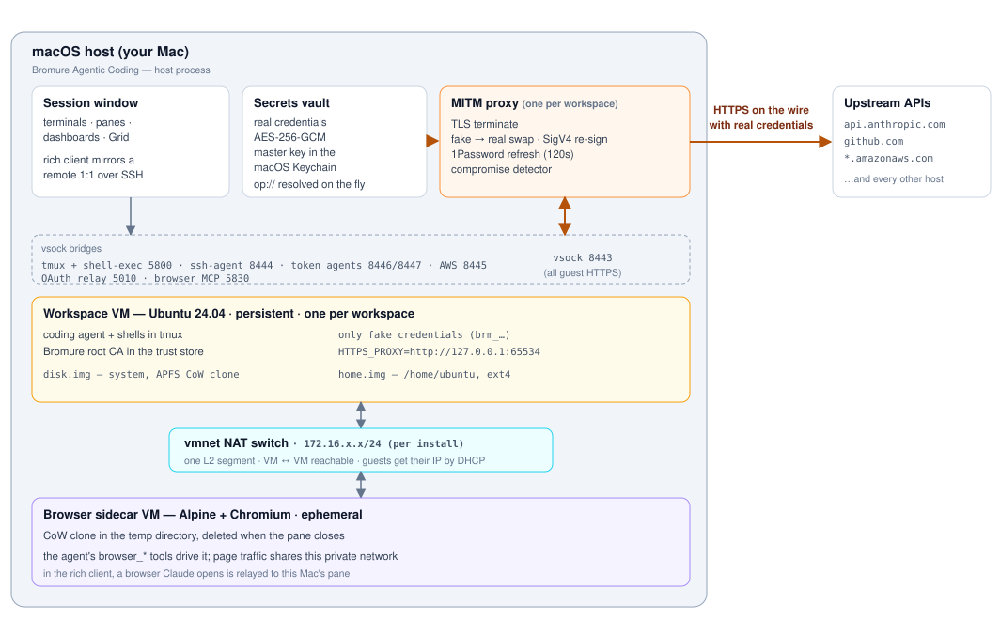

# Concepts & Architecture

Bromure Agentic Coding runs AI coding agents inside hardware-virtualized Linux machines on your Mac, and enforces every security control at one point the agent cannot reach around. This chapter defines the words the rest of the manual relies on — session, machine, room, branch, host and guest, the [wire boundary](18-glossary.mdx) — and explains how the pieces fit together. If you read only one chapter beyond the [Quick Start](03-quick-start.mdx), read this one.

## Sessions, machines, rooms, and branches

Four objects make up almost everything you do in the app.

### Session

A **session** is one conversation with one agent, in one folder, on one machine. You start it from the new-session screen; it has a title (the agent sets one from your first message, and you can rename it), an agent (Claude Code, Codex, Grok, Kimi Code, or Oh My Pi), a machine, and a working folder inside that machine. Sessions are what the sidebar lists and what the chat shows.

Inside the machine, a session is an agent running in its own terminal tab. You rarely need to see that tab, but you can: the **Linux** pill in the toolbar (⌥⌘U) or **Open in Linux Terminal** in the session's menu switches to it, and the pill (now reading **Session**) switches back.

A session outlives the agent process. When the agent exits, or its machine shuts down, the session stays in the sidebar with its conversation, and your next message starts the agent again on the same conversation. See [The Sessions Home](05-sessions-home.mdx).

### Machine

A **machine** is an isolated Linux VM together with its settings and durable storage. The main window says *machine*; the settings editor, several menus (**New Workspace…**, **Workspaces**), and the command line say **workspace** (internally, and in file names such as `profile.json`, a *profile*). All three words mean the same thing.

A machine defines the credentials, shared folders, environment, MCP servers, guardrails, model overrides, appearance, and VM size that apply to every session on it — everything you edit in the settings editor. Every agent is available on every machine. A machine exists whether or not it is running, and many sessions can run on one machine at the same time, each in its own folder and terminal tab.

Typical practice is one machine per project or per credential boundary: sessions on the same machine share its disk, its credentials, and its network identity. Machines are listed under **Virtual Machines** in the sidebar; see [Machines](06f-machines.mdx).

A **machine run** is one continuous period during which a machine's VM is powered on: it begins when the machine starts or resumes, and ends when it shuts down or suspends. Some state belongs to the run, not the machine: credential approvals you grant live in memory and are revoked when the run ends, and the per-boot configuration shares are rebuilt on every start.

### Room

A **room** groups sessions that work on the same thing. Opening a room shows its sessions side by side as a grid of live chats, and a composer that can send to any of them or to all at once. A room can have its own **Switchboard**, a session that keeps track of that room's sessions and only those. Sessions in a room can run on different machines. See [Rooms](06b-rooms.mdx).

### Branch session

A **branch session** is a session started from another session on its own git branch, in a separate checkout (a git worktree) of the same repository on the same machine. It works without touching the original session's folder, and when you're happy with the result you review it and merge it back. See [Branches & Review](06c-branches.mdx).

### Sessions that other sessions start

Two kinds of session are started for you rather than by you:

- **Delegates.** An agent can hand a job to a new child session — on its own branch, or on another machine — and wait for the result. The child is listed under the session that started it. An agent can also send a request to an existing session by its **@nickname**. See [Agents Working Together](06d-delegation.mdx).
- **The Switchboard.** A Claude Code session that keeps track of every other session. It appears in the sidebar once two or more sessions are in flight, works in the folder `~/.bromure/switchboard` on the machine you used last, and can read, answer, and start sessions for you under strict rules. A room's own Switchboard works in `~/.bromure/rooms/<room>` and sees only that room. See [Switchboard & Messaging](06e-switchboard.mdx).

Automation runs and coding tasks also run as sessions, archived when they finish; see [Automations](06h-automations.mdx) and [Coding Tasks](06i-coding-tasks.mdx).

## Session states

The sidebar groups sessions by what they need from you, never by which machine they run on:

| State | Dot | Meaning |
|---|---|---|
| **Needs you** | Red | The agent is waiting on you: a question, a permission prompt, or a sign-in ("Sign in needed"). |
| **Working** | Orange | The agent is busy, or the session is still starting. |
| **Ready** | Green | The agent finished its turn and is waiting for your next message. |
| **Paused** | — | The session's machine is off or suspended. Your next message starts the machine and picks the conversation up. |
| **Finished** | — | The agent has exited, or you ended the session. Your next message starts the agent again on the same conversation. |

Two more places hold sessions outside these groups:

- **Archived** is a fold at the bottom of the session list for conversations you put away. An archived session is still readable, and one message brings it back. Sessions that finished more than three days ago are archived automatically, except sessions in a room and Switchboards. Delegates, coding tasks, and automation runs are archived as soon as they finish.
- A session whose machine or folder no longer exists shows dimmed, as "Machine removed" or "Folder removed". Sessions from deleted machines are gathered into one line at the end of the list with a **Delete** button.

The host keeps a copy of each session's conversation (in `~/Library/Application Support/BromureAC/transcripts/`), refreshed while the agent runs, so a paused, finished, or archived session can be read without starting its machine.

## The host and the guest

Everything in Bromure Agentic Coding lives on one side of a hard line:

- **The host** is your Mac — macOS 14 or later on Apple Silicon — and the Bromure Agentic Coding app running on it. The host holds everything sensitive: your real credentials (encrypted with a master key in the macOS Keychain), your sign-ins, the MITM proxy that talks to the internet for the agent, the private key of the Bromure root CA, the trace and the Security Timeline, and the app's windows, chats, and terminals. The chat and the terminals you type into are drawn on the host, not inside the VM.
- **The guest** is the Linux VM where the agent actually runs — Claude Code, Codex, Grok, Kimi Code, Oh My Pi, or plain shell tools, with everything they install and touch: cloned repositories, package caches, Docker containers, virtualenvs. The guest is treated as untrusted by design. It holds no real secrets, only intentionally invalid [fake credentials](18-glossary.mdx), and its outbound web traffic goes through the host's proxy.

The two sides talk over two narrow channels: [vsock](18-glossary.mdx) (virtio sockets, a host-to-guest channel that needs no network) for control, terminals, MCP servers, and the proxy path; and a private virtual network for ordinary IP traffic. Both are described below.

This split is what makes the security claim concrete: a prompt-injected or misbehaving agent can do anything it likes *inside* the guest, but it cannot read a real API key, sign with a real AWS secret, or extract an SSH private key — none of those exist on its side of the line.

## Architecture at a glance

<figure>
  
</figure>

Read the diagram from the bottom up: the agent works in the machine's VM; its HTTPS leaves over vsock to the host proxy, which is the only place fake credentials become real ones; the app attaches to the VM's terminals over separate vsock bridges; and an optional disposable browser VM shares the same private network so it can load the agent's dev servers.

Besides machines and browser VMs, the app can run three kinds of managed VM of its own, each on the same private network: **Kubernetes cluster nodes** and a **container registry** (see [Kubernetes Clusters & Registries](13a-kubernetes.mdx)), and the **messaging connector** that links the Switchboard to Signal, WhatsApp, or Slack (see [Switchboard & Messaging](06e-switchboard.mdx)). They are listed under **Virtual Machines** in the sidebar but are not machines: no agent runs in them.

## The machine's VM

Each machine's VM is an Ubuntu 24.04 guest running under Apple's Virtualization.framework, which requires Apple Silicon and supports only ARM64 guests. It boots with 4 vCPUs and the amount of memory set in the machine's **Resources** pane, from two virtual disks:

- **`disk.img`** — the system disk. On the machine's first start it is created as an APFS copy-on-write clone of the shared, signed Ubuntu base image (see [Installation & First Run](02-installation.mdx)): the clone appears instantly and uses no new disk space until the guest writes to it. Later starts reuse the same clone, so packages you `apt install`, Docker images you pull, and other system-level changes survive.
- **`home.img`** — a private ext4 disk holding `/home/ubuntu`, attached as a second disk. It has a 64 GiB size by default but only uses space as it fills, and it shrinks on the host as files are deleted in the guest. The home survives a **Reset disk**, which is why your repositories, dotfiles, shell history, and every session's folder outlive a system-disk reset.

The guest also mounts small per-boot shares: a read-only *meta share* carrying that boot's configuration (fake-credential environment files, proxy settings, the Bromure CA certificate, guest agents, MCP configuration) and a writable *outbox* the guest uses to report back to the host (its IP address, its terminal tabs, agent status). Both are rebuilt on every start and hold no durable state. Up to 8 folders from your Mac can also be shared into the guest; they appear in the home folder.

### Persistent by design — the contrast with Bromure (Web)

Bromure Agentic Coding shares its code base with its sibling app, **Bromure**, the web browser, and the two make opposite lifetime choices on purpose:

| | Bromure (Web) | Bromure Agentic Coding |
|---|---|---|
| Guest image | Ubuntu + Chromium | Ubuntu 24.04 |
| VM lifetime | One throwaway VM per browsing session, destroyed when the window closes | One persistent VM per machine, reused across runs |
| Data on close | Everything destroyed | System disk and home kept |
| What is controlled | The VM's entire state (it is thrown away) | The VM's *secrets surface* (fake credentials, wire boundary) |

Coding needs durable state — cloned repositories, package caches, virtualenvs, shell history — so throwing the VM away after every session would make agents useless. Instead of controlling the VM's state, Bromure Agentic Coding controls what the VM is ever allowed to hold: no real secrets, and no unmediated path to the internet. Throwaway machines still exist as an option: **Reset disk** re-clones the system disk from the base image, **Rewind home…** rolls the home back to an earlier checkpoint, `bromure-cli vm run --rm` creates a throwaway machine deleted when it stops, and the compromise flow wipes a contaminated disk and home while keeping your settings and keys.

### The browser VM

One piece of Bromure (Web) lives on inside Bromure Agentic Coding: the embedded browser beside a session. When you (or the agent) open it, the machine gets a second, *disposable* VM running Ubuntu and Chromium, cloned into a temporary folder and deleted when the browser is closed. Browsing state is thrown away by default, unless the machine turns on **Stay signed in to websites**, which keeps Chromium's profile on an encrypted per-machine disk. The browser VM sits on the same private network as the machines, so it can load a dev server the agent just started. See [The Embedded Browser](06g-browser.mdx).

## Machine states: Off, Suspended, and Running

Every machine is always in one of three lasting states. You'll also see **Starting…** briefly while a machine boots.

  

Expand **Virtual Machines** at the bottom of the sidebar to see your machines. Clicking a machine shows its dashboard: live CPU, memory, disk, and uptime while it runs, or its specification and configuration while it's off, with a **Start** or **Resume** button. Starting a session on a machine that's off starts it for you.

| State | The VM is… | Kept | Gone |
|---|---|---|---|
| **Off** | Not running at all. | System disk (`disk.img`), home (`home.img`), checkpoints, settings, SSH keys, network identity. | Running processes, memory, terminal tabs, any saved memory snapshot (a clean shutdown clears it, so the next start is a fresh boot). Sessions on the machine show as **Paused**. |
| **Suspended** | Frozen. Its memory is saved to `vm.state` in the machine's folder, and its terminal tabs to `tabs.json`. | Everything **Off** keeps, *plus* every running process and terminal tab — resuming picks up exactly where it stopped. Sessions show as **Paused** until it resumes. | Nothing, unless the snapshot has to be discarded (see below). |
| **Running** | Live. | Everything is live. | — |

A few rules worth knowing:

- **Suspend is a memory snapshot, not a save file.** Restoring it requires the VM's configuration to be the same as when it was saved. If you change something the snapshot depends on — for example the memory size or the shared folders — the machine starts fresh instead, and no files are affected. The app log names what changed.
- **A snapshot never outlives its disk.** Resetting or wiping the system disk also drops any saved memory snapshot, because a fresh disk plus stale memory would corrupt at once.
- **Off does not mean erased.** A shut-down machine keeps its system disk and home indefinitely. Actual deletion is always explicit (**Reset disk**, **Rewind home…**, **Delete workspace**) or forced by the compromise flow.

### Close actions

What happens when you close a machine's window is a per-machine choice (**When closing the window** in the **General** pane): **Run in the background** (the machine keeps running without a window), **Suspend**, **Shut down**, or **Ask** — the default, which asks each time. See [Machines](06f-machines.mdx).

## The wire boundary

The wire boundary is the product's central idea: *all* outbound web traffic from the guest passes through a host-side man-in-the-middle (MITM) proxy, and every protection — keeping secrets, scoping credentials, supply-chain scanning, prompt-injection detection, PII protection, tracing — is enforced at that one point. The agent cannot reach around it, because there is nothing useful on its side of the line.

The flow, end to end:

1. **The guest holds only fakes.** When a machine starts, the host writes intentionally invalid placeholder credentials into the VM — environment variables such as `ANTHROPIC_API_KEY`, and files such as `~/.git-credentials`, `~/.docker/config.json`, and `~/.kube/config`. Fakes keep the shape of the real thing (`sk-ant-api03-brm-…`, `ghp_…`-shaped, `brm_…`) so client-side checks accept them, and they are stable for a given install, so tools never see a key change between runs. The matching real values are loaded into the proxy's memory on the host, each tied to the host it belongs to.
2. **The guest's TLS ends at the proxy.** Every shell in the guest exports `HTTPS_PROXY=http://127.0.0.1:65534`, an in-VM endpoint that tunnels over vsock (port 8443) to the host proxy. In addition, the host's virtual network switch diverts the guest's outbound connections to ports 80 and 443 into the same proxy, so a tool that ignores the proxy variables still goes through it. The proxy presents a per-host certificate signed by the Bromure root CA, inspects the request, and re-encrypts it toward the real server.
3. **Fakes become real only on the way out.** The proxy swaps each fake for its real value — header swaps for API keys and tokens, the stand-in keys behind subscription sign-ins, full SigV4 re-signing for AWS (the guest signs with a fake secret; the host strips that signature and signs again with the real one), and ssh-agent signing over vsock for SSH. Swaps apply to the registered host and its subdomains only, never a look-alike, so a credential registered for `api.anthropic.com` is never injected toward another domain.

A machine can turn off the transparent diversion in its **Guardrails** pane; the proxy variables, the credential swap, tracing, and guardrails still apply. See [Credentials & the Wire Boundary](08-credentials.mdx).

### The Bromure root CA

The proxy can only read the guest's TLS because the guest trusts it. At first launch the app creates a per-install certificate authority — the **Bromure Agentic Coding Root CA** — whose *public* certificate is installed into every VM's trust store at boot through the meta share. The private key never leaves the host (it lives under `~/Library/Application Support/BromureAC/ca/`, readable only by you). Nothing outside your Bromure VMs trusts this CA: it can't be used to intercept your Mac's own traffic, and deleting the `ca/` folder simply creates a fresh CA at the next launch.

### Fail-closed by construction

The design fails closed: if guest traffic ever gets past the proxy — a raw socket on an unusual port, a deliberate bypass attempt — the only credential it can present is a fake that no server accepts. AWS returns `InvalidSignatureException`; API providers reject the placeholder key. Getting around the boundary gains an attacker nothing, because the boundary isn't where secrets are *checked* — it's the only place secrets *exist*.

### The compromise detector

The boundary also watches for the opposite kind of abuse: exfiltration. The proxy scans every outbound request for any of the machine's registered fake tokens. A fake has exactly one legitimate destination — the host it was made for — so a fake heading anywhere else is the signature of an agent trying to leak credentials. The proxy stops the request, pauses the machine, and alerts you, with the choice to shut the machine down, block the request, or allow that destination for the rest of the session. Because only a fake ever left, the real credential never needs rotating. The full credential model, including per-credential approval prompts and time-limited grants, is in [Credentials & the Wire Boundary](08-credentials.mdx).

## What persists and what does not

Bromure Agentic Coding is explicit about what lasts. Each machine's files live in `~/Library/Application Support/BromureAC/profiles/<uuid>/`; your sessions live beside them, in the support folder.

**Persistent — survives shutdowns and app restarts:**

| Item | Location | Notes |
|---|---|---|
| System disk | `disk.img` | APFS copy-on-write clone of the base image. Removed by **Reset disk**, **Delete workspace**, or a compromise wipe. |
| Home | `home.img` | Holds `/home/ubuntu`, including every session's folder. Survives **Reset disk**; rolled back by **Rewind home…**. |
| Checkpoints | `checkpoints/`, `checkpoints/home/` | Snapshots of the disk and home, used by **Rewind home…** and restores. |
| Machine settings | `profile.json` | Non-secret settings; secrets are stored separately, encrypted on the host. |
| SSH keys | `ssh/` | The machine's key pair (the guest can only ask for signatures, over vsock). |
| Network identity | `machine-identifier.bin` and the MAC address in `profile-macs.json` | Keeps the VM's identity — and usually its IP address — stable; required to restore a suspended machine. |
| Suspend snapshot | `vm.state` + `tabs.json` | Only while the machine is **Suspended**. |
| Browser profile (optional) | `browser-profiles/<uuid>/image/` | Only with **Stay signed in to websites**; encrypted per machine. |
| Sessions and rooms | `sessions.json`, `rooms.json`, `delegations.json` (support folder) | Titles, agents, folders, states, room membership, and work handed between agents. |
| Conversation copies | `transcripts/` (support folder) | The host's copy of each session's conversation, for reading while the machine is off. |

**Temporary — rebuilt or deleted automatically:**

| Item | Lifetime |
|---|---|
| Meta share (`meta-share/`: fake-credential files, proxy settings, CA certificate, guest agents) | Rebuilt on every start. |
| Outbox (`outbox/`) | One machine run. |
| Browser VM disk (a copy-on-write clone in the temporary folder) | Deleted when the browser closes. |
| Credential approvals and denials | In memory only; revoked when the machine run ends. |
| Guest memory, processes, terminal tabs | Lost at shutdown unless the machine is suspended. |

Two things follow from this. First, closing a window or ending a session never deletes anything by itself — the destructive actions are all explicit and confirmed. Deleting a session removes its conversation from the app but leaves its folder on the machine. Second, when you *want* a clean slate, you have a range of options: **Rewind home…**, **Reset disk** (the home survives), deleting the machine, or a throwaway machine from `bromure-cli vm run --rm`.

> **Note:** Folders shared from your Mac are ordinary folders on your disk, outside Bromure's storage. No Bromure action ever deletes them — including the compromise wipe — and the wipe prompt says so.

## Host–guest bridges (vsock)

Everything interactive between the Mac and the guest travels over virtio sockets — direct host-to-guest channels that exist independently of the VM's network. You never configure them, but knowing they exist helps when you read traces or [Troubleshooting](17-troubleshooting.mdx). Each bridge uses a numbered vsock port:

**Machine VM bridges:**

| Port | Bridge | What it carries |
|---|---|---|
| 8443 | MITM proxy | All guest web traffic — the wire boundary itself. |
| 8444 | ssh-agent bridge | Signature requests from the guest's `SSH_AUTH_SOCK`; private keys never cross. |
| 8445 | AWS credential helper | The `credential_process` feed (real access key ID, fake secret). |
| 8446 | Claude sign-in / local inference | Stand-in keys for Claude subscriptions, and the guest's path to on-device models (both share the port). |
| 8447 | Codex sign-in | Stand-in keys for ChatGPT subscriptions. |
| 5800 | Shell bridge | Terminal attach, `bromure-cli exec`, the Files pane, and file uploads from the chat and terminal. |
| 5010 | Sign-in callback relay | Loopback sign-in redirects (for `gh`, `gcloud`, and similar tools) delivered back into the guest. |

**Built-in MCP servers** — tools the host offers to every agent on the machine, each reached through a small shim in the guest:

| Port | Server | What it gives the agent |
|---|---|---|
| 5830 | `browser` | Control of the embedded browser. See [The Embedded Browser](06g-browser.mdx). |
| 5831 | Task board | Coding-task tools: set the plan, create subtasks, hand work to review. See [Coding Tasks](06i-coding-tasks.mdx). |
| 5832 | Plan stream | The live plan channel used while a coding task is planned. |
| 5833 | `bromure-automations` | List, create, edit, delete, and run this machine's automations. See [Automations](06h-automations.mdx). |
| 5834 | `bromure-infrastructure` | The Kubernetes clusters and registries this machine may use. See [Kubernetes Clusters & Registries](13a-kubernetes.mdx). |
| 5835 | `bromure-delegation` | Delegation to other sessions, and requests by @nickname. See [Agents Working Together](06d-delegation.mdx). |
| 5836 | `bromure-switchboard` | The Switchboard's tools; only the Switchboard session can use them. See [Switchboard & Messaging](06e-switchboard.mdx). |

**Browser VM bridges:** configuration (5000), file transfer (5100), Chrome DevTools Protocol (5200), link relay (5300), webcam (5400), tab strip (5810), and network trace (5900).

### Clipboard

Terminal tabs have no separate clipboard service — the clipboard travels through the terminal itself. Copying inside the guest (a tmux selection, or any program using OSC 52) lands on the macOS clipboard; ⌘C copies the selection in a terminal; ⌘V pastes into the guest. In the browser, a guest clipboard agent provides copy and paste between the Mac and Chromium.

### File transfer

Files move between the Mac and a machine in three ways, all covered in [Machines](06f-machines.mdx): shared folders (the normal path for project files that live on your Mac), the Files pane (drag in and out, over the shell bridge on port 5800), and attachments — any file up to 512 MB dropped or pasted into a chat or terminal is copied into the machine and its path handed to the agent.

## Networking

### NAT mode (the default)

All machines in NAT mode connect to one software network switch inside the app, which reaches the internet through a single macOS vmnet NAT interface. As a result:

- **One private subnet.** A fresh install picks a random private /24 inside `172.16.0.0/12` and keeps it, avoiding any `172.x` network your Mac is already on (such as Docker's). The switch in **Preferences › Resources** (**Workspace subnet** — **Use a private subnet (avoids clashes across remotes)**) shows the subnet, and **Randomize** picks a new one; changes apply the next time your machines start. With the switch off, the app uses `192.168.64.0/24`, or another free `192.168.x.0/24` if your LAN already uses that range.
- **The app runs its own DHCP server** on that switch, and leases are kept in `dhcp-leases.sqlite`. Each machine has a stable MAC address (in `profile-macs.json`), so it usually keeps the same IP address across restarts. The machine menu's **Copy IP Address** and the machine's dashboard show the current address.
- **VMs can reach each other.** Machines, browser VMs, cluster nodes, and the registry sit on the same network by design, so the browser can load a dev server running on a machine, and two machines can use each other's services. The dashboard's listening-ports list shows each reachable service as the `<IP>:<port>` you would connect to from the Mac.
- **Isolated from the outside.** The VMs are reachable from your Mac but not from your physical LAN, and nothing else can connect to them unless you explicitly publish a service (for example through a Cloudflare quick tunnel from the listening-ports list).
- **IPv4 only.** IPv6 is turned off inside the guest, and `localhost` resolves to `127.0.0.1`.

The guest's network MTU is set to 1280 by default — a safe value behind VPNs and corporate networks — and can be raised with `defaults write io.bromure.agentic-coding vm.mtu -int <value>`.

Remember that ordinary IP traffic isn't how credentials move: web traffic is steered into the proxy, and anything that gets around it carries only fake credentials — the fail-closed property described above.

### Bridged mode (per machine)

A machine can instead join your physical LAN: set **Network** to bridged in its **Resources** pane and pick an interface, and the VM appears on the local network with its own address from your router (useful when other devices must reach it directly). If the chosen interface isn't available at start, the machine falls back to NAT. See [Settings › Resources](07-settings/resources.mdx).

## Fast starts

Two things keep machines quick to start:

- **Copy-on-write disks.** A new machine's system disk is an instant clone of the base image rather than a copy, so the first start doesn't wait for gigabytes to be written. Later cold starts are ordinary Linux boots.
- **Suspend and resume.** A **Suspended** machine skips booting entirely: its memory snapshot is restored and it continues where it stopped, terminal tabs and agents included.

Machines are not pooled or pre-booted: each machine is a persistent computer of its own, so there is nothing interchangeable to keep warm. The disposable browser VM is the exception; it comes from the same pool machinery as Bromure Web.
