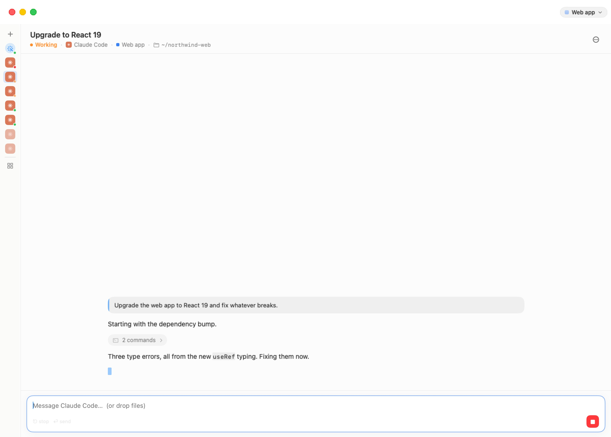
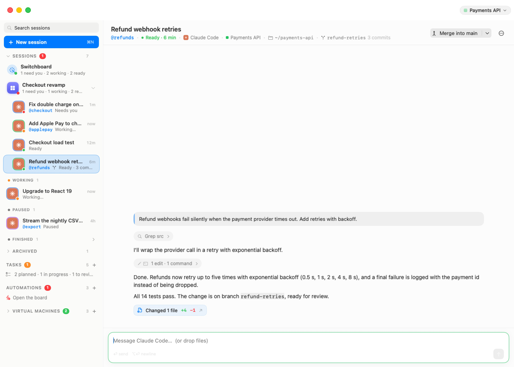
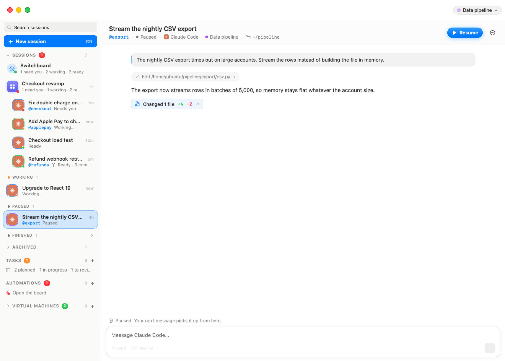
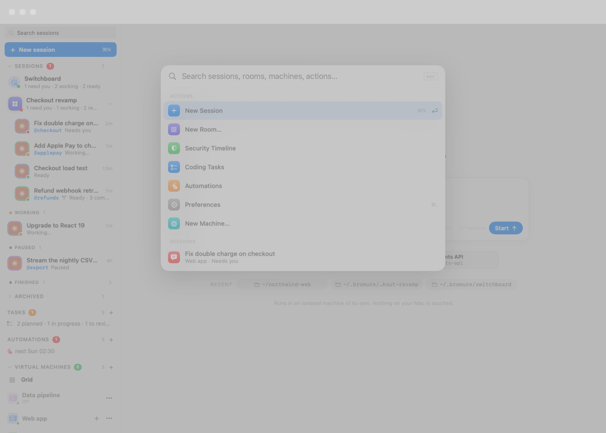

# The Sessions Home

Bromure Agentic Coding opens on your **sessions**. A session is one conversation with one coding agent, working in one folder on one machine — a machine (a workspace, in the settings editor) being the isolated Linux VM described in [Concepts & Architecture](04-concepts.mdx). You start a session by saying what you want; the app wakes the machine if it has to, starts the agent in the right folder, and from then on you talk to it in a chat. The terminal is still there underneath, one click away, but the chat is the main surface.

This chapter covers the window around the chat: the sidebar that lists your sessions, the header and toolbar above the chat, the ⌘K command palette, what archiving, ending and deleting do, and the keyboard. Starting a session is covered in [Starting a Session](06-new-session.mdx), the chat itself in [The Chat](06a-chat.mdx), and the machines behind the sessions in [Machines](06f-machines.mdx).

  

## The window

All sessions live in one window titled **Bromure**. It is split in two: a resizable sidebar on the left, and the *stage* on the right, which shows whatever you selected — a session's chat, the new-session screen, a room, a board, a machine's terminal or dashboard.

When the window opens, the stage shows the session you were last looking at, unless it has since finished or been archived. Otherwise it shows the newest session in the most pressing state, and failing that the new-session screen.

Drag the divider to resize the sidebar (up to 600 points). Dragging it below about 100 points snaps it to the narrow [rail](#the-collapsed-rail); drag back past that point to expand it again. **⌃⌘S** toggles between the two.

## The sidebar

From top to bottom, the sidebar holds:

1. The **Search sessions** field.
2. The **New session** button (**⌘N**, tooltip "Start an agent (⌘N)"), which opens the [new-session screen](06-new-session.mdx).
3. The **Sessions** section: the Switchboard row, your rooms, and your sessions grouped by state.
4. The **Archived** fold, when anything has been archived.
5. **Coding Tasks** — the [coding-task board](06i-coding-tasks.mdx), with a **+** to add one.
6. **Automations** — your [scheduled runs](06h-automations.mdx), with a **+** to add one.
7. **Virtual Machines** (shown as **VMs** when the sidebar is narrow) — the machines, folded away by default. Its header shows a green count of running machines and a **+** that creates a new one. Unfolded, it lists the terminal Grid, each machine with its terminal tabs, and any Kubernetes clusters, registries and messaging connector. See [Machines](06f-machines.mdx).

### Search

Type in **Search sessions** to filter the list. A session matches when your text appears in its title, its opening message, its folder, or its @nickname (you can type the nickname with or without the `@`). From three characters on, the search also looks inside the conversations: a session whose conversation contains the words is listed too, with the words around the match shown in italics in place of its status line. Clicking such a row opens the chat and scrolls to the first message containing the words.

While a search is active, every folded group and the Archived fold open so that no match is hidden, and the Switchboard row is hidden. Clear the field (or click its **×**) to get the normal list back.

> **Note:** Conversation search reads the copy of each conversation kept on this Mac, which is refreshed about every 30 seconds, so a message said a moment ago may take up to half a minute to become searchable. The same index powers **In conversations** in the [⌘K palette](#the-command-palette-k).

### The Sessions section

Click the **Sessions** header to fold or unfold the whole list (tooltip "Your conversations with agents — click to fold the list"). The header carries a red badge with the number of sessions that need you, and the total count.

Under it, in order:

- **The Switchboard row** — a wand icon, **Switchboard**, and a one-line tally such as "1 need you · 2 working · 2 ready". The Switchboard is a session of its own that keeps track of all the others; you ask it what's going on, have it answer a blocked session, or start new work. The row appears once two or more sessions are in flight (working, ready, or waiting on you), and also while the Switchboard itself is working or has a question for you. Clicking it opens the Switchboard's chat, starting it the first time. See [Switchboard & Messaging](06e-switchboard.mdx).
- **Rooms** — each room is a row with its coloured tile, its name and a tally of its sessions; its sessions are nested under it, and a caret folds them away. Clicking the room's row opens the room: its sessions side by side, with a Switchboard of its own. Drag a session onto a room row to move it in. See [Rooms](06b-rooms.mdx).
- **The state groups**, for sessions not in a room:

| Group | Dot | What it holds |
|---|---|---|
| **Needs you** | Red | The agent is waiting for an answer, or needs you to sign in |
| **Working** | Orange | The agent is busy, or just starting |
| **Ready** | Green | The agent finished its turn and is waiting for your next message |
| **Paused** | — | The session's machine is asleep or off; your next message wakes it |
| **Finished** | — | The agent has exited (you ended it, or it quit); your next message starts it again on the same conversation |

Groups appear only when they have sessions, always in this order, so what needs you is at the top. **Finished** is folded by default — click its header to open it.

**Delegates nest under their delegator.** When one agent hands work to another, the delegate's session is listed indented under the session that started it (several levels deep if delegates delegate in turn). See [Agents Working Together](06d-delegation.mdx).

**Sessions whose machine or folder is gone** stay readable but are dimmed, and their status line says why: **Machine removed** or **Folder removed** (a branch that was merged and cleaned up says **Merged into …** instead). They collect in the Finished group. Opening one shows the conversation with the note "Machine removed. The conversation stays readable here; delete the session when you're done with it." — there is nothing to send a message to.

When there are no sessions yet, the section reads "No sessions yet — Start one: pick an agent, say what you're after, and go."

> **Tip:** Agents you didn't start from the new-session screen show up here too. An agent you launch by hand in a machine's terminal, a coding-task run or an automation run each becomes a session in the list, with its own chat.

### The Archived fold

**Archived** ("Conversations you put away — still readable, back with one message") holds the sessions you [archived](#archive-end-and-delete), newest first, and archived rooms with their sessions. It is folded by default; click its header to open it. When you open an archived session from somewhere else (the ⌘K palette, a search), the fold opens by itself to show its row, and closes again when you move on.

Archived sessions whose machine or folder is gone are not listed one by one: a single line reads "1 session whose machine or folder is gone" (or "N sessions whose machine or folder is gone") with a **Delete** button that deletes them all.

### Session rows

Each row shows, from left to right:

- **The agent's avatar**, framed by a ring in the colour of the session's machine (hover the avatar for the machine's name), with the status dot on its corner — red, orange or green as in the table above.
- **The title.** The agent names the session itself once it understands the task (until then, the title is taken from your first message). To rename it, double-click the title in the [session header](#the-session-header) or use **Rename…** in the header's ⋯ menu. When two sessions have the same title, the row adds what tells them apart: the @nickname, the folder, the machine, or the start time.
- **The time** since the session last did something, in short form: "now", "3m", "2h", "5d". While you hold ⌘, the first nine rows show their **⌘1**–**⌘9** shortcut here instead.
- **The status line**: the @nickname, if the session has one, then its status — **Needs you**, **Sign in needed**, **Working…**, **Starting…**, **Waking up…**, **Almost there…**, **Ready**, **Paused**, **Finished**, **Archived**, **Couldn't start**, **Machine removed** or **Folder removed**. A [branch session](06c-branches.mdx) adds a branch glyph and where its work stands, for example "Ready · 3 commits · 2 uncommitted files", or a merge in progress in colour.

Hover a row to see the agent's last reply as a tooltip. Click it to open the session. Drag a row onto another session's row to put the two in a room together (a new room, or the target's own); drag it onto a room row to move it into that room.

### The row menu

Right-click a row for its menu. Items appear only when they apply:

| Item | What it does |
|---|---|
| **Archive** / **End & Archive** | Puts the session away in the Archived fold. While the agent is running, the item reads **End & Archive**, because archiving stops it. |
| **Unarchive** | (Archived sessions) Brings it back to the list. |
| **End session** | (Agent running) Stops the agent; the session moves to Finished. |
| **Nickname…** | Gives the session an @nickname, the name other agents and your composer use to reach it. Letters, digits, dots, dashes and underscores. See [Agents Working Together](06d-delegation.mdx). |
| **New Branch…** | Starts a new session on its own git branch of this session's folder. See [Branches & Review](06c-branches.mdx). |
| **Branch** section | (Branch sessions) **Review Changes**, the merge actions, **Open a Pull Request**, **Open Terminal Here**, **Discard Branch…** — see [Branches & Review](06c-branches.mdx). |
| **Move to Room ›** | Moves the session into an existing room, or **New Room…** to create one around it. |
| **Remove from Room** | (Sessions in a room) Takes it out, back into the list. |
| **“*machine*” Settings…** | Opens the settings editor for the session's machine. |
| **Open in Linux Terminal** | (Agent running) Shows the terminal tab the agent runs in. |
| **Delete session** | Deletes the session. See [Archive, end and delete](#archive-end-and-delete). |

## The collapsed rail

Collapsed, the sidebar becomes a 44-point rail of icons:

  

- **+** — a new session (⌘N).
- **The Switchboard's wand**, when the Switchboard row would show in the full sidebar. Its tooltip carries the tally.
- **One avatar per session**, in the order the sidebar lists them, each with its status dot. Paused and finished sessions are faded. Hover an avatar for the title and status; click it to open the session. Archived sessions are not on the rail.
- A divider, then the **Grid** button and, for each running machine, one icon per terminal tab.

Press **⌃⌘S**, or drag the divider out, to get the full sidebar back.

## The session header

Above the chat, the header says what the session is and where it runs.

  

- **The title.** Double-click it to rename the session (Return saves, Esc cancels). Right-click it for the machine's menu (below).
- **The details line**, separated by dots:
  - the **@nickname**, if any;
  - the **status**, with its dot and, where it helps, a time — "Ready · 6 min", "Finished · 5 min ago", "Working · starting";
  - the **agent** — its icon and name;
  - the **machine** — its colour and name. Click it to open the machine's details (its dashboard); right-click it for **“*machine*” Settings…**, **Open in Linux Terminal** (while the agent runs), **Machine Details** and **Branches on This Machine…**;
  - the **folder**, as a path under the home (`~/northwind-web`);
  - for a branch session, the **branch** chip with how far along it is ("3 commits", "no changes yet"). See [Branches & Review](06c-branches.mdx);
  - for a session started from a repository, the **repository** it was checked out from;
  - the **token count**, "*N* tokens", the total the conversation has used. Hover it for the breakdown: "Input · cached · output".
- On the right, a branch session's **merge button** ([Branches & Review](06c-branches.mdx)), then **Resume** when the session is paused or finished ("Wake up and continue where it left off" / "Resume where it left off"), then the **⋯** menu.

The **⋯** menu holds **Rename…**, **Nickname…**, **Archive** / **End & Archive** (or **Unarchive**), **End session**, and — when the session works in a folder of its own — **Review Changes** and **New Branch…**. A branch session adds its **Branch** section. Then the machine's items (**“*machine*” Settings…**, **Open in Linux Terminal**, **Machine Details**, **Branches on This Machine…**) and, last, **Delete session**.

### Paused and finished sessions

A session whose agent isn't running shows its conversation (read from the copy kept on this Mac, so it is readable even with the machine asleep) and a line above the composer:

  

- "Paused. Your next message picks it up from here." — the machine is asleep or off.
- "Finished. Your next message picks it up from here." — the agent exited.
- "Archived. Your next message brings it back and carries on from here."

Type a message and send it, click **Resume**, or press **⌘⏎**. The app wakes the machine if needed, reopens the agent on the same conversation (in its old terminal tab if it is still there, otherwise in a fresh one in the same folder), and delivers your message once the agent is up. Resuming an archived session brings it back into the list.

## The toolbar

With a session on stage, the toolbar at the top right of the window holds:

- **The Linux pill** (**⌥⌘U**) — "The Linux machine behind this session: its terminal tab in the Machines list". It unfolds Virtual Machines and shows the terminal tab the agent runs in, with the machine's own toolbar. From that terminal, the pill reads **Session** ("Back to the session this terminal hosts") and the same chord takes you back to the chat. If the session's tab is gone, the pill opens the machine's dashboard instead.
- **The machine menu** — a capsule with the machine's colour and name ("The machine: its settings, trace, reboot…"). Its menu holds **Settings…**, **Machine Details**, **Copy IP Address (*address*)**, **Inspect Trace** (the [Trace Inspector](11-tracing.mdx)), **Pop Out to Its Own Window** and **Reboot**. When the machine isn't running, the menu starts with "Not running — starts with your next message" and offers only **Settings…** and **Machine Details**.
- **The globe** — shows or hides the [embedded browser](06g-browser.mdx) (**⌃⌘B**).
- **The Files pane** button — shows or hides the Files pane for the session's folder (**⌃⌘E**). See [Machines](06f-machines.mdx).

The new-session screen shows no machine controls at all. The machine-level indicators (the engine badge, the [Fusion](12-fusion.mdx) bolt) appear on a machine's own terminal tabs, not over a session.

## The command palette (⌘K)

Press **⌘K** (**Workspaces › Go to…**) anywhere in the window to jump to anything or run an action.

  

With nothing typed, the palette lists the actions, then the most relevant sessions (up to eight) and rooms (up to four). Type to search everything; every word you type must match. Results come in sections:

| Section | What's in it |
|---|---|
| **Actions** | **New Session**, **New Room…**, **Security Timeline**, **Coding Tasks**, **Automations**, **Preferences**, **New Machine…**. With a session on stage, also **New Branch…** and **Review Changes** (when it works in its own folder) and **Merge into *branch*** (for a branch session). |
| **Sessions** | Every session, archived ones included, with its machine and state. Nicknames and folders match too. |
| **Rooms** | Every room, with its tally. |
| **Machines** | For each machine: the machine itself (opens **Machine Details**), **Branches on *machine***, and **“*machine*” Settings…**. |
| **In conversations** | From three characters on, sessions whose conversation contains the text, with the words around the match. Opening one scrolls the chat to it. |

Use ↑ and ↓ to move, Return to run the highlighted entry, and Esc (or a click outside) to close. The palette works in remote-mirror windows too ([Remote Access & Clients](14-remote-access.mdx)).

## Archive, end and delete

There are three ways to be done with a session. Each happens at once, without a dialog in the common case, and shows a toast at the bottom of the window — for example "Archived “Fix login”" — with an **Undo** button. Press **⌘Z** while the toast is showing to undo. The toast disappears after about six seconds, or when the next one replaces it.

| Action | What happens | Undo |
|---|---|---|
| **End session** | The agent stops and its terminal tab closes. The session moves to **Finished**; the conversation stays in the folder and can be resumed. | Starts the agent again. |
| **Archive** (**End & Archive** while the agent runs) | The agent stops, and the session moves to the **Archived** fold, still readable. A new message, **Resume** or **Unarchive** brings it back. | Unarchives it. |
| **Delete session** | The session leaves the list for good. **The folder and its files stay on the machine.** | Restores the session and its saved conversation (only when no agent was running — see below). |

A few cases ask first:

- **⌘W** ends the session on stage after asking "End “*title*”?" — "The agent stops. The conversation stays in its folder and can be resumed later." — with **End Session** and **Cancel**. Once confirmed, it shows the same toast with **Undo** as **End session**. ⌘W never closes the terminal tab underneath.
- **Delete session** on a session whose agent is running asks "Delete “*title*”?" — "The agent stops and the session leaves the list. Its folder stays on the machine." — with **Delete** and **Cancel**. A delete confirmed this way has no Undo.
- Archiving or deleting a **branch session** whose work isn't merged asks "Archive “*title*” — and its branch?" (or "Delete …") with **Keep Branch** and **Discard Branch**. See [Branches & Review](06c-branches.mdx).
- Taking a session out of a room shows "Removed from “*room*”", with Undo putting it back.

### Automatic archiving

The list puts some sessions away by itself, so it stays about what's alive:

- A session that **finished more than three days ago** is archived automatically. Sessions in a room and the Switchboards are never archived this way.
- A **delegate's session** is archived when the delegation it served is closed, cancelled or fails; a **coding task's** session when the task lands, is marked done or discarded (it stays live through review, so send-backs and landing reach the same conversation — or after about two hours idle in Review); an **automation run's** session when the run finishes with its tab set to close when done.

Archived sessions stay readable and come back with one message.

## Keyboard

| Shortcut | Action |
|---|---|
| **⌘N** | New session |
| **⌘K** | Command palette (**Go to…**) |
| **⌘1** – **⌘9** | Open the first nine sessions in sidebar order (hold ⌘ to see the numbers) |
| **⌥⌘↑** / **⌥⌘↓** | Previous / next session in sidebar order (wraps around) |
| **⌘⏎** | Resume the paused or finished session on stage |
| **⌘W** | End the session on stage (asks first) |
| **⌥⌘U** | Jump between a session and its Linux terminal |
| **⌘Z** | Undo the action in the toast on screen |
| **⌃⌘S** | Collapse or expand the sidebar |
| **⌃⌘R** | Next room |
| **⌃⌘B** | Show or hide the browser pane |
| **⌃⌘E** | Show or hide the Files pane |

The sidebar order used by ⌘1–9 and ⌥⌘↑/↓ is: each room's sessions first, then the loose sessions from Needs you down to Paused. Finished and archived sessions are skipped.

On a machine's terminal tab (rather than a session), the classic terminal chords apply again — ⌘T for a new tab, ⌘W to close it, ⌘1–9 for its tabs. The full list is in the [Appendix](19-appendix.mdx).
