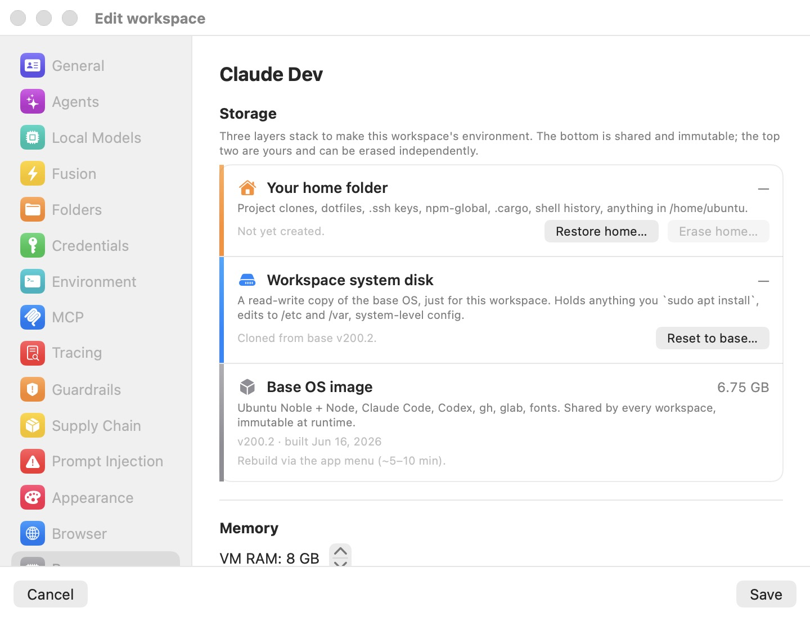
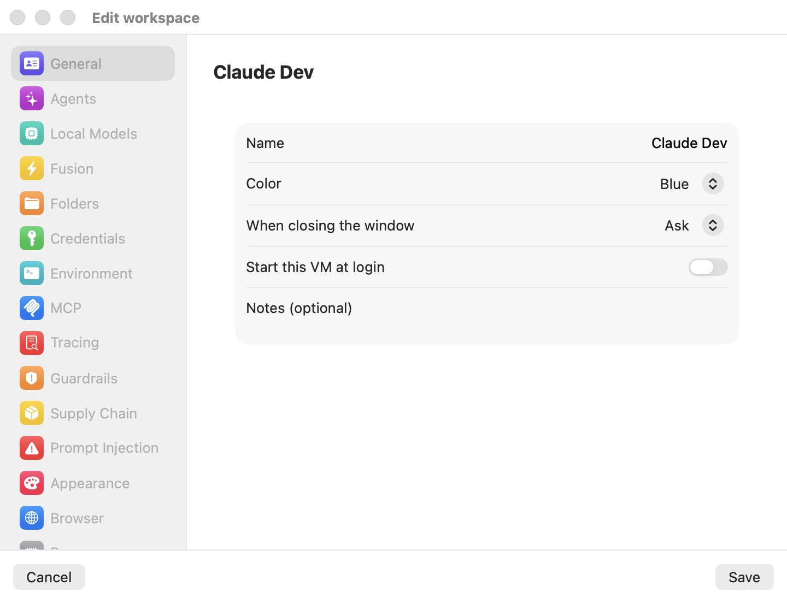

# Sessions

A session is a running [workspace](05-workspaces.mdx): its Ubuntu VM booted, its terminal tabs live, and its agent working. This chapter covers everything that happens between clicking **Start** and closing the window — the layout of the session window, tabs and git worktrees, the embedded browser and file panes, moving files and clipboard content between your Mac and the VM, checkpoints, and the choices you have when a session ends.

Unlike the sibling Bromure web browser, whose sessions are destroyed when the window closes, Bromure Agentic Coding workspaces are persistent by design. The VM's system disk and home directory survive across sessions; only deliberate actions (**Reset to base…**, **Erase home…**, **Delete workspace**) or a security wipe destroy data. Closing a session merely decides what the VM does next: keep running, suspend, or power off.

## How sessions work

Each workspace maps to exactly one VM. The VM boots from a per-workspace system disk (`disk.img`) — an APFS copy-on-write clone of the shared Ubuntu base image, created instantly on first launch and reused on every launch after that. Anything you install inside the VM (`sudo apt install`, language toolchains, system configuration) persists between sessions. The home directory `/home/ubuntu` is stored separately — on a private sparse ext4 disk image for modern workspaces — and survives even a full system-disk reset. See [Concepts](04-concepts.mdx) for the storage model in depth.

Inside the VM, all terminals belong to a single tmux session. tmux is the source of truth: each UI tab is a tmux window, and the host mirrors the guest's tab roster into the sidebar. This design means the UI can detach and reattach freely — a session can keep running headless in the background, be popped out into its own window, or be mirrored from another Mac (see [Remote access](14-remote-access.mdx)) without disturbing the agent's work.

> **Note:** Workspace VMs are not pre-warmed from a pool. Each one cold-boots from its own disk (or restores from a suspend snapshot). Only the sidecar VM behind the [agentic browser pane](#the-agentic-browser-pane) uses the pre-warmed pool.

## Starting a session

You can start a stopped workspace from several places:

1. Select the workspace in the sidebar and click **Start** (or **Resume** if it is suspended) — either on the stage's start card or in the VM dashboard.
2. Click **⋯** on the workspace's sidebar row and choose **Start**.
3. Click a placeholder cell in the terminal Grid that belongs to an off workspace.

### What boots

- **First launch** — the app clones the base image into the workspace's `disk.img` using an APFS copy-on-write clone. The clone is instant and costs no disk space up front; blocks are allocated only as the guest writes. The home image and per-launch shares (metadata share and outbox) are created, and the VM boots with 4 vCPUs (fixed) and the RAM configured in the workspace's settings.
- **Subsequent launches** — the existing system disk and home are reused, so everything installed inside the VM is still there.
- **Suspended workspace** — instead of a cold boot, the saved RAM snapshot (`vm.state`) is restored and the session resumes exactly where it left off, with its tab bar rehydrated from the saved tab snapshot. Resume is near-instant.

By default the VM joins Bromure's shared NAT switch: every workspace VM (and the agentic browser VM) shares one private subnet, gets a stable DHCP address, and can reach the others — so the browser pane can load a dev server the agent started, by the VM's IP. A per-workspace **Bridged** mode is available in the workspace settings. See [Settings — General](07-settings/general.mdx) for memory and network options.

### The boot screen

While the VM boots, an animated "dive" overlay covers the terminal area — the workspace name over a scanning progress bar, with an optional status line. It only appears if boot takes more than 0.4 seconds, and it fades out the moment the guest reports its first tab roster. During a home-storage migration the overlay shows determinate progress instead (for example "MOVING HOME — 42% OF 7.9 GB").

If no terminal appears within 30 seconds, the overlay flips to a **DIVE FAILED** panel — "«name» never returned a terminal after 30 seconds. The VM may be stuck, or the base image may be damaged." — with two buttons:

- **Keep Waiting** — re-arms the watchdog and keeps the boot going.
- **Reset Base Image…** — starts a base-image rebuild for cases where the shared image itself is damaged.

See [Troubleshooting](17-troubleshooting.mdx) if boots fail repeatedly.

### Launch-time prompts

A launch can be preceded by one of these prompts:

| Prompt | When it appears | Choices |
| --- | --- | --- |
| Base-image drift | The shared base image was rebuilt since this workspace's disk was cloned | **Reset and launch** (re-clone from the new base; home untouched) / **Launch as-is** / **Cancel** |
| Compromised workspace | A previous session was flagged for credential exfiltration | Confirm a wipe of the disk, home, RAM snapshot, and per-launch shares before boot; settings, tokens, and SSH keys are kept. See [Credentials](08-credentials.mdx). |
| Home storage upgrade | The workspace still uses the legacy shared-folder home | **Upgrade Now** (migrate to an ext4 home image during this boot) / **Not Now** (asked again next start) |
| Model still downloading | A required local model has not finished downloading | Launch is refused with an explanation. See [Local models](13-local-models.mdx). |
| Disk full | The host volume has less than 1 GB free | Launch is refused with a clear error instead of wedging mid-session. |

## The session window

All sessions live in a single shared window titled **Bromure** (1320 × 860 points by default). It is a Mail.app-style split: a resizable sidebar on the left listing every workspace, and a single *stage* on the right showing the selected workspace's terminal. The titlebar is transparent and unified with the toolbar; clicking an empty area of it drags the window, browser-style.

  

The screenshot above shows the window with an off workspace selected: the **WORKSPACES** sidebar on the left (with the pinned **Grid** node, two workspaces showing their **Off** state, an **AUTOMATIONS** section, and the black **+** button for creating a workspace), and the stage showing that workspace's VM dashboard — stat cards for CPU, Memory, vCPUs, Disk, and Uptime, a **CONFIGURATION** summary, and a **Start** button.

### The workspaces sidebar

The sidebar is a source list with one row per workspace — running or not. Each row shows the workspace name, its accent-color tile, and a run-state badge:

| Badge | State label | Meaning |
| --- | --- | --- |
| Green dot | — | Running |
| Orange, pulsing | Starting… | Booting |
| Yellow dot | Suspended | RAM snapshot saved on disk |
| Grey dot | Off | Powered off |

A red exclamation triangle marks a compromised workspace. Running workspaces show their terminal tabs nested underneath (in worktree tree order) plus an always-on **Docker** node, and reveal hover controls: pop out, close (**×**), and **+** for a new tab. The **⋯** menu on each row offers state-aware lifecycle actions: **Start** / **Resume** / **Shutdown** / **Suspend** / **Reboot**, **Add Worktrees to Grid** (running only), **Edit…**, **Duplicate**, **Reset disk**, and **Delete workspace**.

> **Note:** **Shutdown** and **Reboot** ask for confirmation because they stop running processes. **Suspend** does not — it is fully recoverable.

Drag the divider between the sidebar and the stage to resize it (default width 220 points). Dragging below roughly 100 points snaps the sidebar to a 44-point icon rail; drag back past it to expand. ⌃⌘S toggles the sidebar's collapsed state. In the collapsed rail, container tabs are hidden and tooltips carry the workspace and tab context.

### The stage

The stage shows the selected tab's terminal. It can also be covered by full-bleed overlay surfaces:

- The **VM dashboard** — click a workspace's *name* in the sidebar (see below).
- The **terminal Grid** — click the pinned **Grid** node (see [The terminal Grid](#the-terminal-grid)).
- The **Docker dashboard** — click the **Docker** node under a running workspace to manage containers and images.
- The **automation editor** — from the **AUTOMATIONS** section (see [Automation and the CLI](16-automation-cli.mdx)).

Two additional splits live inside the stage on its right edge: the [agentic browser pane](#the-agentic-browser-pane) (⌃⌘B) and the [file explorer pane](#the-file-explorer-pane) (⌃⌘E).

### The VM dashboard

Clicking a workspace's name (rather than one of its tabs) overlays its dashboard on the stage, for any run state. For a running VM it shows live vitals: CPU with a sparkline, memory used of allocated, vCPUs with load average, disk usage (taken from the guest's own `df`, which is more truthful than the host-side clone size), uptime, and a **Listening Ports** card listing the guest's externally reachable sockets as `<VM-IP>:<port>` endpoints with one-click copy. Likely-HTTP services also get a globe button that can expose that one service to the internet through a Cloudflare quick tunnel (a one-time consent dialog explains the download and terms). For a suspended or off workspace, the dashboard shows the machine spec and configuration instead.

The action bar offers **New Terminal**, **Suspend**, **Reboot**, and **Shut Down** while running, or **Start** / **Resume** otherwise. A **CONFIGURATION** card summarizes the per-tool authentication mode, Guardrails, the prompt-injection scan, and shared folders.

> **Note:** Vitals refresh about every 1.5 seconds from the guest. Zero values right after boot mean the guest agent has not reported yet.

### Title-bar controls

A per-selected-VM control cluster sits at the trailing end of the toolbar while the selected workspace is running:

| Control | What it does |
| --- | --- |
| IP pill | The VM's IP address in monospace. Click to copy — it flashes **Copied**. Tooltip: **VM IP — click to copy**. |
| Streaming dot | A pulsing red dot shown when session metadata is being sent to bromure.io (enrolled Macs, non-private workspaces). See [Enterprise](15-enterprise.mdx). |
| Engine badge | Local-inference status: a spinner while the engine warms up, a green cpu icon when ready, orange on failure. See [Local models](13-local-models.mdx). |
| Fusion bolt | Toggles [Fusion](12-fusion.mdx) for this workspace. Yellow when engaged (**Fusion engaged — click to disengage**). Disabled with the tooltip **Enable at least two models to use Fusion** until at least two providers have usable credentials. |
| **Browse files** | Opens the per-workspace file browser window (see [Moving files and the clipboard](#moving-files-and-the-clipboard)). |
| **Reboot the VM** | Reboots the guest. |
| **Inspect trace (⇧⌘I)** | Opens the [Trace Inspector](11-tracing.mdx). |
| **Edit workspace** | Opens the workspace editor. |
| **Pop out to its own window** | Moves the workspace into its own window (see below). |
| **Show or hide the agentic browser (⌃⌘B)** | Toggles the browser pane (globe icon). |
| **Show or hide repo files (⌃⌘E)** | Toggles the file explorer pane. |

### Pop out and re-dock

Any running workspace can be popped out of the unified window into its own single-VM window: click the pop-out icon on its sidebar row or in the toolbar. Its tabs become a capsule pill strip in that window's titlebar, and the pane keeps its VM and tab state — only the hosting window changes. The popped-out window carries the same toolbar controls, plus a re-dock button (**Move this VM back into the main window**) and a shared-folders popover listing mounted host folders (click a row to open it in Finder). Click the re-dock button to fold the workspace back into the unified window.

## Working with tabs

Each tab is a tmux window inside the workspace VM's single tmux session. tmux is authoritative: the guest publishes its window roster about every 0.7 seconds, and the host mirrors it into the sidebar rows (and the pill strip of a popped-out window). Tab changes such as renames are picked up within about 40 milliseconds.

- **New tab** — press ⌘T, or click **+** on the workspace's sidebar row.
- **Close tab** — press ⌘W, or hover a tab row and click its **×**. Closing the *last* tab ends the session and routes through the same close-action pipeline as closing the window.
- **Switch tabs** — press ⌘1 through ⌘9. Small chord labels appear next to the first nine rows of the selected workspace; numbering follows the sidebar's visible tree order (container tabs excluded).

Tab labels show the foreground program (`claude`, `codex`, a shell, and so on); worktree tabs show a friendlier display name such as "Website refactoring (claude)". Tabs opened by attaching a shell into a Docker container nest under that container in the **Docker** node rather than at the top level.

> **Note:** tmux window indexes can have gaps after tabs close; the UI handles the mapping, and ⌘-number chords always follow what you see in the sidebar.

### Agent status dots

Each tab's icon carries a colored status dot that tracks the agent running in it:

| Dot | Meaning |
| --- | --- |
| Orange, pulsing | The agent is working |
| Green | The agent finished |
| Red | The agent needs your input |

Status is driven by per-window hooks for Claude Code and by the traffic proxy for other agents, so the dots work without any configuration inside the VM.

## Git worktrees

A *git worktree* is a second working copy of one repository: another branch checked out into its own directory, sharing the repository's history but with its own files and its own index. Git supports many at once, so several branches can be worked on in parallel without stashing changes, re-cloning, or switching branches in place.

Bromure builds parallel *agent* lines of work on top of that. Any terminal tab whose working directory is inside a git repository can spawn a worktree with its own nested agent tab — one agent refactoring the site on `wt/website-refactoring` while another chases a bug on `wt/login-fix`, each in its own checkout, neither tripping over the other's uncommitted files. When a line of work is ready you merge its branch back (or open a pull request from it) and discard the worktree. It is the natural way to fan a task out across several agents at once and watch them in the [terminal Grid](#the-terminal-grid).

### Creating a worktree

Right-click any tab row in the sidebar to open its context menu. Two items are always present:

- **New worktree…** — opens the dialog described below. When the tab's working directory is not a git repository the item is shown but disabled, labelled **New worktree…  (Not in a git repo)**, so the menu is never silently empty. A worktree tab is itself a checkout, so it too offers **New worktree…** — that is how you branch a worktree off a worktree.
- **New automation…** — seeds the automation editor with the tab's directory (see [Automations](06b-automations.mdx)).

The **New worktree** dialog — "Creates a git worktree branched from this tab's current commit and opens a nested agent in it." — collects three things:

| Field | Purpose |
| --- | --- |
| **Task name** | A short human label, for example `Website refactoring`. It is slugified into the branch name and shown on the tab. |
| Tool popup | The agent to launch in the new checkout — **claude**, **codex**, or **grok**. Defaults to the workspace's configured agent. |
| **Initial prompt** (optional) | The first message handed to the agent when it starts, so a worktree can begin working unattended. Leave it blank to open the agent idle. |

Click **Create** (or **Cancel**). Bromure adds a git worktree branched from the tab's current commit on a branch named `wt/<slug>` — the slug is the task name lowercased with runs of other characters collapsed to single dashes and capped at 40 characters; a name whose branch already exists gets a `-2`, `-3`, … suffix. A nested agent tab then opens in the new checkout, labelled with the task name and tool, such as "Website refactoring (claude)".

> **Note:** If the tab's working directory cannot be determined, an alert — "This tab's working directory isn't available yet" — explains that the workspace is likely running an older in-VM agent, and suggests restarting it (**Shutdown**, then **Start**) so it picks up worktree support.

### How worktree tabs nest

Worktree tabs nest under the tab they were branched from, indented and prefixed with a small branch glyph so nested sub-agents read as branches rather than plain tabs. Because a worktree can itself be branched, the nesting is a tree: worktrees off worktrees are supported, and the indentation steps inward at each level, up to 6 levels deep. An **Attach terminal** tab and a running **Merge → …** tab nest under their worktree the same way. This is only a display order — each tab is still an ordinary tmux window, and ⌘-number chords follow the visible tree order.

To watch several worktree agents side by side, use **Add Worktrees to Grid** in the workspace's **⋯** menu, which adds every worktree tab of that workspace to the [terminal Grid](#the-terminal-grid) at once.

### Worktree actions

Right-click a worktree tab for the actions specific to it — **Merge…**, **Attach terminal**, and (below a divider) **Discard worktree**.

**Merge… — merging the branch back.** The dialog runs the merge in a new tab checked out at the destination; only committed work on the worktree's branch is merged. Its destination picker walks the *ancestor chain* — the immediate parent worktree, then that worktree's parent, and so on up to the repository root ("«branch» (repo root)"). The immediate parent is the safe default and is selected for you; picking anything higher is flagged **«label»  ⚠︎ skips intermediates**, because those intermediate worktrees then never receive the change. Choose a destination and click **Merge**.

- **Conflicts resolve themselves.** If the merge conflicts, the coding agent is started right there in the merge tab to resolve it automatically. If it stops with the conflict unresolved, the merge tab offers **Have the agent resolve conflicts** in its own right-click menu to try again.
- **Create Pull Request.** When the workspace has a GitHub credential (which is what authenticates `gh` inside the VM), the merge dialog gains a third button, **Create Pull Request**. Instead of merging locally it pushes the branch and has the agent open a clean GitHub pull request against the selected destination. See [Credentials](08-credentials.mdx).
- Merging does not discard the worktree — you clean it up yourself once you are happy with the result.

**Attach terminal** opens a plain terminal tab — no agent, just a shell already `cd`'d into the worktree's checkout — nested under the worktree, so you can inspect or test its changes by hand.

**Discard worktree** is the cleanup step, and it is destructive: it removes the checkout and deletes the branch. Any commits on that branch that were never merged are lost, so it asks first — "Discard worktree “«name»”?" — and closes the tab along with the checkout.

> **Note:** Only committed work crosses a merge or a pull request. Uncommitted changes in a worktree stay in that worktree, and are gone for good once you discard it.

### Worktrees from scheduled automations

Scheduled automations create worktrees too. Each unattended run makes a fresh git worktree on its own `wt/<slug>` branch and launches the agent there, so a run lands as an ordinary worktree tab — indented, attachable, and mergeable exactly like one you created by hand. See [Automations](06b-automations.mdx).

## The terminal

The active tab renders in a native, host-side terminal surface (libghostty, Metal-rendered) attached to its tmux window over a virtio socket. The surface's child process is only a byte pump, so a dead child — a VM reboot, a dropped socket — never loses terminal state: the surface simply respawns and reattaches with backoff. If the native terminal cannot start, the app silently falls back to the VM's graphical framebuffer; both are views of the same tmux session.

Appearance — font family and size, background and foreground colors, cursor shape and blink — comes from the workspace's [Appearance settings](07-settings/appearance.mdx) and applies live when you save the profile. New workspaces are seeded with JetBrains Mono 12 on a dark slate background (`#212734`), with the foreground taken from your Terminal.app theme. Only fixed-pitch fonts render; unresolvable or proportional families fall back to Menlo.

Font zoom is available per surface: ⌘+ / ⌘− / ⌘0, a trackpad pinch (each ±0.25 magnification steps one font size), and a two-finger double-tap to reset.

Workspaces with a window opacity below 1.0 get a frosted-glass terminal: the terminal area composites against the desktop with a background blur, while the titlebar, sidebar, and divider stay opaque. Opacity is clamped to 0.3–1.0 and applies live on profile save.

## The terminal Grid

The Grid is a stage surface that shows up to 25 live terminals (the layout grows squarish, capped at 5 × 5) from any mix of workspaces side by side — ideal for watching a fleet of worktree agents. Each cell is its own live terminal surface on that tmux window, independent of the workspace's stage view, so both can be open at once.

- **Add a terminal** — drag any tab row onto the pinned **Grid** node at the top of the sidebar (its tooltip reads "Drag terminals here to watch them side by side"), or press ⌘D on the active terminal to pin it and jump to the Grid. **Add Worktrees to Grid** in a workspace's **⋯** menu adds every worktree tab at once.
- **Show the Grid** — click the **Grid** node (or the grid button on the collapsed rail). Clicking a member row focuses its cell.
- **Cell controls** — each cell's header shows a status dot, the workspace name, and the tab label, with hover controls **Open in workspace** and **Remove from grid — the terminal keeps running**, plus a drag handle to swap cell positions. Right-click a cell header for the same actions.
- **Zoom** — double-click a cell (or press ⌘↩ on the focused cell) to zoom it full-stage; repeat to unzoom. Esc deliberately does *not* unzoom, because agents use Esc.

Cells belonging to an off or suspended workspace remain as placeholder cards with an **Off** or **Suspended** label and a **Start** button; cells whose tmux window disappeared are pruned. Grid membership persists across app restarts (in `~/Library/Application Support/BromureAC/grid-layout.json`).

## The agentic browser pane

The browser pane is a right-hand split inside the stage hosting a live Chromium — running in its own disposable sidecar VM, one per workspace, created lazily on first open. Both you and the agent drive it: agents control it through the built-in browser MCP server, and their tool calls can boot and reveal the browser automatically for the selected workspace. The pane never re-opens itself after you have closed it manually.

> **Tip:** This section covers the browser as one pane of the session window. For the full guide to using it — driving it yourself, letting the agent drive it through the `browser_*` tools, staying signed in, and the privacy model — see [The Embedded Browser](06a-browser.mdx).

Toggle the pane with ⌃⌘B or the globe toolbar button. The first time you open it, a consent card asks **Install the browser?** with **Download & Install** / **Not Now** — the browser image is a one-time download of roughly 500 MB.

### What you can do in it

The pane is a chrome-less browser view topped by a compact, Safari-style tab bar:

- **Back / forward** — arrow buttons, or ⌘[ and ⌘].
- **Tab pills** — one pill per tab; the *active* pill doubles as the URL field ("Search or enter URL"). Bare hostnames get `https://` prepended; anything that is not a URL becomes a Google search.
- **+** — new tab (⌘T while the pane has focus).
- **DevTools** — toggle Chromium's DevTools (F12).
- **Share** — the standard macOS share menu.
- **Site info** — click the favicon for a site-information popover, including certificate details on HTTPS pages.

Because the browser VM shares the same NAT subnet as the workspace VMs, it can load the agent's dev servers directly by the workspace's IP — copy it from the toolbar IP pill.

Drag the pane's left edge to resize it (default 640 points, between 380 and 1400; the terminal always keeps at least 240 points). Dragging below the minimum closes the pane.

### Lifecycle and persistence

The browser is disposable by default: its disk is an ephemeral clone that is deleted when the browser is torn down, so cookies and logins vanish with it. A hidden browser suspends after 10 seconds and is torn down entirely after 5 minutes collapsed. The pane's open/closed state is remembered per workspace while the app runs, but deliberately not across app restarts — the ephemeral browser does not survive a restart anyway.

To keep logins, enable **Stay signed in to websites** in the workspace's [Browser settings](07-settings/browser.mdx): Chromium's profile then lives on an encrypted per-workspace disk and survives teardowns. Toggling the setting restarts the workspace's browser (you are warned when saving).

> **Note:** While the browser view has keyboard focus, ⌘Q and ⌘Tab are captured by the guest. Click the terminal or the sidebar to get them back.

## The file explorer pane

The file explorer pane (header **FILES**) shows the active tab's git repository as an IDE-style tree of source files. **It opens on its own the moment the active tab's directory enters a git repository** — a `cd` into a repo, or switching to a tab already inside one — so you rarely open it by hand; you can also toggle it with ⌃⌘E or the **Show or hide repo files (⌃⌘E)** toolbar button. Entering a repository is the trigger, so a workspace that never visits a repo simply never shows the pane.

- **Git status at a glance** — files are colored by status with one-letter badges (M/A/U/D/R/!), folders containing changes carry an orange dot, and a pill shows the changed-file count. A "changed files only" filter and a manual refresh button sit in the header.
- **Diffs and previews** — selecting a file opens a detail split with a **Diff** / **File** segmented control: a colored unified diff with +/− counts and line-number gutters, or a rendered preview (Markdown rendered, source files syntax-highlighted, images and binaries flagged). Deleted files show struck through — "File was deleted — switch to Diff to see what was removed." Untracked and newly added files have no diff, only a preview.
- **Pop-out viewer** — a pop-out button opens the detail in a separate, full-screen-capable **File Viewer** window that follows the pane's selection live.
- **Worktree actions** — a bar directly under the header manages [git worktrees](#git-worktrees) for the current repository without opening the sidebar menu: **New worktree…** is always available inside a repo, and **Merge** and **Delete** appear when the active tab is itself a worktree. They run the same operations described under [Git worktrees](#git-worktrees) — New worktree… opens the create dialog, Merge opens the destination picker, and Delete discards the worktree and its branch after confirmation. (Local sessions only; in a [remote mirror](14-remote-access.mdx), manage worktrees from the sidebar tab menu.)

All data is gathered by running `git` (and `head`) *inside the guest* over the virtio-socket shell channel — the pane works even with no shared folder, and for remote workspaces. The tree auto-refreshes every 4 seconds while visible, and directories containing changes auto-expand once per repository.

The pane opens and closes IDE-style on its own: entering a repository (a `cd` into one, or switching to a tab whose directory is in one) opens it; leaving for a non-repository directory closes it. A manual close wins until you change repositories. Drag the pane's left edge to resize (default 260 points, between 200 and 1000; below 200 closes it).

> **Note:** The file tree is read-only — it never edits file contents (the worktree bar runs git operations, not file edits). Limits: 20,000 files listed (the tree is truncated beyond that), 512 KB per preview, 1 MB per diff.

## Moving files and the clipboard

Files and clipboard content cross the host/VM boundary four ways: the file browser window, shared folders, the terminal clipboard, and image paste.

### The file browser window

Click the **Browse files** toolbar button (folder icon) to open a Finder-like window titled **Files — «workspace»** for shuttling files in and out of the VM. Its **Locations** sidebar offers **Home** — the guest's real `/home/ubuntu`, browsed live over the virtio-socket file service — plus one entry per shared host folder (browsed directly on the host). Rows show icon, name, size, and modification date, and the listing auto-refreshes every 1.5 seconds.

- **Copy out** — drag a file from the window to Finder. Guest files download lazily on drop.
- **Copy in** — drop files anywhere on the panel to copy them into the current directory. Transfers are chunked (6 MB) with a "Copying … in/out" progress pill; name collisions get Finder-style " copy" suffixes; dropped folders arrive whole.
- **Toolbar** — up arrow (**Enclosing folder**), a monospaced guest-path breadcrumb, **New folder**, **Reveal in Finder** (host locations only), and **Refresh**.
- **Context menu** — **Open**, **Reveal in Finder** (host rows), and **Move to Trash** (host) or **Delete** (guest).
- **Double-click** — host files open with their default app; guest files download to a per-workspace cache first, then open.

> **Note:** Hidden dotfiles are not shown. Guest locations need a live VM ("The workspace must be running to browse its files."), and a just-booted VM may briefly report "The in-VM agent is updating — try again in a few seconds."

### Shared folders

For ongoing project work, shared folders are usually better than one-off transfers: up to 8 host folders can be mounted into the VM, each symlinked into the guest home as `~/<basename>` (with automatic de-duplication such as `src-2`). Configure them in the workspace's [Folders settings](07-settings/folders.mdx).

### Clipboard

The clipboard is bridged through the terminal protocol itself — there is no separate agent to configure:

- **Guest → Mac** — copying inside the guest (tmux copy mode, OSC 52) lands on the macOS pasteboard automatically; releasing a mouse selection in tmux copies it.
- **Mac → guest** — ⌘V pastes the macOS clipboard into the terminal using bracketed paste.
- **Selection** — a plain mouse drag selects text macOS-style; ⌘C copies the host-side selection. Selecting never copies by itself.

### Pasting images

Pressing ⌘V with an image on the clipboard becomes a file transfer: the image is written into the guest at `/home/ubuntu/.bromure/pastes/clipboard-<timestamp>-<id>.<ext>`, and the guest file path is pasted as text in its place — so the agent can read the image from disk. A transient thumbnail chip appears at the caret with a progress line during upload, lingers briefly on completion (red on failure), and is dismissed by your next keystroke.

Recognized as images: image files copied from Finder (only when *every* copied item is an image) and bare bitmaps such as screenshots or a browser's "Copy Image" — anything that also carries a text flavor pastes as text as usual, so ordinary ⌘V is never hijacked. Pastes are capped at 96 MB total (larger falls back to text), and paste files older than 7 days are cleaned up automatically inside the guest. The paste directory lives in the home image, so pasted paths survive a VM reboot.

> **Tip:** Links work in the other direction automatically: URLs the agent or a CLI tool opens inside the guest (OAuth logins, `xdg-open`) are relayed to the host and open in your default Mac browser. Only `http`/`https` URLs are relayed, rate-limited; `mailto:` links are deliberately dropped.

## Checkpoints and rollback

Bromure takes automatic rollback points so a session that goes wrong can be walked back without a full reset.

### What is captured, and when

On each *successful* boot of a workspace, the app silently snapshots both storage layers as copy-on-write clones under the workspace's `checkpoints/` directory:

- the **system disk** (`disk.img`), and
- the **ext4 home image** (`home.img`, stored under `checkpoints/home/`), for workspaces on the modern home model.

Because a checkpoint is only taken after a boot that produced a working terminal, every checkpoint is proven bootable. Retention follows a tiered ladder: the last few boots are kept unconditionally, then one per day for a week, then one per week for a month. Checkpoints are free to create but consume real disk space as the live disk diverges from them.

### Restoring the home

**Restore home…** lives in the workspace editor's [Resources pane](07-settings/resources.mdx), on the **Your home folder** storage row (it is disabled while the workspace is running — close the session window first).

  

Clicking it lists the available rollback points in a popup — as the dialog explains, "each one is the home as it was when that session started". Pick one and confirm: the current home is checkpointed first, so a restore can itself be undone. A workspace that has never booted on the ext4 home model shows **No home checkpoints yet** instead.

### Resetting the system disk

**Reset to base…**, on the **Workspace system disk** row of the same pane (also **Reset disk** in the sidebar's **⋯** menu), is the nuclear option for the system layer: it deletes `disk.img` so the next launch re-clones a fresh copy of the base image. The confirmation — "Reset “«name»” system disk to base?" — spells out what is wiped: everything you `sudo apt install`ed, modifications to `/etc`, `/var`, `/usr`, `/opt`, and system-wide config. Your home folder is untouched: projects, dotfiles, SSH keys, and shell history all survive.

Resetting is blocked while the VM runs, and a reset also drops any saved RAM snapshot and tab state — a fresh disk plus old RAM would corrupt instantly.

> **Note:** Checkpoints answer a different question than suspend. Suspend preserves the *running state* of the current session so you can resume it; checkpoints preserve *disk contents at known-good points in time* so you can roll a broken environment back. A suspend snapshot is discarded whenever the disk it belongs to is reset or reverted.

> **Tip:** For forensic access to a checkpoint or a stopped workspace's home image without booting anything, **Workspaces ▸ Open ext4 file…** opens any ext4 `.img` in a read-only, Finder-like browser — you can preview and extract files directly on the Mac. See [Advanced](16a-advanced.mdx#the-ext4-file-browser) for the full browser, in-place editing, and the `fsck` integration.

## Closing a session

Closing a session — via the **×** on the workspace's sidebar row, the close button of its popped-out window, or ⌘W on its last tab — resolves the workspace's **When closing the window** preference from the [General settings pane](07-settings/general.mdx):

  

| Action | What it does |
| --- | --- |
| **Run in the background** | Detaches the UI only. The VM keeps running headless — agents keep working — and you can reattach at any time from the sidebar. |
| **Suspend** | Pauses the VM and saves its RAM to disk (`vm.state` in the workspace's storage). The next launch restores it near-instantly, with the same terminals; the tab bar is snapshotted too (`tabs.json`) so the restored session shows its tabs immediately. |
| **Shut down** | A clean ACPI power-off. In-flight processes stop. The system disk and home are kept — nothing is destroyed. A full shutdown clears any saved suspend state, so the next launch cold-boots. |
| **Ask** (default) | Shows a prompt each time: "Close “«name»”?" with buttons **Run in the Background**, **Suspend**, **Shut Down**, and **Cancel**, and the explanation "Run in the background keeps the VM running so you can reattach later. Suspend saves its state to disk. Shut down powers it off." |

A few details worth knowing:

- **Suspend/resume identity** — restore requires the exact same VM configuration, so the workspace's machine identifier, MAC address, and share paths are persisted alongside the snapshot. On resume, the host pings the guest to resynchronize its clock.
- **Restore failures** — if a saved snapshot cannot be restored on an interactive launch, the app falls back to a fresh boot. Automation-initiated starts abort instead — they never silently destroy a suspended session.
- **Changing shared folders while suspended** — a snapshot cannot resume against a different share set, so editing shared folders forces a **Discard suspended VM…** confirmation; the next launch cold-boots. Home and shared-folder files are unaffected.
- **Guest-initiated reboot** — running `reboot` inside the guest does not end the session: the app detects the reboot intent and relaunches the VM in place.
- **Destroying data is always explicit** — a shut-down workspace keeps its disk and home. Data is only destroyed by **Reset to base…**, **Erase home…**, **Delete workspace** (all confirmed; see [Workspaces](05-workspaces.mdx)), or the forced wipe after a credential-exfiltration compromise — and even then your profile settings, tokens, and SSH keys are kept, and shared host folders are never touched.

## Keyboard shortcuts

Session-window chords are host-owned — they are intercepted before the terminal sees them, so they work regardless of what runs inside the VM.

### Window and tabs

| Shortcut | Action |
| --- | --- |
| ⌘T | New tab |
| ⌘W | Close tab (the last tab closes the session) |
| ⌘1 – ⌘9 | Select tab by sidebar row order |
| ⌘D | Pin the active terminal to the Grid and reveal it |
| ⌘↩ | Zoom / unzoom the focused Grid cell |
| ⌘N | Open the workspace manager |
| ⌃⌘S | Toggle the sidebar |
| ⌃⌘E | Toggle the file explorer pane |
| ⌃⌘B | Toggle the agentic browser pane |
| ⇧⌘I | Open the Trace Inspector |

### Terminal

| Shortcut | Action |
| --- | --- |
| ⌘C | Copy the selection |
| ⌘V | Paste (images upload into the guest as files) |
| ⌘+ / ⌘− / ⌘0 | Font size larger / smaller / reset |
| Pinch / two-finger double-tap | Zoom font / reset zoom |

### Browser pane (while focused)

| Shortcut | Action |
| --- | --- |
| ⌘T / ⌘W | New / close browser tab |
| ⌘R | Reload |
| ⌘[ / ⌘] | Back / forward |
| ⌘L | Focus the address field |
| F12 | Toggle DevTools |

> **Note:** An 80 ms auto-repeat guard means holding a chord down fires it once; deliberate re-presses all fire.
