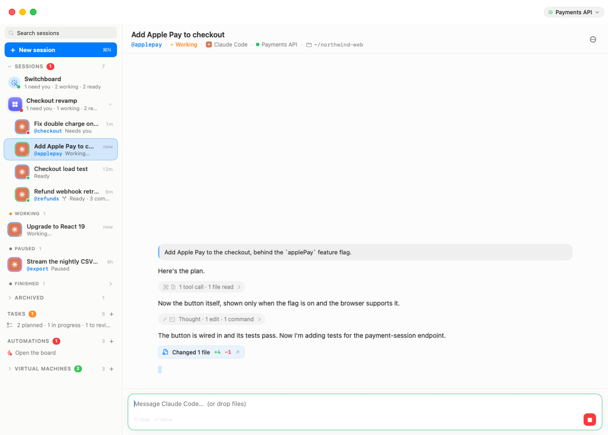
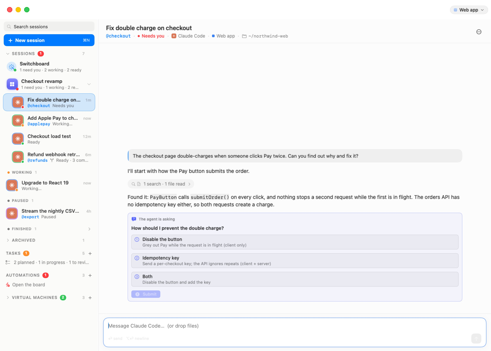

# The Chat

Every session opens as a chat. You write in the composer at the bottom; the agent's replies, its questions and a summary of what it did appear above. Underneath, the agent runs in an ordinary terminal tab on its machine (a workspace, in the settings editor) — the chat reads its conversation and types into it for you, so everything the agent would do in the terminal it does here too. The terminal is always one click away with the **Linux** pill (**⌥⌘U**; see [The Sessions Home](05-sessions-home.mdx#the-toolbar)).

This chapter describes the chat of a running session. A paused or finished session shows the same conversation, read back from this Mac, with a composer whose next message resumes it — see [Paused and finished sessions](05-sessions-home.mdx#paused-and-finished-sessions).

<p align="center">
  
</p>

## The composer

The composer reads "Message *agent*…  (or drop files)".

- **Return** sends. **⌥⏎** inserts a new line. The hint under the text says so: "⏎ send ⌥⏎ newline".
- While the agent is working, the send button becomes a red **Stop** button ("Stop the agent (Esc)") and the hint reads "⎋ stop ⏎ send". **Esc**, or a click on Stop, interrupts the agent — the same as pressing Esc in its terminal. You can still type and press Return while it works; the message goes to the agent as it would in the terminal.

When the conversation is empty, the chat reads "*agent* is ready. Say what you need."

## Attachments

You can hand the agent any file from your Mac:

- **Drag files** from Finder (or a picture from a browser or Preview) anywhere onto the chat. The chat shows **Drop to attach**; each file becomes a chip above the composer, with a thumbnail for pictures. Click a chip's badge to remove it.
- **Drop on the text itself**, and the text field first receives the file's path; the chat turns a path to a file on your Mac into a chip the same way. This also works for a path you paste.

Any kind of file works, up to **512 MB each**; one that is too big or unreadable is refused with a beep. Nothing is sent until you send the message. Then the files are copied into the machine under `~/.bromure/drops/` (each name prefixed with the time of sending, so two files called `photo.png` never collide) and their paths are added to the end of your message, so the agent can open them. You can send attachments with no text at all.

Pictures you attach from this Mac stay in the conversation: they are shown inside your message, in place of their paths, and remain there when you scroll back or reopen the session later. A picture that was sent from another client shows as its path.

> **Note:** The drops folder lives in the machine's home, so attached files survive a reboot of the machine. They also take space there; delete old ones from `~/.bromure/drops/` if you attach large files often.

## Slash commands

Type **/** at the start of the composer to open the **Commands** palette above it: the agent's built-in commands (`/model`, `/compact`, `/review`, …) and the ones you added yourself — for Claude Code, your custom commands (`~/.claude/commands/` and the project's `.claude/commands/`), tagged **yours**, and your skills, tagged **skill**; for Codex, your saved prompts (`~/.codex/prompts/`). The header shows the agent's name and the number of matches.

Keep typing to filter. **↑↓** move, **⇥** completes, **↩** sends (a partial name is completed first), **esc** closes and clears. Clicking a command that takes no argument sends it at once; one that takes an argument is completed with a space so you can type the rest.

A slash command is answered by the agent's terminal, not in the conversation, so the chat shows what the terminal printed in a card under the command (refreshed for a few seconds; "Nothing new appeared in the terminal." when there was nothing). Click the card's **×** to dismiss it.

When the command opens a menu in the terminal — `/model`, `/config` and the like — the card turns into an **inline terminal**: the agent's real terminal, right in the chat, with the hint "↑↓ move · ⏎ pick · esc close". Keys go straight to the agent. **Fold** ("Back to the printed output") shrinks it back to text, **Interact** ("Show the terminal here and type into it") brings it back. The card folds by itself once the menu has closed.

## Asking another session: @

Type **@** to open the **Sessions** palette — the "sessions you can ask", by @nickname, with their title and machine. A session without a nickname is listed with a proposed one, tagged **new name**, and gets it when you pick it. **↑↓** move, **⇥** or **↩** complete, **esc** removes the `@…` you were typing and keeps the rest of the sentence.

Naming a session with `@name` lets your agent send it a request. Requests and delegations appear in a **Delegations** panel above the composer, with their state, and let you answer a delegate's question in your agent's place. See [Agents Working Together](06d-delegation.mdx).

## Questions from the agent

When Claude Code asks you a multiple-choice question, the chat shows it as a live card in the brand blue: "The agent is asking", the question, and its options, each with its description.

<p align="center">
  
</p>

- Click an option to pick it. A question that allows several answers shows checkboxes instead of numbers, and a **None of these** button.
- When the agent asks several questions at once, the card reads "The agent is asking *N* questions — answer them all, then Submit" and shows one tab per question, ticked once answered. Picking an answer to a single-choice question moves on to the next unanswered tab.
- Nothing reaches the agent until you click **Submit**, so a wrong click is just another click to fix. **Submit** stays disabled until every question has an answer ("Submit enables once every tab is answered."). After sending, the card says "Answers sent to the agent."; if the session couldn't be reached, "Couldn't reach the session — try again."

Once answered, a question folds to one grey line: the question, an arrow, and what you picked (or "dismissed"). Click the line to see the whole question again, with your pick highlighted; the chevron folds it back.

While a question is waiting, the session sits in the sidebar's **Needs you** group with a red dot.

Other agents' menus, and Claude Code's other dialogs, appear as a [status card](#sign-in-and-status-cards) instead.

## Activity lines

What the agent does between two messages — commands it runs, files it reads and edits, searches, web pages, subagents, and its thinking — is folded into one quiet line, for example "Thought · 1 edit · 1 command" or "3 commands · 2 files read · 1 edit". A run of a single step names it ("Grep src", "Edit /home/ubuntu/pipeline/export/csv.py"). Failed tool calls are counted in red on the line ("1 failed").

Click a line to open it ("Show what the agent did") and see every step as a card, and click again to fold it ("Hide the details"). While the agent is in the middle of a run, the line shows a spinner and the step in progress — "Running npm test…", "Reading src/app.ts…", "Editing …", "Searching …", "Fetching …", "Thinking…". Between runs, a "Thinking…" cue, or a blinking caret while a reply is being written, shows the agent is still going.

### What a turn changed

When the agent's turn edited files, the turn ends with a button such as **Changed 3 files +120 −35** — the files its edits touched and the lines added and removed, counted from its own edit calls. Hover it for the list of files; click it to open the session's review window on those files. See [Branches & Review](06c-branches.mdx).

## Cards

Inside an opened activity line, each step is drawn for what it is:

| Card | Shows |
|---|---|
| **Edit** | A coloured diff of the change (edits and patches alike), with added and removed lines; long diffs are cut with "… *N* more lines". |
| **File write** | A brand-new file's contents, syntax-highlighted, with its path. |
| **Command** | The shell command on a `$` line with a copy button. A command that writes files through a heredoc shows the files it writes and each heredoc as its own block. |
| **Files and searches** | The file, folder or pattern a read, list or search was about; the URL or query of a web fetch. |
| **Result** | A tool's output, folded to its first line ("*tool* result"); errors in red. |
| **Thinking** | The agent's reasoning, in italics. |
| Anything else | The tool's name and summary, opening to its raw input. |

In the agent's replies:

- **Code blocks** are syntax-highlighted, with a copy button.
- **Diagrams** written as ```` ```mermaid ```` blocks are drawn as diagrams, offline, in light or dark to match the window. A diagram that fails to parse is shown as its source instead.
- **Tables** are drawn as cards: a tinted header, rows separated by hairlines, one rounded border. In a chat narrower than about 480 points — a room cell, or the iPhone — a wide table keeps readable columns and scrolls sideways instead of squeezing.

**To-dos.** When the agent keeps a to-do list (Claude Code's to-dos, Codex's plan, Oh My Pi's todo), the latest list is pinned above the composer as a **To-dos** checklist — done, in progress, blocked and pending items at a glance — instead of scrolling away with the conversation. A long list scrolls in place.

## Messages

Hover a message to see its tools, at its top right:

- the **time** it was sent (hover the time for the full date);
- **Copy** — copies the message. For a long reply, which the chat draws in several pieces, Copy on its first piece takes the whole reply;
- **Edit and send again** — on your last message only: puts its text back in the composer, to change and send again.

When you scroll up while the agent keeps going, a **Jump to latest** button appears at the bottom; click it to go back to the end. The chat follows new messages on its own only while you are at the end.

A long conversation is drawn 300 messages at a time: a **Show *N* earlier messages** button at the top brings in the previous ones. A very long one isn't read in full at first; the top then offers **Load earlier conversation** to fetch more of it from the machine.

## Sign-in and status cards

When the agent is stuck on something in its terminal that isn't a conversation — a dialog, a sign-in, an error — the chat detects it and shows a card at the end of the conversation, so you rarely need to open the terminal.

**The agent is waiting for you to trust this folder.** Agents ask whether to trust a folder the first time they work in it. The card shows the folder and a **Trust this folder & continue** button. When the dialog is one the chat can't answer, it says "Waiting for the agent's trust dialog — it will continue once answered."

**Sign in to *provider*.** An agent with no account set up shows its sign-in; the sidebar marks the session **Sign in needed**. Where Bromure can sign in for it (Claude, ChatGPT for Codex, Grok, Kimi), the card explains "Bromure signs you in on this Mac and keeps your *provider* account out of the machine — the agent only ever sees a stand-in key." and offers **Sign in to *provider*…**:

1. Click it. The card reads "Opening your browser to sign in…" and the provider's sign-in page opens in your Mac's browser.
2. Approve access there.
3. Bromure captures the credential, keeps it on this Mac, and restarts the agent on its stand-in ("Signed in. Starting *agent* again…"). A conversation that had begun is resumed; one that never started gets your opening message.

If nothing arrives within five minutes, the card says so and you can try again. See [Credentials & the Wire Boundary](08-credentials.mdx) for how the stand-in key works, and [Models & Providers](13-models.mdx) for managing sign-ins.

Where Bromure can't sign in for the agent, the card drives the agent's own sign-in instead: "How would you like to sign in?" with its methods as buttons, then **Open sign-in page**, and a **Paste code** field with **Submit** for the code the page gives you.

***agent* needs a model provider.** Oh My Pi has no account to sign in to: "*agent* has no model provider on this machine yet. Add an API key or a local model in the machine's settings, then start the session again." **Machine settings…** opens the machine's settings.

**Other dialogs.** Any other menu the agent puts up is shown with its title and its options as buttons (the one Return would pick is highlighted), plus **Dismiss** (Esc) — "Or open Linux (⌥⌘U) to answer in the terminal." Approval panels and Kimi Code's multiple-choice questions appear this way. Kimi Code puts up neither in its default **Never ask** mode — it asks in plain text instead — only when the machine's **Kimi approvals** setting is **Ask when needed** (see [General](07-settings/general.mdx#kimi-approvals)).

**Failures.** When the agent stops on an error, a red card says which kind — "The agent couldn't authenticate", "The agent hit a usage limit" or "The agent stopped with an error" — with the agent's own error line under it. An authentication failure offers **Sign in to *provider*…** when Bromure can sign in for the agent; otherwise the card reads "Switch to the terminal to resolve it, then send again."

## Finding things in a conversation

There is no search field inside the chat. Use the sidebar's **Search sessions** field or the **In conversations** section of the [⌘K palette](05-sessions-home.mdx#the-command-palette-k): both search what was said in every session, and opening a result scrolls the chat to the first message containing your words.

## Limits

- **History.** The chat holds about 24 MB of a conversation's history at a time. Older parts of a longer conversation are fetched with **Load earlier conversation**; once the history held passes about 40 MB, its oldest part is dropped from view again. The conversation itself is untouched on the machine. In a [mirror of a remote Mac](14-remote-access.mdx), a chat's first open reads only the latest ~1.5 MB, and a chat opened again fetches only what's new since last time.
- **Appearance.** The chat has its own look — warm paper in light mode, the system's colours in dark mode, following macOS. A machine's [Appearance settings](07-settings/appearance.mdx) (terminal font, colours, opacity) apply to its terminals, not to the chat.
- **What the chat sees.** The chat is built from the agent's own conversation file and from what its terminal shows. Anything the chat doesn't recognise is still in the terminal: when in doubt, open **Linux** (⌥⌘U).
