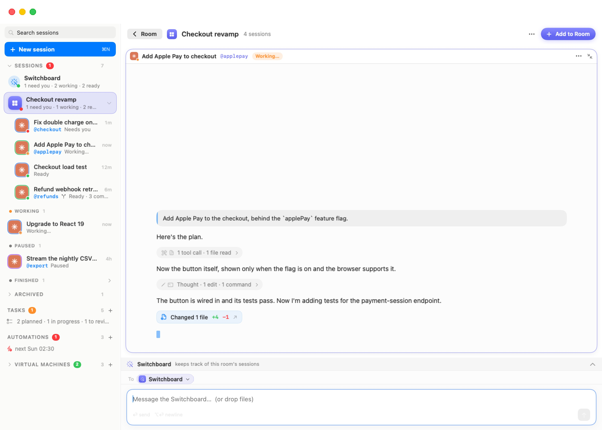

# Rooms

A **room** groups sessions that work on the same thing: a feature, a project, an incident. Click a room and its sessions fill the stage as a grid of live chats. A **Switchboard** of its own is docked underneath and keeps track of those sessions only. Nothing outside the room is closed or stopped. It is just out of the way.

A room is only a grouping. Its sessions keep their own agents, folders and machines. One room can mix sessions from several machines (workspaces, in the settings editor) and several agents. Leaving a room, or removing the room, doesn't touch a session's work.

  

## Creating a room

There are three ways to make one:

- **Workspaces › New Room…**, or **New Room…** in the ⌘K palette. Give the room a name (the field suggests "e.g. Payments v2") and click **Create**. The empty room takes the stage, ready for sessions.
- **Drag a session onto another session** in the sidebar. If the target is already in a room, the dragged session joins that room. Otherwise Bromure makes a new room holding both, named after the target: its @nickname if it has one, else its title.
- **Right-click a session › Move to Room ›**. The submenu lists your rooms (the one the session is already in is greyed out), then **New Room…**, which creates a room with that session in it.

Room names are unique. If you pick a name that is taken, Bromure appends a number ("Payments 2").

You add sessions to an existing room the same ways: drop a session on the room's row in the sidebar, use **Move to Room ›**, or start a new one inside it. To start a session inside the room, click **Add to Room** in the room's header, use **New Session in Room** from the room's right-click menu, or click **New Session** in an empty room. The [new-session screen](06-new-session.mdx) then shows a strip reading "New session in “*room*”", and the session joins the room when it starts.

To take a session out, right-click it and choose **Remove from Room**. You can also use the **⋯** menu on its cell and choose **Remove from Room**. A toast offers **Undo**. The session goes back to the ordinary list, still running.

> **Note:** A Switchboard can't be moved into or out of a room. The global Switchboard stays global, and each room's Switchboard belongs to its room.

## Rooms in the sidebar

Rooms are listed in the **Sessions** section. Each room row shows a tile in the room's colour, the room name, and a one-line summary. The summary gives the same counts as the Switchboard row ("1 need you · 1 working · 2 ready"), or how many sessions the room holds, or "Empty — drag sessions here". A dot on the tile shows the most pressing state inside: red when a session needs you, orange when one is working, green when one is ready.

The room's sessions are nested under its row. The chevron on the row folds and unfolds them. Click the row itself to put the room on stage.

### Colours

Rooms get their colours in turn from a palette of eight: **Indigo**, **Green**, **Amber**, **Pink**, **Cyan**, **Violet**, **Red** and **Lime**. To change one, right-click the room and use **Color ›**. The colour tints the room's tile, its cell borders, its Switchboard and the "To" token on its composer.

### The room's right-click menu

| Item | What it does |
| --- | --- |
| **New Session in Room** | Opens the new-session screen for a session that joins this room. |
| **Rename…** | Renames the room. You can also double-click its name in the stage header. |
| **Color ›** | Picks one of the eight colours. |
| **Archive Room** / **Unarchive Room** | Archive puts the room away with every session in it, including its Switchboard. Their agents end, their conversations stay readable, and the room moves to the **Archived** fold. Unarchive brings the room and its sessions back. An archived room's stage says **Archived** in its header and offers **Unarchive Room**. |
| **Ungroup Room** | Removes the room but keeps its sessions. They go back to the list, still running. The room's Switchboard is archived. |
| **Delete Room…** | Deletes the room **and every session in it**, after a confirmation: "Delete “*room*” and every session in it?". The agents stop and the sessions leave the list, but their folders stay on the machines. To keep the sessions, ungroup the room instead. |

> **Note:** Sessions in a room are never archived automatically. Outside rooms, a session that ended more than three days ago moves to the Archived fold on its own. See [The Sessions Home](05-sessions-home.mdx).

## The room stage

The stage has a header, the grid of sessions, the room's Switchboard dock, and one composer at the bottom. (At **1×1** there is no dock: the Switchboard gets a tab of its own — see [Tabs](#tabs).)

The header shows the room's tile and name, how many sessions it holds, the layout picker, a **⋯** menu of room actions, and **Add to Room**. The header stays on one line: when the stage is narrow the session count is shortened first, and **Add to Room** shrinks to a round **+** button.

Each **cell** is the session's live chat, with its title bar on top. The title bar shows:

- the agent's avatar with its status dot
- the title and @nickname
- a tinted chip while the session is **Working** or **Needs you**
- a **⋯** menu with **Open as Session** (show it on its own, with its header and full composer) and **Remove from Room**
- a zoom glyph

Cells are interactive. You can answer a question card, expand activity lines and scroll back, just as in [the chat](06a-chat.mdx). In a narrow cell, a wide Markdown table keeps a readable width and scrolls sideways instead of being squeezed.

A session that isn't running shows its last messages, faded, under a floating bar. The bar gives its state (for example **Paused**), the words "a message picks it up", and a **Resume** button. A session that is still starting shows **Starting…**.

Clicking anywhere in a cell **focuses** it: the cell gets a tinted border, and the composer is aimed at that session (see [The composer's "To" target](#the-composers-to-target)). The [Files pane](06f-machines.mdx) and the [embedded browser](06g-browser.mdx) follow the focused cell.

### The ⋯ menu (room actions)

| Item | What it does |
| --- | --- |
| **Resume All** | Resumes every session in the room that isn't running. |
| **End All** | Ends every running session in the room. |
| **Hide Ended Sessions** | A toggle. When it is on, ended sessions leave the grid and the tabs. Bromure remembers the setting for each room. |

## Layouts

The layout picker in the header offers:

- **Auto**, "Sized to fit the room". This is the default. It picks the smallest grid that shows every session at once, up to 4×4.
- **2×2** and **3×3**, one click each.
- **⋯**, "Other layouts": **1 × 1**, **2 × 1**, **3 × 2** and **4 × 4 grid**. When one of these is in use, the button shows it (for example "3×2") instead of "⋯".

Each room remembers its own layout. When a row isn't full, the cells in it stretch to use the room. For example, three sessions in a 2×2 grid show as two cells above one wide cell.

### Tabs

When a room holds more sessions than its layout shows, the extra sessions go to further **tabs**. A tab bar appears above the grid. Each tab shows the avatars of its sessions and the first two titles. At **1×1**, the tab bar is always shown and every session gets its own tab, labelled with its title and status. The first tab, with a wand icon, is the room's **Switchboard**, shown full size in place of the dock.

- **⌃Tab** shows the next tab, and **⌃⇧Tab** the previous one.
- Clicking a tab shows it. The focus moves to that tab's first session unless the focused session is already on it.
- At **1×1**, the composer follows the tab on show: the **Switchboard** tab aims it at the Switchboard, and a session's tab at that session. Switching the layout to 1×1 opens the tab matching the composer's current target.

## Zoom

**Click a cell's title bar** to zoom that session to the whole stage. This also focuses it. While a cell is zoomed:

- A **Room** button with a back arrow appears at the left of the header. Click it, press **Esc**, or click the title bar again to go "Back to the whole room".
- The layout picker is hidden.
- The Switchboard dock folds to its title line. Its chevron lets you peek at the Switchboard without leaving the zoom.

  

## The room's Switchboard

Every room can have its own **Switchboard**. It works like the [global Switchboard](06e-switchboard.mdx), but its scope is the room. Its session list shows only the room's sessions, and it is only woken about them. It reaches a session outside the room only when you name that session explicitly, by @nickname or exact name, and it says so when it does. Sessions it starts with its tools join the room.

The dock sits under the grid in every layout except **1×1**, where the Switchboard is the first tab instead (the paused and starting states below show there the same way):

- In a room without a Switchboard yet, the dock says what it is for and offers **Start the Room's Switchboard**. It starts on the machine where most of the room's sessions run, or else on the one you used last. It greets you with a short status of the room. It runs Claude Code in the folder `~/.bromure/rooms/<room-name>`, where it keeps its brief and its own conversation. While it boots, the dock reads "The room's Switchboard is starting…".
- When it is running, the dock shows its conversation under a **Switchboard** title line reading "keeps track of this room's sessions". Drag the top edge of the dock to make it taller or shorter.
- When it is paused, the title line reads "Paused — your next message picks it up" and offers **Resume**.
- The chevron at the right folds and unfolds the dock (**Fold the Switchboard** / **Show the Switchboard**).

A room's Switchboard doesn't get its own row in the sidebar. You reach it through the room. Ungrouping the room archives its Switchboard, and deleting the room deletes it.

## The composer's "To" target

A room has one composer, under the dock (at 1×1, under the tab on show), spanning the stage. Above it, a **To** token names who the message goes to: the room's Switchboard or one session.

- Clicking a cell aims the composer at that session. Clicking in the Switchboard's conversation aims it back at the Switchboard.
- Clicking the token opens a picker with a **Send to…** search field. The **Switchboard** is pinned at the top, described as "The whole room at once", because it speaks for every session in the room. Below it is every session in the room, with its avatar, @nickname and status. Sessions that aren't running are dimmed. Picking a session also brings its tab on screen.

The placeholder names the target, for example "Message the Switchboard… (or drop files)". You can attach files by dropping them, as in any chat.

If the target isn't running, the composer still works. It reads "Message *name* — it wakes up and carries on…", and sending the message resumes that session with it. In that composer too, typing **@** offers the sessions the target can ask (see [Agents Working Together](06d-delegation.mdx)).

With no Switchboard started and nothing focused, the composer area says "Start the room's Switchboard to ask it about everything here."

## Moving between rooms

- **Workspaces › Next Room** (**⌃⌘R**) shows the next room's grid, cycling through the rooms that aren't archived. From anywhere other than a room, it opens the first room. With no rooms at all, it offers **New Room…** instead.
- The ⌘K palette has a **Rooms** section that lists every room with its summary.
- Clicking a session in the sidebar leaves the room and shows that session on its own.

## On a mirrored server, iPhone and iPad

Rooms live on the Mac that runs the sessions. A [fat-client window](14-remote-access.mdx) mirroring another Mac shows that Mac's rooms with the same stage, dock and composer. **New Room…**, **Next Room** and **New Session…** in the menu bar act on the focused mirror window.

The iPhone and iPad clients show rooms as sidebar rows and cards. A room's screen has the room's Switchboard and a "To" composer that takes attachments: photos, files, pasted images and drops, uploaded to the target's machine when you send. The iPad shows the grid. The iPhone shows one tab per session.
