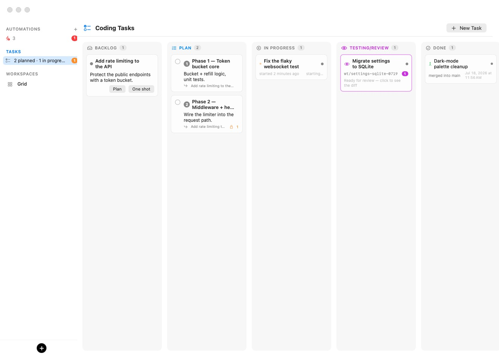

# Coding Tasks

The coding board turns a written brief into merged code with as little ceremony as you want: write what you need, either **plan** it into reviewable phases with an interactive planning agent or **one-shot** it, watch the agent work in its own git worktree, review the diff with line-anchored comments, and merge. Every stage is a column; every task is a card.

The sidebar keeps a slim **TASKS** section near the top — a pulse row summarizes the board (*9 planned · 1 in progress · 2 to review*) with an orange badge counting cards waiting in Testing/Review and a red badge when an agent needs your input. Click the section title or the row to open the board, or press **⇧⌘T** anywhere.

<p align="center">
  
</p>

| Column | What sits there |
| --- | --- |
| **Backlog** | Briefs you have written but not started. Each card offers **Plan** and **One shot**. |
| **Plan** | Phase cards a planner agent filed from a brief — numbered, dependency-aware, multi-selectable. |
| **In Progress** | Phases and one-shot tasks an agent is actively working on, each in its own worktree. |
| **Testing/Review** | Finished work waiting on you: the card opens the review window with the branch's diff. |
| **Done** | Merged, pull-requested, or closed-without-merge tasks. |

Everything on this page works identically from a remote [rich client](14-remote-access.mdx) — the board, the planning window, and the review window all mirror over the control API.

## Writing a task

**+ New Task** (or clicking a backlog card) opens the editor:

- **Title** and a **description** written in Markdown, with a **Write / Preview** toggle. The brief becomes the agent's prompt, so write it like one.
- **Workspace** and **Agent** — the task runs inside the chosen [workspace](05-workspaces.mdx) with one of its configured agents.
- **Start the agent in** — a folder inside the workspace. When it is a git repository of its own, the task runs in a fresh worktree and branch there.
- **Create folder & git repo if needed** — for greenfield work: starting or planning first runs `mkdir` + `git init` (with an empty root commit) when the folder is not already its own repository. Leave it off for a folder inside an existing repo.

A brief in the Backlog offers two buttons:

- **One shot** sends the task straight to In Progress: the agent does the whole thing autonomously and hands you the diff in Testing/Review.
- **Plan** opens a planning session first.

## Planning

**Plan** launches a *visible, interactive* planning session and opens its window — a native conversation view, no terminal required. The session opens on **your brief**, rendered as a card; the agent explores the repository read-only, narrates what it finds, and asks questions when the brief leaves real choices open.

Questions arrive as a **tabbed card** — one tab per question, exactly mirroring the picker the agent shows in its own session. Answers are collected locally and stay editable until you press **Submit**, which sends the whole set at once; a mis-click is never final. You can also type free-form answers in the composer at the bottom of the window, or press **Open Terminal** to watch the raw session.

When the agent has what it needs, it files the plan onto the board — ordered **phase cards** in the Plan column, each roughly one reviewable pull request of work, with dependencies between them — and records a plan overview. The window then shows **Plan is ready** with the phase count and a **Close** button, the planning session's tab closes itself, and the brief leaves the Backlog (its phases supersede it; delete them all and it returns).

Planning is watched: if the workspace reboots, the agent is quit, or the session dies before phases are filed, the card's spinner ends with a specific reason — *click Plan to retry* — instead of spinning forever.

## The Plan column

Phase cards are numbered in plan order and carry:

- A **dependency badge** (a lock with phase numbers) when the phase needs earlier phases **Done** first.
- A **queued** badge when you started it before its dependencies finished — it starts automatically the moment they are all Done.
- Their parent brief's name.

Select multiple phases with the checkboxes and the selection bar appears: **Start N selected** one-shots each of them (dependency-gated phases queue), **Clear** drops the selection, and **Delete** removes the whole selection behind one confirmation. Editing a phase shows its **Depends on** list — every sibling phase with a checkbox, so dependencies can be reworked by hand.

Phases run *fully autonomously* — no interactive input is expected once started.

## In Progress

A started task boots the workspace if needed, creates a fresh worktree of the repository, and launches the agent with the brief as its prompt. The card shows a live agent-status dot, when it started, and **Needs your input** in red if the agent is blocked on a question — clicking the card jumps to the live session. The sidebar's TASKS badge counts these so you never miss one.

When the agent reports done, the task moves to **Testing/Review**, and its terminal tab closes on its own — a finished session is not left squatting in the tab strip. If the agent crashes instead, the card turns red rather than pretending to work.

## Testing/Review

The Testing/Review card opens the **review window**: the branch's full diff against its parent, read live from the VM, with per-file expanders, add/remove counts, and any plan the agent recorded.

Review like a pull request:

- **Line comments**: hover any added or context line and click the margin bubble to attach a comment to that exact line; anchored comments render under their lines. File-level and general comments work too.
- **Send Back to In Progress** delivers every drafted comment to the agent — formatted as *In `foo.js`, line 196: use a different method* — and the task returns to In Progress for another round. The agent resumes on the same worktree and branch.
- **Merge** — the split button's default merges into the parent branch; hold it for **Squash & Merge**, **Create Pull Request…** (when the workspace has a GitHub token), or merging into any other branch. A clean merge closes its own terminal tab; conflicts open a resolver session instead.
- **Close Without Merging** discards the round while keeping the record in Done.

> **Tip:** The same line-comment workflow exists *outside* the board: when the active tab runs a coding agent, the [file explorer](06-sessions.mdx) diff pane grows the same margin bubbles, and **Send to agent** batches your comments straight into that session — code review without ever creating a task.

## Removing cards

Every card grows a **✕** on hover (and a **Remove from board** context-menu entry), behind a confirmation. For cards with real work behind them the dialog offers a choice: **Stop Agent & Delete Worktree** (In Progress) or **Delete Worktree & Branch** (Testing/Review) tears everything down, while **Remove Card Only** leaves the session and checkout untouched in the workspace.

## Storage and API

Tasks persist in one file next to the workspace store, with atomic writes and ISO-8601 dates:

```
~/Library/Application Support/BromureAC/tasks.json
```

The whole board is mirrored on the app's control socket for [rich clients](14-remote-access.mdx) and scripts:

| Endpoint | Purpose |
| --- | --- |
| `GET /tasks` | List every task. |
| `POST /tasks` | Create or update (upsert) a task document. |
| `POST /tasks/<id>/start` | Start it (worktree + agent). |
| `POST /tasks/<id>/plan` | Launch the planning session. |
| `POST /tasks/<id>/comment` | Add a review comment (`text`, optional `file` and `line`). |
| `POST /tasks/<id>/send-back` | Deliver unsent comments and return the task to In Progress. |
| `POST /tasks/<id>/merge` | Merge (`squash`, optional `target`). |
| `POST /tasks/<id>/open-pr` | Create a pull request instead of merging. |
| `POST /tasks/<id>/to-testing`, `/to-in-progress` | Move it by hand. |
| `POST /tasks/<id>/destroy` | Stop the agent, delete the worktree and branch, remove the card. |
| `DELETE /tasks/<id>` | Remove the card only. |

Under the hood, the planning and task agents talk back to the board through a per-session **board MCP server** (vsock, host-side): `board_get_task`, `board_set_plan`, `board_create_subtasks`, and `board_ready_for_review` are how phases get filed and how a finished task announces itself — no polling, no scraping.
