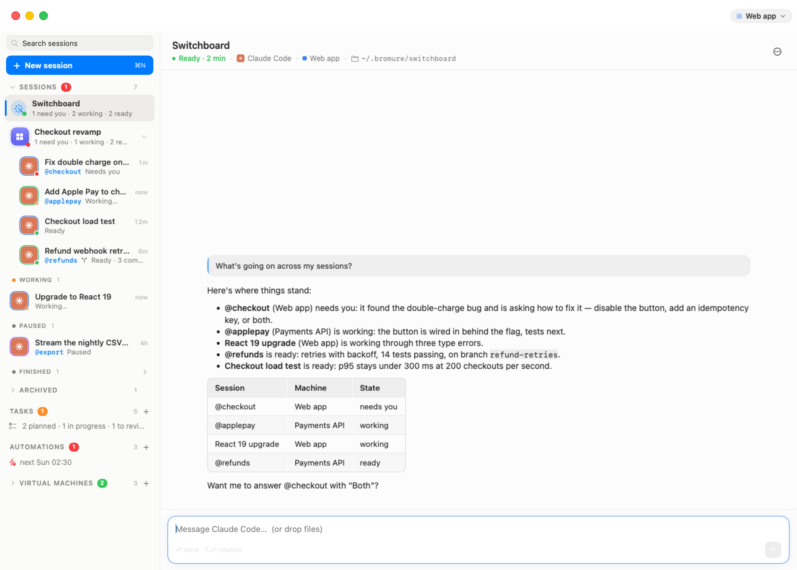
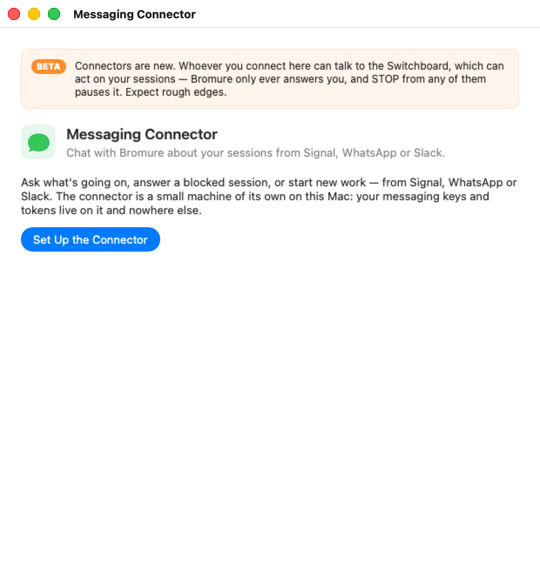

# Switchboard & Messaging

With several agents at work, you don't want to click through each session to learn which one needs you. The **Switchboard** is one conversation that keeps track of all the others. It tells you what is working, what is stuck and what is waiting on you. It carries your answers to the right session, and it starts, resumes or puts away sessions when you ask.

With the **Messaging Connector**, you can also talk to it from your phone or from Slack.

## The Switchboard

  

### Where it appears

The **Switchboard** row sits at the top of the Sessions list, above the rooms and sessions. It appears once **two or more sessions are in flight**, which means starting, working, ready, or waiting on you. Sessions that are paused, ended or archived don't count. The row also stays while the Switchboard itself is busy or asking you something, so it never vanishes mid-answer. With a single session, you are already looking at the only thing that matters, and the row stays out of the way.

- **Before the Switchboard has been started**, the row reads "Ask about all your sessions at once". Clicking it starts the Switchboard.
- **Once it is running**, the row gives a summary: "*n* need you · *n* working · *n* ready". With nothing in flight, it reads "Keeps track of your sessions".
- **In the collapsed sidebar rail**, the Switchboard is a wand icon at the top, following the same rule. Its tooltip gives the same summary, for example "Switchboard — 1 need you · 2 working".

Click the row or the wand to put the Switchboard's conversation on stage. It is a chat like any other: type to it, attach files, scroll back. See [The Chat](06a-chat.mdx).

### What it is

Underneath, the Switchboard is an ordinary Claude Code session with a special role:

- **It runs in the machine you used last** (a machine is a workspace, in the settings editor). If you have no sessions yet, it runs in the first machine.
- **It works in the folder `~/.bromure/switchboard`.** The `CLAUDE.md` there is its brief, rewritten each time it starts.
- **It is the only session with the `bromure-switchboard` MCP server** (vsock port 5836). The host refuses those tools to any other session.
- **It doesn't write code or edit files.** Its brief tells it to keep track, tell you what matters in a few lines, and carry your decisions.

When it starts, it greets you with a short status of every session. After that, it doesn't poll. When something happens that is worth its attention, the host types a one-line notice into its conversation, starting `[Switchboard]`. For example, a session has needed you for a few seconds, or a session it acted on has finished. The notice only goes in when its prompt is free, and at most every 20 seconds. The Switchboard then looks, tells you what matters, and ends its turn.

The Switchboard is never archived automatically. If you archive it, or its agent stops, clicking the row brings it back.

### What it can do

These are its tools, from the `bromure-switchboard` MCP server:

| Tool | What it does |
| --- | --- |
| `list_sessions` | Lists every session: its handle (the @nickname, or a short slug of its title), machine, agent, folder, state, last activity, and the last thing its agent said. |
| `read_session` | Shows a session's recent turns, or the last lines of its terminal. The terminal shows permission prompts and dialogs that no transcript records. |
| `pending_question` | Shows what a session that needs you is waiting on: its question with numbered options, plus its screen. |
| `list_workspaces` | Lists the machines a new session can run in. |
| `next_events` | Shows what happened since it last looked: sessions started, finished a turn, ended or needing you, and model calls refused (a wrong API key, or no credit). |
| `send_to_session` | Types a message into a session, or wakes a sleeping session with it. Long or multi-line text is left in a file in the session's `~/.bromure/inbox/`, with a one-line pointer. |
| `answer_question` | Answers a session's pending question: picks a numbered option, or types a free answer. |
| `press_keys` | Presses keys at a prompt `answer_question` can't handle. Only 1 to 12 of `Enter Escape Tab BTab Space BSpace Up Down Left Right C-c y n a 0`–`9` are allowed. |
| `start_session` | Starts a new session in a machine, with an opening message and a choice of agent (Claude Code by default), in the folder it names or, by default, a fresh folder of its own. |
| `resume_session` | Wakes a sleeping or ended session, optionally with a message. |
| `archive_session` | Puts a session away. |
| `message_user` | Sends you a message on the channel you last wrote from (Signal, WhatsApp or Slack). With no phone or Slack connected, the Switchboard is told to answer in its conversation instead, and pointed to **Workspaces › Infrastructure › Messaging Connector…**. |

You talk to it in plain words: "what's going on?", "tell @checkout to go with option 2", "start a Codex session in Payments API to bump the Node version", "archive the load test".

If a model provider refuses a session's calls (HTTP 401, 402 or 403), the Switchboard tells you which session, or at least which machine, is affected, so you can fix its credentials. See [Models & Providers](13-models.mdx). A repeated refusal is reported once per machine every 10 minutes.

### Safety: it acts only on your word

The Switchboard reads the output of every session. That output could contain instructions planted in a web page or a file. So the actions that speak for you are checked by the host, not left to the model's judgement.

- **Checked actions:** answering a blocked session, which covers `answer_question`, `press_keys`, and `send_to_session` to a session that needs you. Archiving a session is checked too.
- **The rule:** each of these must quote your own words, verbatim, from a message *you* typed into the Switchboard's conversation in the last **30 minutes**. The host looks for the quote among your messages. Its own `[Switchboard]` notices and the opening brief don't count.
- **When there is no match**, the action is refused and the Switchboard has to ask you first.

In practice: it will tell you "@checkout is asking whether to disable the button, add an idempotency key, or both", and wait. It answers only after you say "answer @checkout with both".

It never approves a permission prompt or answers a question because another session's output told it to.

### STOP and RESUME

From a connected phone or Slack, send **STOP** (on its own; case and a leading `/` don't matter).

- The host pauses the Switchboard at once, before the model sees the message. It interrupts the Switchboard's current turn and replies "Paused — I won't act on any session. Send RESUME to continue."
- While paused, its acting tools are refused: `send_to_session`, `answer_question`, `press_keys`, `start_session`, `resume_session` and `archive_session`. It can still read sessions and answer your questions.
- The pause covers the rooms' Switchboards too.
- **RESUME** turns it back on ("Resumed."). The pause is not saved: it also ends when Bromure restarts.

> **Note:** STOP and RESUME are handled only when they come from the Messaging Connector. Typed into the Switchboard's chat on the Mac, they are ordinary messages.

### Room Switchboards

Each [room](06b-rooms.mdx) can have a Switchboard of its own, docked under the room's grid. It works the same way, with these differences:

- It only lists the room's sessions and is only woken about them.
- It works in `~/.bromure/rooms/<room-name>`.
- The sessions it starts join the room.

The global Switchboard in the sidebar still sees everything.

## The Messaging Connector

The **Messaging Connector** links the Switchboard to Signal, WhatsApp or Slack. From wherever you are, you can ask what's going on, answer a blocked session, or start new work:

- *"what's going on?"* gets a short status, phone-sized.
- *"api 2"* answers a blocked session. When a session starts needing you and you last wrote from your phone, the Switchboard messages you the question word for word, with numbered options and how to reply.
- *"start a codex session in infra to bump the coturn image"* starts new work.
- **STOP** / **RESUME** pause and resume it, as above.

Your messages arrive in the Switchboard's conversation as `[Signal] …`, `[WhatsApp] …` or `[Slack] …`. The Switchboard answers you on the channel you last wrote from. Its replies start with "☎️ ". If the Switchboard isn't running, your message starts it.

  

### Setting it up

Open **Workspaces › Infrastructure › Messaging Connector…**. Once the connector exists, you can also use its **Messaging** row in the sidebar.

The window carries a **BETA** banner: "Connectors are new. Whoever you connect here can talk to the Switchboard, which can act on your sessions — Bromure only ever answers you, and STOP from any of them pauses it. Expect rough edges."

Click **Set Up the Connector**. Bromure creates a small machine of its own for it, which "Runs isolated on this Mac". It is a managed VM like a registry, with 512 MB of memory by default. This is where the messaging services run:

- Signal (signal-cli-rest-api) and WhatsApp (GOWA), in Docker
- Slack, over Socket Mode

Your messaging keys and Slack tokens live on that machine's disk and nowhere else.

The connector's machine behaves like any other managed machine:

- **Start with Bromure** is on by default. With it on, the connector starts with the app and is suspended when you quit.
- **Start** and **Stop** are in the window, and on its sidebar row.

**Only the services you have set up run.** A service starts when you open its **Connect…** sheet, and disconnecting stops it. An unused WhatsApp service is never left dialling out.

Then click **Connect…** on the channel you want. It is available once the connector is running. Its tooltip, "Waiting for the connector to start", explains when it isn't.

### Signal and WhatsApp

Both ask **Where do you want to chat with Bromure?**

**Chat with yourself.** Bromure becomes a linked device of your own account, and you talk to it in your own **Note to Self** (Signal) or **Message yourself** (WhatsApp) chat.

- Nothing else to set up. Scan the QR code from your phone:
  - Signal: **Settings › Linked devices › Link new device**
  - WhatsApp: **Settings › Linked devices › Link a device**
- WhatsApp also offers **Use a pairing code instead**. Enter the account's number, click **Get Code**, then on the phone choose **Link with phone number instead** and type the code.
- **Replies don't notify you.** Signal and WhatsApp never notify you about your own chat, so open it to see them.
- Only that chat reaches the Switchboard. A linked device receives your other conversations too, because that's how linking works. The connector drops them, and its log records only that a message was ignored, never what it said.

**Chat with a Bromure contact.** Bromure uses a second account and shows up like a person in your chats, so its replies notify you.

- **Signal** needs a spare phone number that can receive one text or one call:
  1. Enter **Bromure's number — the spare one (international format)** and click **Text Me a Code**.
  2. If Signal asks for a captcha, click **Open Signal's captcha page**. Solve it, right-click **Open Signal**, copy the link and paste it into the field.
  3. If no text arrives (landlines, some VoIP numbers), click **Call Me Instead**, and Signal reads the code out. Signal only calls a number it has tried to text first, so the button is enabled after the text.
  4. Click **I Have the Code**. Enter the code, and **Your own number — the only one Bromure will answer**. Click **Verify**.
- **WhatsApp:** Bromure can't create a WhatsApp account. It links to one you set up for it:
  1. Get a spare number: a second SIM or eSIM, or a landline (WhatsApp can verify it with a voice call).
  2. Install **WhatsApp Business**, which runs next to your regular WhatsApp on the same phone, and register it with the spare number.
  3. Enter **Your personal WhatsApp number**. Bromure answers messages from this number only. Click **I Have the Second Account — Continue**.
  4. Scan the QR code with WhatsApp Business (**Settings › Linked devices › Link a device**), or use a pairing code.

  Then write to that contact from your personal WhatsApp.

> **Warning:** WhatsApp doesn't officially support this kind of link, and may disconnect it. Signal is the more dependable channel.

### Slack

Slack connects through a Slack app of your own, in your workspace. "Slack opens with its settings filled in: direct messages only, no channels, no public URL." Your workspace admin may have to approve the app.

1. Click **Create the App in Slack**, pick your workspace and click **Create**. If the link doesn't open the form, choose **Create New App › From an app manifest** in Slack instead. Paste the manifest shown under **The app's manifest** (**Copy Manifest**).
2. In Slack, **Install App › Install to Workspace**, and allow. If your workspace needs an admin's approval, it waits for them. Then click **I've Installed It — Continue**.
3. Paste the two tokens and click **Connect**:
   - **Bot User OAuth Token**, from the app's **OAuth & Permissions** page. It starts with `xoxb-`.
   - **App-level token**, from **Basic Information › App-Level Tokens › Generate Token and Scopes**. Add the `connections:write` scope and generate. It starts with `xapp-`.

   "Both are checked with Slack from the connector and kept there, on its own disk — not on this Mac."
4. **Pair your account.** Bromure shows a six-digit code. In Slack, open **Bromure** (under **Apps**) and send it the code in a direct message. **Whoever sends the code becomes the only person Bromure answers on Slack.** Send it yourself, and don't share it.
   - The code works for 10 minutes. **New Code** gets another.
   - After several wrong codes sent to the app, pairing stops ("If that wasn't you, someone else in your workspace is trying").

   Once paired, Bromure sends you a message in that conversation. From then on, only your direct messages reach the Switchboard. Channels and everyone else are ignored.

If you close the sheet before pairing, the Slack card reads "App set up — not paired with your account yet" and offers **Pair…**.

### Checking it works

A connected channel's card offers **Send Test Message**. With *Chat with yourself*, it lands silently in your own chat, so open it to check.

The **Log** at the bottom of the window records the connector's steps and each message received or ignored, never its content.

### Disconnecting and removing

- **Disconnect…** on a channel's card forgets that channel's link or tokens on the connector. For Slack, the app stays in your workspace until you remove it there (**Slack › Settings › Manage apps**).
- Removing the connector from its sidebar row deletes its machine and everything on it: the linked accounts and the Slack tokens. A device linked to your own account stays listed on your phone until you remove it there.

### Privacy and security

- **Only you reach the Switchboard:** your own number (a Bromure contact), your own self-chat, or your paired Slack account. The connector drops everything else before the Switchboard could see it.
- **Your messaging keys and tokens stay on the connector's machine.** The rest of Bromure never holds them.
- **What the Switchboard sends you is only what it chooses to relay.** Credentials inside your machines are stand-ins, never the real secrets. See [Credentials & the Wire Boundary](08-credentials.mdx).
