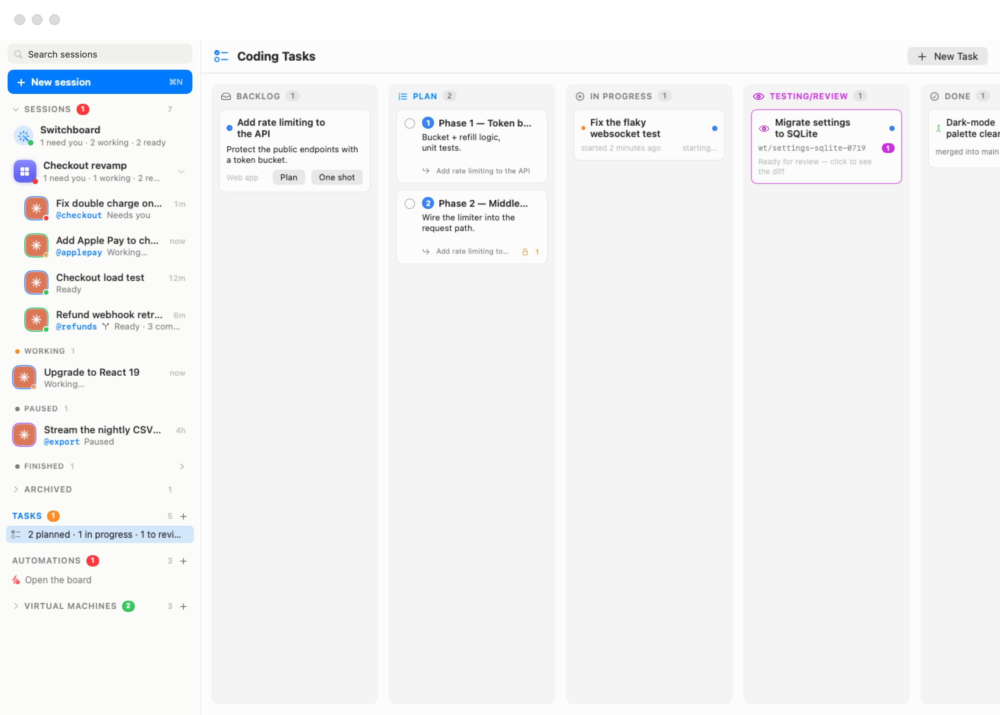

# Coding Tasks

The coding board turns a written brief into merged code with as little ceremony as you want: write what you need, either **plan** it into reviewable phases with an interactive planning agent or **one-shot** it, watch the agent work in its own git worktree, review the diff with line-anchored comments, and merge. Every stage is a column; every task is a card.

In the sidebar, the **Tasks** section sits just below Sessions, above Automations and Virtual Machines. Its header shows how many tasks there are, an orange badge counting cards waiting in Testing/Review, a red badge when an agent needs your input, and a **+** for a new task. Under it, one line summarizes the board (*2 planned · 1 in progress · 1 to review*), or reads **Open the board** when it is empty. Click the section title (**Open the coding board (⇧⌘T)**) or that line to open the board titled **Coding Tasks**; you can also press **⇧⌘T** (**Workspaces › Tasks**) or choose **Coding Tasks** in the ⌘K palette.


<p align="center">
  
</p>

| Column | What sits there |
| --- | --- |
| **Backlog** | Briefs you have written but not started. Each card offers **Plan** and **One shot**. |
| **Plan** | Phase cards a planner agent filed from a brief — numbered, dependency-aware, multi-selectable. |
| **In Progress** | Phases and one-shot tasks an agent is actively working on, each in its own worktree and each shown as a session in the sidebar. |
| **Testing/Review** | Finished work waiting on you: the card opens the review window with the branch's diff. |
| **Done** | Merged, pull-requested, or closed-without-merge tasks. |

Everything on this page works identically from a remote [rich client](14-remote-access.mdx) — the board, the planning window, and the review window all mirror over the control API.

## Writing a task

**New Task** at the top of the board, the **+** on the sidebar's Tasks header, or clicking a backlog card opens the editor:

- **Title** and a **description** written in Markdown, with a **Write / Preview** toggle. The brief becomes the agent's prompt, so write it like one.
- **Workspace** and **Agent** — the task runs on the chosen [machine](06f-machines.mdx) (a workspace, in the settings editor) with one of the agents available on it.
- **Start the agent in** — a folder inside the machine. When it is a git repository of its own, the task runs in a fresh worktree and branch there.
- **Create folder & git repo if needed** — for greenfield work: starting or planning first runs `mkdir` + `git init` (with an empty root commit) when the folder is not already its own repository. Leave it off for a folder inside an existing repo.

A brief in the Backlog offers two buttons:

- **One shot** sends the task straight to In Progress: the agent does the whole thing autonomously and hands you the diff in Testing/Review.
- **Plan** opens a planning session first.

## Planning

**Plan** launches a *visible, interactive* planning session and opens its window — a native conversation view, no terminal required. The session opens on **your brief**, rendered as a card; the agent explores the repository read-only, narrates what it finds, and asks questions when the brief leaves real choices open.

Questions arrive as a **tabbed card** — one tab per question, exactly mirroring the picker the agent shows in its own session. Answers are collected locally and stay editable until you press **Submit**, which sends the whole set at once; a mis-click is never final. You can also type free-form answers in the composer at the bottom of the window, or press **Open Terminal** to watch the raw session.

When the agent has what it needs, it files the plan onto the board — ordered **phase cards** in the Plan column, each roughly one reviewable pull request of work, with dependencies between them — and records a plan overview. The window then shows **Plan is ready** with the phase count and a **Close** button, the planning session's tab closes itself and its session is archived, and the brief leaves the Backlog (its phases supersede it; delete them all and it returns).

Planning is watched: if the machine reboots, the agent is quit, or the session dies before phases are filed, the card's spinner ends with a specific reason — *click Plan to retry* — instead of spinning forever.

## The Plan column

Phase cards are numbered in plan order and carry:

- A **dependency badge** (a lock with phase numbers) when the phase needs earlier phases **Done** first.
- A **queued** badge when you started it before its dependencies finished — it starts automatically the moment they are all Done.
- Their parent brief's name.

Select multiple phases with the checkboxes and the selection bar appears: **Start N selected** one-shots each of them (dependency-gated phases queue), **Clear** drops the selection, and **Delete** removes the whole selection behind one confirmation. Editing a phase shows its **Depends on** list — every sibling phase with a checkbox, so dependencies can be reworked by hand.

Phases run *fully autonomously* — no interactive input is expected once started.

## In Progress

A started task boots the machine if needed, creates a fresh worktree of the repository, and launches the agent with the brief as its prompt. The agent appears as a session in the sidebar like any other, so you can follow it in the chat. The card shows a live agent-status dot, when it started, and **Needs your input** in red if the agent is blocked on a question — clicking the card (**Open the task's live session**) puts that session on the stage. The sidebar's Tasks badge counts these so you never miss one.

Right-click an In Progress card for **Restart Session**, **Move to Testing**, **Close Without Merging**, **Stop Agent & Delete Worktree** and **Remove Card Only**.

When the agent reports done, the task moves to **Testing/Review**: its terminal tab closes on its own and its session is **archived**, so finished work doesn't pile up in the Sessions list. The archived session stays readable in the sidebar's Archived fold (see [The Sessions Home](05-sessions-home.mdx)). If the agent crashes instead, the card turns red rather than pretending to work.

## Testing/Review

A Testing/Review card shows the task's branch and how many review comments it carries ("Ready for review — click to see the diff"). Click it to open the **review window** — the same window used to [review a session's changes](06c-branches.mdx), titled **Review — <task>**, with the task's own buttons.

The window shows the branch's diff, read live from the machine (so the machine must be running), with per-file expanders, added and removed line counts, the commits and working-tree status, and the plan the agent recorded, if any. A picker at the top chooses what the diff is compared against:

| Choice | Shows |
|---|---|
| **Since <parent>** (default) | Everything the branch changed since it left its parent branch, committed or not. |
| **Uncommitted** | Only edits not committed yet, new files included. |
| **Last commit** | The last commit alone. |

Review it like a pull request:

- **Mark files as looked at.** Each file has a **Viewed** mark (**Mark as looked at — it folds away until it changes again**). A viewed file folds away, and unfolds again by itself if its diff changes.
- **Comment.** Hover a line and click the margin bubble (**Comment on this line**) to comment on that exact line, use **Comment on this file** on a file header, or type in the composer at the bottom for a comment on the whole change. In the composer, ⏎ adds the comment, ⌥⏎ inserts a new line and ⇧⌘⏎ sends everything back. Draft comments can be removed before you send them.
- **Send back.** The send button reads **Send Back with 1 Comment**, **Send Back with N Comments**, or **Send Back to In Progress** when there are none. It delivers every draft comment to the agent in one message — formatted as *In `foo.js`, line 196: use a different method* — and moves the task back to In Progress for another round, on the same worktree and branch (⇧⌘⏎).
- **Merge.** The **Merge into <parent>** split button merges into the parent branch when clicked. Its menu offers **Squash & Merge into <parent>**, **Create Pull Request…**, **Merge into…** any other branch of the repository, and a **Remove worktree after merge** option (on by default: the worktree and branch are removed once the merge is verified on the target, never before). A clean merge moves the task to Done ("Merging… goes Done once the changes land"); conflicts open a session that resolves them.
- **Open Terminal** jumps to the task's worktree on the machine.

Right-click a Testing/Review card on the board for **Merge into <parent>…**, **Back to In Progress**, **Close Without Merging** (ends the round but keeps the record in Done), **Delete Worktree & Branch** and **Remove Card Only**.

> **Tip:** You don't need a task to review an agent's work. Every session with a folder has **Review Changes** in its menu and in ⌘K, and the chat's **Changed N files** line opens the same window for that turn. See [Branches & Review](06c-branches.mdx).

## Removing cards

Every card grows a **✕** on hover (and a **Remove from board** context-menu entry), behind a confirmation. For cards with real work behind them the dialog offers a choice: **Stop Agent & Delete Worktree** (In Progress) or **Delete Worktree & Branch** (Testing/Review) tears everything down, while **Remove Card Only** leaves the session and checkout untouched on the machine.

## Storage and API

Tasks persist in one file next to the machine store, with atomic writes and ISO-8601 dates:

```
~/Library/Application Support/BromureAC/tasks.json
```

The whole board is mirrored on the app's control socket for [rich clients](14-remote-access.mdx) and scripts:

| Endpoint | Purpose |
| --- | --- |
| `GET /tasks` | List every task. |
| `POST /tasks` | Create or update (upsert) a task document. |
| `POST /tasks/<id>/start` | Start it (worktree + agent). |
| `POST /tasks/<id>/plan` | Launch the planning session. |
| `POST /tasks/<id>/comment` | Add a review comment (`text`, optional `file` and `line`). |
| `POST /tasks/<id>/send-back` | Deliver unsent comments and return the task to In Progress. |
| `POST /tasks/<id>/merge` | Merge (`squash`, optional `target`). |
| `POST /tasks/<id>/open-pr` | Create a pull request instead of merging. |
| `POST /tasks/<id>/to-testing`, `/to-in-progress` | Move it by hand. |
| `POST /tasks/<id>/destroy` | Stop the agent, delete the worktree and branch, remove the card. |
| `DELETE /tasks/<id>` | Remove the card only. |

Under the hood, the planning and task agents talk back to the board through a per-session **board MCP server** (vsock, host-side): `board_get_task`, `board_set_plan`, `board_create_subtasks`, and `board_ready_for_review` are how phases get filed and how a finished task announces itself — no polling, no scraping. The tools are wired automatically for every supported agent: Claude Code loads a per-branch MCP config, Codex gets per-invocation `mcp_servers` overrides, and Grok reads a project-scoped `.grok/settings.json` written into the session's checkout (and excluded from its diff).
