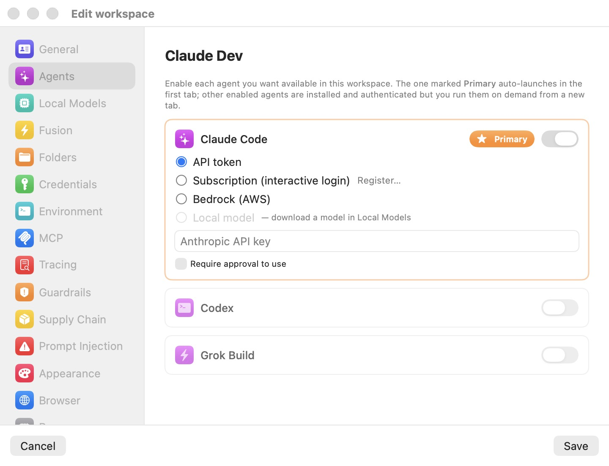

# Agents

The **Agents** pane decides which coding agents are available in a workspace and how each one signs in. Bromure Agentic Coding ships three agents — **Claude Code**, **Codex**, and **Grok Build** — and any subset can be enabled per workspace. The pane's subtitle states the model plainly: enable each agent you want available in this workspace; the one marked **Primary** auto-launches in the first tab, and other enabled agents are installed and authenticated but you run them on demand from a new tab.

Whatever credential you enter here never reaches the VM. The agent inside the sandbox is handed a decoy key; the host proxy swaps the decoy for the real value on the wire. That [wire boundary](../18-glossary.mdx) — and the subscription-registration and token-swap machinery the auth modes below depend on — is the subject of the [Credentials](../08-credentials.mdx) chapter.

  

## Enabling agents and choosing the primary

Each agent is a card with an enable switch in its top-right corner. Toggle it on to reveal that agent's authentication options; toggle it off to collapse the card and remove the agent from the workspace.

One enabled agent is always the **Primary**, marked with an orange star pill. The primary auto-launches in the first terminal tab when a session opens; the other enabled agents are installed and authenticated but wait until you start them from a new tab. To promote a different agent, enable it and click **Make primary** on its card — the previous primary is demoted but keeps its own authentication. Disabling the current primary automatically promotes another enabled agent, and the last remaining agent cannot be disabled: a workspace always has at least one.

## Authentication modes

When an agent is enabled, a radio group selects how it authenticates. Which modes are offered depends on the agent — **Bedrock** is exclusive to Claude Code:

| Mode | Claude Code | Codex | Grok Build |
|---|---|---|---|
| **API token** | Yes | Yes | Yes |
| **Subscription (interactive login)** | Yes | Yes | Yes |
| **Bedrock (AWS)** | Yes | — | — |
| **Local model** | Yes | Yes | Yes |

### API token

Paste a provider API key into the secure field — its placeholder names the provider: **Anthropic API key**, **OpenAI API key**, or **xAI API key**. The key is stored on the host, encrypted; the VM only ever sees a decoy that the proxy rewrites to the real value on requests bound for that provider. A **Require approval to use** checkbox (off by default) is described under [Require approval to use](#require-approval-to-use) below.

Newly enabled agents default to this mode.

### Subscription (interactive login)

Signs the agent in with your paid subscription (Claude, ChatGPT/Codex, or Grok) rather than an API key. An inline **Register…** button runs a one-time interactive login flow; once it completes, a green seal appears next to the mode alongside **Re-register…** and **Forget** controls. The real OAuth tokens stay on the host and are refreshed there while the VM is served fakes — whether that swap is currently active is shown, and can be reset, in the [Tracing](tracing.mdx) pane.

This is the factory-template default for Claude Code.

### Bedrock (AWS) — Claude Code only

Routes Claude Code through Amazon Bedrock using the AWS credentials you configure under **Credentials → AWS**. A **Default Model ID** field overrides the Bedrock model Claude Code requests — for example `us.anthropic.claude-sonnet-4-6-v1:0`; leave it empty to use Claude Code's built-in default. Bedrock is not offered for Codex or Grok Build.

### Local model

Runs the agent entirely against an on-device model served by the host, with no cloud provider involved. The option is greyed out — labeled **— download a model in Local Models** — until at least one model is installed in the [Local Models](local-models.mdx) pane. Once a model is available, the agent is pointed at the local engine through its base-URL environment variable (`ANTHROPIC_BASE_URL`, `OPENAI_BASE_URL`, or `XAI_BASE_URL`) and serves the model selected in Local Models. The engine, on-device routing, and hybrid fallback are covered in the [Local Models](../13-local-models.mdx) chapter.

> **Note:** Turning on **Enable local models** for the workspace pins every enabled agent to **Local model** automatically, and turning it back off restores each agent's previous mode. You normally set on-device inference from the [Local Models](local-models.mdx) pane rather than agent by agent.

## Require approval to use

In **API token** mode, the **Require approval to use** checkbox adds a consent gate: before the proxy swaps the decoy key for the real one, the host pops a dialog so you can allow the use once, for a short window, or for the rest of the session. It is off by default. The same per-credential approval pattern recurs throughout the [Credentials](../08-credentials.mdx) pane.

## Settings reference

| Setting | Description |
|---|---|
| **Enable** (per agent) | Makes the agent available in this workspace. Default: **Claude Code** on and primary; **Codex** and **Grok Build** off. |
| **Primary** / **Make primary** | Marks the agent that auto-launches in the first tab. Default: **Claude Code**. The last enabled agent cannot be turned off. |
| **Auth mode** | Radio: **API token** / **Subscription (interactive login)** / **Bedrock (AWS)** (Claude Code only) / **Local model** (needs an installed local model). Default: **Subscription (interactive login)** for Claude Code in the factory template; newly enabled agents default to **API token**. |
| **API key** | Secure field for the provider key in token mode (`ANTHROPIC_API_KEY` / `OPENAI_API_KEY` / `XAI_API_KEY`). Injected into the VM as a decoy; swapped on the wire. Default: empty. |
| **Require approval to use** | Checkbox (token mode). Consent dialog before each decoy→real key swap. Default: off. |
| **Default Model ID** | Bedrock mode only. Overrides the Bedrock model id, e.g. `us.anthropic.claude-sonnet-4-6-v1:0`. Default: empty (agent's built-in default). |
| **Register… / Re-register… / Forget** | Subscription mode only. Runs or clears the interactive-login registration. Default: not registered. |

## Related chapters

- [Credentials](../08-credentials.mdx) — how keys, subscription tokens, and AWS credentials are held on the host and swapped fake→real on the wire.
- [Local Models](../13-local-models.mdx) — the on-device engine that backs the **Local model** auth mode.
- [Fusion](fusion.mdx) — the multi-model pane draws its legs from the agents you configure here.
- [Tracing](tracing.mdx) — the subscription token-swap status rows for the **Subscription** modes.
