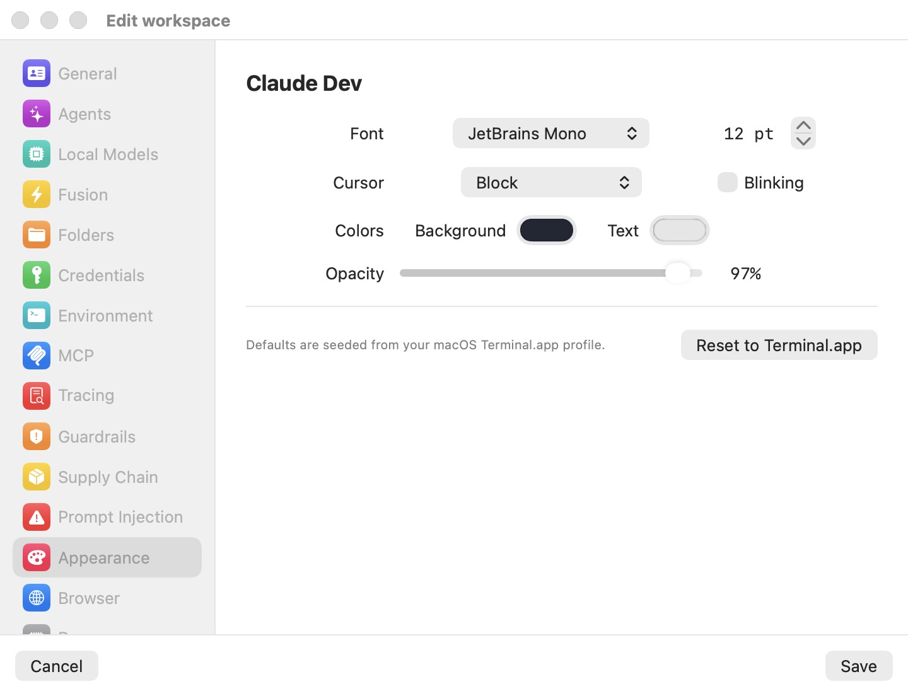

# Appearance

The **Appearance** pane styles the terminal of one workspace. Terminals in Bromure Agentic Coding render natively on the host (Metal-rendered Ghostty surfaces attached to the VM's tmux session — see [Sessions](../06-sessions.mdx)), so everything you set here applies to every tab of the workspace: in the unified window, in a popped-out window, and in Grid cells. Changes take effect when you click **Save**, and they apply live to a running session — you do not need to restart the VM to see a new font or color.

Like the other per-workspace panes, Appearance can also be set on the Preferences template (**Bromure → Preferences…**), in which case every workspace you create afterwards inherits it.

  

## Font

The **Font** picker lists the fixed-pitch (monospace) font families installed on your Mac, sorted alphabetically. Two filters apply:

- Families whose names start with a period (macOS-internal identifiers such as the system UI fonts) are excluded — Linux fontconfig inside the VM cannot resolve them, so picking one would silently fall back.
- Proportional families are excluded — a terminal only makes sense in a monospace font. If a saved family cannot be resolved at render time, the terminal falls back to Menlo.

Three families are always offered even when they are not installed on your Mac, because they ship inside the guest image and are guaranteed to resolve: **JetBrains Mono**, **SF Mono**, and **SF Mono Terminal**.

The size stepper next to the picker sets the font size in points, from 8 to 32 pt. This is the *base* size; you can still zoom a running terminal temporarily with ⌘+ / ⌘− / ⌘0 or a trackpad pinch without touching this setting.

## Cursor

The **Cursor** picker selects the cursor shape drawn in the terminal:

| Shape | Appearance |
|---|---|
| **Block** | A filled cell (the default for new workspaces). |
| **Beam (I-cursor)** | A thin vertical bar. |
| **Underline** | A thin bar under the character cell. |

The **Blinking** checkbox next to the picker makes the cursor blink. It is off by default.

## Colors

Two color swatches open the standard macOS color picker:

- **Background** — the terminal background color.
- **Text** — the terminal foreground (text) color.

Both are seeded from your macOS Terminal.app default profile (see [Defaults and Reset to Terminal.app](#defaults-and-reset-to-terminalapp) below), so a fresh workspace usually looks like your Terminal.app already does.

## Opacity

The **Opacity** slider ranges from 30% to 100% and defaults to 97%. It is applied in two places at once:

- as the terminal's background opacity, and
- as the macOS window's transparency.

Below 100%, the terminal area composites against your desktop with a window-server background blur — a frosted-glass effect. Only the terminal itself is translucent; the titlebar, the sidebar, and the divider stay opaque. At exactly 100% the window is fully opaque (which also means a solid stage while the VM boots).

## Defaults and Reset to Terminal.app

The footer of the pane reads: **Defaults are seeded from your macOS Terminal.app profile.** When the app starts, it reads your Terminal.app default profile (font family and size, background color, text color) and uses those values as the starting point for any appearance field a workspace has not overridden. If Terminal.app has never been configured or its preferences are unreadable, a built-in fallback is used (JetBrains Mono on a dark background).

The **Reset to Terminal.app** button restores the font *size* and both *colors* from that startup snapshot of your Terminal.app profile — but it deliberately sets the font *family* to **JetBrains Mono**, not to your Terminal.app font, because JetBrains Mono is guaranteed to exist inside the guest image on every machine.

> **Note:** the snapshot is taken once, at app startup. If you change your Terminal.app profile while Bromure Agentic Coding is running, restart the app before using **Reset to Terminal.app** to pick up the new values.

## Settings reference

| Setting | Type | Default | Description |
|---|---|---|---|
| **Font** (family) | picker | Terminal.app default family (fallback: JetBrains Mono) | Monospace families on the Mac, plus the guest-bundled JetBrains Mono / SF Mono / SF Mono Terminal. |
| **Font** (size) | stepper, 8–32 pt | Terminal.app default size | Base terminal font size in points. |
| **Cursor** | picker | Block | **Block** / **Beam (I-cursor)** / **Underline**. |
| **Blinking** | checkbox | Off | Blinking cursor. |
| **Colors — Background** | color picker | Terminal.app default | Terminal background color. |
| **Colors — Text** | color picker | Terminal.app default | Terminal foreground color. |
| **Opacity** | slider, 30–100% | 97% | Terminal and window translucency; below 100% the desktop shows through with a blur. |
| **Reset to Terminal.app** | button | — | Restores size and colors from the Terminal.app snapshot; pins the family to JetBrains Mono. |
