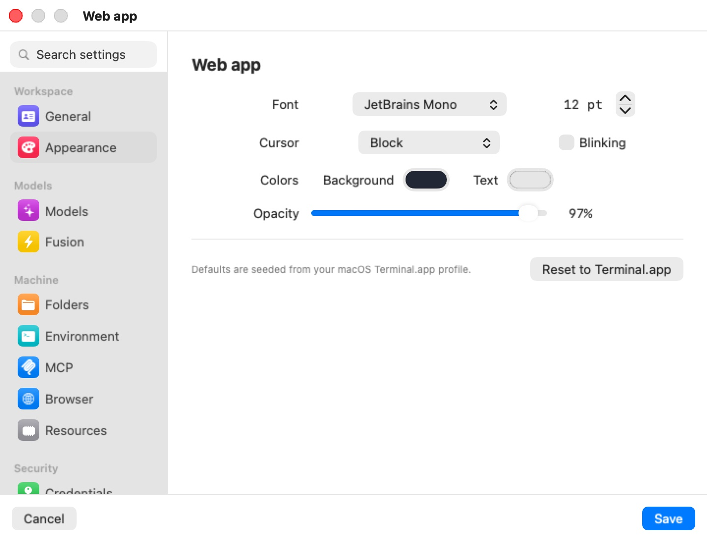

# Appearance

The **Appearance** pane styles the terminals of one machine (a workspace, in the settings editor). Terminals render natively on the Mac, attached to the VM's tmux session, so the settings apply to every terminal tab of the machine: its Linux terminal, a popped-out window, and Grid cells. The chat view of a session has its own look and is not affected by this pane — see [The Chat](../06a-chat.mdx).

Changes apply to a running machine when you click **Save**; there is no restart. Set them in Preferences (the **Defaults** template) and every machine you create afterwards inherits them.

  

## Font

The **Font** picker lists the monospace font families installed on your Mac, alphabetically. Families whose names start with a period (macOS-internal system fonts) and proportional families are left out. Three families are always offered, installed or not, because they ship inside the guest image: **JetBrains Mono**, **SF Mono**, and **SF Mono Terminal**.

The stepper next to the picker sets the size, from 8 to 32 pt. It is the base size: you can still zoom a terminal temporarily with ⌘+ / ⌘− / ⌘0 or a pinch without changing this setting.

## Cursor

| Shape | Appearance |
|---|---|
| **Block** | A filled cell (default). |
| **Beam (I-cursor)** | A thin vertical bar. |
| **Underline** | A bar under the character cell. |

**Blinking** makes the cursor blink. Off by default.

## Colors

**Background** and **Text** open the macOS color picker for the terminal's background and foreground. Both start from your Terminal.app default profile (see below), so a new machine usually looks like your Terminal.app already does.

## Opacity

The **Opacity** slider runs from 30% to 100% (default 97%). It sets the terminal background's opacity and the window's transparency together: below 100%, the terminal shows your desktop through a blur. Only the terminal area is translucent; the sidebar and toolbar stay opaque.

## Defaults and Reset to Terminal.app

The pane's footer reads **Defaults are seeded from your macOS Terminal.app profile.** When the app starts, it reads your Terminal.app default profile (font family and size, background and text colors) and uses it for any field a machine hasn't set. If Terminal.app's preferences can't be read, a built-in fallback is used (JetBrains Mono on a dark background).

**Reset to Terminal.app** restores the font size and both colors from that snapshot, and sets the family to **JetBrains Mono** — not to your Terminal.app font — because JetBrains Mono is guaranteed to exist in the guest.

> **Note:** The Terminal.app snapshot is taken once, at app start. If you change your Terminal.app profile while Bromure is running, quit and reopen the app before using **Reset to Terminal.app**.

## On a mirror window

When you use a machine from another Mac through a mirror window, its font family, size, and colors follow the machine's settings. Fields the machine hasn't set fall back to the viewing Mac's own Terminal.app defaults.

## Settings reference

| Setting | Type | Default | Description |
|---|---|---|---|
| **Font** (family) | Picker | Terminal.app default family (fallback JetBrains Mono) | Monospace families on the Mac, plus the guest-bundled JetBrains Mono, SF Mono, SF Mono Terminal. |
| **Font** (size) | Stepper, 8–32 pt | Terminal.app default size | Base font size. |
| **Cursor** | Picker | **Block** | **Block** / **Beam (I-cursor)** / **Underline**. |
| **Blinking** | Checkbox | Off | Blinking cursor. |
| **Colors — Background** | Color picker | Terminal.app default | Terminal background. |
| **Colors — Text** | Color picker | Terminal.app default | Terminal foreground. |
| **Opacity** | Slider, 30–100% | 97% | Terminal and window translucency. |
| **Reset to Terminal.app** | Button | — | Restores size and colors from the Terminal.app snapshot; sets the family to JetBrains Mono. |

## Related chapters

- [The Chat](../06a-chat.mdx) — the session view, which this pane does not style.
- [Remote Access & Clients](../14-remote-access.mdx) — mirror windows onto another Mac.
- [Settings Reference](index.mdx) — all panes at a glance.
