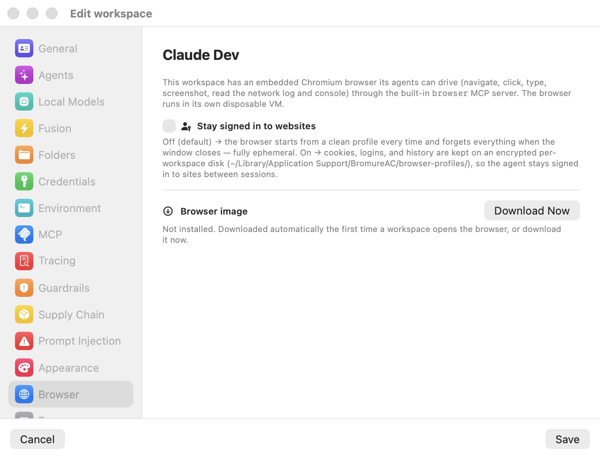

# Browser

Every workspace ships with an embedded Chromium browser that its agents can drive — navigate, click, type, take screenshots, read the console and network log — through the built-in `browser` MCP server. The browser runs in **its own disposable VM**, separate from the workspace's Ubuntu VM, so a page an agent opens can never touch the agent's own environment. The **Browser** pane controls two things: whether that browser remembers your sign-ins between sessions, and how the shared browser image is downloaded to your Mac.

  

The pane opens with the same summary the app shows above the controls: this workspace has an embedded Chromium browser its agents can drive through the built-in `browser` MCP server, and it runs in its own disposable VM. The pane sets policy only — you drive the browser itself from the agentic browser pane in the session window (⌃⌘B), and the agent drives it through the MCP tools. Both are covered in [Sessions](../06-sessions.mdx), and the full list of `browser_*` tools is in [Automation & the CLI](../16-automation-cli.mdx).

## Stay signed in to websites

The **Stay signed in to websites** toggle decides whether the browser is ephemeral or persistent:

- **Off (default)** — the browser starts from a clean profile every time and forgets everything when the window closes. No cookies, logins, or history survive. This is the fully disposable behavior that matches the rest of the workspace's isolation model.
- **On** — cookies, logins, and history are kept on an **encrypted per-workspace disk** at `~/Library/Application Support/BromureAC/browser-profiles/<workspace-id>/image/profile.img`, so the agent stays signed in to sites between sessions. The profile disk belongs to this one workspace and is never shared with another.

Because the persistence setting changes how the browser VM is booted, changing it restarts that VM. When you save a change, the app warns:

> Changing "Stay signed in to websites" takes effect by restarting this workspace's browser — its open tabs will close. Saved sign-ins stay on the encrypted per-workspace disk: they're used while the setting is on and simply ignored while it's off.

Turning the setting off does not delete the saved profile disk — it is simply ignored while off, and used again if you turn the setting back on.

> **Note:** Persisting sign-ins trades isolation for convenience. A logged-in browser that an agent can drive is a standing credential the agent can use on any page it visits; leave this off unless a workflow genuinely needs a persistent login.

## The browser image

The browser VM boots from a shared **browser image** — the same Alpine + Chromium image the sibling [Bromure](https://bromure.io) web browser uses. It is downloaded once and shared by every workspace, so the **Browser image** section at the bottom of the pane is app-wide, not per-workspace. What it shows depends on where the image came from:

| State | Caption | Action |
|---|---|---|
| **Installed by Bromure Web** | "Installed by Bromure Web (size) — shared with Agentic Coding, managed by the Bromure app." | None — the Bromure web app owns and updates it. |
| **Downloaded by Agentic Coding** | "Installed (size) — downloaded from `dl.bromure.io` into `~/Library/Application Support/BromureAC/browser`." | **Re-download** |
| **Not installed** | "Not installed. Downloaded automatically the first time a workspace opens the browser, or download it now." | **Download Now** |

When Bromure Agentic Coding downloaded the image itself, **Re-download** fetches a fresh copy. It confirms first — **Re-download the browser image?** — with the explanation:

> Downloads a fresh copy (a few GB) and replaces the current image. Open browser sessions keep running and pick up the new image next time they start.

While an install or re-download runs, the section shows a live progress bar and percentage in place of the button; a failure is shown inline in red.

### First-open consent

You do not have to install the image from this pane. The first time any workspace opens its browser pane, the session window shows a one-time consent card before anything is fetched — **Install the browser?**, with the note that Chromium runs in its own disposable VM and a one-time download of about 500 MB installed to your Library folder, and the buttons **Download & Install** / **Not Now**. Nothing is downloaded until you accept. Because the image is shared, installing it once — from this pane or from that card — serves every workspace.

## The browser VM's lifecycle

The browser VM is created lazily, only when the pane (or an agent tool call) first needs it, and it is reclaimed when idle:

- Hidden for about **10 seconds**, the VM is suspended in memory so it stops using CPU while its state is preserved.
- With the pane closed for about **5 minutes**, the VM is torn down entirely; the next open cold-boots a fresh one.

An agent's `browser` MCP tool call can boot and reveal the browser for the selected workspace on its own, but it will never re-open a pane you have deliberately closed. The browser VM shares the workspace's NAT network segment, so an agent can reach a dev server the workspace is running by the workspace VM's LAN IP — never `localhost`, because the browser is a different VM. See [Sessions](../06-sessions.mdx) for how the pane behaves in the window.

## Settings reference

| Setting | Type | Default | Scope |
|---|---|---|---|
| **Stay signed in to websites** | Toggle | Off (fully ephemeral) | Per workspace |
| **Browser image** | Status + **Download Now** / **Re-download** | Not installed (auto-offered on first browser open) | App-wide (shared with all workspaces and with Bromure Web) |

Like every per-workspace pane, **Stay signed in to websites** can also be set on the preferences template so new workspaces inherit it — see [Settings Reference](index.mdx). The persistent profile disk is encrypted with the same host-held key that protects the rest of your workspace secrets; the credential model is described in [Credentials & the wire boundary](../08-credentials.mdx).
