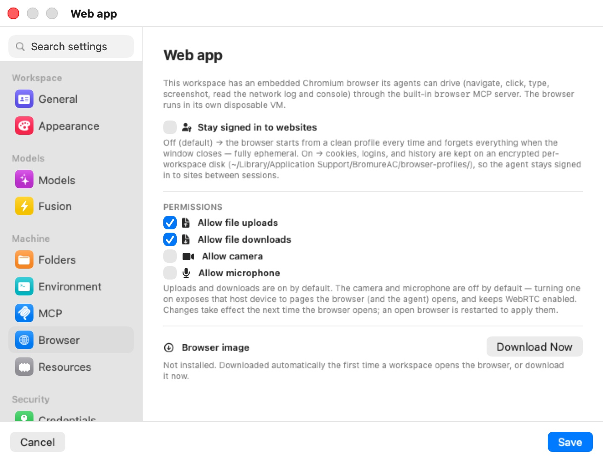

# Browser

Every machine (a workspace, in the settings editor) comes with an embedded Chromium browser that its agents can drive — navigate, click, type, take screenshots, read the console and network log — through the built-in `bromure-browser` MCP server. The browser runs in **its own disposable VM**, separate from the machine's Linux VM, so a page the agent opens can't touch the agent's environment. The **Browser** pane sets whether the browser remembers sign-ins, what it may access on your Mac, and manages the shared browser image.

  

The pane sets policy only. You use the browser from the browser pane of the main window (⌃⌘B), and agents use it through their MCP tools — see [The Embedded Browser](../06g-browser.mdx).

## Stay signed in to websites

- **Off (default)** — the browser starts from a clean profile every time and forgets everything when it closes. No cookies, logins or history survive.
- **On** — cookies, logins and history are kept on an encrypted disk belonging to this machine, under `~/Library/Application Support/BromureAC/browser-profiles/`, so the agent stays signed in to sites between sessions. The disk is never shared with another machine.

Turning it off doesn't delete the saved disk: it is ignored while the setting is off and used again if you turn it back on.

> **Note:** A signed-in browser the agent can drive is a standing credential the agent can use on any page. Leave this off unless a workflow needs a persistent login.

## Permissions

| Permission | Default | Effect |
|---|---|---|
| **Allow file uploads** | On | Pages can receive files you or the agent upload. |
| **Allow file downloads** | On | Pages can save files. |
| **Allow camera** | Off | Exposes your Mac's camera to pages the browser opens, and keeps WebRTC enabled. |
| **Allow microphone** | Off | Exposes your Mac's microphone the same way. |

As the pane says, turning the camera or microphone on exposes that device "to pages the browser (and the agent) opens".

## When changes apply

Permissions and **Stay signed in to websites** take effect when the browser next starts. If this machine's browser is open when you save, the app asks first:

> **Restart the browser for “*name*”?** Changing the browser's permissions (uploads, downloads, camera, microphone) or “Stay signed in to websites” takes effect by restarting this workspace's browser — its open tabs will close.

**Restart & Save** applies the change and restarts the browser; **Cancel** returns to the editor without saving.

## Browser image

The browser VM boots from a shared **browser image**, downloaded once and used by every machine — the same image the Bromure web browser uses. The **Browser image** section is therefore app-wide:

| State | Caption | Action |
|---|---|---|
| Installed by the Bromure web app | "Installed by Bromure Web (*size*) — shared with Agentic Coding, managed by the Bromure app." | None — the Bromure app keeps it up to date. |
| Downloaded by Agentic Coding | "Installed (*size*) — downloaded from dl.bromure.io into ~/Library/Application Support/BromureAC/browser." | **Re-download** |
| Not installed | "Not installed. Downloaded automatically the first time a workspace opens the browser, or download it now." | **Download Now** |

**Re-download** asks **Re-download the browser image?** — "Downloads a fresh copy (a few GB) and replaces the current image. Open browser sessions keep running and pick up the new image next time they start." While a download runs, the section shows its progress; a failure appears in red.

You don't have to install the image here. The first time any machine opens its browser, the browser pane asks **Install the browser?** with **Download & Install** and **Not Now**; nothing is downloaded until you accept.

The browser-image section is not shown in the iPhone, iPad or Vision Pro client — the image lives on the Mac that runs the machines.

## Settings reference

| Setting | Type | Default | Scope |
|---|---|---|---|
| **Stay signed in to websites** | Toggle | Off | This machine |
| **Allow file uploads** | Checkbox | On | This machine |
| **Allow file downloads** | Checkbox | On | This machine |
| **Allow camera** | Checkbox | Off | This machine |
| **Allow microphone** | Checkbox | Off | This machine |
| **Browser image** | Status, **Download Now** / **Re-download** | Not installed | The whole Mac (shared with the Bromure web app) |

## Related chapters

- [The Embedded Browser](../06g-browser.mdx) — using the browser pane, and how agents drive it.
- [MCP](mcp.mdx) — the built-in `bromure-browser` server.
- [Settings Reference](index.mdx) — all panes at a glance.
