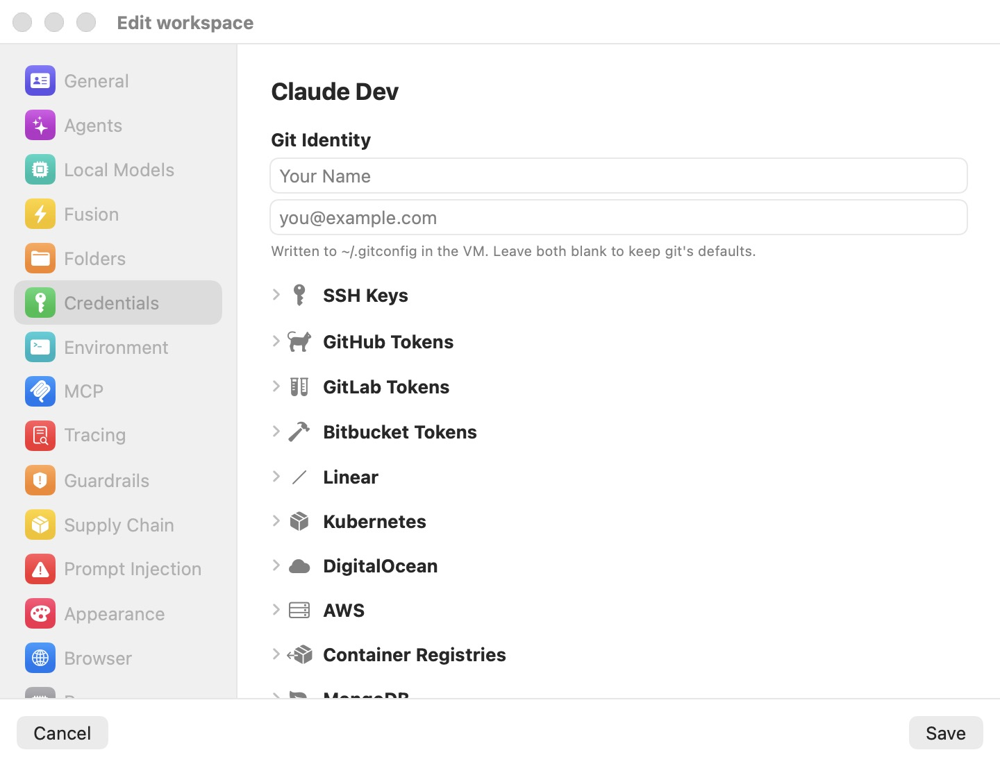

# Credentials

The **Credentials** pane is where you give a workspace the secrets its agent needs — git tokens, SSH keys, cloud credentials, database passwords — without any of those secrets ever entering the VM. Every value you type here is stored encrypted on your Mac. Inside the sandbox the agent sees only a structure-preserving *fake* (for example `brm_…`); when a request actually leaves your Mac, the host-side proxy swaps the fake back to the real value, scoped to the destination host.

This page is the field-by-field reference for the pane. The mechanism behind it — the [wire boundary](../18-glossary.mdx), the deterministic fakes, host scoping, the fail-closed AWS resigner, and the compromise detector — is documented in full in [Credentials & the wire boundary](../08-credentials.mdx). Read that chapter for the security model; read this page to fill in the fields. The per-credential **approval** and **write-policy** controls now live in the [Guardrails](guardrails.mdx) pane, not here.

  

> **Note:** The screenshot above predates the redesign and may show the older stack of collapsible sections. The current pane shows only the credentials you have configured, grouped under category headers, plus the two buttons described below.

The pane opens with **Git Identity** pinned at the top, followed by a list of the credentials you have already configured — nothing else. Each configured credential is one row; the empty families that used to sit collapsed on the pane are gone. Two buttons at the bottom, **Add credential** and **Import env file…**, are how you add more. Nothing is applied until you click **Save**.

## Git Identity

The two fields at the top set the git author identity written into `~/.gitconfig` inside the VM:

- **user.name** — placeholder **Your Name**.
- **user.email** — placeholder **you@example.com**.

The caption reads: **Written to ~/.gitconfig in the VM. Leave both blank to keep git's defaults.** These are not secrets and are not swapped — they are plain configuration so that commits the agent makes are attributed correctly. Leaving a field blank leaves that git default untouched.

## The configured-credentials list

Below Git Identity, the pane lists only the credentials that actually produce a swap at session launch, grouped under category headers:

| Header | What appears under it |
|---|---|
| **AGENTS** | The agent API keys (Anthropic, OpenAI, xAI) configured in the [Agents](agents.mdx) pane, shown here read-only for reference. |
| **GIT** | Personal access tokens for git over HTTPS (GitHub, GitLab, Bitbucket, self-hosted). |
| **CLOUD** | AWS, DigitalOcean, Linear, Kubernetes contexts, and container registries. |
| **DATABASES** | MongoDB, ClickHouse, and Elasticsearch endpoints. |
| **SSH** | The workspace's own key and any keys you imported. |
| **OTHER** | Manual "Other API key" swap rules. |

Each row shows an icon, a title, and the host or hosts the credential is scoped to (for a git token, `user@host`; for a database or registry, its host; for AWS, `amazonaws.com`; and so on). A **⋯** menu on the right — also reachable by clicking the row — offers **Edit…** and **Remove**:

- **Edit…** reopens that credential's editor so you can change or reveal its fields.
- **Remove** deletes the credential from the workspace. (There is no undo other than re-adding it; nothing is removed from disk until you **Save**.)

Rows under **AGENTS** are the one exception: their menu reads **Edit in Agents…** and has no **Remove**, because agent keys are owned by the [Agents](agents.mdx) pane. Choosing it switches the editor to that pane.

When a workspace has no credentials at all, the list is replaced by an empty state — **No credentials yet** — reminding you that real values stay on your Mac and the VM only ever holds a fake.

## Adding a credential

Click **Add credential** to open the picker sheet. It lists every credential type the app can add; each entry opens that type's editor:

| Type | What it holds |
|---|---|
| **Git token** | Personal access token for GitHub, GitLab, or Bitbucket. |
| **SSH key** | Import a private key, or use the per-workspace key. |
| **AWS credentials** | Static IAM keys or SSO — SigV4-signed on the wire. |
| **DigitalOcean token** | `doctl` / API personal access token. |
| **Linear API key** | Linear personal API key. |
| **Kubernetes** | A cluster context (token, client cert, or exec plugin). |
| **Container registry** | Registry login for Docker Hub, ghcr.io, and others. |
| **Database** | MongoDB Data API, ClickHouse, or Elasticsearch. |
| **Other API key** | Any other token — you choose the env var and host(s). |

Agent API keys are deliberately **not** in this picker; a footer note reminds you that Anthropic, OpenAI, and xAI keys are configured in the [Agents](agents.mdx) pane. Each editor is a sheet with a **Done** button; the fields for each type are described in the sections below.

## Importing an env file

Click **Import env file…** to pull credentials out of an existing `.env` file — or a `~/.bashrc`. The parser reads plain `KEY=VALUE` and `export KEY=VALUE` assignments, strips surrounding quotes and trailing `# comments`, and takes the last assignment when a name is repeated. It never runs a shell: any value that would need interpolation (a `$VAR` reference or a `$(…)` command substitution) is skipped rather than imported wrong, so pointing it at a real `.bashrc` is safe.

The file's variables are then shown in a review sheet titled **Import from &lt;filename&gt;**, split into two groups. **Every value is masked** in this sheet.

**Recognized** variables are auto-mapped to their credential type:

| Variable(s) | Mapped to |
|---|---|
| `ANTHROPIC_API_KEY` | Claude Code API key |
| `OPENAI_API_KEY` | Codex API key |
| `XAI_API_KEY` | Grok Build API key |
| `GH_TOKEN` / `GITHUB_TOKEN` | GitHub token |
| `GITLAB_TOKEN` | GitLab token |
| `AWS_ACCESS_KEY_ID` / `AWS_SECRET_ACCESS_KEY` / `AWS_SESSION_TOKEN` | AWS static keys |
| `DIGITALOCEAN_ACCESS_TOKEN` | DigitalOcean token |
| `LINEAR_API_KEY` | Linear API key |

Each recognized row has a checkbox. A git token additionally asks for a **Git username** (placeholder **you**) so the credential is complete. If a variable maps to something the workspace already has configured, its row is flagged **Already configured — check to overwrite.** and left unchecked, so a re-import never silently clobbers an existing secret.

**Unrecognized** variables can be imported as generic **Other API key** tokens. Each row carries a **Host(s)** field — a comma-separated list of hostnames the fake should be swapped on (multiple hosts allowed; blank means *any host*). The env-var name is reused as both the token's name and the variable the fake is exported under.

The button reads **Import N credentials** and reflects only the rows you left checked. Importing merges the selections into the pane; you still click **Save** to persist them.

## SSH Keys

The **SSH key** editor manages the keys the workspace can authenticate with over SSH. Private key bytes never enter the VM: signing is served through an in-process [ssh-agent bridge](../18-glossary.mdx) over vsock, so the guest can request signatures but can never read the key.

There are two sources of keys:

- **The workspace's own ed25519 keypair.** New workspaces carry a pre-checked **Generate an ed25519 keypair** toggle (unless your preferences template already provides a key). Once a key exists, the editor shows its public key with **Copy** and **Open GitHub keys page** buttons (for pasting into `github.com/settings/keys`) and a **Regenerate** toggle.
- **Imported SSH keys.** Under **Imported SSH keys**, click **Import…** to open a file picker; a sheet then asks for a **Label** and, if the key is encrypted, a **Passphrase**. Passphrases are stored in the macOS Keychain, and imported keys are loaded into the per-workspace ssh-agent at every session launch. RSA, ed25519, and ecdsa keys are supported.

## Git tokens (GitHub, GitLab, Bitbucket)

The **Git token** editor holds personal access tokens for git over HTTPS, split into **GitHub**, **GitLab**, and **Bitbucket** groups. As its caption puts it: personal access tokens are stored encrypted on the host, and the proxy swaps them onto outbound requests so the VM only ever holds the fake. `gh` and `glab` pick up `GH_TOKEN` / `GITLAB_TOKEN` automatically.

Click **Add token** in a group to add a row. Each row takes a **Host**, a **Username**, and a **Personal access token** (with a reveal-eye button and a link to that forge's token page). The fake is written into `~/.git-credentials` and into the `gh` / `glab` CLI configs inside the VM. The host field lets you point an entry at `github.com`, `gitlab.com`, or a self-hosted GitLab/Gitea/Bitbucket instance.

## Linear

The **Linear API key** editor takes a single personal API key (placeholder shaped `lin_api_…`, with an **Open Linear API settings** link). It is injected into the VM as `LINEAR_API_KEY`, which the Linear SDK, MCP servers, and CLI tools pick up automatically, and is swapped fake-to-real only on requests to `linear.app` (including `api.linear.app` and `mcp.linear.app`). A Linear key in the workspace is also the prerequisite for Linear-issue [scheduled automation](../16-automation-cli.mdx) triggers.

## Kubernetes

The **Kubernetes** editor holds one row per cluster context. Bromure Agentic Coding builds a synthetic `~/.kube/config` inside the VM so `kubectl` talks to the proxy, never the API server directly; the real identity stays on the host.

Each context has a **name**, a **Server URL**, an optional **CA cert** (PEM, used so the proxy can verify the upstream API server), a **Namespace**, and an authentication method chosen with a segmented control:

- **Bearer token** — a static token, swapped to the real value on the wire.
- **Client certificate** — the real cert and key are registered on the host for upstream mutual TLS; the VM gets a throwaway self-signed cert.
- **Exec plugin** — a **Command**, **Args**, and a **Refresh** stepper (1–60 minutes). The plugin runs *on the host* every refresh interval and the fresh token is fed into the swap map; the VM's `kubectl` never runs the plugin.

A badge on each row shows which kind (token / cert / exec) it is. Use **Import file…** to parse an existing kubeconfig into one row per context, or **Add context** to add one by hand. The matching per-context write policy is set in the [Guardrails](guardrails.mdx) pane.

## DigitalOcean

The **DigitalOcean token** editor takes a single personal access token (placeholder shaped `dop_v1_…`, with a link to the DigitalOcean token page). It is injected as `DIGITALOCEAN_ACCESS_TOKEN` and written into `~/.config/doctl/config.yaml`, so `doctl auth init` is unnecessary. The token is swapped fake-to-real on requests to `digitalocean.com`, and a second swap entry covers the base64 Basic-auth form used when `docker login` or `doctl registry login` authenticates against `registry.digitalocean.com`.

## AWS

The **AWS credentials** editor configures credentials for the `aws` CLI, the SDKs, terraform, and Claude Code's Bedrock auth mode. The real secret never reaches the VM — the host re-signs SigV4 requests with the real material, and a request that bypasses the proxy gets an `InvalidSignatureException` from AWS. An **Auth method** segmented control selects between:

- **Static keys** — **Access key ID**, **Secret access key**, an optional **Session token** (STS only), and a **Default region**, plus an **Open IAM credentials page** link.
- **SSO / Identity Center** — a **Grant access to ~/.aws** folder-picker, then an **SSO profile** picker populated from the profiles discovered in your `~/.aws/config` (with a refresh button). Temporary role credentials are resolved on the host, triggering `aws sso login` in your browser when the cached token has expired.

The full AWS handling — the `credential_process` helper, the resigner, and its limits — is in [Credentials & the wire boundary](../08-credentials.mdx).

## Container Registries

The **Container registry** editor holds per-registry HTTP Basic auth for `docker pull` / `docker push`. As the caption explains, the real password is never written into the VM — bromure puts a fake `base64("<user>:<derived>")` in `~/.docker/config.json`, and the proxy substitutes the real value on the wire when the request hits the matching registry host.

The **Add** menu offers presets — **Docker Hub (docker.io)**, **GitHub Container Registry (ghcr.io)**, **GitLab Container Registry (registry.gitlab.com)**, **Quay (quay.io)**, and **Other host…** — plus **Import config.json…**, which pulls entries from an existing `~/.docker/config.json`. Import skips `credsStore` / `credHelpers` entries (their passwords live in the OS keychain rather than the file) and reports how many were skipped. Each registry row takes a **Host**, a **Username**, and a **Password or token**. The matching push/pull/delete write policy is set in the [Guardrails](guardrails.mdx) pane.

## Databases (MongoDB, ClickHouse, Elasticsearch)

The **Database** editor holds one row per HTTPS endpoint, grouped by engine. The fake is exported under the environment variable names you list and is swapped to the real value wherever it appears — header, query parameter, or request body.

Each endpoint row has:

- **Name** — optional display name.
- **Host** — the bare hostname; it scopes both the swap and the endpoint's guardrail.
- **Authentication** — a segmented control: **Username + password**, **API key**, or **Bearer token**. MongoDB defaults to **API key**; ClickHouse and Elasticsearch default to **Username + password**.
- **Username** — for Basic auth only.
- **Secret** — with a reveal-eye button.
- **Environment variable(s)** — a comma-separated list of the names the fake should be exported under.

New database endpoints default their per-endpoint write policy to **Prompt before write**, set in the [Guardrails](guardrails.mdx) pane — the engine-specific classification (which Mongo actions, which SQL keywords, which Elasticsearch paths count as writes) lives there.

## Other API keys

The **Other API key** editor is the escape hatch for any service Bromure Agentic Coding does not auto-handle. Each entry is a manual swap rule:

- **Name** — a label for the entry.
- **Real secret** — masked (placeholder shaped `sk_live_…`).
- **Environment variable** — the name the fake is exported under inside the VM. Leaving this blank exports nothing; you would then copy the fake from the session's welcome banner.
- **API host (optional)** — the host or hosts the swap is scoped to (exact-or-subdomain, comma-separated). Blank means "inject on any host."

The VM sees a minted `brm_…` fake and the proxy swaps it back on the wire.

> **Warning:** A blank **API host** is deliberately never gated by the compromise detector — it is an explicit "inject on any host" choice. To keep an unscoped secret under control, either give it a host or turn on **Ask before use** for it in the [Guardrails](guardrails.mdx) pane.

## Approval and write policies live in Guardrails

There are no **Require approval to use** checkboxes in the Credentials pane anymore. The per-credential consent gate — now surfaced as **Ask before use** — and each service's write policy both live in the [Guardrails](guardrails.mdx) pane, which lists one row per configured credential. Configure the secret here; decide how the agent is allowed to use it there.

## How the pane is stored

Everything in this pane is a secret, so on save it is split out of the plain-text `profile.json` into the workspace's encrypted `secrets.enc` (AES-GCM, keyed from the macOS Keychain, permissions `600`). The auto-handled providers — Anthropic, OpenAI, GitHub, GitLab, DigitalOcean, Kubernetes — need no manual entry beyond what you configure here; the primary agent's own API key is set in the [Agents](agents.mdx) pane.

## Settings reference

| Editor | What it holds |
|---|---|
| **Git Identity** | `user.name` / `user.email` written to `~/.gitconfig`; not a secret, not swapped. |
| **SSH key** | Workspace keypair + imported keys; served via the vsock ssh-agent, private bytes never in the VM. |
| **Git token** | Per-host username + PAT for GitHub / GitLab / Bitbucket; fake in `~/.git-credentials` and `gh`/`glab` configs. |
| **Linear API key** | `lin_api_…` key exported as `LINEAR_API_KEY`; swapped on `linear.app`. |
| **Kubernetes** | Contexts (bearer / client cert / exec plugin); synthetic `~/.kube/config` in the VM. |
| **DigitalOcean token** | `dop_v1_…` token exported as `DIGITALOCEAN_ACCESS_TOKEN` + `doctl` config. |
| **AWS credentials** | Static keys or SSO / Identity Center; host re-signs SigV4, secret never in the VM. |
| **Container registry** | Per-registry Basic auth; fake in `~/.docker/config.json`. |
| **Database** | Per-endpoint secret exported under named env vars; swapped in header, query, or body. |
| **Other API key** | Manual swap rules: real secret, env var, optional host filter; VM sees a `brm_…` fake. |
| **Import env file…** | Bulk-import from a `.env` or `~/.bashrc`; recognized variables auto-map, unrecognized ones import as scoped generic tokens. |

Per-credential **Ask before use** and write policies are set in the [Guardrails](guardrails.mdx) pane.

## Related chapters

- [Credentials & the wire boundary](../08-credentials.mdx) — the full security model behind this pane.
- [Agents](agents.mdx) — the primary agent's API key and subscription/Bedrock auth modes.
- [Guardrails](guardrails.mdx) — per-credential approval and per-service write policies for these same secrets.
- [Settings Reference](index.mdx) — all panes at a glance.
