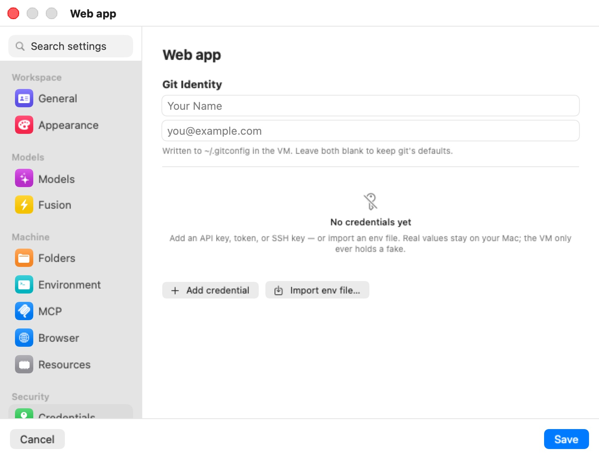

# Credentials

The **Credentials** pane is where you give a machine (a workspace, in the settings editor) the secrets its agent needs — git tokens, SSH keys, cloud credentials, database passwords — without those secrets ever entering the VM. Every value is stored encrypted on your Mac. Inside the VM the agent only sees a stand-in (for example `brm_…`); when a request leaves your Mac, the proxy replaces the stand-in with the real value, and only for the hosts that credential belongs to.

This page is the field-by-field reference. The mechanism — the [wire boundary](../18-glossary.mdx), stand-ins, host scoping, AWS re-signing, the compromise alert — is explained in [Credentials & the Wire Boundary](../08-credentials.mdx). Whether a credential needs your approval before use, and what writes it may make, are set in [Guardrails](guardrails.mdx).

  

> **Note:** API keys and sign-ins for the coding agents' model providers (Anthropic, OpenAI, xAI, Moonshot, z.ai, Bedrock, OpenRouter, custom servers) are not set here. They live in **Preferences › Models**, or in a machine's own [Models](models.mdx) override.

## Git Identity

The two fields at the top set the author identity written to `~/.gitconfig` in the VM:

- **user.name** — placeholder **Your Name**.
- **user.email** — placeholder **you@example.com**.

"Written to ~/.gitconfig in the VM. Leave both blank to keep git's defaults." These are not secrets and are not swapped. Changes apply to a running machine at **Save**.

## Imported Config Files

If the first-run setup imported configuration files from your Mac into this machine, they appear under **Imported Config Files**: each as `~/<path>`, with how many settings it holds, how many secrets were left out, and which settings were disabled. "Copied into the VM as-is. Secrets were left out — those come in as credentials above, so the VM only ever sees a fake." The minus button removes a file from the machine.

## The credentials list

Below, the pane lists only the credentials this machine actually has, under category headers:

| Header | What appears under it |
|---|---|
| **GIT** | Personal access tokens for GitHub, GitLab, Bitbucket, or self-hosted forges. |
| **CLOUD** | AWS, DigitalOcean, Linear, Twilio, Kubernetes contexts, container registries. |
| **DATABASES** | MongoDB, ClickHouse and Elasticsearch endpoints. |
| **SSH** | The machine's own key and any keys you imported. |
| **OTHER** | "Other API key" swap rules. |

Each row shows an icon, a name, and the host or hosts the credential applies to. Its **⋯** menu (or a click on the row) offers **Edit…** and **Remove**. Nothing is removed from disk until you click **Save**.

An **AGENTS** group can also appear, on machines that still carry an agent API key of their own from before model providers moved to Models. Those rows have no **Remove**; their menu offers **Edit in Models…**, which opens **Preferences › Models** (in Preferences itself, or in a remote machine's editor, it switches to that editor's **Models** pane).

With no credentials, the pane shows **No credentials yet** — "Add an API key, token, or SSH key — or import an env file. Real values stay on your Mac; the VM only ever holds a fake."

## Adding a credential

**Add credential** opens a list of credential types; each opens its own editor sheet, closed with **Done**:

| Type | Subtitle |
|---|---|
| **Git token** | Personal access token for GitHub, GitLab, or Bitbucket |
| **SSH key** | Import a private key, or use the per-workspace key |
| **AWS credentials** | Static IAM keys or SSO — SigV4-signed on the wire |
| **DigitalOcean token** | doctl / API personal access token |
| **Linear API key** | Linear personal API key |
| **Twilio API key** | Account/API-key SID + secret — HTTP Basic on the wire |
| **Kubernetes** | A cluster context (token, client cert, or exec plugin) |
| **Container registry** | Registry login for Docker Hub, ghcr.io, and others |
| **Database** | MongoDB Data API, ClickHouse, or Elasticsearch |
| **Other API key** | Any other token — you choose the env var and host(s) |

Agent API keys (Anthropic, OpenAI, xAI, Moonshot) are not in this list: they are set in **Preferences › Models**.

## Importing an env file

**Import env file…** reads credentials out of an existing `.env` file or a `~/.bashrc`. The parser reads `KEY=VALUE` and `export KEY=VALUE` lines, strips quotes and trailing `# comments`, and keeps the last assignment of a repeated name. It never runs a shell: a value that would need expansion (`$VAR`, `$(…)`) is skipped rather than imported wrong, so a real `.bashrc` is safe to use.

The variables appear in a review sheet, **Import from *filename***, with every value masked.

**Recognized** variables map to a credential type:

| Variable(s) | Becomes |
|---|---|
| `GH_TOKEN`, `GITHUB_TOKEN` | GitHub token (asks for a **Git username**) |
| `GITLAB_TOKEN`, `GLAB_TOKEN` | GitLab token (asks for a **Git username**) |
| `AWS_ACCESS_KEY_ID`, `AWS_SECRET_ACCESS_KEY`, `AWS_SESSION_TOKEN` | AWS static keys |
| `DIGITALOCEAN_ACCESS_TOKEN`, `DIGITALOCEAN_TOKEN`, `DO_TOKEN` | DigitalOcean token |
| `LINEAR_API_KEY` | Linear API key |
| `TWILIO_ACCOUNT_SID`, `TWILIO_API_KEY_SID`, `TWILIO_API_KEY` | Twilio SID |
| `TWILIO_AUTH_TOKEN`, `TWILIO_API_SECRET`, `TWILIO_API_KEY_SECRET` | Twilio secret |
| `ANTHROPIC_API_KEY`, `OPENAI_API_KEY`, `XAI_API_KEY`, `MOONSHOT_API_KEY`, `KIMI_API_KEY` | The API key of the matching provider in the model settings: Anthropic, OpenAI, xAI or Moonshot |

Agent keys go where agents take their provider keys from. On this Mac they land in **Preferences › Models**, so every machine that inherits the global settings gets them, and they are saved as soon as you import, like any change on that board. For a remote machine edited from a mirror window, they go into that machine's own **Models** override and are saved with **Save**; in a remote's Preferences, into that Mac's global settings. A key is flagged **Already configured** when the provider already has one.

A variable that matches something the machine already has is flagged **Already configured — check to overwrite.** and left unticked, so a re-import never silently replaces a secret.

**Unrecognized** variables can be imported as **Other API key** entries. Each has a **Host(s)** field — the hosts the stand-in is swapped on, comma-separated; blank means any host. The variable name becomes both the entry's name and the variable the stand-in is exported under.

A value that is a 1Password reference (`op://vault/item/field`) is imported as an **Other API key** that stores the reference, not the secret (see [Other API keys](#other-api-keys)).

The button reads **Import *N* credentials**. Importing adds the selection to the pane; click **Save** to keep it.

## SSH keys

Private keys never enter the VM: signatures are served by an ssh-agent on the Mac over a private virtual socket, so the VM can ask for a signature but can't read the key.

- **The machine's own ed25519 key.** New machines have **Generate an ed25519 keypair** ticked (unless the Defaults template already provides a key). Once a key exists, the editor shows its public key with **Copy** and **Open GitHub keys page**, and a **Regenerate** toggle. Right after a new key is generated, the app shows it so you can add it to GitHub.
- **Imported SSH keys.** **Import…** opens a file picker, then asks for a **Label** and, if the key is encrypted, a **Passphrase** (stored in the macOS Keychain). RSA, ed25519 and ecdsa keys are supported.

SSH key changes apply when the machine restarts.

## Git tokens (GitHub, GitLab, Bitbucket)

Split into **GitHub**, **GitLab** and **Bitbucket** groups. **Add token** adds a row with a **Host**, a **Username**, and a **Personal access token** (with a reveal button and a link to the forge's token page). The host can point at `github.com`, `gitlab.com`, or a self-hosted instance. The stand-in is written to `~/.git-credentials` and into the `gh` / `glab` configuration; `gh` and `glab` also pick up `GH_TOKEN` / `GITLAB_TOKEN`.

## Linear

One personal API key (placeholder shaped `lin_api_…`, with a link to Linear's API settings). Exported as `LINEAR_API_KEY` and swapped only on requests to `linear.app` and its subdomains. A Linear key is also what Linear-triggered [automations](../06h-automations.mdx) need.

## Twilio

"Account SID + Auth Token from console.twilio.com (or an API Key SID `SK…` + its secret)." Two fields:

- **Account SID (AC…) or API Key SID (SK…)** — the SID is an identifier that travels in request URLs, so it isn't treated as secret; the VM gets it as-is in `TWILIO_ACCOUNT_SID`.
- **Auth Token / API Key secret** — the VM gets a stand-in in `TWILIO_AUTH_TOKEN`; the proxy puts the real one in on requests to `twilio.com`.

A button next to the secret opens the Twilio Console. The editor also has the **Require approval to use** checkbox, the same one [Guardrails](guardrails.mdx) shows for every credential.

## Kubernetes

One row per cluster context. Bromure writes a `~/.kube/config` inside the VM that points `kubectl` at the proxy; the real identity stays on the Mac. Each context has a name, a **Server URL**, an optional **CA cert** (PEM), a **Namespace**, and an authentication method:

- **Bearer token** — swapped on the wire.
- **Client certificate** — the real certificate and key are used by the Mac for the upstream connection; the VM gets a throwaway one.
- **Exec plugin** — a **Command**, **Args**, and a **Refresh** interval (1–60 minutes). The plugin runs on the Mac and the fresh token is swapped in; `kubectl` in the VM never runs it.

**Import file…** reads an existing kubeconfig into one row per context; **Add context** adds one by hand. Clusters you create with Bromure itself are handled separately — see [Kubernetes Clusters & Registries](../13a-kubernetes.mdx). Kubernetes changes apply when the machine restarts.

## DigitalOcean

One personal access token (placeholder shaped `dop_v1_…`). Exported as `DIGITALOCEAN_ACCESS_TOKEN` and written to `doctl`'s configuration, so `doctl auth init` isn't needed. Swapped on requests to `digitalocean.com`, including the Basic-auth form `docker login` / `doctl registry login` use against `registry.digitalocean.com`.

## AWS

For the `aws` CLI, the SDKs, terraform and similar tools. The real secret never reaches the VM: the Mac re-signs each request with the real key, and a request that bypasses the proxy is rejected by AWS (`InvalidSignatureException`). An **Auth method** control chooses:

- **Static keys** — **Access key ID**, **Secret access key**, an optional **Session token** ("Optional — STS only"), and a **Default region**, with **Open IAM credentials page**.
- **SSO / Identity Center** — grant access to your `~/.aws` folder, then pick an **SSO profile** from your `~/.aws/config`. Temporary credentials are fetched on the Mac, which runs `aws sso login` in your browser when needed. (In the iPhone, iPad and Vision Pro client you type the profile name instead.)

A machine's AWS credentials also sign **Amazon Bedrock** requests when Bedrock is enabled in Models without a Bedrock API key. AWS changes apply when the machine restarts.

## Container registries

Per-registry logins for `docker pull` / `docker push`. The VM's `~/.docker/config.json` holds a stand-in, and the proxy swaps in the real password on requests to that registry. The **Add** menu offers **Docker Hub (docker.io)**, **GitHub Container Registry (ghcr.io)**, **GitLab Container Registry (registry.gitlab.com)**, **Quay (quay.io)**, **Other host…**, and **Import config.json…** (entries whose password lives in a credential helper or keychain are skipped and counted). Each row has a **Host**, a **Username**, and a **Password or token**.

## Databases (MongoDB, ClickHouse, Elasticsearch)

One row per HTTPS endpoint, grouped by engine. Each has an optional **Name**, a **Host** (which also scopes the endpoint's write policy), an **Authentication** method — **Username + password**, **API key**, or **Bearer token** (MongoDB defaults to API key, the others to username + password) — a **Username** for password auth, the **Secret**, and **Environment variable(s)**: the comma-separated names the stand-in is exported under. The stand-in is swapped wherever it appears — header, query string, or body.

## Other API keys

For any service Bromure doesn't handle on its own. Each entry is a swap rule:

- **Name** — a label for you (placeholder "e.g. Stripe (sandbox)").
- **Real secret** — the key (placeholder `sk_live_…`). You can paste a **1Password reference** instead (`op://vault/item/field`): only the reference is stored, and Bromure fetches the secret with the 1Password `op` CLI at launch and refreshes it every 2 minutes. A **Get 1Password CLI** link helps if it isn't installed.
- **Environment variable** — where the agent finds the stand-in (placeholder `STRIPE_API_KEY`). Leave it blank to export nothing.
- **API host(s) (optional)** — hostnames, comma-separated, no `https://` or path. The real key is swapped in only on requests to these hosts and their subdomains. Blank allows any host.

> **Warning:** An entry with no host is swapped in on any host, and it is not covered by the compromise alert — that is what "any host" means. To keep an unscoped secret under control, give it a host, or turn on **Require approval to use** for it in [Guardrails](guardrails.mdx).

## When changes apply

Git identity, git tokens, Linear, Twilio, DigitalOcean, container registries, databases and other API keys apply to a running machine at **Save**. SSH keys, Kubernetes contexts and AWS credentials need a restart; the app offers one when you save.

Everything in this pane is stored in the machine's encrypted `secrets.enc`, never in `profile.json`.

## Settings reference

| Editor | What it holds |
|---|---|
| **Git Identity** | `user.name` / `user.email` for `~/.gitconfig`; not secret. |
| **SSH key** | The machine's key and imported keys; served by the Mac's ssh-agent. |
| **Git token** | Per-host username and token for GitHub, GitLab, Bitbucket. |
| **Linear API key** | `LINEAR_API_KEY`, swapped on `linear.app`. |
| **Twilio API key** | `TWILIO_ACCOUNT_SID` as-is, `TWILIO_AUTH_TOKEN` as a stand-in, swapped on `twilio.com`. |
| **Kubernetes** | Contexts (token, client certificate, exec plugin). |
| **DigitalOcean token** | `DIGITALOCEAN_ACCESS_TOKEN` and `doctl` config. |
| **AWS credentials** | Static keys or SSO; the Mac re-signs requests. Also signs Bedrock. |
| **Container registry** | Per-registry logins; stand-in in `~/.docker/config.json`. |
| **Database** | Per-endpoint secret exported under the variables you name. |
| **Other API key** | Secret or 1Password reference, variable, optional hosts. |
| **Import env file…** | Bulk import from `.env` or `~/.bashrc`. |

## Related chapters

- [Credentials & the Wire Boundary](../08-credentials.mdx) — the security model behind this pane.
- [Guardrails](guardrails.mdx) — approval and write policies for these credentials.
- [Models](models.mdx) and [Models & Providers](../13-models.mdx) — model-provider keys and sign-ins.
- [Settings Reference](index.mdx) — all panes at a glance.
