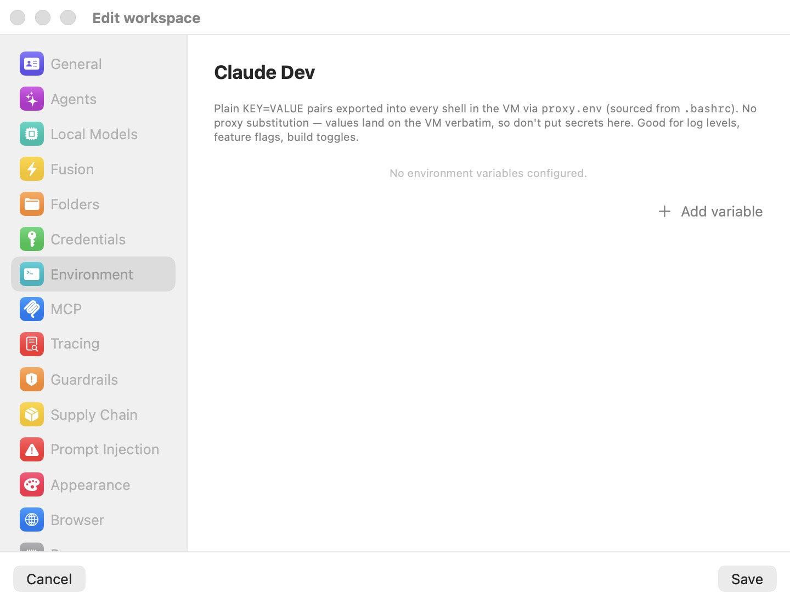

# Environment

The **Environment** pane sets plain environment variables that are exported into every shell in the workspace's VM. These are non-secret configuration knobs — log levels, feature flags, build toggles — that you want present in the agent's environment without wiring up any swap or credential machinery.

  

The pane's caption states both what it does and what it is *not* for: **Plain KEY=VALUE pairs exported into every shell in the VM via proxy.env (sourced from .bashrc). No proxy substitution — values land on the VM verbatim, so don't put secrets here. Good for log levels, feature flags, build toggles.** With nothing configured it reads **No environment variables configured.**

## How variables are exported

Each variable you add is written to `proxy.env`, a file on the workspace's metadata share that the managed `.bashrc` sources for every shell. That means the value is present in every terminal tab, every command the agent runs, and every login and non-login shell — verbatim, exactly as you typed it. There is no `brm_…` fake and no wire swap: this pane is a straight pass-through, which is precisely why secrets do not belong here.

If you need the VM to hold a token or password, use the [Credentials](credentials.mdx) pane instead. Anything defined there is injected as a fake and swapped to the real value on the wire; a secret typed into the Environment pane would instead land inside the sandbox in cleartext.

## Adding and editing variables

Click **Add variable** to append a row. Each row is a **Name** field and a **Value** field, with a minus button to remove it.

The name is validated against the shell identifier rule `[A-Za-z_][A-Za-z0-9_]*` — it must start with a letter or underscore and contain only letters, digits, and underscores. A name that does not match shows an inline orange warning and is not exported. The value is unconstrained and is used exactly as written.

> **Tip:** Group related toggles in one workspace and leave a scratch workspace bare. Because these variables are per-workspace, a workspace tuned for verbose debugging (`RUST_LOG=debug`, `NODE_ENV=development`) stays separate from one configured for a clean production-like build.

## Live refresh on a running session

Editing this pane and saving does not require a VM restart. Bromure Agentic Coding bumps an internal `env.generation` counter and re-writes `proxy.env`; new shells opened after the save re-source it and see the updated values immediately. A foreground agent that is already running keeps the environment it started with until it exits — a new prompt (or a new tab) picks up the change.

Although these values are non-secret by intent, they are still stored in the workspace's encrypted `secrets.enc` blob on save, alongside the pane's other data, rather than in the plain-text `profile.json`.

## Settings reference

| Setting | Type | Default | Description |
|---|---|---|---|
| **Variable list** | List of `Name = Value` rows | Empty | Each row exports one variable into every VM shell via `proxy.env`. Name must match `[A-Za-z_][A-Za-z0-9_]*`, or it shows a warning and is skipped. Values are used verbatim — no substitution. |
| **Add variable** | Button | — | Appends a new empty row. |

## Related chapters

- [Credentials](credentials.mdx) — where secrets belong; injected as fakes and swapped on the wire.
- [MCP](mcp.mdx) — configuring tool servers, some of which read environment variables.
- [Settings Reference](index.mdx) — all panes at a glance.
